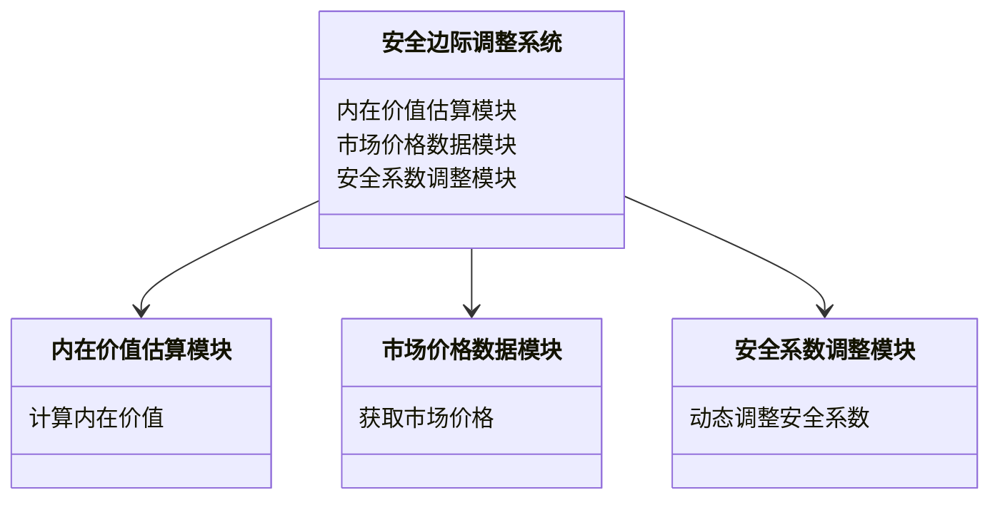

                 


# 《格雷厄姆的安全边际理论在高估值市场中的调整》

---

## 关键词：
- 格雷厄姆的安全边际理论
- 高估值市场
- 投资策略调整
- 内在价值评估
- 风险控制

---

## 摘要：
本文探讨了格雷厄姆的安全边际理论在高估值市场中的应用与调整。首先，我们分析了安全边际理论的背景及其在投资中的重要性。然后，我们详细讨论了当前高估值市场中的挑战，包括市场估值现状和安全边际的缩小。接下来，我们提出了动态调整安全边际的方法，包括数学模型和计算公式，并通过实际案例展示了如何在高估值市场中应用这些方法。最后，我们总结了调整安全边际理论的重要性和未来的发展方向。

---

# 正文

---

## 第一部分：安全边际理论的背景与基础

---

### 第1章：安全边际理论的核心概念

#### 1.1 安全边际的定义与内涵

##### 1.1.1 安全边际的定义
安全边际（Margin of Safety）是格雷厄姆投资理论中的核心概念，指股票的市场价格与其内在价值之间的差异。具体来说，安全边际 = 内在价值 - 市场价格。当市场价格低于内在价值时，安全边际为正，投资风险较低。

##### 1.1.2 安全边际的核心要素
- **内在价值**：股票的真实价值，基于公司基本面分析得出。
- **市场价格**：股票在市场上的交易价格。
- **安全系数**：用于调整内在价值的安全边际比例，通常为30%到50%。

##### 1.1.3 安全边际与投资风险的关系
安全边际越大，投资风险越小。在高估值市场中，安全边际可能为负，这意味着投资风险增加。

#### 1.2 格雷厄姆投资理论的背景

##### 1.2.1 格雷厄姆的投资理念
格雷厄姆倡导“价值投资”，强调以低于内在价值的价格买入股票，长期持有，等待市场回归其真实价值。

##### 1.2.2 安全边际理论的提出背景
20世纪30年代，全球经济大萧条期间，格雷厄姆提出安全边际理论，以帮助投资者在市场波动中降低风险。

##### 1.2.3 安全边际在价值投资中的地位
安全边际是价值投资的核心，帮助投资者在市场恐慌时寻找被低估的股票，避免重大损失。

---

### 第2章：高估值市场的现状与挑战

#### 2.1 当前市场的估值现状

##### 2.1.1 市场估值的定义与衡量指标
市场估值通常通过市盈率（P/E）、市净率（P/B）等指标衡量。当前市场估值普遍偏高，市盈率远高于历史平均水平。

##### 2.1.2 当前市场的高估值特征
- 市场整体估值偏高。
- 高估值股票集中在成长性较高的行业，如科技和消费股。

##### 2.1.3 高估值市场中的投资风险
高估值市场中，股票价格可能大幅波动，安全边际可能为负，投资风险增加。

#### 2.2 高估值市场与安全边际的关系

##### 2.2.1 高估值市场中安全边际的缩小
在高估值市场中，安全边际可能为负，意味着投资者需要承担更高的风险。

##### 2.2.2 高估值市场中传统安全边际理论的局限性
传统安全边际理论假设市场估值合理，但在高估值市场中可能不再适用。

##### 2.2.3 高估值市场中的投资策略调整方向
投资者需要调整安全边际的计算方法，引入动态调整机制，以应对高估值市场的挑战。

---

## 第二部分：安全边际理论的数学模型与调整方法

---

### 第3章：安全边际的数学模型与计算方法

#### 3.1 安全边际的计算公式

##### 3.1.1 格雷厄姆的安全边际计算公式
$$
P_m = V - P
$$
其中，$P_m$ 是安全边际，$V$ 是内在价值，$P$ 是市场价格。

##### 3.1.2 安全边际的动态调整公式
$$
P_m = V \times (1 - f)
$$
其中，$f$ 是安全系数，通常为30%到50%。

#### 3.2 内在价值的估算方法

##### 3.2.1 内在价值的定义与计算公式
内在价值是基于公司基本面分析得出的股票真实价值。计算公式为：
$$
V = \frac{E}{r}
$$
其中，$E$ 是公司未来现金流的现值，$r$ 是折现率。

##### 3.2.2 格雷厄姆的内在价值估算方法
格雷厄姆使用保守的财务指标，如每股收益（EPS）和股息率，估算内在价值。

##### 3.2.3 内在价值与市场估值的关系
当市场价格低于内在价值时，安全边际为正，投资风险较低。

#### 3.3 安全边际的动态调整

##### 3.3.1 安全边际的动态调整公式
在高估值市场中，安全边际需要动态调整。调整公式为：
$$
P_m = V \times (1 - f) - P
$$
其中，$f$ 是动态调整的安全系数，通常为50%到70%。

##### 3.3.2 不同市场环境下安全边际的调整策略
- **低估值市场**：安全系数为30%到50%。
- **高估值市场**：安全系数为50%到70%。

---

## 第三部分：系统分析与架构设计

---

### 第4章：系统分析与架构设计方案

#### 4.1 问题场景介绍
在高估值市场中，传统安全边际理论可能不再适用，需要动态调整安全边际的计算方法。

#### 4.2 项目介绍
本项目旨在构建一个动态调整安全边际的系统，帮助投资者在高估值市场中降低投资风险。

#### 4.3 系统功能设计（领域模型mermaid类图）



#### 4.4 系统架构设计（mermaid架构图）

```mermaid
browser --> 安全边际调整系统
安全边际调整系统 --> 内在价值估算模块
安全边际调整系统 --> 市场价格数据模块
安全边际调整系统 --> 安全系数调整模块
```

---

## 第四部分：项目实战

---

### 第5章：项目实战

#### 5.1 环境安装
- 安装Python和必要的库（如pandas、numpy）。
- 获取市场数据（如股票价格）。

#### 5.2 系统核心实现源代码

##### 5.2.1 内在价值估算函数

```python
def calculate_intrinsic_value(revenue, profit_margin, discount_rate):
    # 计算未来现金流的现值
    cash_flow = revenue * profit_margin
    intrinsic_value = cash_flow / discount_rate
    return intrinsic_value
```

##### 5.2.2 安全边际计算函数

```python
def calculate_margin_of_safety(intrinsic_value, market_price, safety_coefficient):
    margin_of_safety = intrinsic_value * (1 - safety_coefficient) - market_price
    return margin_of_safety
```

##### 5.2.3 动态调整安全系数函数

```python
def adjust_safety_coefficient(market_valuation):
    if market_valuation > 150:  # 市场估值超过150%
        return 0.5  # 调整为50%
    else:
        return 0.3  # 调整为30%
```

#### 5.3 案例分析与详细解读

##### 5.3.1 案例分析

假设某公司的内在价值为100元，市场价格为80元，市场估值为150%。

1. 计算内在价值：
   $$ V = 100 $$

2. 动态调整安全系数：
   $$ f = 0.5 $$

3. 计算安全边际：
   $$ P_m = 100 \times (1 - 0.5) - 80 = 10 $$

4. 投资决策：
   安全边际为正，可以考虑买入。

##### 5.3.2 详细解读
在高估值市场中，动态调整安全系数有助于降低投资风险。通过上述案例，我们可以看到，动态调整安全系数能够帮助投资者在高估值市场中做出更明智的投资决策。

---

## 第五部分：总结与展望

---

### 第6章：总结与展望

#### 6.1 最佳实践 tips
- 在高估值市场中，动态调整安全系数是必要的。
- 保持谨慎，避免过度乐观。

#### 6.2 小结
本文探讨了格雷厄姆的安全边际理论在高估值市场中的调整方法，提出了动态调整安全系数的策略，并通过实际案例展示了其应用。

#### 6.3 注意事项
- 安全边际的计算需要结合市场实际情况。
- 投资者需要根据市场变化，及时调整安全系数。

#### 6.4 拓展阅读
- 格雷厄姆的《 Intelligent Investor》
- 价值投资的相关书籍和论文。

---

# 作者：AI天才研究院/AI Genius Institute & 禅与计算机程序设计艺术 /Zen And The Art of Computer Programming

---

以上是文章的完整内容，希望对您有所帮助！

