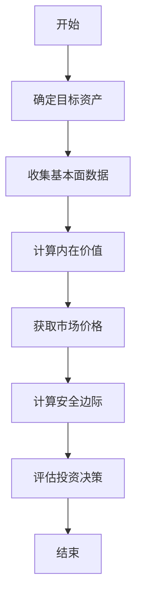
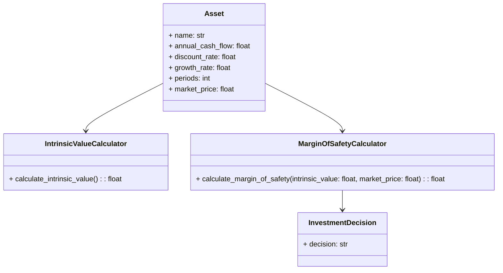
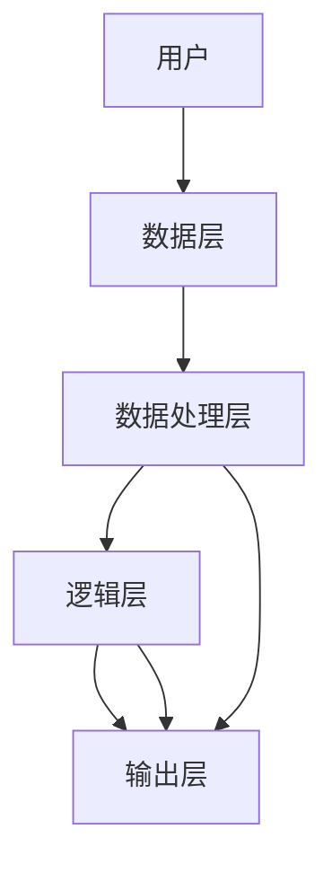

                 


# 格雷厄姆的安全边际理论：在高估值市场中的应用

**关键词：** 安全边际理论、投资策略、高估值市场、风险管理、价值投资

**摘要：** 格雷厄姆的安全边际理论是投资领域的重要理论，强调以低于内在价值的价格买入资产以降低风险。本文将详细探讨该理论在当前高估值市场中的应用，分析其数学模型、系统架构，并通过案例分析和项目实战提供实用的投资策略。

---

## 第一部分：安全边际理论的背景与核心概念

### 第1章：安全边际理论的起源与发展

#### 1.1 格雷厄姆与安全边际理论的提出

- **1.1.1 格雷厄姆的生平与投资理念**
  - 本杰明·格雷厄姆（1894-1975）是价值投资之父，其投资理念强调安全性和稳健性。
  - 格雷厄姆的学生包括沃伦·巴菲特，他的理论对现代投资产生了深远影响。

- **1.1.2 安全边际理论的诞生背景**
  - 20世纪30年代经济大萧条期间，格雷厄姆观察到市场恐慌导致资产价格暴跌，安全边际理论应运而生。
  - 该理论旨在帮助投资者在市场波动中找到安全的投资机会。

- **1.1.3 格雷厄姆安全边际理论的核心思想**
  - 投资者应购买具有足够安全边际的资产，即市场价格远低于其内在价值。
  - 通过计算安全边际，投资者可以降低风险并获得超额收益。

#### 1.2 安全边际理论的核心概念

- **1.2.1 安全边际的定义与内涵**
  - 安全边际是资产的市场价格与内在价值之间的差额。
  - 内在价值是基于基本面分析确定的资产真实价值，市场价格是市场交易价格。
  - 安全边际提供了一个缓冲区，以应对市场波动和预测错误。

- **1.2.2 安全边际与投资风险的关系**
  - 安全边际越大，投资风险越小，回报潜力越大。
  - 在高估值市场中，安全边际较小，投资者需更加谨慎。

- **1.2.3 安全边际在投资决策中的作用**
  - 确定资产是否值得投资。
  - 评估市场波动中的风险敞口。
  - 作为买卖决策的依据。

#### 1.3 安全边际理论的现代发展

- **1.3.1 理论的演变与扩展**
  - 现代投资者将安全边际理论应用于更多资产类别，如股票、债券和房地产。
  - 结合现代金融工具和技术，安全边际的计算更加精确。

- **1.3.2 当代投资者对安全边际理论的重新诠释**
  - 强调动态调整安全边际，根据市场变化及时修正。
  - 结合技术分析和基本面分析，提升投资决策的科学性。

- **1.3.3 安全边际理论在不同市场环境下的应用**
  - 在牛市中，安全边际较小，需谨慎选择资产。
  - 在熊市中，安全边际较大，提供买入机会。

---

## 第二部分：高估值市场的特点与挑战

### 第2章：高估值市场的现状与问题

#### 2.1 高估值市场的定义与特征

- **2.1.1 高估值市场的形成原因**
  - 过度乐观的市场情绪。
  - 低利率环境推动资产价格上涨。
  - 投资者追求短期收益，忽视长期价值。

- **2.1.2 市场估值指标分析**
  - 市盈率（PE）：市场价格与每股收益的比率，高PE表示高估值。
  - 市净率（PB）：市场价格与每股净资产的比率，高PB表示资产溢价。
  - 市盈率增长比（PEG）：考虑增长率的市盈率，高PEG表示高估值。

- **2.1.3 高估值市场中的投资风险**
  - 资产价格泡沫破裂的风险。
  - 市场波动加剧，投资者可能面临重大损失。
  - 非理性决策导致的投资失误。

#### 2.2 高估值市场中的投资者行为

- **2.2.1 投资者情绪与市场波动**
  - 过度自信导致高估资产价值。
  - 追涨杀跌，放大市场波动。

- **2.2.2 过度乐观与非理性决策**
  - 投资者忽视基本面，仅关注短期收益。
  - 忽视长期风险，追求高回报。

- **2.2.3 羊群效应与跟风投资**
  - 投资者跟随市场潮流，缺乏独立判断。
  - 羊群效应加剧市场波动，增加系统性风险。

#### 2.3 安全边际理论在高估值市场中的重要性

- **2.3.1 高估值市场中安全边际的应用价值**
  - 帮助投资者识别被高估的资产，避免重大损失。
  - 在高估值市场中，安全边际较小，需更加谨慎。

- **2.3.2 如何通过安全边际理论降低投资风险**
  - 选择具有足够安全边际的资产，减少波动影响。
  - 分散投资，降低单一资产的风险敞口。

- **2.3.3 高估值市场中安全边际的计算与评估**
  - 定期评估资产的安全边际，及时调整投资组合。
  - 使用历史数据验证安全边际的有效性。

---

## 第三部分：安全边际理论的数学模型与算法

### 第3章：安全边际的计算方法

#### 3.1 格雷厄姆安全边际的数学模型

- **3.1.1 内在价值的计算公式**
  格雷厄姆的内在价值公式基于未来现金流的折现：
  $$ V = \sum_{t=1}^{n} \frac{C_t}{(1 + k)^t} $$
  其中，\( V \) 是内在价值，\( C_t \) 是第 \( t \) 年的现金流，\( k \) 是折现率。

- **3.1.2 安全边际的计算公式**
  安全边际是内在价值与市场价格的差额：
  $$ \text{安全边际} = V - P $$
  其中，\( V \) 是内在价值，\( P \) 是市场价格。

- **3.1.3 安全边际率的计算**
  安全边际率是安全边际占市场价格的比例：
  $$ \text{安全边际率} = \frac{V - P}{P} \times 100\% $$

#### 3.2 安全边际的算法流程



#### 3.3 安全边际的Python实现

```python
def calculate_intrinsic_value(annual_cash_flow, discount_rate, growth_rate, periods):
    intrinsic_value = 0
    for t in range(periods):
        cash_flow = annual_cash_flow * (1 + growth_rate) ** t
        intrinsic_value += cash_flow / (1 + discount_rate) ** t
    return intrinsic_value

def calculate_margin_of_safety(intrinsic_value, market_price):
    margin_of_safety = intrinsic_value - market_price
    return margin_of_safety

# 示例
annual_cash_flow = 100
discount_rate = 0.08
growth_rate = 0.05
periods = 10
market_price = 150

intrinsic_value = calculate_intrinsic_value(annual_cash_flow, discount_rate, growth_rate, periods)
margin_of_safety = calculate_margin_of_safety(intrinsic_value, market_price)

print(f"内在价值: {intrinsic_value:.2f}")
print(f"安全边际: {margin_of_safety:.2f}")
```

#### 3.4 安全边际的数学模型解释

- **内在价值计算：**
  内在价值是未来现金流的现值，反映了资产的真实价值。通过折现率 \( k \) 和增长假设，投资者可以估算资产的合理价格。
  
- **安全边际计算：**
  通过比较市场价格与内在价值，投资者可以评估资产的安全性。正值的安全边际表示资产价格被低估，负值表示高估。

---

## 第四部分：系统分析与架构设计方案

### 第4章：系统功能设计与架构

#### 4.1 系统功能设计

- **问题场景：**
  投资者需要在高估值市场中找到具有足够安全边际的资产，降低投资风险。

- **系统功能：**
  - 数据收集：获取目标资产的基本面数据和市场数据。
  - 分析模块：计算内在价值和安全边际。
  - 决策支持：根据安全边际率提供投资建议。

#### 4.2 领域模型设计



#### 4.3 系统架构设计



#### 4.4 接口设计与交互

- **接口设计：**
  - 数据接口：从数据库获取资产数据。
  - 计算接口：调用内在价值和安全边际计算函数。
  
- **交互流程：**
  用户输入资产信息，系统计算内在价值和安全边际，提供投资建议。

---

## 第五部分：项目实战

### 第5章：安全边际理论的应用与案例分析

#### 5.1 环境安装

- **Python安装：** 下载并安装Python 3.8或更高版本。
- **库安装：** 使用pip安装numpy和pandas。

#### 5.2 核心代码实现

```python
import numpy as np
import pandas as pd

def calculate_intrinsic_value(annual_cash_flow, discount_rate, growth_rate, periods):
    cash_flows = []
    for t in range(periods):
        cash_flow = annual_cash_flow * (1 + growth_rate) ** t
        cash_flows.append(cash_flow / (1 + discount_rate) ** t)
    return np.sum(cash_flows)

def calculate_margin_of_safety(intrinsic_value, market_price):
    return intrinsic_value - market_price

# 示例数据
data = {
    '资产名称': ['资产A', '资产B', '资产C'],
    '年度现金流': [100, 150, 200],
    '折现率': [0.08, 0.08, 0.08],
    '增长率': [0.05, 0.05, 0.05],
    '期间': [10, 10, 10],
    '市场价格': [150, 200, 250]
}

df = pd.DataFrame(data)

# 计算内在价值和安全边际
intrinsic_values = []
margins = []
for i in range(len(df)):
    iv = calculate_intrinsic_value(df['年度现金流'][i], df['折现率'][i], df['增长率'][i], df['期间'][i])
    mo_s = calculate_margin_of_safety(iv, df['市场价格'][i])
    intrinsic_values.append(iv)
    margins.append(mo_s)

df['内在价值'] = intrinsic_values
df['安全边际'] = margins

print(df)
```

#### 5.3 案例分析与解读

- 案例1：资产A的内在价值为140，市场价格为150，安全边际为-10，表示高估，建议卖出。
- 案例2：资产B的内在价值为220，市场价格为200，安全边际为20，表示低估，建议买入。
- 案例3：资产C的内在价值为230，市场价格为250，安全边际为-20，表示高估，建议观望。

#### 5.4 项目总结

- 项目成功的关键在于准确的数据收集和可靠的模型计算。
- 定期更新数据和模型参数，以适应市场变化。

---

## 第六部分：最佳实践与未来展望

### 第6章：投资策略与风险管理

#### 6.1 最佳投资策略

- **选择低估资产：** 寻找市场价格低于内在价值的资产。
- **分散投资：** 降低单一资产的风险。
- **长期持有：** 避免频繁交易，减少成本。

#### 6.2 风险管理

- **设置止损点：** 防止重大损失。
- **监控市场变化：** 及时调整投资组合。
- **定期评估：** 重新计算安全边际，确保投资组合的安全性。

#### 6.3 长期投资的重要性

- 长期投资有助于平滑市场波动，实现资本增值。
- 避免短期市场的干扰，专注于资产的长期价值。

### 6.4 小结与未来展望

- 本文详细探讨了格雷厄姆的安全边际理论，并展示了其在高估值市场中的应用。
- 未来，随着市场的变化，安全边际理论将不断发展，帮助投资者在复杂环境中做出明智决策。

---

## 作者：AI天才研究院 & 禅与计算机程序设计艺术

---

**总结：** 格雷厄姆的安全边际理论为投资者提供了科学的决策框架，尤其是在高估值市场中，通过计算安全边际，投资者可以有效降低风险，实现稳健投资。希望本文能为读者提供有价值的见解和实用的策略。

