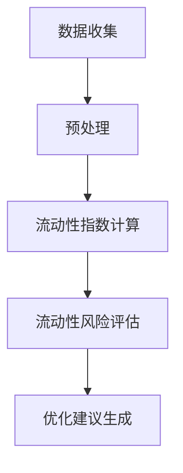
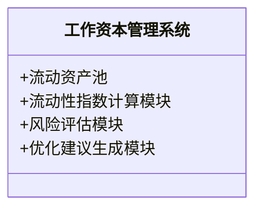

                 

# 格雷厄姆的工作资本策略：关注流动性

**关键词**：工作资本、流动性、投资策略、数学模型、系统架构

**摘要**：格雷厄姆的工作资本策略是一种通过关注流动性来优化资本配置的方法。本文将详细探讨其背景、核心概念、数学模型、系统架构设计以及实际应用案例，帮助读者深入理解这一策略的应用和价值。

---

## 第1章：工作资本策略概述

### 1.1 工作资本策略的背景介绍

#### 1.1.1 传统资本管理的局限性
传统的资本管理方法往往忽视了流动性的动态变化，导致在市场波动时资本配置效率低下。

#### 1.1.2 格雷厄姆投资理念的形成
格雷厄姆作为价值投资之父，提出了“安全边际”概念，强调在投资中注重流动性以降低风险。

#### 1.1.3 工作资本策略的提出与意义
工作资本策略通过关注流动性，优化资本分配，提升投资效率和风险控制能力。

### 1.2 工作资本的核心概念与定义

#### 1.2.1 工作资本的定义与组成
工作资本包括流动资产和部分非流动资产，主要用于支持企业的日常运营和投资活动。

#### 1.2.2 工作资本与流动性的关系
流动性是衡量工作资本效率的关键指标，直接影响企业的资金周转和市场应对能力。

#### 1.2.3 格雷厄姆工作资本策略的核心要素
包括资产流动性管理、风险评估和优化建议生成。

### 1.3 工作资本策略的边界与外延

#### 1.3.1 工作资本的应用场景
适用于企业日常运营和投资决策，特别是在市场波动较大的情况下。

#### 1.3.2 工作资本与其他资本形式的对比
通过表格对比工作资本与其他资本形式的异同，展示其独特性。

#### 1.3.3 工作资本策略的适用范围
适用于不同规模的企业和投资机构，灵活性强。

---

## 第2章：工作资本策略的数学模型与算法原理

### 2.1 工作资本流动性分析的数学模型

#### 2.1.1 流动性指数的定义与计算公式
流动性指数 $L$ 表示为 $L = \frac{A}{T}$，其中 $A$ 是资产流动性，$T$ 是交易频率。

#### 2.1.2 流动性指数的应用
通过具体案例说明流动性指数如何评估资产配置效率。

### 2.2 工作资本流动性评估算法

#### 2.2.1 算法步骤
1. 数据收集与预处理
2. 流动性指数计算
3. 流动性风险评估
4. 优化建议生成

#### 2.2.2 算法流程图

---

## 第3章：工作资本策略的系统分析与架构设计

### 3.1 系统分析

#### 3.1.1 问题场景介绍
描述企业如何通过工作资本策略优化流动性管理。

#### 3.1.2 项目目标与范围
明确系统设计的目标和适用范围。

#### 3.1.3 需求分析
分析用户需求，确定系统功能模块。

### 3.2 系统架构设计

#### 3.2.1 系统功能设计

#### 3.2.2 系统架构图
展示系统各模块之间的交互关系。

---

## 第4章：项目实战

### 4.1 环境安装与配置

#### 4.1.1 系统环境要求
列出运行所需的软件和硬件配置。

#### 4.1.2 数据库安装与配置
指导如何安装和配置数据库。

### 4.2 核心代码实现

#### 4.2.1 流动性指数计算模块
展示关键代码片段，解释其功能。

#### 4.2.2 风险评估模块
详细说明风险评估的实现方法。

#### 4.2.3 优化建议生成模块
展示如何根据评估结果生成优化建议。

### 4.3 案例分析与解读

#### 4.3.1 实际案例分析
通过具体案例说明系统应用的效果。

#### 4.3.2 系统优化与调整
总结经验，提出改进建议。

---

## 第5章：总结与展望

### 5.1 最佳实践 tips

#### 5.1.1 核心理念
强调流动性管理的重要性。

#### 5.1.2 系统设计
建议采用模块化设计提升系统的灵活性和可扩展性。

#### 5.1.3 持续优化
定期评估和优化资本配置策略。

### 5.2 小结

回顾全文，总结工作资本策略的核心价值和实际应用效果。

### 5.3 注意事项

提醒读者在实际操作中注意数据质量和系统维护。

### 5.4 拓展阅读

推荐相关书籍和资源，供读者深入学习。

---

**作者：AI天才研究院/AI Genius Institute & 禅与计算机程序设计艺术 /Zen And The Art of Computer Programming**

