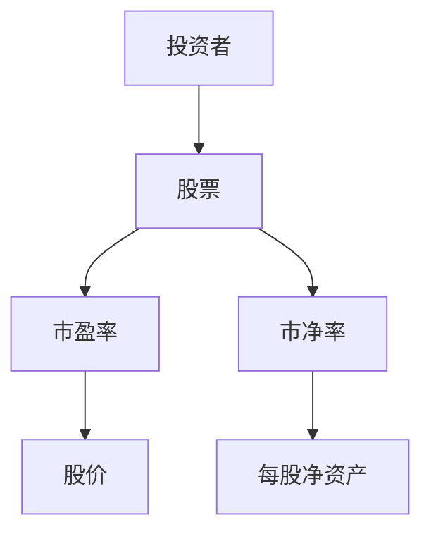

                 


# 格雷厄姆的市盈率和市净率使用指南

## 关键词：
- 价值投资
- 市盈率
- 市净率
- 格雷厄姆
- 股票分析

## 摘要：
本文深入探讨了格雷厄姆的市盈率和市净率在价值投资中的应用，通过理论分析、数学公式、系统架构和实际案例，帮助投资者掌握这两个关键指标的使用方法，从而做出明智的投资决策。

---

# 第一部分：背景介绍

## 第1章：背景介绍

### 1.1 价值投资的起源与发展

- **价值投资的起源**：价值投资起源于20世纪20年代，由本杰明·格雷厄姆和他的学生大卫·多德共同提出。他们认为市场会在短期波动中被情绪左右，但长期来看，股票的价值应基于其基本面。
- **格雷厄姆的投资理念**：格雷厄姆强调安全边际和内在价值，主张以低于内在价值的价格买入股票，从而在长期获得收益。
- **市盈率与市净率的提出**：格雷厄姆在分析股票时，提出了市盈率（P/E）和市净率（P/B）作为衡量股票价值的重要指标。

### 1.2 市盈率与市净率的核心概念

- **市盈率的定义与计算公式**：市盈率是股票价格除以每股收益（EPS），公式为：
  $$市盈率 = \frac{股价}{每股收益}$$
- **市净率的定义与计算公式**：市净率是股票价格除以每股净资产（BPS），公式为：
  $$市净率 = \frac{股价}{每股净资产}$$
- **优缺点对比**：
  | 指标 | 优点 | 缺点 |
  |------|------|------|
  | 市盈率 | 易于计算，反映盈利能力 | 受企业盈利周期影响较大 |
  | 市净率 | 更稳定，反映资产价值 | 受资产质量影响 |

### 1.3 市盈率与市净率的联系与区别

- **联系**：两者都用于衡量股票价格与基本面指标之间的关系，帮助投资者判断股票是否被高估或低估。
- **区别**：市盈率关注盈利能力，市净率关注资产价值；市盈率适用于盈利稳定的公司，市净率适用于资产密集型行业。

---

# 第二部分：核心概念与联系

## 第2章：核心概念与联系

### 2.1 市盈率与市净率的数学模型

- **市盈率公式**：
  $$市盈率 = \frac{股价}{每股收益}$$
  - 示例：某股票价格为50元，每股收益为5元，则市盈率为10倍。
- **市净率公式**：
  $$市净率 = \frac{股价}{每股净资产}$$
  - 示例：某股票价格为50元，每股净资产为10元，则市净率为5倍。

### 2.2 市盈率与市净率的属性特征对比

- **属性对比表**：
  | 属性 | 市盈率 | 市净率 |
  |------|--------|--------|
  | 计算方式 | 股价/每股收益 | 股价/每股净资产 |
  | 适用场景 | 判断盈利能力 | 判断资产价值 |
  | 反映因素 | 利润能力 | 资产价值 |

### 2.3 ER实体关系图



---

# 第三部分：算法原理讲解

## 第3章：算法原理讲解

### 3.1 市盈率计算算法

- **流程图**：
  ```mermaid
  graph TD
      A[股价] --> B[每股收益]
      B --> C[市盈率]
  ```

### 3.2 市净率计算算法

- **流程图**：
  ```mermaid
  graph TD
      A[股价] --> B[每股净资产]
      B --> C[市净率]
  ```

### 3.3 Python实现代码

```python
def calculate_pe_ratio(price, eps):
    return price / eps

def calculate_pb_ratio(price, book_value_per_share):
    return price / book_value_per_share

# 示例计算
price = 50
eps = 5
book_value_per_share = 10

pe_ratio = calculate_pe_ratio(price, eps)
pb_ratio = calculate_pb_ratio(price, book_value_per_share)

print(f"市盈率: {pe_ratio}")
print(f"市净率: {pb_ratio}")
```

---

# 第四部分：系统分析与架构设计方案

## 第4章：系统分析与架构设计方案

### 4.1 问题场景介绍

- **项目背景**：设计一个基于格雷厄姆市盈率和市净率的股票分析系统，帮助投资者快速评估股票价值。
- **项目目标**：构建一个自动化分析系统，提供市盈率和市净率的计算及可视化展示。

### 4.2 系统功能设计

- **领域模型**：
  ```mermaid
  classDiagram
      class 股票 {
          股票代码
          股票名称
          股价
          每股收益
          每股净资产
      }
      class 市盈率计算 {
          计算市盈率
      }
      class 市净率计算 {
          计算市净率
      }
      class 结果展示 {
          显示结果
      }
  ```

### 4.3 系统架构设计

- **系统架构图**：
  ```mermaid
  graph TD
      UI[用户界面] --> DataAccessor[数据访问层]
      DataAccessor --> LogicProcessor[逻辑处理层]
      LogicProcessor --> ResultDisplay[结果展示层]
  ```

### 4.4 系统接口设计

- **接口定义**：
  - 数据获取接口：从数据库获取股票价格、每股收益、每股净资产。
  - 计算接口：调用市盈率和市净率计算函数。
  - 展示接口：将结果以图表形式展示。

### 4.5 系统交互流程

- **交互序列图**：
  ```mermaid
  sequenceDiagram
      用户 -> UI: 请求分析
      UI -> DataAccessor: 获取数据
      DataAccessor -> LogicProcessor: 调用计算函数
      LogicProcessor -> ResultDisplay: 显示结果
  ```

---

# 第五部分：项目实战

## 第5章：项目实战

### 5.1 环境安装

- **Python环境**：安装Python 3.8及以上版本。
- **库安装**：安装pandas、numpy、matplotlib用于数据处理和可视化。

### 5.2 核心实现源代码

```python
import pandas as pd
import matplotlib.pyplot as plt

def calculate_pe_ratio(price, eps):
    return price / eps

def calculate_pb_ratio(price, book_value_per_share):
    return price / book_value_per_share

# 示例数据
data = {
    '股票代码': ['AAPL', 'MSFT', 'GOOGL'],
    '股价': [300, 250, 150],
    '每股收益': [10, 12, 8],
    '每股净资产': [50, 40, 30]
}

df = pd.DataFrame(data)

# 计算市盈率和市净率
df['市盈率'] = df['股价'] / df['每股收益']
df['市净率'] = df['股价'] / df['每股净资产']

print(df)

# 可视化
df.plot(kind='bar', y=['市盈率', '市净率'], stacked=True)
plt.title('市盈率和市净率对比')
plt.show()
```

### 5.3 代码应用解读

- **数据处理**：使用pandas读取数据，计算市盈率和市净率，结果展示在表格中。
- **可视化**：使用matplotlib绘制柱状图，直观展示市盈率和市净率的对比。

### 5.4 实际案例分析

- **案例分析**：分析苹果、微软、谷歌的市盈率和市净率，判断其估值是否合理。
- **结果解读**：通过对比，发现某股票可能被高估或低估，提供投资决策参考。

### 5.5 项目小结

- **项目总结**：本项目通过代码实现，帮助投资者快速计算和分析市盈率和市净率，提供了可视化工具辅助决策。

---

# 第六部分：最佳实践

## 第6章：最佳实践

### 6.1 实用技巧

- **多指标结合使用**：结合市盈率、市净率和其他指标（如股息率）进行综合分析。
- **行业对比**：在同一行业内比较市盈率和市净率，找出估值合理的股票。
- **动态调整**：根据市场变化和公司业绩，定期更新分析结果。

### 6.2 小结

- **总结**：格雷厄姆的市盈率和市净率是价值投资的重要工具，正确使用它们可以帮助投资者发现被低估的股票。

### 6.3 注意事项

- **避免单一指标**：不要仅依赖市盈率或市净率，需结合其他指标和行业标准进行分析。
- **长期视角**：市盈率和市净率在短期可能波动较大，需从长期角度考虑投资价值。

### 6.4 拓展阅读

- **推荐阅读书籍**：
  - 《证券分析》——本杰明·格雷厄姆
  - 《投资学原理》——理查德·A·阿什沃斯
- **推荐阅读文章**：
  - 《价值投资入门指南》
  - 《市盈率与市净率的深度分析》

---

# 结语

通过本文的详细讲解，读者可以全面理解格雷厄姆的市盈率和市净率，掌握它们的计算方法和实际应用。希望这些知识能帮助投资者在价值投资的道路上走得更远。

---

# 作者

作者：AI天才研究院/AI Genius Institute & 禅与计算机程序设计艺术/Zen And The Art of Computer Programming

