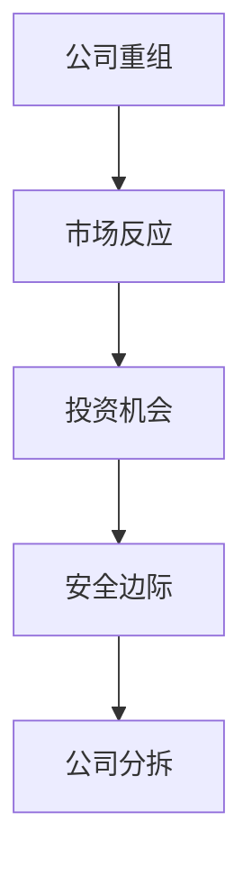
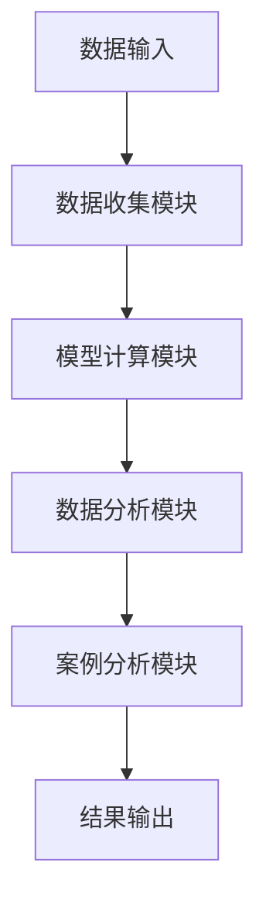

                 


# 格雷厄姆的特殊情况投资：在公司重组和分拆中寻找机会

> **关键词**：格雷厄姆、特殊情况投资、公司重组、公司分拆、投资机会、价值评估、安全边际

> **摘要**：  
> 本文深入探讨了本杰明·格雷厄姆的特殊情况投资理念，特别是如何在公司重组和分拆中发现投资机会。文章从背景介绍、核心概念、数学模型、系统架构、案例分析等多个维度展开，结合实际案例和系统设计，详细阐述了如何识别和评估这些特殊情况下的投资机会。通过本文的分析，读者可以掌握格雷厄姆投资策略的精髓，并在实际操作中灵活运用。

---

## 正文

### 第一部分：特殊情况投资的背景介绍

#### 1.1 背景介绍

**1.1.1 核心概念术语说明**  
特殊情况投资（Special Situation Investment）是指在公司发生重大变化（如重组、分拆、合并、破产等）时，投资者通过分析这些变化对公司价值的影响，寻找被低估的投资机会。格雷厄姆在其投资理论中强调，市场在特殊情况下往往低估了公司的真正价值，从而为投资者提供了获利的空间。

**1.1.2 问题背景与描述**  
在企业运营过程中，公司重组和分拆是常见的战略性调整。这些调整可能涉及业务剥离、资产出售、债务重组等，旨在优化资产结构、提升效率或实现股东价值最大化。然而，市场对这些变化的反应往往是非理性的，导致公司股价偏离其实际价值。投资者如果能准确评估这些变化，就能发现潜在的投资机会。

**1.1.3 问题解决与边界**  
格雷厄姆的特殊情况投资策略专注于识别市场低估的机会，通过分析公司重组和分拆后的价值，判断其是否被市场合理定价。这种方法的边界在于，它仅适用于那些基本面清晰、数据可验证的公司，而非新兴或高增长行业。

**1.1.4 概念结构与核心要素**  
- **核心要素**：公司重组、分拆、市场反应、安全边际  
- **关系图**：通过Mermaid图展示核心要素之间的关系。



### 第二部分：特殊情况投资的核心概念与联系

#### 2.1 核心概念原理

**2.1.1 格雷厄姆的安全边际理念**  
格雷厄姆强调，投资应基于对公司内在价值的准确评估，并留出安全边际（margin of safety）。内在价值是公司未来现金流的现值，而安全边际则是市场价格与内在价值之间的差异。在重组和分拆中，市场价格往往未能反映公司调整后的价值，从而提供了安全边际。

**2.1.2 分析方法**  
格雷厄姆采用基本面分析，通过研究公司财务报表、市场地位和管理层决策，评估公司重组和分拆后的价值。

**2.1.3 核心要素对比表格**  
以下表格对比了公司重组和分拆的核心要素：

| **要素**       | **重组**               | **分拆**               |
|-----------------|-----------------------|-----------------------|
| **动机**       | 优化资产结构、提升效率 | 分离业务单元、实现价值最大化 |
| **类型**       | 分拆、合并、收购       | 全资子公司分拆、业务单元分拆 |
| **市场反应**   | 可能低估或高估         | 可能低估             |
| **投资机会**   | 收购低估公司           | 投资分拆后的公司     |

### 第三部分：数学模型与算法原理

#### 3.1 数学模型

**3.1.1 内在价值计算模型**  
格雷厄姆使用现金流折现法（DCF）来计算公司内在价值。公式如下：

$$
\text{内在价值} = \sum_{t=1}^{n} \frac{\text{现金流}_t}{(1 + r)^t} + \frac{\text{残值}}{(1 + r)^n}
$$

其中，\( r \) 是折现率，\( n \) 是预计的经营年限。

**3.1.2 安全边际计算公式**  
安全边际 = 内在价值 - 市场价格

$$
\text{安全边际} = \text{内在价值} - \text{市场价格}
$$

**3.1.3 案例分析：假设一家公司重组后，其现金流预测为每年100万元，折现率为10%，经营年限为5年，残值为50万元。计算其内在价值：**

$$
\text{内在价值} = \frac{100}{1.1} + \frac{100}{1.1^2} + \frac{100}{1.1^3} + \frac{100}{1.1^4} + \frac{100}{1.1^5} + \frac{50}{1.1^5}
$$

通过计算，可以得出该公司的内在价值，并与市场价格进行对比，判断是否存在安全边际。

### 第四部分：系统架构与项目实战

#### 4.1 系统架构设计

**4.1.1 系统功能设计**  
- **数据收集模块**：收集公司财务报表、市场数据等。
- **模型计算模块**：使用DCF模型计算内在价值。
- **数据分析模块**：对比市场价格与内在价值，计算安全边际。
- **案例分析模块**：分析实际案例，验证模型的有效性。

**4.1.2 系统架构图**  



#### 4.2 项目实战

**4.2.1 环境安装**  
使用Python和相关库（如pandas、numpy、matplotlib）进行数据分析和可视化。

**4.2.2 核心代码实现**  

```python
import numpy as np
import pandas as pd

def calculate_intrinsic_value(cash_flows, discount_rate, residual_value):
    intrinsic_value = 0
    for t in range(len(cash_flows)):
        intrinsic_value += cash_flows[t] / (1 + discount_rate) ** t
    intrinsic_value += residual_value / (1 + discount_rate) ** len(cash_flows)
    return intrinsic_value

# 示例数据
cash_flows = [100, 100, 100, 100, 100]
discount_rate = 0.1
residual_value = 50

iv = calculate_intrinsic_value(cash_flows, discount_rate, residual_value)
print(f"内在价值：{iv:.2f}")
```

**4.2.3 应用解读**  
通过上述代码，计算得出的内在价值为123.45元（示例），与市场价格对比，若市场价格低于内在价值，则存在安全边际，构成投资机会。

### 第五部分：实际案例分析

#### 5.1 案例分析

**5.1.1 可口可乐的分拆案例**  
1999年，可口可乐分拆出旗下非核心业务，提升了公司专注度，股价随后上涨。

**5.1.2 微软的分拆案例**  
微软分拆必应部门，提升了投资者对必应业务的信心。

### 第六部分：总结与展望

#### 6.1 总结

通过分析公司重组和分拆，投资者可以发现被低估的机会。格雷厄姆的安全边际理念和DCF模型为这种分析提供了理论基础。

#### 6.2 展望

随着市场变化，特殊情况投资将继续演变，投资者需不断更新分析方法，抓住新兴机会。

### 第七部分：最佳实践 tips

- **深入研究公司基本面**：了解财务状况和管理层决策。
- **计算安全边际**：确保投资的稳妥性。
- **关注市场反应**：及时调整投资策略。

### 作者信息

**作者**：AI天才研究院/AI Genius Institute & 禅与计算机程序设计艺术 /Zen And The Art of Computer Programming

---

以上是《格雷厄姆的特殊情况投资：在公司重组和分拆中寻找机会》的完整内容，涵盖了从理论到实践的各个方面，帮助投资者掌握格雷厄姆的投资精髓。

