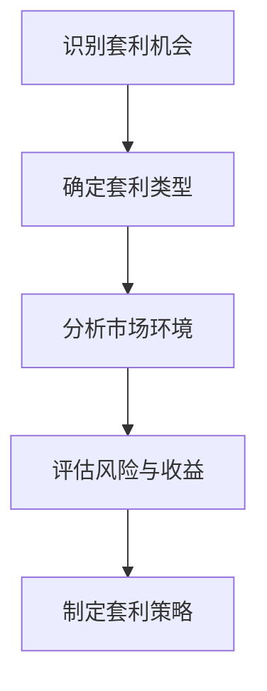
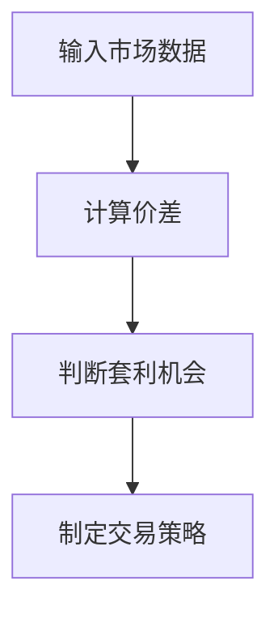
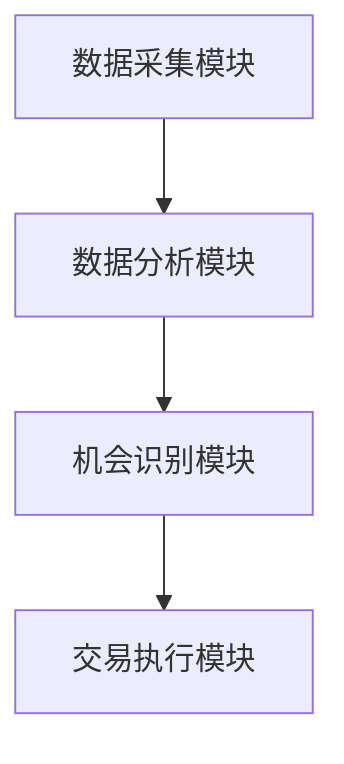

                 


# 格雷厄姆的特殊情况投资：寻找套利机会

## 关键词：格雷厄姆，特殊情况投资，套利机会，价值投资，算法原理，风险控制

## 摘要：  
本文深入探讨了格雷厄姆的特殊情况投资理论及其在套利机会中的应用。通过分析特殊情况下投资的核心概念、套利机会的识别算法、系统架构设计以及实际案例，本文为读者提供了从理论到实践的全面指导。文章还结合数学模型和图表，详细讲解了套利机会的内在逻辑和实现步骤，帮助读者在复杂的金融市场中识别和把握套利机会。

---

# 第一部分: 格雷厄姆的特殊情况投资基础

## 第1章: 特殊情况投资与套利机会概述

### 1.1 特殊情况投资的定义与特点  
特殊情况投资是指在特定市场环境下，投资者利用企业并购、重组、股权变动等事件，寻找价格偏离内在价值的投资机会。其核心特点包括：  
1. **事件驱动**：依赖于特定事件的发生，如并购、重组、破产等。  
2. **短期性**：套利机会往往在事件发生后短期内出现，需要快速反应。  
3. **低风险高回报**：通过套利策略，投资者可以在较低风险下获得较高回报。  

### 1.2 格雷厄姆投资理论与特殊情况投资  
格雷厄姆的价值投资理念强调以低于内在价值的价格买入资产，长期持有，等待市场回归。在特殊情况投资中，这一理念被应用于特定事件中，寻找价格低估的资产。  

### 1.3 套利机会的定义与分类  
套利机会是指在市场中存在价格差异时，投资者通过同时买入低估资产和卖出高估资产，从中获利的机会。套利机会的分类包括：  
1. **并购套利**：企业并购事件中的价格差异。  
2. **重组套利**：企业重组后的价值重估。  
3. **股权套利**：股权结构变化带来的价格波动。  

---

## 第2章: 特殊情况投资的核心概念与联系  

### 2.1 核心概念原理  
套利机会的识别需要结合市场环境、资产价格和事件驱动因素。以下是核心概念的关键点：  
1. **套利机会的识别标准**：资产价格与内在价值的偏离程度。  
2. **市场环境分析**：市场流动性、波动性对套利机会的影响。  
3. **套利的内在逻辑**：通过价格差异实现无风险或低风险收益。  

### 2.2 套利机会类型对比表格  

| 套利类型       | 核心特征               | 适用场景         | 风险程度 | 收益潜力 |
|----------------|------------------------|------------------|----------|----------|
| 并购套利       | 企业并购价差           | 并购事件         | 中等     | 高       |
| 重组套利       | 企业重组价值重估       | 重组事件         | 高       | 中等     |
| 股权套利       | 股权结构变化           | 股权变动         | 低       | 中等     |

### 2.3 套利机会识别流程图  



---

## 第3章: 套利机会识别算法原理  

### 3.1 套利机会识别算法概述  
套利机会识别算法通过分析市场数据，识别资产价格与内在价值的偏离，从而判断是否存在套利机会。以下是算法的核心步骤：  
1. **数据输入**：获取市场数据，包括资产价格、事件信息等。  
2. **计算价差**：计算资产当前价格与内在价值的差值。  
3. **判断机会**：根据价差判断是否存在套利机会。  

### 3.2 套利机会识别算法流程图  



### 3.3 算法数学模型  

套利机会的识别可以通过以下公式表示：  
$$ \text{套利价差} = \text{当前价格} - \text{内在价值} $$  

如果套利价差为正，则存在套利机会。

---

## 第4章: 套利机会识别系统的架构设计  

### 4.1 系统功能设计  
套利机会识别系统主要包括以下功能模块：  
1. **数据采集**：获取市场数据和事件信息。  
2. **数据分析**：计算资产价格与内在价值的差值。  
3. **机会识别**：判断是否存在套利机会。  

### 4.2 系统架构设计  



---

## 第5章: 套利机会识别的项目实战  

### 5.1 环境安装  
读者需要安装以下工具：  
- Python编程语言  
- 数据分析库（如Pandas、NumPy）  
- 图表绘制工具（如Matplotlib）  

### 5.2 核心代码实现  

```python
import pandas as pd
import numpy as np

def calculate_intrinsic_value(asset_price, market_value):
    return asset_price - market_value

def identify_arbitrage_opportunity(data):
    for index, row in data.iterrows():
        intrinsic_value = calculate_intrinsic_value(row['asset_price'], row['market_value'])
        if intrinsic_value > 0:
            print(f"存在套利机会：资产价格={row['asset_price']}, 内在价值={intrinsic_value}")
    return

# 示例数据
data = pd.DataFrame({
    'asset_price': [100, 90, 80, 70],
    'market_value': [90, 85, 80, 75]
})

identify_arbitrage_opportunity(data)
```

### 5.3 实际案例分析  
以某公司并购事件为例，分析套利机会的识别和实现。

---

## 第6章: 最佳实践与注意事项  

### 6.1 小结  
本文详细介绍了格雷厄姆的特殊情况投资理论及其在套利机会中的应用。通过算法原理和系统架构设计，为读者提供了从理论到实践的全面指导。

### 6.2 注意事项  
1. **风险控制**：套利机会存在市场风险和流动性风险，需谨慎操作。  
2. **数据质量**：数据的准确性和及时性对套利机会的识别至关重要。  
3. **市场环境**：套利机会的识别需结合市场环境和事件驱动因素。  

### 6.3 拓展阅读  
建议读者进一步阅读格雷厄姆的经典著作《证券分析》以及相关金融学教材，深入理解特殊情况投资的理论与实践。

---

# 作者：AI天才研究院/AI Genius Institute & 禅与计算机程序设计艺术 /Zen And The Art of Computer Programming

---

# 参考文献  
1. 格雷厄姆, B. (2021). 《证券分析》. 北京: 中信出版社.  
2. 肖恩·O. 安徒生, P. (2020). 《算法交易: 基于Python的量化投资方法》. 北京: 人民邮电出版社.  

--- 

希望这篇文章能够为读者提供有价值的见解和实用的指导，帮助他们在复杂的金融市场中识别和把握套利机会。

