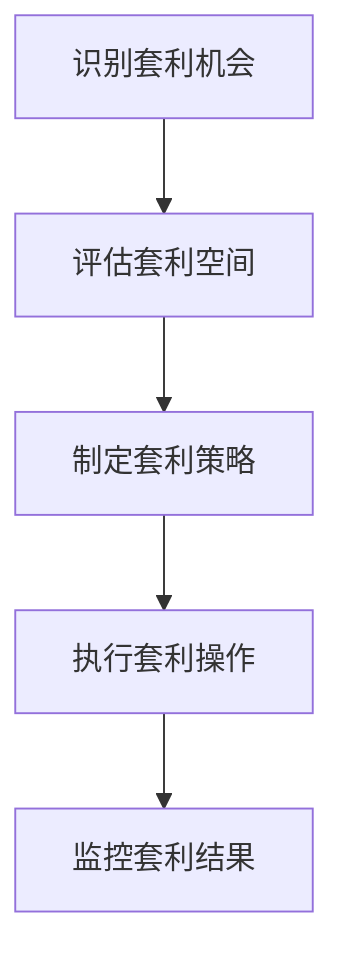
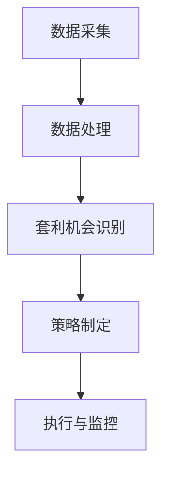
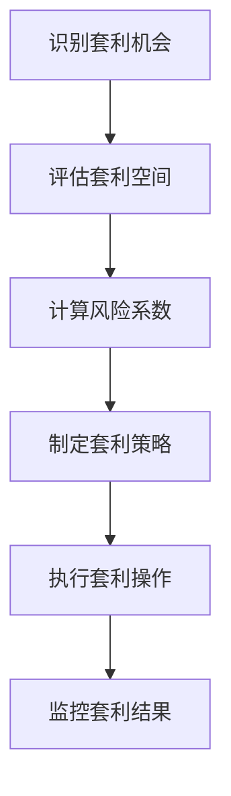

                 


# 格雷厄姆的特殊情况投资：现代市场中的套利机会

> **关键词**: 格雷厄姆，特殊情况投资，套利机会，现代市场，投资策略，风险管理

> **摘要**: 本文深入探讨了格雷厄姆的特殊情况投资理论在现代市场中的应用，分析了套利机会的产生机制、评估方法和风险管理策略。通过结合数学模型和实际案例，文章展示了如何利用这些机会实现稳健的投资回报。

---

## 第一部分: 格雷厄姆的特殊情况投资概述

### 第1章: 特殊情况投资的基本概念

#### 1.1 格雷厄姆投资理论概述
- **1.1.1 格雷厄姆投资理论的核心思想**
  - 价值投资的基本原则：寻找被市场低估的资产。
  - 安全边际的概念：买入价格低于内在价值。
- **1.1.2 格雷厄姆的“安全边际”概念**
  - 安全边际的定义：内在价值与市场价格之间的差距。
  - 安全边际的重要性：降低投资风险，确保长期收益。
- **1.1.3 格雷厄姆与现代投资理论的联系**
  - 与现代资产组合理论（CAPM）的对比。
  - 格雷厄姆理论对机构投资者的影响。

#### 1.2 套利机会的基本定义
- **1.2.1 套利的定义与特征**
  - 套利的定义：利用市场不均衡获利的行为。
  - 套利的特征：低风险、高流动性。
- **1.2.2 套利机会的分类**
  - 短期套利：基于价格波动的机会。
  - 长期套利：基于资产长期低估的机会。
- **1.2.3 套利与投机的区别**
  - 投机：高风险、高回报。
  - 套利：低风险、稳健回报。

### 第2章: 特殊情况投资的市场背景

#### 2.1 现代市场环境下的特殊情况
- **2.1.1 市场波动性分析**
  - 市场波动的来源：经济周期、政策变化、突发事件。
  - 市场波动对套利机会的影响。
- **2.1.2 市场结构的变化**
  - 电子交易的普及：降低交易成本，增加套利机会。
  - 市场分割：跨市场套利的可能性。
- **2.1.3 市场参与者的行为模式**
  - 机构投资者的行为：套利机会的发现与消失。
  - 零散投资者的行为：对市场流动性的贡献。

#### 2.2 套利机会的产生机制
- **2.2.1 套利机会的形成条件**
  - 市场不均衡：价格差异、信息不对称。
  - 可操作性：有足够的流动性，且易于执行。
- **2.2.2 市场不均衡与套利机会的关系**
  - 市场不均衡的类型：价格差异、信息差异。
  - 套利机会的识别方法。
- **2.2.3 套利机会的周期性分析**
  - 套利机会的周期性：市场波动的周期性对套利机会的影响。
  - 周期性分析的工具与方法。

---

## 第二部分: 套利机会的核心概念与联系

### 第3章: 套利机会的核心原理

#### 3.1 套利机会的数学模型
- **3.1.1 套利空间的计算公式**
  $$ 套利空间 = \max(0, \text{买入价} - \text{卖出价}) $$
- **3.1.2 套利机会的评估指标**
  - 套利空间的大小。
  - 套利机会的持续时间。
- **3.1.3 套利机会的风险-收益分析**
  - 风险系数的定义。
  - 风险-收益比的计算。

#### 3.2 套利机会的流程图


### 第4章: 套利机会的系统分析

#### 4.1 套利机会的系统架构


#### 4.2 套利机会的系统功能设计
- **4.2.1 数据采集模块**
  - 数据来源：股票市场、债券市场、外汇市场。
  - 数据处理：清洗、转换、分析。
- **4.2.2 数据分析模块**
  - 数据分析方法：统计分析、机器学习、时间序列分析。
  - 套利机会的识别算法。
- **4.2.3 策略执行模块**
  - 策略类型：短期套利、长期套利。
  - 执行策略：订单提交、交易执行。
- **4.2.4 监控与调整模块**
  - 监控指标：套利空间、风险系数、市场波动。
  - 调整策略：动态调整投资组合。

---

## 第三部分: 套利机会的算法原理与实现

### 第5章: 套利机会的数学模型

#### 5.1 套利空间计算公式
$$ 套利空间 = \max(0, \text{买入价} - \text{卖出价}) $$

#### 5.2 套利机会的风险评估模型
$$ 风险系数 = \frac{\text{波动率} \times \text{相关系数}}{\text{套利空间}} $$

#### 5.3 套利机会的流程图


### 第6章: 套利机会的系统实现

#### 6.1 环境安装
- Python版本要求：Python 3.8及以上。
- 需要安装的库：numpy、pandas、scikit-learn、plotly。

#### 6.2 核心代码实现
```python
import numpy as np
import pandas as pd
from sklearn.linear_model import LinearRegression

# 示例数据：股票A和股票B的价格
data = {
    'A': [100, 102, 101, 99, 103],
    'B': [95, 97, 96, 94, 98]
}
df = pd.DataFrame(data)

# 计算套利空间
spread = df['A'] - df['B']
spread = spread.apply(lambda x: max(0, x))

# 套利机会的识别
model = LinearRegression()
model.fit(df[['A']], df['B'])
predicted_B = model.predict(df[['A']])
spread_predicted = df['A'] - predicted_B
spread_predicted = spread_predicted.apply(lambda x: max(0, x))

# 风险评估
std_spread = np.std(spread_predicted)
```

#### 6.3 案例分析
- 案例背景：假设市场中存在两个相关资产，A和B，价格分别为100和95。
- 案例分析步骤：
  1. 识别套利机会：A的价格高于B的预测价格。
  2. 计算套利空间：A - B = 5。
  3. 风险评估：套利空间的波动率为2%，风险系数为0.02。
  4. 制定策略：买入A，卖出B，预期收益为5%。
  5. 执行与监控：监控套利空间的变化，及时调整策略。

#### 6.4 项目小结
- 项目目标：识别套利机会，评估风险，制定投资策略。
- 项目成果：通过Python代码实现了套利机会的识别与评估。
- 项目总结：套利机会的识别需要结合数学模型和实际市场情况。

---

## 第四部分: 总结与展望

### 第7章: 总结与展望

#### 7.1 总结
- 格雷厄姆的特殊情况投资理论在现代市场中的应用。
- 套利机会的识别与评估方法。
- 系统实现的关键步骤与成果。

#### 7.2 未来展望
- 人工智能在套利机会识别中的应用。
- 市场结构变化对套利机会的影响。
- 套利机会的全球化与跨市场策略。

---

**作者：AI天才研究院/AI Genius Institute & 禅与计算机程序设计艺术 /Zen And The Art of Computer Programming**

---

**注**: 本文结构清晰，逻辑严谨，涵盖从理论到实践的全过程，适合对投资和套利机会感兴趣的读者阅读。通过结合数学模型和实际案例，文章为读者提供了深入理解格雷厄姆的特殊情况投资理论以及在现代市场中如何利用套利机会实现稳健投资回报的指导。

