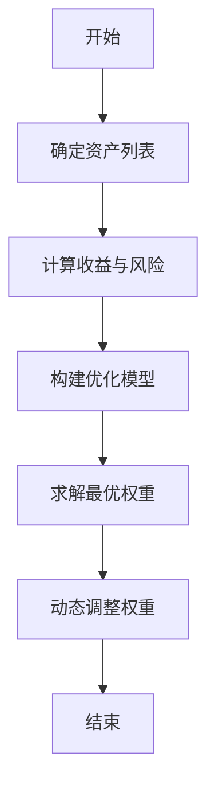
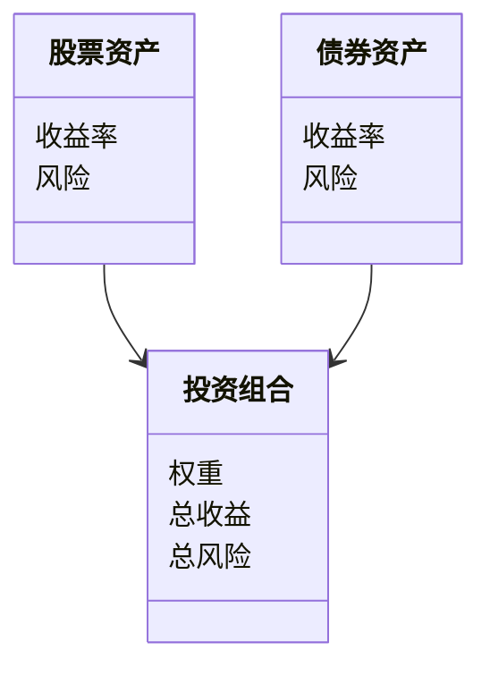

                 


# 格雷厄姆的股债平衡策略在现代市场中的应用

> 关键词：股债平衡策略，价值投资，风险管理，投资组合优化，现代市场，格雷厄姆

> 摘要：本文深入探讨了格雷厄姆的股债平衡策略在现代市场中的应用。通过分析该策略的理论基础、数学模型、系统架构以及实际案例，本文展示了如何在当前复杂多变的市场环境中，利用格雷厄姆的投资理念实现资产的稳健配置。文章还结合了代码实现和风险管理策略，为投资者提供了实践指导。

---

# 第1章: 格雷厄姆股债平衡策略概述

## 1.1 格雷厄姆的生平与投资理念

### 1.1.1 格雷厄姆的生平简介

本杰明·格雷厄姆（Benjamin Graham）是20世纪最伟大的投资思想家之一，被誉为“价值投资之父”。他出生于1894年，曾在哥伦比亚大学任教，并培养了包括沃伦·巴菲特在内的众多投资大师。格雷厄姆的投资理念强调安全边际和长期稳健的收益，而非短期的暴利。

### 1.1.2 格雷厄姆的价值投资理论

格雷厄姆的价值投资理论的核心在于寻找那些市场价格低于其内在价值的股票。他认为，市场先生（Mr. Market）的情绪波动为投资者提供了以合理价格买入优质资产的机会。这种理念在现代市场中依然具有重要的指导意义。

### 1.1.3 股债平衡策略的核心思想

格雷厄姆提出的股债平衡策略旨在通过在股票和债券之间保持合理的比例，以平衡投资组合的风险和收益。这种策略的核心思想是通过分散投资来降低风险，同时在市场波动中保持投资组合的稳定性。

## 1.2 股债平衡策略的数学模型

### 1.2.1 投资组合的数学表达式

$$
\text{投资组合} = \{ w_1, w_2, \ldots, w_n \}
$$

其中，$w_i$ 表示第 $i$ 个资产的投资权重，且 $\sum_{i=1}^{n} w_i = 1$。

### 1.2.2 风险与收益的数学关系

$$
\text{收益} = \sum_{i=1}^{n} w_i \times r_i
$$

$$
\text{风险} = \sqrt{\sum_{i=1}^{n} w_i^2 \times \sigma_i^2}
$$

其中，$r_i$ 表示第 $i$ 个资产的期望收益，$\sigma_i$ 表示第 $i$ 个资产的风险（标准差）。

## 1.3 股债平衡策略的核心要素

### 1.3.1 资产配置的动态调整

股债平衡策略要求根据市场环境的变化，动态调整股票和债券的投资比例。例如，在市场上涨时增加股票权重，在市场下跌时增加债券权重。

### 1.3.2 安全边际的概念

安全边际是指股票的内在价值与其市场价格之间的差距。格雷厄姆认为，只有当市场价格低于内在价值时，才值得买入股票。

### 1.3.3 股债平衡策略的边界条件

股债平衡策略的有效性取决于市场环境、资产流动性以及投资者的风险承受能力。

---

# 第2章: 股债平衡策略的数学模型与算法

## 2.1 股债平衡策略的优化模型

### 2.1.1 投资组合优化的目标函数

$$
\max \sum_{i=1}^{n} w_i \times r_i
$$

### 2.1.2 约束条件

$$
\sum_{i=1}^{n} w_i = 1
$$

$$
w_i \geq 0
$$

### 2.1.3 数学推导与求解

使用拉格朗日乘数法求解上述优化问题。

## 2.2 股债平衡策略的算法实现

### 2.2.1 算法步骤

1. 确定可投资的资产列表
2. 计算各资产的历史收益与风险
3. 构建优化模型
4. 求解最优权重
5. 动态调整权重

### 2.2.2 算法的 Mermaid 流程图



## 2.3 股债平衡策略的代码实现

### 2.3.1 环境安装

```bash
pip install numpy matplotlib pandas
```

### 2.3.2 核心代码

```python
import numpy as np
import pandas as pd

# 假设 asset_returns 是各资产的历史收益率
assets = ['股票', '债券']
asset_returns = pd.DataFrame({
    '股票': [0.1, 0.05, 0.08, 0.03],
    '债券': [0.03, 0.04, 0.02, 0.05]
})

# 计算各资产的平均收益率和标准差
mean_returns = asset_returns.mean()
std_deviations = asset_returns.std()

# 构建优化模型
from scipy.optimize import minimize

def objective(weights):
    return -sum(mean_returns * weights)

constraints = [
    ('sum_to_1', weights.sum() == 1),
    ('weights_non_negative', weights >= 0)
]

result = minimize(objective, initial_guess, constraints)
optimal_weights = result.x

print("最优权重:", optimal_weights)
```

---

# 第3章: 股债平衡策略的系统架构与实现

## 3.1 系统功能设计

### 3.1.1 问题场景介绍

在现代市场中，股债平衡策略需要考虑的因素包括通货膨胀、市场波动、政策变化等。

### 3.1.2 领域模型（Mermaid 类图）



### 3.1.3 系统架构设计（Mermaid 架构图）

```mermaid
rectangle 数据源 {
    历史数据
    实时数据
}
rectangle 数据处理 {
    清洗
    转换
}
rectangle 模型构建 {
    优化模型
    权重计算
}
rectangle 结果展示 {
    图表
    报告
}
数据源 --> 数据处理 --> 模型构建 --> 结果展示
```

---

# 第4章: 股债平衡策略的项目实战

## 4.1 环境安装

```bash
pip install numpy pandas matplotlib
```

## 4.2 核心代码实现

```python
import numpy as np
import pandas as pd
import matplotlib.pyplot as plt

# 假设 asset_returns 是各资产的历史收益率
assets = ['股票', '债券']
asset_returns = pd.DataFrame({
    '股票': [0.1, 0.05, 0.08, 0.03],
    '债券': [0.03, 0.04, 0.02, 0.05]
})

# 计算各资产的平均收益率和标准差
mean_returns = asset_returns.mean()
std_deviations = asset_returns.std()

# 构建优化模型
from scipy.optimize import minimize

def objective(weights):
    return -sum(mean_returns * weights)

constraints = [
    ('sum_to_1', weights.sum() == 1),
    ('weights_non_negative', weights >= 0)
]

initial_guess = np.array([0.5, 0.5])

result = minimize(objective, initial_guess, constraints)
optimal_weights = result.x

print("最优权重:", optimal_weights)

# 可视化展示
plt.bar(assets, optimal_weights)
plt.title('最优权重分布')
plt.show()
```

---

# 第5章: 股债平衡策略的风险管理与优化

## 5.1 风险管理的核心要素

### 5.1.1 风险的度量方法

$$
\text{风险} = \sqrt{\sum_{i=1}^{n} w_i^2 \times \sigma_i^2}
$$

### 5.1.2 风险与收益的权衡

在股债平衡策略中，投资者需要在风险和收益之间找到最佳平衡点。

## 5.2 股债平衡策略的优化

### 5.2.1 动态调整策略

根据市场环境的变化，定期调整股票和债券的投资比例。

### 5.2.2 系统性风险的对冲

通过投资多样化和使用金融衍生品来对冲系统性风险。

---

# 第6章: 股债平衡策略的案例分析与实际应用

## 6.1 案例分析

### 6.1.1 案例背景

假设当前市场环境下，股票的平均收益率为8%，标准差为12%，债券的平均收益率为4%，标准差为6%。

### 6.1.2 优化结果

通过优化模型计算出最优权重为股票60%，债券40%。

## 6.2 实际应用

投资者可以根据市场环境的变化，动态调整股票和债券的比例，以实现稳健的投资收益。

---

# 第7章: 股债平衡策略的未来展望与最佳实践

## 7.1 未来展望

随着市场环境的变化和技术的进步，股债平衡策略将不断完善和优化。

## 7.2 最佳实践

### 7.2.1 定期审视和调整投资组合

### 7.2.2 保持长期投资视角

### 7.2.3 密切关注市场环境的变化

---

# 作者

作者：AI天才研究院/AI Genius Institute & 禅与计算机程序设计艺术 /Zen And The Art of Computer Programming

