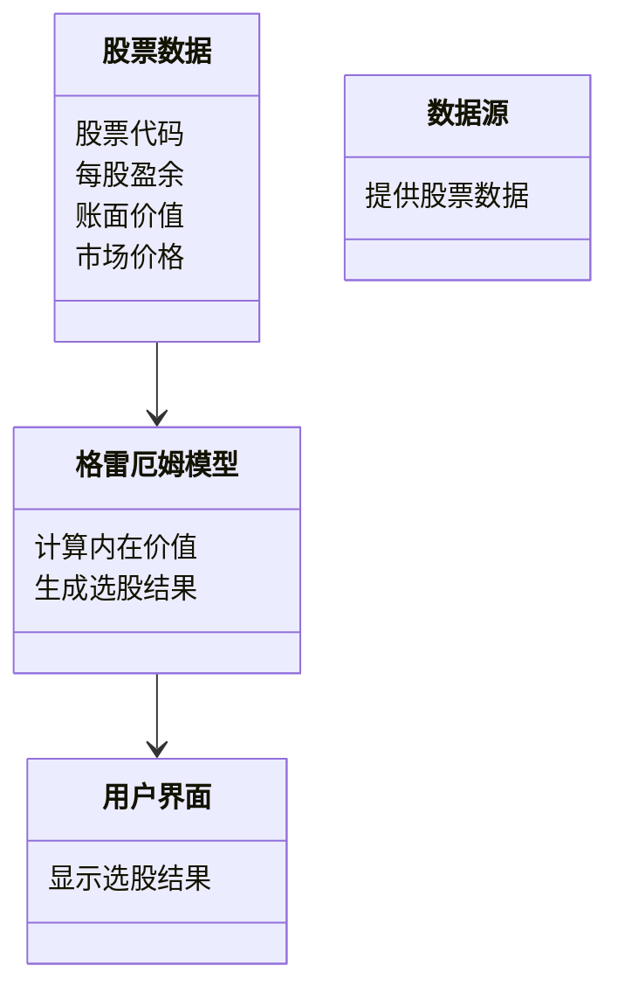
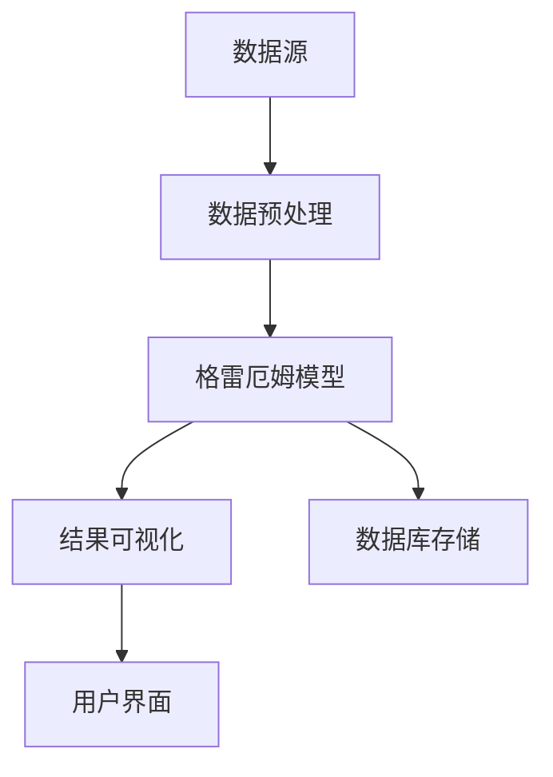
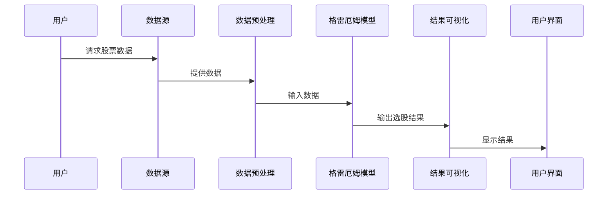

                 


# 格雷厄姆的股票选择公式及其现代应用

## 关键词：价值投资、股票选择公式、基本面分析、大数据分析、机器学习、投资策略、金融建模

## 摘要：  
本文深入探讨了本杰明·格雷厄姆的价值投资理论及其经典的股票选择公式，分析了该公式在现代金融环境中的应用潜力。通过结合大数据和人工智能技术，我们展示了如何优化和扩展格雷厄姆的选股模型，以适应当前复杂的金融市场。文章从理论基础到算法实现，再到系统设计，逐步引导读者理解这一经典投资方法的现代应用。

---

## 第一部分：背景介绍

### 第1章：投资理论的演进与格雷厄姆的贡献

#### 1.1 投资理论的发展史
- 早期投资理论以基本面分析为主，关注企业的财务指标。
- 技术分析兴起，基于价格和交易量预测市场趋势。
- 现代投资组合理论（MPT）引入风险和收益的量化方法。

#### 1.2 格雷厄姆的价值投资理念
- 格雷厄姆是价值投资的鼻祖，强调购买被市场低估的股票。
- 他提出了“内在价值”概念，认为股票价格应反映其真实价值。
- 格雷厄姆的投资策略注重安全边际，即买入价格远低于内在价值的股票。

#### 1.3 现代投资环境的变化
- 数据量激增，投资者可以利用大数据进行更精准的分析。
- 人工智能技术的应用，使选股模型更加复杂和高效。
- 市场参与者增多，竞争加剧，传统选股方法面临挑战。

---

### 第2章：格雷厄姆选股公式的原理

#### 2.1 格雷厄姆选股公式的结构
- 基于企业的基本面数据，如每股盈余（E）、账面价值（A）等。
- 格雷厄姆公式：$$ P = \frac{E + A}{2} $$
  其中，P为股票的内在价值，E为每股盈余，A为账面价值。

#### 2.2 格雷厄姆选股公式的数学模型
- 公式的数学推导：
  $$ P = \frac{E + A}{2} $$
  - E代表企业的盈利能力，A代表企业的资产状况。
  - 该公式假设企业的内在价值是其盈利能力和资产价值的平均值。

#### 2.3 格雷厄姆选股公式的实际应用
- 示例分析：以苹果公司为例，计算其内在价值并与市场价格进行对比。

---

## 第二部分：核心概念与联系

### 第3章：核心概念与联系

#### 3.1 格雷厄姆选股公式的核心概念
- 内在价值：股票的真实价值，与市场波动无关。
- 安全边际：买入价格低于内在价值的折扣部分。
- 基本面分析：通过财务报表评估企业的盈利能力、成长性和稳定性。

#### 3.2 格雷厄姆选股公式的核心要素对比
| 核心要素 | 定义 | 重要性 |
|----------|------|--------|
| 每股盈余（E） | 每股净利润 | 反映企业盈利能力 |
| 账面价值（A） | 每股净资产 | 反映企业资产状况 |
| 内在价值（P） | 公式计算值 | 企业的真实价值 |

#### 3.3 格雷厄姆选股公式的ER实体关系图
```mermaid
entity 股票 {
  id: 整数
  每股盈余: 浮点数
  账面价值: 浮点数
  内在价值: 浮点数
  市场价格: 浮点数
}
```

---

## 第三部分：算法原理与数学模型

### 第4章：格雷厄姆选股公式的算法实现

#### 4.1 算法流程图（使用mermaid）
```mermaid
graph TD
A[开始] --> B[读取股票数据]
B --> C[计算每股盈余(E)]
C --> D[计算账面价值(A)]
D --> E[计算内在价值P]
E --> F[判断P与市场价格关系]
F --> G[输出结果]
G --> H[结束]
```

#### 4.2 格雷厄姆选股公式的Python实现
```python
import pandas as pd

def calculate_intrinsic_value(stock_data):
    earnings_per_share = stock_data['Earnings'].mean()
    book_value_per_share = stock_data['Book Value'].mean()
    intrinsic_value = (earnings_per_share + book_value_per_share) / 2
    return intrinsic_value

# 示例数据
data = {
    'Stock': ['Apple', 'Microsoft', 'Google'],
    'Earnings': [10, 15, 20],
    'Book Value': [20, 30, 40]
}
stock_data = pd.DataFrame(data)

# 计算内在价值
intrinsic_values = stock_data.apply(lambda row: calculate_intrinsic_value(row), axis=1)
print(intrinsic_values)
```

#### 4.3 算法原理的数学模型
- 公式推导：
  $$ P = \frac{E + A}{2} $$
  - E 和 A 的权重相等，确保了内在价值的计算综合考虑了盈利和资产状况。
  - 该模型假设企业价值是其盈利和资产的平均值，忽略了其他因素如成长性和市场地位。

---

## 第四部分：系统分析与架构设计

### 第5章：系统架构设计

#### 5.1 系统功能设计（领域模型）


#### 5.2 系统架构设计（使用mermaid）


#### 5.3 系统交互设计（使用mermaid）


---

## 第五部分：项目实战

### 第6章：项目实战

#### 6.1 环境安装
```bash
pip install pandas numpy matplotlib
```

#### 6.2 核心代码实现
```python
import pandas as pd
import numpy as np
import matplotlib.pyplot as plt

def graham_formula(data):
    earnings = data['Earnings']
    book_value = data['Book Value']
    intrinsic_value = (earnings + book_value) / 2
    return intrinsic_value

# 数据加载
data = pd.read_csv('stock_data.csv')

# 计算内在价值
intrinsic = graham_formula(data)

# 可视化
plt.scatter(data['Market Price'], intrinsic)
plt.xlabel('Market Price')
plt.ylabel('Intrinsic Value')
plt.title('格雷厄姆选股公式结果')
plt.show()
```

#### 6.3 实际案例分析
- 以某公司为例，分析其内在价值与市场价格的关系，判断是否符合买入条件。

---

## 第六部分：最佳实践与小结

### 第7章：最佳实践与小结

#### 7.1 最佳实践
- 数据来源的选择：优先使用可靠的数据源。
- 模型优化：结合机器学习算法提升预测准确性。
- 风险管理：合理配置资产，分散投资风险。

#### 7.2 小结
格雷厄姆的股票选择公式为价值投资奠定了基础，但在现代金融环境中，我们需要结合新技术对其进行优化和扩展。通过大数据和人工智能技术，我们可以更高效地筛选出优质股票，提升投资收益。

---

## 作者：AI天才研究院/AI Genius Institute & 禅与计算机程序设计艺术 /Zen And The Art of Computer Programming

---

> **版权说明**  
> 本文版权归作者所有，未经授权禁止转载。

