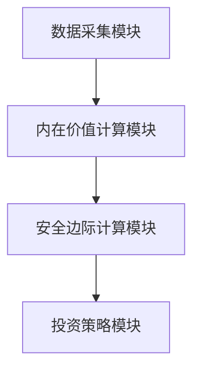

                 


# 格雷厄姆的证券分析：投资者的圣经

> 关键词：格雷厄姆, 证券分析, 价值投资, 内在价值, 安全边际, 投资策略, 投资系统

> 摘要：本文将详细介绍本杰明·格雷厄姆的证券分析方法，从其核心理念、投资策略到实际操作方法，帮助投资者理解和应用这些方法。我们将从背景介绍、核心概念、数学模型、系统架构到项目实战，逐步深入分析，结合实际案例和最佳实践，帮助读者掌握格雷厄姆的投资智慧。

---

## 第一部分：格雷厄姆的证券分析基础

### 第1章：证券分析的背景与核心概念

#### 1.1 证券分析的背景介绍

- **1.1.1 证券分析的定义与重要性**
  证券分析是通过对公司基本面、财务数据和市场趋势的研究，评估证券的投资价值和风险的过程。它帮助投资者做出明智的投资决策，是投资成功的关键。

- **1.1.2 格雷厄姆与价值投资的起源**
  本杰明·格雷厄姆是价值投资的鼻祖，他的《证券分析》一书为投资者提供了系统的分析方法。他强调以低于内在价值的价格买入优质股票，从而实现长期稳定的收益。

- **1.1.3 证券分析的核心目标与意义**
  核心目标是发现被市场低估的证券，通过深入分析公司财务状况和行业地位，评估其投资价值，降低投资风险，实现长期收益。

#### 1.2 格雷厄姆的投资理念与方法

- **1.2.1 价值投资的核心思想**
  价值投资的核心是寻找市场价格低于内在价值的证券。格雷厄姆认为，市场先生的情绪波动为理性投资者提供了低价买入优质资产的机会。

- **1.2.2 安全边际的定义与作用**
  安全边际是格雷厄姆提出的重要概念，指股票市场价格与内在价值之间的差距。通过安全边际，投资者可以降低投资风险，确保在市场波动中依然获得收益。

- **1.2.3 内在价值的计算与市场价的关系**
  内在价值是公司未来现金流的现值。当市场价格低于内在价值时，股票具有投资价值。格雷厄姆强调，内在价值的计算是投资决策的核心。

#### 1.3 核心概念对比分析

- **1.3.1 概念属性特征对比表**

| 概念       | 定义                                                                 | 特征            |
|------------|----------------------------------------------------------------------|-----------------|
| 内在价值    | 股票未来现金流的现值，反映公司的真实价值                                | 理论值，非市场价 |
| 市场价格    | 当前市场上的股票价格，受市场情绪和短期因素影响                          | �易波动          |
| 安全边际    | 市场价格与内在价值的差距，反映投资风险的缓冲空间                        | 保护投资者       |

- **1.3.2 核心概念的ER实体关系图**

```mermaid
entity 内在价值
entity 市场价格
entity 安全边际
关系：内在价值 -> 安全边际
关系：市场价格 -> 安全边际
```

---

### 第2章：格雷厄姆的证券分析方法论

#### 2.1 格雷厄姆的防御性投资策略

- **2.1.1 防御性投资的定义与特点**
  防御性投资强调保守、稳健，注重安全边际，适合风险厌恶型投资者。其特点是选择低风险、高确定性的投资标的。

- **2.1.2 安全边际的计算方法**
  安全边际 = 内在价值 - 市场价格。格雷厄姆建议投资者选择安全边际超过20%的股票，以确保投资的安全性。

- **2.1.3 防御性投资的实施步骤**
  1. 选择具有稳定收益和良好财务状况的公司。
  2. 计算股票的内在价值。
  3. 比较市场价格与内在价值，确保安全边际的存在。
  4. 分散投资，降低风险。

#### 2.2 格雷厄姆的攻击性投资策略

- **2.2.1 攻击性投资的定义与风险**
  攻击性投资追求高收益，适合风险承受能力强的投资者。其特点是选择具有高增长潜力的公司，但风险较高。

- **2.2.2 如何识别低估股票**
  1. 通过市盈率、市净率等指标筛选低估值股票。
  2. 分析公司基本面，确保公司具有增长潜力。
  3. 比较内在价值与市场价格，选择低估股票。

- **2.2.3 攻击性投资的实施要点**
  1. 集中投资于少数优质股票。
  2. 紧密关注市场变化，及时调整投资组合。
  3. 严格控制风险，避免过度投资。

#### 2.3 格雷厄姆的投资策略对比分析

- **2.3.1 防御性与攻击性投资的对比表格**

| 战略       | 风险承受 | 投资目标           | 投资方式         |
|------------|----------|--------------------|------------------|
| 防御性     | 低       | 稳定收益           | 分散投资         |
| 攻击性     | 高       | 高收益             | 集中投资         |

---

### 第3章：证券分析的数学模型与公式

#### 3.1 内在价值的计算公式

- **3.1.1 内在价值的公式推导**
  内在价值 = ∑ (未来现金流的现值)。格雷厄姆通过分析公司未来现金流，计算其现值，得出股票的内在价值。

- **3.1.2 示例计算与分析**
  假设某公司未来5年现金流分别为100万、120万、140万、160万、180万，折现率5%。计算其现值总和，得出内在价值。

- **3.1.3 公式在实际中的应用**
  内在价值公式帮助投资者评估股票的真实价值，指导投资决策。

#### 3.2 安全边际的计算方法

- **3.2.1 安全边际的公式**
  安全边际 = 内在价值 - 市场价格。

- **3.2.2 计算过程与步骤**
  1. 计算股票的内在价值。
  2. 获取股票的市场价格。
  3. 计算安全边际，评估投资风险。

- **3.2.3 实例分析与解释**
  例如，某股票内在价值为100元，市场价格为80元，安全边际为20元，具有较高的投资价值。

---

### 第4章：证券分析的系统架构与设计

#### 4.1 投资决策系统的构成

- **4.1.1 系统功能模块划分**
  1. 数据采集模块：获取公司财务数据和市场数据。
  2. 内在价值计算模块：计算股票的内在价值。
  3. 安全边际计算模块：计算安全边际。
  4. 投资策略模块：根据安全边际和内在价值，制定投资策略。

- **4.1.2 系统架构设计图**



#### 4.2 系统交互流程图

- **4.2.1 投资者决策流程**
  1. 获取市场数据和公司财务数据。
  2. 计算内在价值和安全边际。
  3. 制定投资策略。
  4. 实施投资并监控市场变化。

- **4.2.2 数据分析流程**
  1. 数据清洗与预处理。
  2. 数据分析与建模。
  3. 结果可视化与解释。

---

### 第5章：项目实战与应用

#### 5.1 环境安装与工具准备

- **5.1.1 数据分析工具安装**
  安装Python、Pandas、NumPy等工具。

- **5.1.2 投资分析软件配置**
  配置Jupyter Notebook或PyCharm进行数据分析。

- **5.1.3 数据源获取与处理**
  从Yahoo Finance获取股票数据，进行清洗和预处理。

#### 5.2 核心代码实现

- **5.2.1 内在价值计算代码**

```python
import pandas as pd
import numpy as np

def calculate_intrinsic_value(cash_flows, discount_rate):
    present_value = []
    for year, cash_flow in enumerate(cash_flows):
        pv = cash_flow / (1 + discount_rate) ** year
        present_value.append(pv)
    return sum(present_value)

cash_flows = [100, 120, 140, 160, 180]
discount_rate = 0.05
intrinsic_value = calculate_intrinsic_value(cash_flows, discount_rate)
print("内在价值：", intrinsic_value)
```

- **5.2.2 安全边际计算代码**

```python
market_price = 80
intrinsic_value = 100
margin_of_safety = intrinsic_value - market_price
print("安全边际：", margin_of_safety)
```

- **5.2.3 投资组合优化代码**

```python
import pandas as pd
import numpy as np

# 假设我们有多个股票的数据和它们的内在价值和市场价格
stocks = pd.DataFrame({
    '内在价值': [100, 120, 90, 110],
    '市场价格': [80, 100, 70, 90]
})

stocks['安全边际'] = stocks['内在价值'] - stocks['市场价格']
print(stocks)
```

---

### 第6章：最佳实践与小结

#### 6.1 格雷厄姆投资方法的总结

- **6.1.1 核心理念的回顾**
  价值投资的核心是寻找市场价格低于内在价值的股票，强调安全边际的重要性。

- **6.1.2 方法论的总结**
  格雷厄姆通过深入分析公司基本面，计算内在价值和安全边际，制定防御性和攻击性投资策略。

#### 6.2 投资注意事项与风险提示

- **6.2.1 投资中的常见误区**
  追求短期收益，忽视公司基本面，过度依赖市场情绪。

- **6.2.2 风险管理的重要性**
  设置止损点，分散投资，避免过度集中。

- **6.2.3 长期投资的注意事项**
  长期投资需要耐心和纪律，定期审视投资组合，及时调整。

#### 6.3 拓展阅读与深入学习

- **6.3.1 推荐书籍与资料**
  - 《证券分析》——本杰明·格雷厄姆
  - 《投资之道》——彼得·林奇

- **6.3.2 进一步学习的方向**
  学习其他投资流派，如技术分析，结合价值投资，形成自己的投资体系。

- **6.3.3 实战中的持续改进**
  不断优化投资策略，提升分析能力，总结经验教训。

---

## 作者：AI天才研究院/AI Genius Institute & 禅与计算机程序设计艺术 /Zen And The Art of Computer Programming

通过本文，我们深入探讨了格雷厄姆的证券分析方法，从核心理念到实际操作，帮助投资者掌握价值投资的精髓。希望本文能为您提供有价值的见解和指导，助您在投资道路上取得成功。

