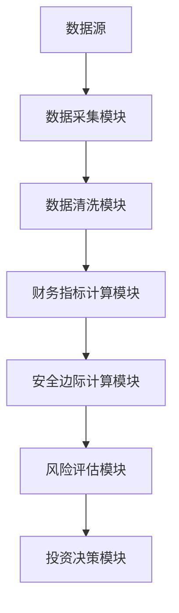
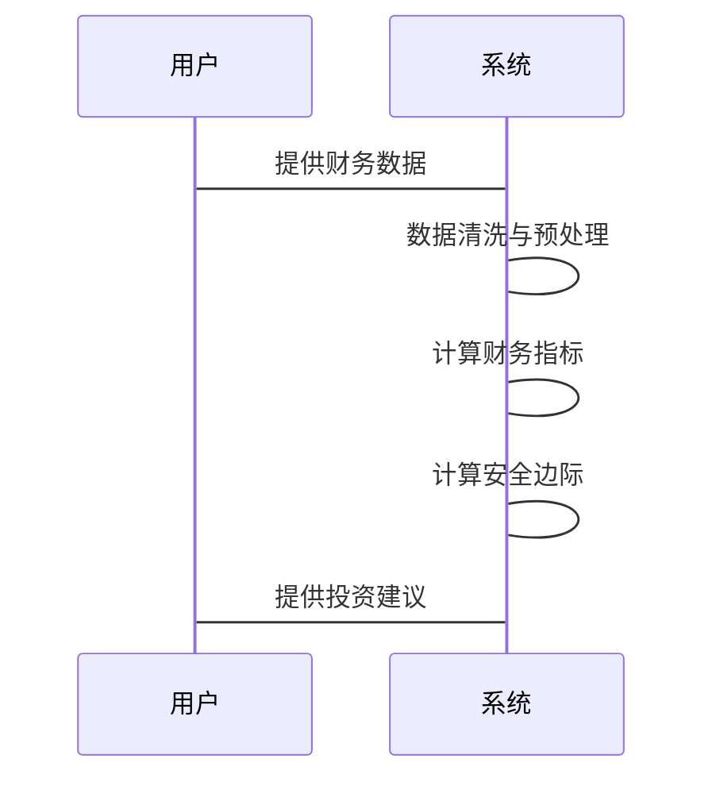

                 


```markdown
# 格雷厄姆的财务分析方法：应对创新商业模式

> 关键词：格雷厄姆、财务分析、创新商业模式、价值投资、安全边际

> 摘要：本文详细探讨了格雷厄姆的财务分析方法在应对创新商业模式中的应用，结合实际案例和系统架构设计，分析了如何在新兴经济环境下利用传统财务分析方法进行有效的投资决策。

---

# 第一部分: 背景介绍与核心概念

## 第1章: 背景介绍

### 1.1 格雷厄姆投资方法的背景
#### 1.1.1 价值投资的起源与发展
- 价值投资的定义与核心理念
- 格雷厄姆的贡献与影响力
- 传统财务分析方法的局限性

#### 1.1.2 创新商业模式的兴起
- 创新商业模式的定义与分类
- 创新商业模式对传统财务分析的挑战
- 创新商业模式与传统商业模式的对比分析

### 1.2 格雷厄姆财务分析方法的核心要素
#### 1.2.1 内在价值的定义与计算
- 内在价值公式：$$内在价值 = \sum_{t=1}^{n} \frac{CF_t}{(1+r)^t}$$
- 现金流贴现模型（DCF）的应用

#### 1.2.2 安全边际的概念与应用
- 安全边际的计算方法
- 安全边际与投资风险的关系
- 安全边际在创新商业模式中的应用

### 1.3 传统财务分析方法与创新商业模式的对比
#### 1.3.1 传统商业模式的财务特征
- 收入来源稳定，资产流动性高
- 财务报表数据的稳定性与可预测性
- 传统财务指标（如ROE、ROA）的有效性

#### 1.3.2 创新商业模式的财务特征
- 收入来源多样化，资产轻资产化
- 高研发投入与长期亏损
- 非传统财务指标（如用户增长率、订阅收入）的重要性

---

# 第二部分: 格雷厄姆财务分析方法的核心概念与联系

## 第2章: 核心概念原理

### 2.1 内在价值的数学模型
#### 2.1.1 现金流贴现模型（DCF）
- 永续年金模型：$$V = \frac{C}{r}$$
- 有限年金模型：$$V = \sum_{t=1}^{n} \frac{C}{(1+r)^t}$$

#### 2.1.2 折现率的确定
- 折现率的定义与计算方法
- 风险溢价的计算与应用

### 2.2 安全边际的计算与应用
#### 2.2.1 安全边际的计算公式
- $$安全边际 = 市场价 - 内在价值$$
- $$安全边际率 = \frac{安全边际}{内在价值}$$

#### 2.2.2 安全边际在投资决策中的应用
- 安全边际与投资风险的关系
- 安全边际在不同市场环境下的调整

### 2.3 财务报表分析的关键指标
#### 2.3.1 利润表分析
- 营业收入、净利润、毛利率等指标的计算与应用
- 资产负债表分析：$$资产 = 负债 + 所有者权益$$

#### 2.3.2 现金流量表分析
- 经营活动、投资活动、筹资活动的现金流分析
- 现金流量与企业价值的关系

## 第3章: 核心概念对比分析

### 3.1 创新商业模式与传统商业模式的对比
#### 3.1.1 财务特征对比表格
| 财务指标 | 传统商业模式 | 创新商业模式 |
|----------|--------------|--------------|
| 资产结构 | 重资产       | 轻资产       |
| 收入来源 | 单一         | 多样化       |
| 利润率   | 高           | 低或负       |

#### 3.1.2 财务报表分析的差异
- 创新商业模式中研发投入的资本化与费用化
- 用户增长率与传统销售收入增长的对比

### 3.2 不同行业模式的财务分析差异
#### 3.2.1 高科技行业
- 高研发投入与长期亏损
- 知识产权与无形资产的评估

#### 3.2.2 互联网行业
- 用户增长与收入转化的关系
- 订阅收入与一次性收入的对比

---

# 第三部分: 格雷厄姆财务分析方法的系统架构设计

## 第4章: 系统架构设计

### 4.1 系统功能设计
#### 4.1.1 财务数据采集模块
- 数据源：财务报表、行业数据、市场数据
- 数据清洗与预处理

#### 4.1.2 财务指标计算模块
- 核心指标：市盈率、市净率、ROE等
- 创新指标：用户增长率、研发投入占比

#### 4.1.3 安全边际计算模块
- 内在价值计算
- 安全边际计算与风险评估

### 4.2 系统架构设计
#### 4.2.1 系统架构图（Mermaid）


#### 4.2.2 系统接口设计
- 数据接口：API调用与数据格式化
- 模块接口：模块之间的数据传递与调用

### 4.3 系统交互流程
#### 4.3.1 系统交互图（Mermaid）


---

# 第四部分: 项目实战与最佳实践

## 第5章: 项目实战

### 5.1 环境安装
#### 5.1.1 安装Python与相关库
- 安装步骤：```bash
    pip install pandas numpy matplotlib
```
- 数据获取：从CSV文件或数据库中获取财务数据

### 5.2 核心代码实现
#### 5.2.1 内在价值计算
```python
import pandas as pd
import numpy as np

def calculate_intrinsic_value(fcf, discount_rate):
    # 永续年金模型
    return fcf / discount_rate
```

#### 5.2.2 安全边际计算
```python
def calculate_margin_of_safety market_price, intrinsic_value):
    return market_price - intrinsic_value
```

### 5.3 实际案例分析
#### 5.3.1 案例选择
- 案例：某互联网公司
- 数据来源：公开财务报表

#### 5.3.2 数据分析与计算
- 计算内在价值与安全边际
- 对比传统与创新商业模式的财务特征

## 第6章: 最佳实践

### 6.1 小结
- 格雷厄姆方法的核心要点
- 创新商业模式的财务分析要点

### 6.2 注意事项
- 数据的准确性和完整性
- 模型的适用性和局限性
- 投资决策的综合性和系统性

### 6.3 未来趋势
- 创新商业模式的进一步发展
- 格雷厄姆方法的改进与创新
- 数字化与智能化在财务分析中的应用

---

# 结语

格雷厄姆的财务分析方法为应对创新商业模式提供了强大的理论基础和实践工具。通过系统的分析与实际案例的剖析，我们可以更好地理解和应用这些方法，以应对新兴经济环境中的投资挑战。未来，随着技术的进步和商业模式的不断创新，格雷厄姆方法的应用也将不断进化，为投资者提供更精准的决策支持。

---

# 作者：AI天才研究院/AI Genius Institute & 禅与计算机程序设计艺术 /Zen And The Art of Computer Programming
```

