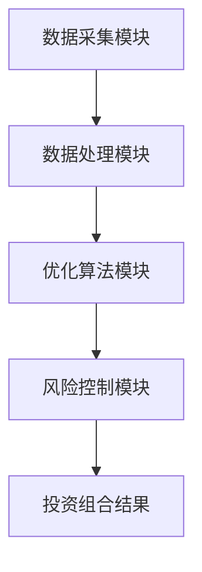

                 

# 格雷厄姆的防御型投资组合构建方法

---

## 关键词

- 防御型投资
- 投资组合构建
- 格雷厄姆投资策略
- 安全边际
- 数学模型

---

## 摘要

本文详细探讨了格雷厄姆防御型投资组合的构建方法，从理论基础到实际应用，结合数学模型和系统架构，全面分析了防御型投资策略的核心要素、优化算法及实战案例。通过本文，读者可以理解如何在复杂多变的金融市场中，通过科学的组合构建方法实现风险可控、收益稳定的防御型投资目标。

---

## 第一部分：格雷厄姆防御型投资组合的背景与核心理念

### 第1章：防御型投资的基本概念与重要性

#### 1.1 投资的基本问题与防御型投资的背景

- **投资的基本问题**：在金融市场中，投资者面临的最大挑战是如何在不确定性和波动性中实现资产的保值与增值。
- **防御型投资的背景**：防御型投资策略起源于20世纪30年代，格雷厄姆在其经典著作《证券分析》中首次系统提出了防御型投资的理念。

#### 1.2 格雷厄姆与防御型投资的联系

- **格雷厄姆的生平与投资理念**：本杰明·格雷厄姆是价值投资之父，他主张以低于内在价值的价格买入优质资产，以规避市场波动带来的风险。
- **防御型投资的核心思想**：格雷厄姆提出，防御型投资的目标是通过合理的资产配置和严格的安全边际筛选，构建一个能够在市场下跌时保持稳定的组合。

#### 1.3 防御型投资在现代金融中的地位

- **防御型投资的现代意义**：在当前复杂的经济环境中，防御型投资策略因其稳健性而备受关注。
- **防御型投资与其他投资策略的对比**：与激进型投资相比，防御型投资更注重风险控制和长期稳定性。

---

### 第2章：防御型投资组合的核心要素

#### 2.1 投资组合构建的基本原理

- **投资组合的定义与作用**：投资组合是指投资者持有的多种资产的集合，其目的是通过多样化来降低风险。
- **防御型投资组合的特点**：防御型投资组合注重资产的安全性，通常以债券、蓝筹股等低风险资产为主。

#### 2.2 格雷厄姆防御型投资的核心策略

- **安全边际的概念与计算**：安全边际是指资产的市场价格低于其内在价值的部分，是防御型投资的核心要素。
- **防御型投资者的特质**：格雷厄姆强调，防御型投资者应具备耐心、纪律性和对市场波动的免疫力。

#### 2.3 防御型投资组合的构建原则

- **分散投资**：通过投资不同类型的资产和行业，降低组合的整体风险。
- **长期视角**：防御型投资注重长期收益，而非短期波动。

---

## 第二部分：格雷厄姆防御型投资组合的数学模型与算法

### 第3章：投资组合优化的数学模型

#### 3.1 均值-方差模型的介绍

- **均值-方差模型的定义**：均值-方差模型由哈里·马科维茨提出，是现代投资组合理论的基础。
- **模型的数学表达**：
  - 投资组合的期望收益：$$E(r_p) = \sum_{i=1}^{n} w_i E(r_i)$$
  - 投资组合的方差：$$Var(r_p) = \sum_{i=1}^{n} \sum_{j=1}^{n} w_i w_j Cov(r_i, r_j)$$

#### 3.2 马科维茨有效前沿的理论基础

- **有效前沿的定义**：有效前沿是指在给定风险水平下，能够提供最高期望收益的投资组合的集合。
- **防御型投资组合的有效前沿分析**：通过调整组合的构成，找到风险最低、收益稳定的投资点。

#### 3.3 格雷厄姆防御型投资组合的数学表达

- **防御型组合的优化目标**：
  $$\min \sum_{i=1}^{n} \sum_{j=1}^{n} w_i w_j Cov(r_i, r_j)$$
  $$\text{subject to } \sum_{i=1}^{n} w_i = 1 \text{ 且 } w_i \geq 0$$

---

### 第4章：防御型投资组合的风险控制算法

#### 4.1 风险调整后的收益计算

- **夏普比率**：$$Sharpe = \frac{E(r_p) - r_f}{\sigma_p}$$
- **特雷诺比率**：$$Treynor = \frac{E(r_p) - r_f}{\beta_p}$$

#### 4.2 方差最小化投资组合的构建

- **方差最小化模型**：
  $$\min \sum_{i=1}^{n} \sum_{j=1}^{n} w_i w_j Cov(r_i, r_j)$$
  $$\text{subject to } \sum_{i=1}^{n} w_i = 1$$

#### 4.3 现实中的防御型投资组合优化

- **实际案例分析**：通过具体市场数据，展示如何通过数学模型优化防御型投资组合。

---

## 第三部分：格雷厄姆防御型投资组合的系统架构与实现

### 第5章：防御型投资组合管理系统架构

#### 5.1 系统功能模块划分

- **数据采集模块**：负责获取市场数据和资产信息。
- **优化算法模块**：实现投资组合的优化计算。
- **风险控制模块**：监控和调整组合的风险水平。

#### 5.2 系统架构的 Mermaid 图

---

### 第6章：防御型投资组合的实战案例分析

#### 6.1 实战案例介绍

- **案例背景**：2008年金融危机期间，防御型投资组合的表现优于市场平均水平。
- **案例分析**：通过具体资产配置，展示防御型组合的风险控制能力。

#### 6.2 投资组合优化的详细解读

- **优化过程**：从数据采集到模型计算，详细解读每一步骤。
- **结果分析**：对比优化前后的组合风险和收益。

---

## 第四部分：格雷厄姆防御型投资组合的最佳实践与总结

### 第7章：防御型投资组合的最佳实践与总结

#### 7.1 最佳实践的总结与建议

- **定期再平衡**：定期调整组合以维持目标配置。
- **避免过度交易**：减少交易成本和税务负担。

#### 7.2 投资组合构建的未来展望

- **新兴市场的防御型机会**：探讨在新兴市场中应用防御型策略的可能性。
- **技术驱动的优化**：利用人工智能和大数据技术进一步优化投资组合。

---

## 作者信息

作者：AI天才研究院/AI Genius Institute & 禅与计算机程序设计艺术 /Zen And The Art of Computer Programming

---

通过本文的详细分析，读者可以全面理解格雷厄姆防御型投资组合的构建方法，并能够在实际投资中灵活运用这些策略。

