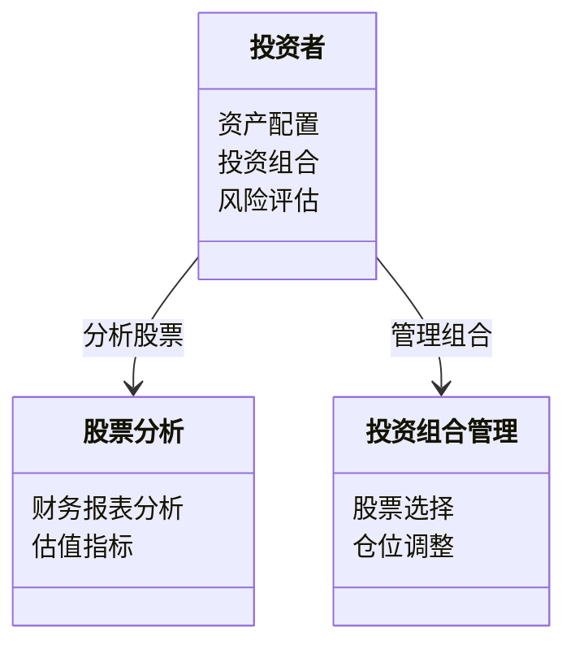
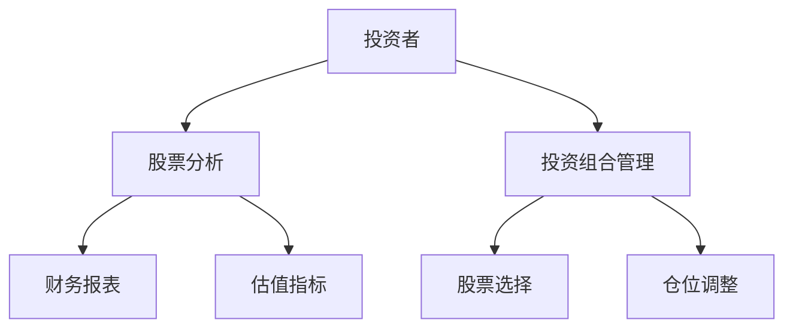
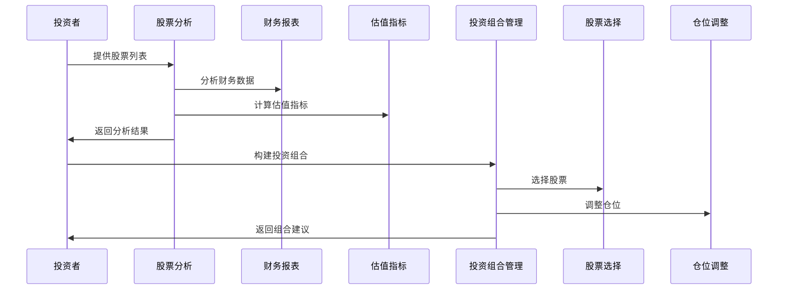

                 


# 格雷厄姆的防御型投资者策略：稳健致胜

## 关键词：
- 格雷厄姆
- 防御型投资
- 安全边际
- 价值投资
- 长期投资

## 摘要：
本篇文章深入探讨了格雷厄姆的防御型投资者策略，强调稳健投资的重要性。通过分析安全边际、基本面评估、风险管理等核心概念，结合实际案例，展示了如何在投资中应用这些策略。文章还提供了数学模型和系统架构，帮助读者更好地理解和实施防御型投资。

---

## 第1章：防御型投资概述

### 1.1 投资的基本概念

#### 1.1.1 投资的定义与分类
投资是指将资金投入某一项目或资产，以期获得未来收益的行为。根据投资目标的不同，可以分为短期投资、中期投资和长期投资。

- **短期投资**：目标是通过快速交易获利，通常在几周或几个月内完成。
- **中期投资**：目标是在几个月到几年内获得稳定收益。
- **长期投资**：目标是通过持有优质资产，获得长期稳定的收益。

#### 1.1.2 主动投资与被动投资的对比
- **主动投资**：投资者积极选择股票，试图通过市场波动获利。风险较高，收益不稳定。
- **被动投资**：通过指数基金等工具，长期持有，收益相对稳定。

#### 1.1.3 防御型投资的定义与特点
防御型投资是一种稳健的投资策略，强调安全边际和长期稳定收益。其特点包括：
- 重视基本面分析
- 注重安全边际
- 低风险，高收益

### 1.2 格雷厄姆的投资理念

#### 1.2.1 价值投资的起源与发展
本杰明·格雷厄姆是价值投资的鼻祖，他提出的防御型投资策略奠定了现代投资学的基础。

#### 1.2.2 安全边际的概念与重要性
安全边际是指股票价格与实际价值之间的差距。通过购买低于内在价值的股票，降低投资风险。

$$ \text{安全边际} = \text{内在价值} - \text{市场价格} $$

#### 1.2.3 边际安全与投资决策的关系
边际安全是指每增加一单位投资的风险变化。格雷厄姆强调在边际安全为正时进行投资。

### 1.3 防御型投资的核心要素

#### 1.3.1 财务报表分析基础
分析资产负债表、利润表和现金流量表，评估企业的财务健康状况。

#### 1.3.2 估值方法的初步介绍
- **市盈率（P/E）**：股价与每股收益的比率。
- **市净率（P/B）**：股价与每股净资产的比率。

#### 1.3.3 风险与收益的平衡
通过分散投资和风险控制，平衡收益与风险。

---

## 第2章：防御型投资者的选股策略

### 2.1 安全边际的计算与应用

#### 2.1.1 安全边际的数学模型
$$ \text{安全边际} = \text{内在价值} - \text{市场价格} $$

#### 2.1.2 通过市盈率、市净率评估安全边际
- **市盈率低于行业平均水平**：表明股票价格被低估。
- **市净率低于行业平均水平**：同样表明股票价格被低估。

### 2.2 防御型投资者的选股标准

#### 2.2.1 企业财务健康状况分析
- **资产负债表**：评估企业的资产、负债和所有者权益。
- **利润表**：评估企业的收入、成本和利润。

#### 2.2.2 企业盈利能力与成长性评估
- **净利润率**：衡量企业的盈利能力。
- **收入增长率**：衡量企业的成长性。

#### 2.2.3 行业地位与竞争优势
选择行业龙头，具有竞争优势的企业。

### 2.3 避免常见错误

#### 2.3.1 过度关注短期波动
防御型投资注重长期，避免受短期波动影响。

#### 2.3.2 忽视企业基本面
全面分析企业的基本面，避免仅关注价格。

#### 2.3.3 追逐市场热点
避免盲目跟风，注重基本面分析。

---

## 第3章：风险管理与心理建设

### 3.1 投资组合的分散化

#### 3.1.1 分散化投资的原理与实践
通过投资不同行业、不同地区的资产，降低风险。

#### 3.1.2 不同资产类别的配置比例
- **股票**：不超过60%
- **债券**：不低于30%
- **现金**：不低于10%

### 3.2 仓位管理与止损策略

#### 3.2.1 如何设定止损点
根据技术分析或估值变化，设定止损点。

#### 3.2.2 动态调整投资仓位
根据市场变化和个人风险承受能力，动态调整仓位。

#### 3.2.3 技术分析在风险管理中的应用
使用均线、MACD等技术指标，辅助决策。

### 3.3 心理风险管理

#### 3.3.1 避免情绪化决策
保持理性，避免贪婪和恐惧影响决策。

#### 3.3.2 建立长期投资心态
耐心持有优质资产，避免频繁交易。

#### 3.3.3 应对市场恐慌的有效方法
保持冷静，利用市场恐慌寻找投资机会。

---

## 第4章：长期投资策略与组合构建

### 4.1 长期投资的哲学与实践

#### 4.1.1 长期投资的优势与挑战
- **优势**：复利效应显著，风险分散。
- **挑战**：需要长期坚持，应对市场波动。

### 4.2 投资组合的构建与调整

#### 4.2.1 初步投资组合的设计
- **资产配置**：股票、债券、现金的比例。
- **行业分布**：分散投资在不同行业。

#### 4.2.2 定期审视与调整策略
每年至少审视一次投资组合，根据市场变化和个人情况调整。

---

## 第5章：系统分析与架构设计

### 5.1 项目介绍
构建一个防御型投资系统，帮助投资者进行基本面分析、风险评估和投资组合管理。

### 5.2 系统功能设计

#### 5.2.1 领域模型


### 5.3 系统架构设计

#### 5.3.1 系统架构


### 5.4 系统接口设计
- **输入接口**：投资者输入资金、风险承受能力。
- **输出接口**：系统输出股票分析结果、投资组合建议。

### 5.5 系统交互

#### 5.5.1 序列图


---

## 第6章：项目实战

### 6.1 环境安装
- **工具**：Python、Pandas、Matplotlib
- **数据源**：Yahoo Finance API

### 6.2 核心实现源代码

#### 6.2.1 财务报表分析
```python
import pandas as pd
import requests

def get_stock_data(ticker):
    url = f"https://query1.finance.yahoo.com/v7/finance/quote/{ticker}"
    response = requests.get(url)
    data = response.json()
    return data

def calculate_pe(ticker):
    data = get_stock_data(ticker)
    pe = data[0]['PE Ratio']
    return pe

print(calculate_pe("AAPL"))
```

#### 6.2.2 估值指标计算
```python
def calculate_margin_of_safety(ticker):
    pe = calculate_pe(ticker)
    intrinsic_value = 1.5 * pe
    current_price = get_current_price(ticker)
    mos = intrinsic_value - current_price
    return mos

print(calculate_margin_of_safety("AAPL"))
```

### 6.3 实际案例分析
以苹果公司为例，计算其安全边际，评估是否为防御型投资标的。

### 6.4 代码应用解读与分析
- **财务报表分析**：获取苹果公司的财务数据，分析其盈利能力。
- **估值指标计算**：计算苹果公司的市盈率和安全边际，评估其投资价值。

### 6.5 项目小结
通过实战项目，掌握了防御型投资策略的具体应用，验证了理论的有效性。

---

## 第7章：最佳实践 tips、小结、注意事项、拓展阅读

### 7.1 最佳实践 tips
- **定期审视投资组合**
- **分散投资，降低风险**
- **避免情绪化决策**

### 7.2 小结
格雷厄姆的防御型投资策略强调稳健和长期，通过基本面分析和安全边际评估，帮助投资者实现稳健收益。

### 7.3 注意事项
- **市场波动不可预测**
- **投资需结合市场环境**
- **持续学习和调整策略**

### 7.4 拓展阅读
- 格雷厄姆的《证券分析》
- 巴菲特的《巴菲特致股东的信》

---

## 作者：AI天才研究院 & 禅与计算机程序设计艺术

---

通过以上结构，我详细地介绍了格雷厄姆的防御型投资策略，从理论到实践，帮助读者全面理解并应用这一策略。

