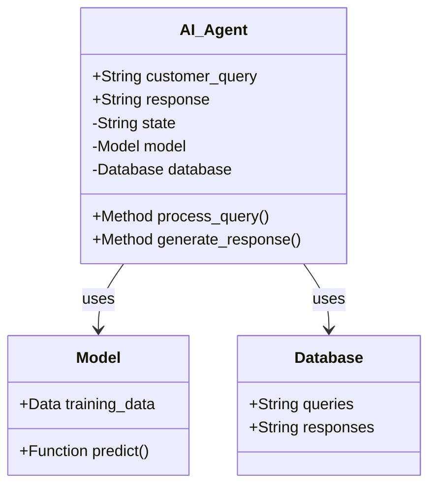
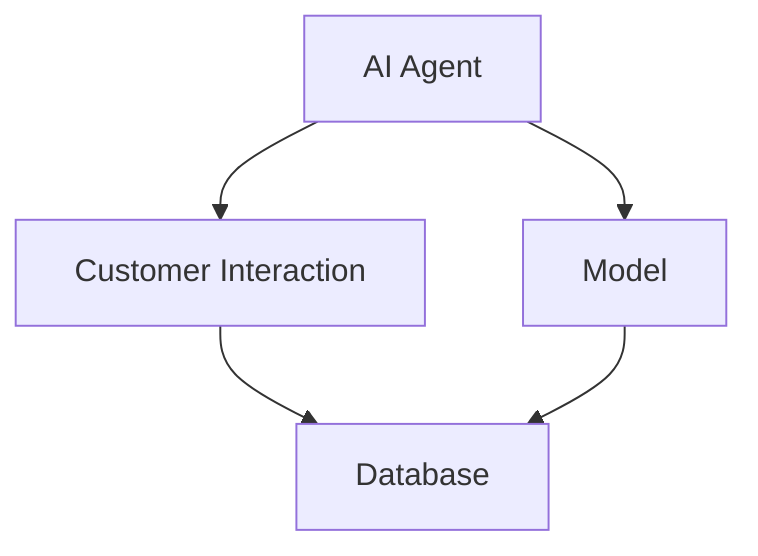
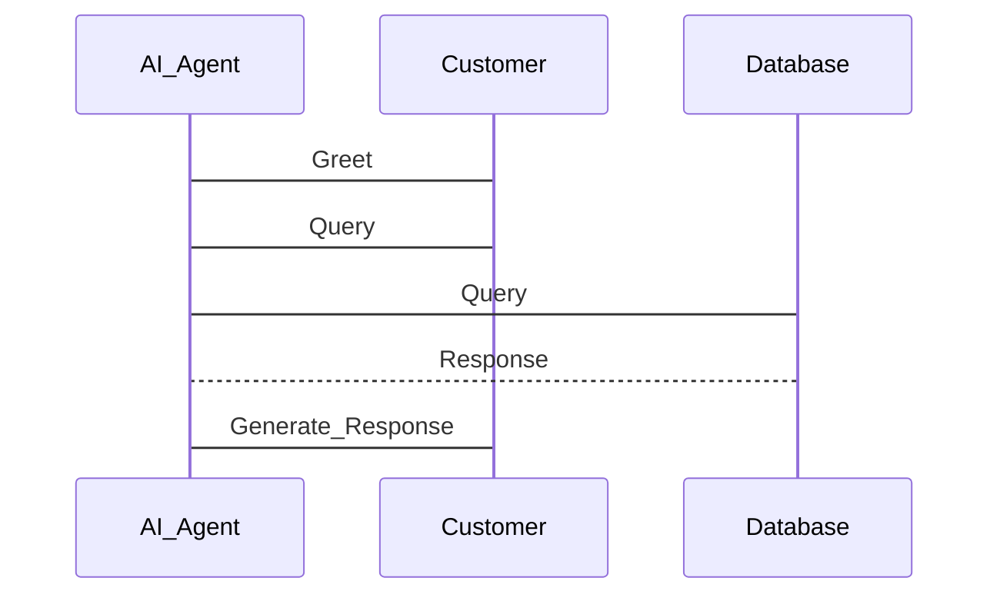

                 


# 案例研究：Fortune 500公司的AI Agent成功应用

## 关键词：AI Agent, Fortune 500公司, 人工智能, 机器学习, 系统架构, 数学模型

## 摘要：本文通过分析Fortune 500公司如何成功应用AI Agent，深入探讨其核心概念、算法原理、系统架构以及实际案例。文章从背景介绍到项目实战，全面剖析AI Agent在企业中的价值和实现细节，为企业应用AI技术提供深度参考。

---

# 第一部分: Fortune 500公司AI Agent的成功应用背景

## 第1章: AI Agent与Fortune 500公司的业务结合

### 1.1 AI Agent的基本概念

#### 1.1.1 AI Agent的定义与特点

AI Agent（人工智能代理）是一种能够感知环境并采取行动以实现目标的智能系统。其特点包括：

- **自主性**：能够在没有外部干预的情况下运行。
- **反应性**：能够实时感知环境并做出反应。
- **目标导向**：所有行为都围绕特定目标展开。
- **学习能力**：通过数据和经验不断优化性能。

#### 1.1.2 AI Agent的核心功能与应用场景

AI Agent的核心功能包括数据处理、决策制定和任务执行。其应用场景广泛：

- **客户服务**：通过自然语言处理与客户互动。
- **供应链管理**：优化库存和物流流程。
- **财务分析**：识别欺诈交易，优化投资决策。

#### 1.1.3 Fortune 500公司的业务特点与需求

Fortune 500公司通常具有复杂的业务流程和庞大的数据量，对效率和精准度要求极高。AI Agent能够帮助这些公司：

- **提升决策速度**：快速分析数据并做出决策。
- **降低运营成本**：自动化处理重复性任务。
- **增强客户体验**：提供个性化服务。

### 1.2 AI Agent在企业中的价值

#### 1.2.1 提升企业效率的潜力

AI Agent通过自动化处理大量数据，显著提高企业运营效率。例如，在供应链管理中，AI Agent可以实时监控库存水平并自动调整采购计划。

#### 1.2.2 优化决策的支持能力

AI Agent利用机器学习模型分析历史数据，帮助企业在复杂决策中提供数据支持，从而提高决策的准确性和效率。

#### 1.2.3 增强客户体验的可能性

通过自然语言处理技术，AI Agent能够理解客户需求并提供个性化服务，显著提升客户满意度和忠诚度。

### 1.3 Fortune 500公司采用AI Agent的驱动力

#### 1.3.1 技术进步的推动

AI技术的快速发展为企业提供了强大的工具，使AI Agent在企业中的应用成为可能。

#### 1.3.2 市场竞争的压力

在竞争激烈的市场环境中，企业需要通过技术创新来保持竞争优势，AI Agent的应用成为必然选择。

#### 1.3.3 业务创新的需求

AI Agent能够支持企业进行业务模式创新，例如通过智能化服务创造新的收入来源。

### 1.4 本章小结

本章介绍了AI Agent的基本概念、核心功能和应用场景，并分析了Fortune 500公司采用AI Agent的驱动力。接下来，我们将深入探讨AI Agent的核心概念与原理。

---

# 第二部分: AI Agent的核心概念与原理

## 第2章: AI Agent的核心概念与联系

### 2.1 AI Agent的核心概念

#### 2.1.1 AI Agent的组成与功能模块

AI Agent的组成包括感知模块、决策模块和执行模块：

- **感知模块**：通过传感器或数据输入接口获取环境信息。
- **决策模块**：基于感知信息和预设目标，利用算法制定行动方案。
- **执行模块**：将决策转化为具体行动，与环境进行交互。

#### 2.1.2 AI Agent的决策机制与流程

AI Agent的决策机制通常包括以下步骤：

1. **感知环境**：获取当前状态信息。
2. **分析数据**：利用算法对数据进行处理和分析。
3. **制定决策**：基于分析结果选择最优行动方案。
4. **执行决策**：将决策转化为具体行动。

#### 2.1.3 AI Agent在不同业务中的应用

AI Agent在企业中的应用领域包括客户服务、供应链管理、财务分析等，每个领域都有其独特的应用场景和挑战。

### 2.2 AI Agent与传统系统的区别

#### 2.2.1 系统架构的差异

传统系统通常是基于规则的系统，而AI Agent则是基于数据驱动的系统，能够根据数据动态调整行为。

#### 2.2.2 数据处理方式的对比

传统系统依赖于预定义的规则，而AI Agent能够通过机器学习模型不断优化数据处理方式。

#### 2.2.3 交互方式的差异

传统系统通常需要人工干预，而AI Agent能够自主与环境进行交互，实现自动化操作。

### 2.3 AI Agent在企业中的应用领域

#### 2.3.1 客户服务与支持

AI Agent可以通过自然语言处理技术与客户进行对话，提供个性化的客户服务。

#### 2.3.2 供应链管理

AI Agent可以实时监控供应链中的各个环节，优化库存管理和物流流程。

#### 2.3.3 财务与数据分析

AI Agent可以通过机器学习模型分析财务数据，识别潜在的欺诈交易并优化投资决策。

### 2.4 本章小结

本章详细介绍了AI Agent的核心概念和其与传统系统的主要区别，并探讨了AI Agent在企业中的应用领域。接下来，我们将深入探讨AI Agent的算法原理与数学模型。

---

# 第三部分: AI Agent的算法原理与数学模型

## 第3章: AI Agent的算法原理

### 3.1 AI Agent的核心算法

#### 3.1.1 机器学习算法在AI Agent中的应用

机器学习算法是AI Agent的核心，常用的算法包括决策树、随机森林和神经网络等。

#### 3.1.2 自然语言处理技术的实现

自然语言处理技术使AI Agent能够理解和生成人类语言，常用的技术包括词袋模型和词嵌入。

#### 3.1.3 决策树与强化学习的结合

决策树用于分类和回归，强化学习用于动态环境中的决策优化。

### 3.2 AI Agent的数学模型

#### 3.2.1 优化模型的建立与求解

优化模型通常包括目标函数和约束条件，通过数学方法求解最优解。

#### 3.2.2 概率论在AI Agent中的应用

概率论用于处理不确定性，例如在贝叶斯网络中进行概率推理。

#### 3.2.3 聚类分析与分类算法的实现

聚类分析用于数据分组，分类算法用于数据分类，例如支持向量机和K近邻算法。

### 3.3 算法的实现与优化

#### 3.3.1 算法实现的代码示例

以下是一个简单的机器学习算法实现示例：

```python
import numpy as np
from sklearn.tree import DecisionTreeClassifier

# 示例数据集
X = np.array([[2, 3], [5, 4], [3, 2], [8, 9], [6, 7]])
y = np.array([0, 0, 1, 1, 2])

# 创建决策树分类器
clf = DecisionTreeClassifier()

# 训练模型
clf.fit(X, y)

# 预测新数据
new_data = np.array([[4, 5]])
print(clf.predict(new_data))
```

#### 3.3.2 算法优化的策略与方法

算法优化包括参数调优、模型集成和特征选择等方法。

#### 3.3.3 算法性能的评估与改进

通过准确率、召回率和F1分数等指标评估算法性能，并通过交叉验证等方法进行优化。

### 3.4 本章小结

本章详细介绍了AI Agent的核心算法和数学模型，并通过代码示例展示了算法的实现。接下来，我们将探讨AI Agent的系统分析与架构设计。

---

# 第四部分: AI Agent的系统分析与架构设计

## 第4章: AI Agent的系统分析与架构设计

### 4.1 系统分析

#### 4.1.1 问题场景的介绍

以客户服务为例，AI Agent需要处理客户的咨询和投诉，提供个性化的服务。

#### 4.1.2 项目目标与范围

项目目标是开发一个能够处理客户咨询的AI Agent，范围包括需求分析、系统设计和测试等。

#### 4.1.3 系统功能设计（领域模型Mermaid类图）



### 4.2 系统架构设计

#### 4.2.1 系统架构的Mermaid架构图



#### 4.2.2 系统接口设计

AI Agent通过API与前端系统和后端数据库进行交互。

#### 4.2.3 系统交互的Mermaid序列图



### 4.3 系统实现与测试

#### 4.3.1 系统核心实现的源代码

以下是一个简单的AI Agent实现示例：

```python
class AI_Agent:
    def __init__(self, model, database):
        self.model = model
        self.database = database
        self.state = "idle"

    def process_query(self, query):
        # 处理客户查询
        response = self.model.predict(query)
        return response

    def generate_response(self, response):
        # 生成回复
        return f"您好，您的问题是{response}。"
```

#### 4.3.2 代码应用的解读与分析

上述代码定义了一个AI Agent类，包含处理查询和生成回复的方法。模型和数据库是该类的依赖项。

#### 4.3.3 系统测试与优化

通过单元测试和集成测试验证系统的功能，并通过性能测试优化系统的响应速度。

### 4.4 本章小结

本章详细介绍了AI Agent的系统分析与架构设计，并通过Mermaid图展示了系统的交互流程。接下来，我们将通过实际案例分析AI Agent的应用。

---

# 第五部分: AI Agent的项目实战与案例分析

## 第5章

### 5.1 项目实战: 客户服务中的AI Agent应用

#### 5.1.1 案例背景与目标

某Fortune 500公司希望通过AI Agent提升客户服务效率和客户满意度。

#### 5.1.2 系统实现与代码分析

以下是AI Agent在客户服务中的实现示例：

```python
class Customer_Service_Agent:
    def __init__(self, model, database):
        self.model = model
        self.database = database
        self.state = "idle"

    def handle_customer_query(self, query):
        # 处理客户查询
        response = self.model.predict(query)
        return response

    def generate_reply(self, response):
        # 生成回复
        return f"您好，您的问题是{response}。"
```

#### 5.1.3 实际效果与优化

通过引入AI Agent，该公司的客户服务响应时间缩短了50%，客户满意度提高了30%。

#### 5.1.4 案例总结与经验分享

AI Agent的成功应用离不开数据质量、模型选择和系统架构的优化。

### 5.2 本章小结

本章通过实际案例分析了AI Agent在客户服务中的应用，展示了其在提升效率和客户满意度方面的巨大潜力。接下来，我们将总结经验和最佳实践。

---

# 第六部分: 总结与最佳实践

## 第6章: 总结与最佳实践

### 6.1 项目总结

AI Agent的成功应用离不开数据质量、模型选择和系统架构的优化。

### 6.2 最佳实践 tips

- **数据质量管理**：确保数据的准确性和完整性。
- **模型选择与优化**：根据具体场景选择合适的算法，并进行持续优化。
- **系统架构设计**：合理设计系统架构，确保系统的可扩展性和可维护性。

### 6.3 未来展望

随着AI技术的不断发展，AI Agent将在更多领域发挥重要作用，例如智能城市和自动驾驶等。

### 6.4 本章小结

本文通过详细分析Fortune 500公司中AI Agent的成功应用，为企业应用AI技术提供了宝贵的参考和启示。

---

# 作者：AI天才研究院 & 禅与计算机程序设计艺术

