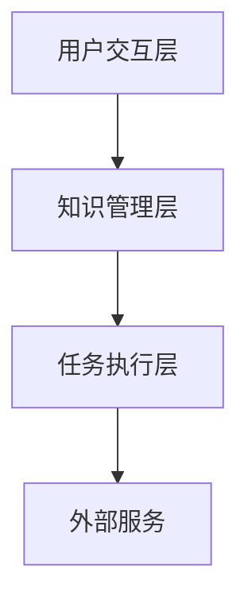

                 


# 案例解析：成功落地的企业级AI Agent项目

## 关键词：企业级AI Agent，AI代理，知识表示，自然语言处理，系统架构，项目实战

## 摘要：  
本文通过详细解析一个成功落地的企业级AI Agent项目，深入探讨了AI Agent的核心概念、技术原理、系统架构以及实际应用中的关键问题。文章首先介绍了AI Agent的基本概念与背景，随后分析了其核心原理与技术架构，详细讲解了相关算法原理，并通过具体案例展示了项目实战过程。最后，总结了项目实施中的最佳实践与经验教训，为读者提供了宝贵的参考。

---

## 第1章: AI Agent的基本概念与背景

### 1.1 AI Agent的定义与核心概念  
AI Agent（人工智能代理）是指能够感知环境、自主决策并执行任务的智能体。它通过与用户交互、分析数据、调用服务等方式，帮助用户完成复杂任务。  

#### 1.1.1 什么是AI Agent  
AI Agent是一种智能系统，能够理解用户需求、执行任务并提供反馈。它结合了自然语言处理、知识表示、推理和决策等技术，具有以下核心特征：  
- **自主性**：能够自主决策，无需人工干预。  
- **反应性**：能够实时感知环境并做出响应。  
- **学习能力**：能够通过经验优化自身行为。  

#### 1.1.2 AI Agent的核心特征  
1. **感知能力**：通过传感器或数据输入感知环境。  
2. **推理能力**：基于知识库进行逻辑推理。  
3. **决策能力**：根据推理结果做出最优决策。  
4. **执行能力**：通过调用服务或接口执行任务。  

#### 1.1.3 企业级AI Agent的独特性  
企业级AI Agent专注于为企业场景提供解决方案，具有以下独特性：  
- **高可用性**：需要7×24小时稳定运行。  
- **复杂性**：涉及多部门协作和复杂业务逻辑。  
- **安全性**：需要保护企业数据和隐私。  

---

## 第2章: AI Agent的核心原理与技术架构

### 2.1 AI Agent的核心原理  
AI Agent的核心原理包括感知、决策和执行三个主要阶段。  

#### 2.1.1 感知与理解  
AI Agent通过自然语言处理（NLP）技术理解用户输入。感知过程包括：  
1. **分词与词性标注**：将输入文本分割成词语，并标注词性。  
2. **语义理解**：通过预训练语言模型（如BERT）理解用户意图。  
3. **知识库查询**：将用户需求与知识库中的信息进行匹配。  

#### 2.1.2 决策与执行  
AI Agent基于感知结果进行决策，并通过调用服务或接口执行任务。决策过程包括：  
1. **逻辑推理**：基于知识库进行推理，生成解决方案。  
2. **任务分解**：将复杂任务分解为多个子任务。  
3. **服务调用**：通过API调用相关服务完成任务。  

### 2.2 技术架构分析  
企业级AI Agent的技术架构通常采用分层架构，包括用户交互层、知识管理层和任务执行层。  

#### 2.2.1 分层架构设计  
- **用户交互层**：负责接收用户输入并返回结果。  
- **知识管理层**：存储和管理知识库，支持推理和查询。  
- **任务执行层**：负责调用外部服务和执行具体任务。  

#### 2.2.2 组件间关系分析  
以下是组件间关系的Mermaid图：



---

## 第3章: 企业级AI Agent的算法原理

### 3.1 知识表示与推理算法  
知识表示是AI Agent的核心技术之一，常用的表示方法包括语义网和知识图谱。  

#### 3.1.1 知识图谱构建  
知识图谱是一种图结构，由节点和边组成，节点表示实体，边表示关系。知识图谱的构建过程包括：  
1. **数据采集**：从多种数据源采集数据。  
2. **数据清洗**：去除冗余和错误数据。  
3. **实体识别**：识别文本中的实体并建立映射关系。  

#### 3.1.2 逻辑推理方法  
逻辑推理是AI Agent进行决策的重要手段。常用的推理方法包括：  
1. **基于规则的推理**：通过预定义规则进行推理。  
2. **基于概率的推理**：通过概率模型进行推理。  
3. **基于图的推理**：通过知识图谱进行最短路径推理。  

### 3.2 自然语言处理算法  
自然语言处理（NLP）是AI Agent理解用户需求的关键技术。  

#### 3.2.1 分词与词性标注  
分词是将文本分割成词语的过程，词性标注是对每个词语进行词性分类的过程。  

#### 3.2.2 语义理解模型  
语义理解模型（如BERT）能够理解文本的语义含义，并生成上下文相关的表示。  

#### 3.2.3 对话生成算法  
对话生成算法通过生成模型生成自然流畅的对话回复。常用的算法包括生成式对抗网络（GAN）和Transformer模型。  

---

## 第4章: 系统架构与设计

### 4.1 系统功能模块划分  
企业级AI Agent系统通常划分为以下功能模块：  
1. **用户交互模块**：负责接收用户输入并返回结果。  
2. **知识库管理模块**：负责知识库的存储和管理。  
3. **任务执行模块**：负责调用外部服务和执行任务。  

#### 4.1.1 用户交互模块  
用户交互模块通过自然语言处理技术实现与用户的对话交互。  

#### 4.1.2 知识库管理模块  
知识库管理模块通过知识图谱技术实现知识的存储和管理。  

#### 4.1.3 任务执行模块  
任务执行模块通过API调用外部服务完成具体任务。  

### 4.2 系统架构设计  
企业级AI Agent的系统架构通常采用微服务架构，具有高可用性和可扩展性。  

#### 4.2.1 微服务架构设计  
微服务架构将系统划分为多个独立的服务，每个服务负责特定的功能。  

#### 4.2.2 高可用性设计  
高可用性设计通过冗余和负载均衡确保系统的稳定运行。  

---

## 第5章: 项目实战与案例分析

### 5.1 项目背景与目标  
本项目旨在开发一个企业级AI Agent系统，用于内部员工的智能助手。  

#### 5.1.1 项目需求分析  
项目需求包括：  
- 提供自然语言对话功能。  
- 支持知识库查询与推理。  
- 提供任务执行功能。  

#### 5.1.2 项目目标设定  
项目目标是实现一个能够理解用户需求、提供解决方案的智能助手。  

### 5.2 系统实现与代码解读  
以下是系统核心功能模块的实现代码示例：  

#### 5.2.1 知识库管理模块  
```python
class KnowledgeBase:
    def __init__(self):
        self.graph = {}

    def add_entity(self, entity, properties):
        self.graph[entity] = properties

    def query(self, entity):
        return self.graph.get(entity, {})
```

#### 5.2.2 用户交互模块  
```python
class NLPProcessor:
    def __init__(self):
        pass

    def process_input(self, input_text):
        # 分词和词性标注
        tokens = tokenize(input_text)
        # 语义理解
        semantics = semantic_parser(tokens)
        return semantics
```

---

## 第6章: 最佳实践与经验总结

### 6.1 项目实施中的关键点  
1. **团队协作**：团队成员需要具备跨领域知识。  
2. **技术选型**：选择合适的技术栈和工具。  
3. **测试与优化**：通过测试不断优化系统性能。  

### 6.2 项目总结与未来展望  
通过本项目的实施，我们积累了宝贵的经验，未来将致力于优化算法和扩展功能。  

---

## 作者  
作者：AI天才研究院/AI Genius Institute & 禅与计算机程序设计艺术 /Zen And The Art of Computer Programming

