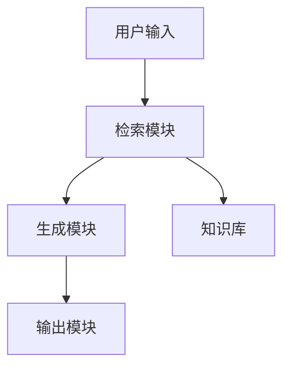
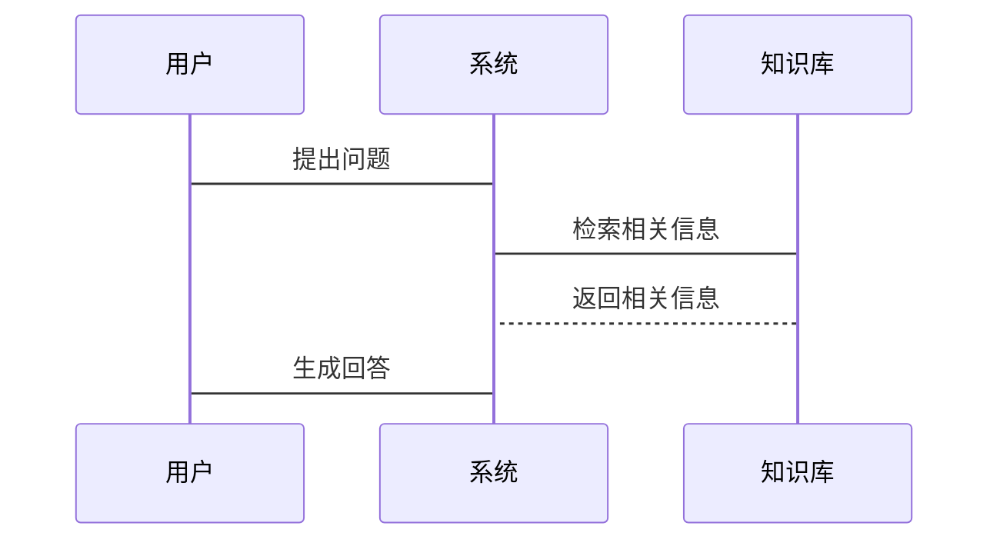
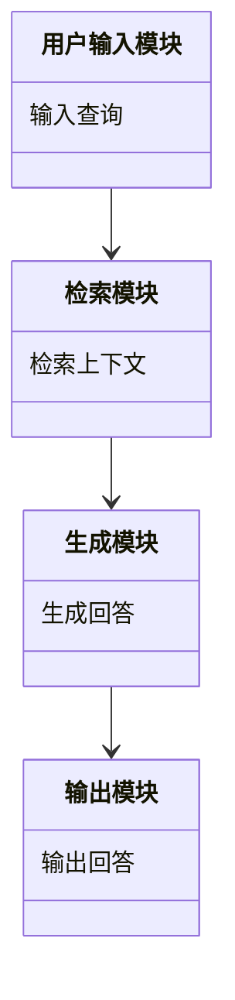

                 


# 检索增强生成：提高AI Agent回答的准确性

## 关键词：
AI Agent, 检索增强生成, 大语言模型, 检索技术, 精准回答, 生成模型

## 摘要：
AI Agent作为人工智能技术的重要应用，其回答准确性直接影响用户体验。传统的生成模型在面对复杂问题时，容易产生不准确或不相关的回答。为了提高回答的准确性，检索增强生成技术应运而生。本文从背景、原理、算法实现、系统架构到项目实战，全面探讨检索增强生成技术的核心概念、实现方法及应用案例，帮助读者深入了解如何通过结合检索和生成技术，提升AI Agent的回答质量。

---

## 第1章 检索增强生成的背景与问题背景

### 1.1 AI Agent的发展与挑战
#### 1.1.1 AI Agent的基本概念
AI Agent（人工智能代理）是一种能够感知环境、执行任务并做出决策的智能体。它可以理解用户需求，通过内部逻辑推理生成回答或执行操作。AI Agent的应用场景广泛，包括智能助手、智能客服、教育辅助工具等。

#### 1.1.2 当前AI Agent的回答准确性问题
尽管生成模型（如GPT系列）在自然语言处理任务中表现出色，但其生成的回答可能存在以下问题：
- **不准确性**：生成的回答可能与实际情况不符，尤其是在处理复杂或专业领域的问题时。
- **相关性不足**：生成的回答可能偏离用户的真实需求。
- **多样性不足**：生成的回答可能缺乏多样性，无法覆盖多种可能的解决方案。

#### 1.1.3 检索增强生成技术的提出背景
为了解决上述问题，检索增强生成（Retrieval-Augmented Generation, RAG）技术应运而生。RAG结合了检索技术（如向量索引、记忆网络）和生成技术（如大语言模型），通过检索相关上下文信息来增强生成的准确性和相关性。

---

### 1.2 检索增强生成的核心概念
#### 1.2.1 检索与生成的结合方式
检索增强生成的核心思想是：在生成回答之前，通过检索模块获取与用户查询相关的上下文信息，结合这些信息生成更准确和相关的回答。其结合方式主要包括：
- **基于检索的生成策略**：先检索相关上下文，再基于这些上下文生成回答。
- **基于生成的检索优化**：通过生成模型优化检索结果，选择最相关的上下文。
- **检索与生成的联合优化**：同时优化检索和生成过程，使两者相互促进。

#### 1.2.2 检索增强生成的优势与特点
检索增强生成相比传统生成技术，具有以下优势：
- **提高准确性**：通过检索相关上下文，生成的回答更贴近真实需求。
- **增强相关性**：结合上下文信息，生成的回答更相关。
- **支持复杂场景**：能够处理需要多步推理或专业知识的复杂问题。

#### 1.2.3 检索增强生成的应用场景
- **智能客服系统**：通过检索客户历史记录和知识库，生成更精准的回复。
- **教育辅助工具**：结合教材内容，生成更准确的解答。
- **新闻生成与摘要**：通过检索相关新闻内容，生成高质量的新闻摘要。

---

### 1.3 检索增强生成的现状与发展趋势
#### 1.3.1 当前主流技术分析
当前，检索增强生成技术主要结合大语言模型和向量检索技术。主流方法包括：
- **基于向量的检索增强生成**：将文本编码为向量，通过向量检索获取相关上下文。
- **基于记忆网络的检索增强生成**：利用记忆网络存储和检索上下文信息。
- **基于强化学习的检索增强生成**：通过强化学习优化检索和生成过程。

#### 1.3.2 检索增强生成技术的发展方向
未来，检索增强生成技术可能朝着以下方向发展：
- **多模态检索增强生成**：结合图像、视频等多模态信息，提升生成的准确性和多样性。
- **动态检索增强生成**：根据实时数据动态调整检索和生成策略。
- **分布式检索增强生成**：在分布式系统中实现高效的检索和生成。

#### 1.3.3 技术面临的挑战与解决方案
检索增强生成技术面临的主要挑战包括：
- **计算效率问题**：检索和生成的计算成本较高。
- **数据质量问题**：检索到的上下文信息可能存在噪声或不准确性。
- **模型调优难度**：检索和生成模块的联合优化需要复杂的算法设计。

---

## 第2章 检索增强生成的核心原理

### 2.1 检索与生成的结合方式
#### 2.1.1 基于检索的生成策略
基于检索的生成策略是一种常见的检索增强生成方法。其核心步骤如下：
1. **用户输入查询**：用户提出问题或需求。
2. **检索模块获取上下文**：通过向量检索技术，从知识库中检索与查询相关的上下文信息。
3. **生成模块生成回答**：基于检索到的上下文和用户查询，生成最终的回答。

#### 2.1.2 基于生成的检索优化
基于生成的检索优化是一种通过生成模型优化检索结果的方法。其核心步骤如下：
1. **用户输入查询**：用户提出问题或需求。
2. **生成模块生成检索关键词**：通过生成模型生成检索关键词。
3. **检索模块获取上下文**：基于检索关键词，从知识库中检索相关上下文信息。
4. **生成模块生成回答**：基于检索到的上下文生成最终回答。

#### 2.1.3 检索与生成的联合优化
检索与生成的联合优化是一种更复杂的检索增强生成方法。其核心思想是同时优化检索和生成过程，使两者相互促进。具体步骤如下：
1. **用户输入查询**：用户提出问题或需求。
2. **检索模块和生成模块联合优化**：通过联合优化算法，调整检索策略和生成策略。
3. **生成模块生成回答**：基于优化后的检索结果生成最终回答。

---

### 2.2 检索增强生成的数学模型
#### 2.2.1 检索模块的数学表达
检索模块通常基于向量相似度计算。假设我们将文本表示为向量$X$，检索目标向量$Y$，则相似度计算公式为：
$$ \text{similarity}(X, Y) = \frac{X \cdot Y}{\|X\| \|Y\|} $$
其中，$X$和$Y$分别为查询向量和候选文本向量。

#### 2.2.2 生成模块的数学表达
生成模块通常基于生成对抗网络（GAN）或变分自编码器（VAE）。以生成对抗网络为例，生成器的目标函数为：
$$ \min_{G} \max_{D} \mathbb{E}_{x \sim p_{\text{data}}}[\log D(x)] + \mathbb{E}_{z \sim p(z)}[\log (1 - D(G(z)))] $$

#### 2.2.3 检索与生成的联合优化模型
检索与生成的联合优化模型通常基于端到端训练。假设检索模块和生成模块共享参数$\theta$，则联合优化目标函数为：
$$ \min_{\theta} \mathbb{L}_{\text{retrieval}}(\theta) + \mathbb{L}_{\text{generation}}(\theta) $$

---

### 2.3 检索增强生成的核心算法
#### 2.3.1 基于向量的检索增强生成
基于向量的检索增强生成是一种常见的方法，其核心算法如下：
1. **文本向量化**：将输入文本映射为向量表示。
2. **向量检索**：基于向量相似度计算，检索最相关的文本。
3. **生成回答**：基于检索到的文本生成最终回答。

#### 2.3.2 基于记忆网络的检索增强生成
基于记忆网络的检索增强生成通过记忆网络存储上下文信息，其核心算法如下：
1. **记忆存储**：将上下文信息存储在记忆网络中。
2. **查询处理**：将用户查询与记忆网络中的信息进行匹配。
3. **生成回答**：基于匹配结果生成最终回答。

#### 2.3.3 基于强化学习的检索增强生成
基于强化学习的检索增强生成通过强化学习优化检索和生成过程，其核心算法如下：
1. **状态表示**：表示当前状态，包括用户查询和检索结果。
2. **动作选择**：基于状态选择检索或生成动作。
3. **奖励机制**：根据生成回答的质量给予奖励。
4. **策略优化**：基于奖励优化检索和生成策略。

---

## 第3章 检索增强生成的算法实现

### 3.1 检索模块的实现
#### 3.1.1 向量索引的构建
向量索引的构建是基于文本向量化技术，通常使用预训练的大语言模型（如BERT）提取文本表示。

#### 3.1.2 检索策略的设计
检索策略的设计包括相似度计算和检索结果排序。常用的相似度计算方法包括余弦相似度和欧氏距离。

#### 3.1.3 检索结果的优化
检索结果的优化包括结果去重、排序优化和结果摘要。

### 3.2 生成模块的实现
#### 3.2.1 生成模型的选择
生成模型可以选择基于Transformer的生成模型，如GPT。

#### 3.2.2 生成策略的设计
生成策略的设计包括基于检索结果的条件生成和基于记忆网络的生成。

#### 3.2.3 生成结果的优化
生成结果的优化包括生成结果的多样性优化和生成结果的可解释性优化。

---

### 3.3 检索增强生成的系统架构

#### 3.3.1 系统功能设计
系统功能设计包括用户输入、检索模块、生成模块和输出模块。

#### 3.3.2 系统架构图
以下是系统架构的Mermaid图：



#### 3.3.3 系统交互流程图
以下是系统交互的Mermaid图：



---

## 第4章 检索增强生成的系统分析与架构设计

### 4.1 系统分析
#### 4.1.1 系统功能模块
系统功能模块包括：
- 用户输入模块
- 检索模块
- 生成模块
- 输出模块

#### 4.1.2 系统性能分析
系统性能分析包括系统响应时间、系统吞吐量和系统资源利用率。

### 4.2 系统架构设计
#### 4.2.1 系统架构图
以下是系统架构的Mermaid图：



#### 4.2.2 系统接口设计
系统接口设计包括：
- 用户输入接口
- 检索模块接口
- 生成模块接口
- 输出模块接口

---

## 第5章 检索增强生成的项目实战

### 5.1 环境安装
#### 5.1.1 安装Python
安装Python 3.8及以上版本。

#### 5.1.2 安装必要的库
安装必要的库，如numpy、pandas、transformers、sentence-transformers。

### 5.2 系统核心实现
#### 5.2.1 检索模块实现
以下是检索模块的Python代码示例：

```python
from sentence_transformers import SentenceTransformer
from sklearn.metrics.pairwise import cosine_similarity

model = SentenceTransformer('all-mpnet-base-v2')
def retrieve(text, corpus_embeddings, top_k=3):
    query_embedding = model.encode(text)
    similarity = cosine_similarity(query_embedding.reshape(1, -1), corpus_embeddings)
    top_indices = similarity.argsort()[0][-top_k:][::-1]
    return [corpus[i] for i in top_indices]
```

#### 5.2.2 生成模块实现
以下是生成模块的Python代码示例：

```python
from transformers import AutoModelForCausalLM, AutoTokenizer

model = AutoModelForCausalLM.from_pretrained('gpt2')
tokenizer = AutoTokenizer.from_pretrained('gpt2')

def generate_response(prompt, max_length=50):
    inputs = tokenizer.encode(prompt, return_tensors='pt')
    outputs = model.generate(inputs, max_length=max_length, do_sample=True)
    response = tokenizer.decode(outputs[0], skip_special_tokens=True)
    return response
```

### 5.3 案例分析
#### 5.3.1 实际案例分析
以智能客服系统为例，分析检索增强生成技术在实际场景中的应用。

#### 5.3.2 详细讲解剖析
详细讲解检索增强生成技术在实际案例中的实现过程和效果。

### 5.4 项目小结
总结项目实现的关键点和经验教训，提出改进建议。

---

## 第6章 总结与展望

### 6.1 总结
总结全文，回顾检索增强生成技术的核心概念、算法实现和系统架构。

### 6.2 展望
展望检索增强生成技术的未来发展，提出可能的研究方向和应用前景。

### 6.3 最佳实践 tips
- 数据质量是检索增强生成技术的关键，确保知识库的准确性和完整性。
- 在实际应用中，合理配置检索模块和生成模块的资源，确保系统的高效运行。
- 定期更新知识库和优化模型参数，提升系统的适应性和回答质量。

---

## 作者：AI天才研究院/AI Genius Institute & 禅与计算机程序设计艺术 /Zen And The Art of Computer Programming

