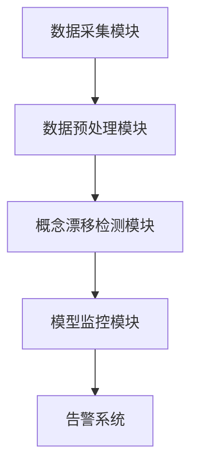

                 


# 概念漂移检测：适应动态变化的环境

## 关键词：
概念漂移检测、数据分布变化、机器学习模型监控、动态环境适应、模型性能评估

## 摘要：
概念漂移检测是机器学习系统在动态环境中保持性能稳定的核心技术。随着数据分布的变化，模型的预测准确性会逐渐下降，这需要实时检测和适应。本文从概念漂移的基本概念、类型、检测算法、系统架构到实际项目实现，全面系统地讲解了概念漂移检测的理论与实践。通过详细的算法原理、系统设计和项目案例，帮助读者掌握如何在实际业务场景中设计和实现概念漂移检测系统，确保机器学习模型在动态环境中的稳定性和可靠性。

---

# 第一部分: 概念漂移检测基础

## 第1章: 概念漂移概述

### 1.1 概念漂移的定义与背景

#### 1.1.1 什么是概念漂移
概念漂移（Concept Drift）是指数据分布或目标与输入变量之间的关系随时间发生变化的现象。简单来说，就是模型在训练时所依赖的假设在实际应用中发生了变化，导致模型性能下降。

#### 1.1.2 概念漂移的背景与重要性
在机器学习系统中，数据通常是在特定时间窗口上采集的，而现实环境是动态变化的。例如，在电商领域，用户的行为可能因为季节、促销活动或市场变化而发生改变。如果模型无法适应这些变化，就会出现预测不准确的问题。

#### 1.1.3 概念漂移的分类与特征
概念漂移可以分为以下几种类型：
- **突然性概念漂移**：数据分布突然发生显著变化。
- **渐进性概念漂移**：数据分布逐渐变化。
- **噪声干扰型漂移**：数据中夹杂了大量噪声，掩盖了真正的分布变化。

---

### 1.2 概念漂移的核心属性

#### 1.2.1 数据分布的变化
概念漂移的核心是数据分布的变化，包括输入特征的分布和目标变量的分布变化。

#### 1.2.2 模型预测的准确性
模型性能的变化是概念漂移的重要表现，例如准确率、召回率等指标的变化。

#### 1.2.3 业务目标的关联性
概念漂移检测需要结合业务目标，例如电商领域的用户购买行为变化可能与销售额预测模型的准确性密切相关。

---

### 1.3 概念漂移检测的挑战

#### 1.3.1 动态数据环境的复杂性
数据分布的变化可能是渐进的、突然的，或是周期性的，增加了检测的难度。

#### 1.3.2 模型性能评估的难度
模型性能的变化可能受到多种因素的影响，例如数据质量、模型老化等。

#### 1.3.3 数据分布变化的不确定性
概念漂移检测需要在不确定的环境下做出判断，这对算法的鲁棒性提出了更高的要求。

---

## 第2章: 概念漂移的核心概念与联系

### 2.1 概念漂移的核心属性

#### 2.1.1 数据分布的变化
概念漂移的根本原因是数据分布的变化，包括输入特征的分布和目标变量的分布变化。

#### 2.1.2 模型预测的准确性
模型性能的变化是概念漂移的重要表现，例如准确率、召回率等指标的变化。

#### 2.1.3 业务目标的关联性
概念漂移检测需要结合业务目标，例如电商领域的用户购买行为变化可能影响销售额预测模型的准确性。

---

### 2.2 概念漂移与相关概念对比

#### 2.2.1 概念漂移与数据漂移
数据漂移（Data Drift）是指数据分布的变化，而概念漂移是指目标变量与输入特征之间关系的变化。数据漂移是概念漂移的一种表现形式。

#### 2.2.2 概念漂移与模型退化
模型退化是指模型在训练集和测试集上的表现差异增大，通常与过拟合或欠拟合有关，而概念漂移是由于数据分布变化导致的模型性能下降。

#### 2.2.3 概念漂移与概念偏移
概念偏移（Concept Shift）是概念漂移的一种特殊情况，指目标变量的分布发生了变化，但输入特征的分布保持不变。

---

### 2.3 概念漂移的ER实体关系图

```mermaid
er
    entity 概念漂移检测系统 {
        id: string
        检测时间: datetime
        数据源: string
        模型名称: string
        漂移指标: float
        检测结果: boolean
    }
    entity 数据源 {
        id: string
        数据类型: string
        数据时间戳: datetime
    }
    entity 模型 {
        id: string
        模型版本: string
        模型类型: string
    }
    entity 评估指标 {
        id: string
        指标名称: string
        指标值: float
    }
    概念漂移检测系统 --> 数据源: 获取数据
    概念漂移检测系统 --> 模型: 获取模型信息
    概念漂移检测系统 --> 评估指标: 获取指标值
```

---

## 第3章: 概念漂移检测的算法原理

### 3.1 基于统计的方法

#### 3.1.1 突发性概念漂移的统计检测
使用假设检验的方法检测数据分布的突然变化，例如使用卡方检验或Kolmogorov-Smirnov检验。

#### 3.1.2 渐进性概念漂移的统计建模
通过时间序列分析的方法，建模数据分布的变化趋势。

#### 3.1.3 基于假设检验的检测方法
使用统计显著性检验的方法，判断数据分布的变化是否显著。

---

### 3.2 基于分布距离的方法

#### 3.2.1 Kullback-Leibler散度
KL散度衡量两个概率分布之间的差异，公式如下：

$$
D_{KL}(P \mid\mid Q) = \sum_{x} P(x) \log \frac{P(x)}{Q(x)}
$$

#### 3.2.2 Jensen-Shannon散度
JS散度是KL散度的一种对称形式，公式如下：

$$
D_{JS}(P \mid\mid Q) = \frac{1}{2} \left( D_{KL}(P \mid\mid M) + D_{KL}(Q \mid\mid M) \right)
$$

其中，$M = \frac{P + Q}{2}$。

---

### 3.3 基于模型性能的监控方法

#### 3.3.1 模型准确率监控
通过监控模型的准确率变化，判断模型是否出现概念漂移。

#### 3.3.2 模型召回率监控
通过监控模型的召回率变化，判断模型是否出现概念漂移。

#### 3.3.3 模型F1分数监控
通过监控模型的F1分数变化，综合评估模型的准确性和召回率。

---

## 第4章: 概念漂移检测系统的架构设计

### 4.1 系统功能设计

#### 4.1.1 数据采集模块
负责从数据源获取实时数据，并存储到数据仓库中。

#### 4.1.2 数据预处理模块
对获取的数据进行清洗和特征工程处理，确保数据质量。

#### 4.1.3 概念漂移检测模块
基于检测算法，判断数据是否发生概念漂移。

#### 4.1.4 模型监控模块
监控模型性能，评估模型是否需要重新训练。

---

### 4.2 系统架构设计



---

## 第5章: 项目实战——电商用户购买行为的概念漂移检测

### 5.1 项目背景与目标

#### 5.1.1 项目背景
电商领域的用户购买行为受到季节、促销活动等多种因素的影响，容易发生概念漂移。

#### 5.1.2 项目目标
设计一个实时的概念漂移检测系统，监控用户购买行为的变化，及时告警。

---

### 5.2 项目实现

#### 5.2.1 环境安装
安装Python、机器学习库（如scikit-learn）、数据处理库（如Pandas）等。

#### 5.2.2 核心代码实现

```python
import pandas as pd
from sklearn.metrics import accuracy_score
from scipy.stats import chi2

def detectConceptDrift(X_train, y_train, X_test, y_test):
    # 统计检验方法
    if len(X_train.columns) > 0:
        # 使用卡方检验判断数据分布变化
        statistic, p_value = chi2(X_train, X_test)
        if p_value < 0.05:
            return True
    return False

# 示例调用
X_train = pd.DataFrame({'feature1': [1, 2, 3, 4], 'feature2': [5, 6, 7, 8]})
y_train = pd.Series([0, 0, 1, 1])
X_test = pd.DataFrame({'feature1': [5, 6, 7, 8], 'feature2': [9, 10, 11, 12]})
y_test = pd.Series([0, 1, 1, 1])
drift = detectConceptDrift(X_train, y_train, X_test, y_test)
print("概念漂移检测结果：", drift)
```

---

### 5.3 项目分析与解读

#### 5.3.1 案例分析
通过实际数据，分析用户购买行为的变化，判断是否发生概念漂移。

#### 5.3.2 检测结果解读
根据检测结果，判断模型是否需要重新训练或调整。

---

## 第6章: 最佳实践与总结

### 6.1 最佳实践

#### 6.1.1 定期监控模型性能
定期评估模型的准确率、召回率等指标，及时发现概念漂移。

#### 6.1.2 结合业务背景分析
概念漂移检测结果需要结合业务背景进行分析，避免误报。

#### 6.1.3 组合使用多种检测方法
结合统计方法、分布距离方法和模型性能监控方法，提高检测的准确性。

---

### 6.2 小结

概念漂移检测是机器学习系统在动态环境中保持性能稳定的重要技术。通过本文的讲解，读者可以掌握概念漂移的基本概念、检测算法和系统设计方法，并能够通过实际案例理解如何在业务场景中应用这些方法。

---

### 6.3 注意事项

- 检测算法的选择需要根据数据特性和业务需求进行调整。
- 模型监控需要结合实际业务目标，避免过度优化。
- 检测结果需要结合业务背景进行分析，避免误报和漏报。

---

### 6.4 拓展阅读

- 《机器学习实战》
- 《数据挖掘导论》
- 《时间序列分析》

---

## 作者：AI天才研究院/AI Genius Institute & 禅与计算机程序设计艺术 /Zen And The Art of Computer Programming

