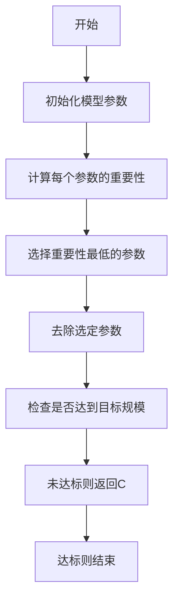
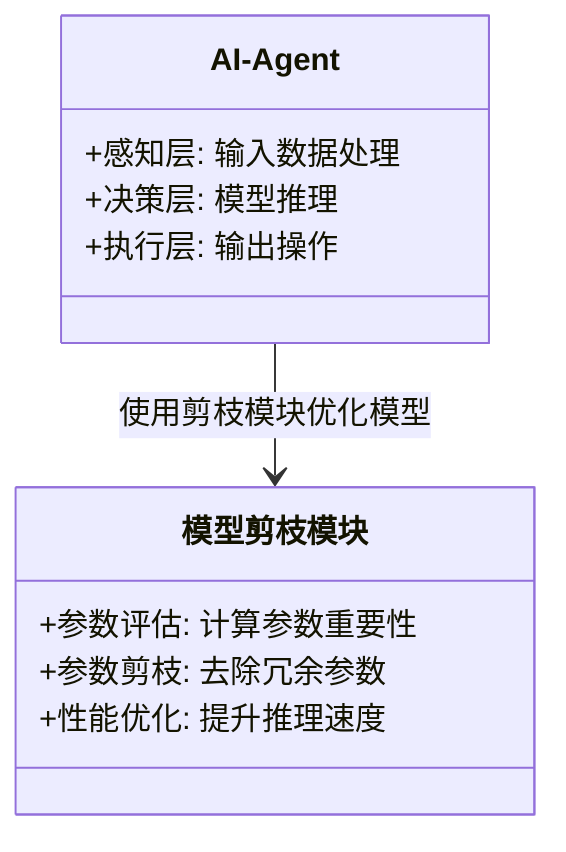
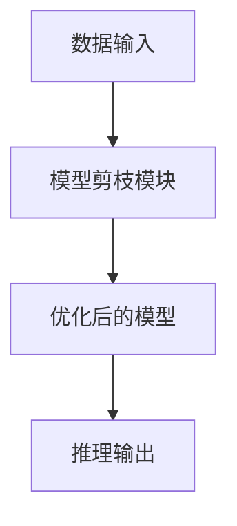
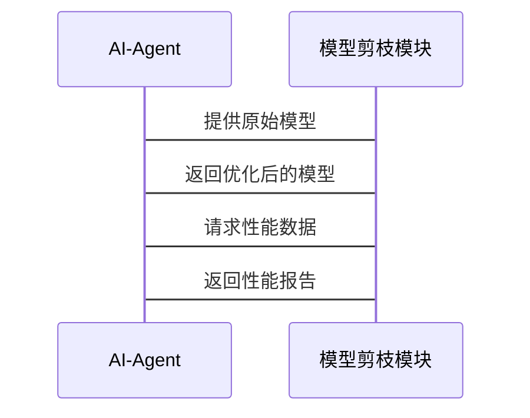

                 


# 模型剪枝：精简AI Agent的参数规模

## 关键词：模型剪枝、AI Agent、深度学习、参数优化、模型压缩

## 摘要：模型剪枝是一种通过去除冗余参数来精简AI Agent规模的技术，旨在降低计算成本和提升部署效率，同时保持模型性能。本文系统介绍模型剪枝的基本概念、算法原理、数学模型，并通过实战案例展示其应用。

---

## 第1章: 模型剪枝概述

### 1.1 模型剪枝的基本概念

#### 1.1.1 什么是模型剪枝
模型剪枝是一种通过去除模型中冗余参数或结构，以减少模型复杂度的技术。类似于园艺中的修剪枝条，模型剪枝旨在去除不必要的部分，使模型更加简洁高效。

#### 1.1.2 模型剪枝的目标与意义
- **目标**：减少模型参数规模，降低计算复杂度，提升推理速度，减少存储需求。
- **意义**：在保持模型性能的前提下，降低资源消耗，便于在边缘设备等资源受限的环境中部署AI Agent。

#### 1.1.3 模型剪枝的应用场景
- **边缘计算**：在移动设备、物联网设备等资源有限的环境中，模型剪枝尤为重要。
- **实时推理**：需要快速响应的场景，如自动驾驶、实时翻译等。
- **模型部署**：在云服务中，减少计算资源消耗，降低成本。

### 1.2 AI Agent与模型剪枝的关系

#### 1.2.1 AI Agent的定义与特点
AI Agent是一种智能体，能够感知环境、自主决策并执行任务。其核心依赖于高效的模型推理能力。

#### 1.2.2 模型参数规模对AI Agent性能的影响
- 参数规模直接影响计算速度和资源消耗。
- 过大的参数规模会导致推理时间增加，资源消耗过高，影响实时性和响应速度。

#### 1.2.3 模型剪枝在AI Agent中的作用
通过精简模型规模，AI Agent可以在保持性能的同时，适应资源受限的环境，提升部署灵活性和效率。

### 1.3 模型剪枝的背景与发展趋势

#### 1.3.1 深度学习模型参数爆炸的挑战
近年来，深度学习模型参数规模急剧增加（如大语言模型），导致计算资源消耗激增，推理效率下降。

#### 1.3.2 模型剪枝技术的发展历程
- **早期研究**：从Lasso回归等正则化方法开始。
- **现代技术**：结合深度学习特点，发展出多种结构化剪枝方法。

#### 1.3.3 当前模型剪枝技术的研究热点
- 结合AI Agent需求的剪枝方法。
- 跨模态模型的剪枝优化。
- 剪枝后的模型再优化技术。

## 第2章: 模型剪枝的核心概念

### 2.1 模型剪枝的基本原理

#### 2.1.1 什么是冗余参数
冗余参数是指在模型中对输出影响较小的参数，可以通过去除这些参数来精简模型。

#### 2.1.2 模型复杂度的衡量指标
- 参数数量。
- 计算复杂度（FLOPS）。
- 模型压缩率。

#### 2.1.3 模型剪枝的实现方法
- 基于权重重要性的剪枝。
- 基于梯度的剪枝。
- 结构化剪枝。

### 2.2 模型剪枝与模型压缩的区别

#### 2.2.1 模型剪枝的定义与特点
- **定义**：通过去除冗余参数来减少模型规模。
- **特点**：注重去除无用部分，不改变模型结构。

#### 2.2.2 模型压缩的定义与特点
- **定义**：通过量化、知识蒸馏等技术减少模型规模。
- **特点**：改变模型结构或参数表示方式。

#### 2.2.3 两者之间的联系与区别
- **联系**：都旨在减少模型规模。
- **区别**：剪枝是去除冗余，压缩是改变表示方式。

### 2.3 模型剪枝的数学基础

#### 2.3.1 线性代数基础
- 矩阵运算。
- 线性空间。

#### 2.3.2 优化理论基础
- 凸优化。
- 梯度下降。

#### 2.3.3 概率论与统计基础
- 贝叶斯推理。
- 显著性检验。

### 2.4 本章小结
模型剪枝基于数学理论，通过去除冗余参数降低模型复杂度，是实现高效AI Agent的重要手段。

---

## 第3章: 常见模型剪枝算法

### 3.1 贪心剪枝算法

#### 3.1.1 贪心剪枝的基本思想
逐层评估参数重要性，逐步去除对模型影响最小的参数。

#### 3.1.2 贪心剪枝的实现步骤
1. 计算每个参数的重要性。
2. 去除重要性最低的参数。
3. 重复直到达到目标规模。

#### 3.1.3 贪心剪枝的优缺点分析
- **优点**：简单易实现。
- **缺点**：可能影响模型性能。

#### 3.1.4 贪心剪枝的mermaid流程图


### 3.2 基于权重重要性的剪枝算法

#### 3.2.1 权重重要性评估方法
- **L1正则化**：通过Lasso回归评估权重重要性。
- **L2正则化**：通过Ridge回归评估权重重要性。

#### 3.2.2 基于L1正则化的剪枝
使用Lasso回归模型，通过L1正则化项迫使部分权重变为零，实现剪枝。

#### 3.2.3 基于梯度的剪枝方法
通过梯度信息评估参数重要性，去除对目标函数影响较小的参数。

### 3.3 结构化剪枝算法

#### 3.3.1 网络层剪枝
- **定义**：去除整个网络层。
- **方法**：评估每层的重要性，选择性去除。

#### 3.3.2 滤波器剪枝
- **定义**：去除对模型贡献较小的滤波器。
- **方法**：基于通道重要性评估。

#### 3.3.3 神经元剪枝
- **定义**：去除对模型输出无影响的神经元。
- **方法**：基于神经元活性评估。

### 3.4 本章小结
模型剪枝算法多种多样，各有优缺点，选择合适的算法需考虑具体应用场景和需求。

---

## 第4章: 模型剪枝的数学模型与公式

### 4.1 基于L1正则化的剪枝模型

#### 4.1.1 Lasso回归模型
Lasso回归通过L1正则化迫使部分权重变为零，实现特征选择。

#### 4.1.2 L1正则化的数学表达
目标函数：
$$
\text{Minimize} \quad \frac{1}{2m} \sum_{i=1}^{m} (y_i - \hat{y_i})^2 + \lambda \sum_{j=1}^{n} |w_j|
$$

#### 4.1.3 模型优化目标函数
结合L1正则化的损失函数，优化器通过梯度下降等方法求解。

### 4.2 基于L2正则化的剪枝模型

#### 4.2.1 Ridge回归模型
Ridge回归通过L2正则化降低模型复杂度，防止过拟合。

#### 4.2.2 L2正则化的数学表达
目标函数：
$$
\text{Minimize} \quad \frac{1}{2m} \sum_{i=1}^{m} (y_i - \hat{y_i})^2 + \lambda \sum_{j=1}^{n} w_j^2
$$

### 4.3 结构化剪枝的数学模型

#### 4.3.1 滤波器剪枝的数学表达
评估每个滤波器的重要性，选择性去除对模型贡献最小的滤波器。

#### 4.3.2 神经元剪枝的数学表达
基于神经元的活性或梯度信息，评估其对模型输出的贡献，选择性剪枝。

### 4.4 本章小结
数学模型是模型剪枝的核心，基于正则化的方法在实际应用中表现出色。

---

## 第5章: 模型剪枝的系统架构设计

### 5.1 问题场景介绍
在AI Agent系统中，模型剪枝技术用于优化模型规模，提升推理效率。

### 5.2 系统功能设计

#### 5.2.1 领域模型设计
使用mermaid类图展示AI Agent系统的组成部分，包括感知层、决策层和执行层。



### 5.3 系统架构设计

#### 5.3.1 系统架构设计
使用mermaid架构图展示AI Agent的系统架构，包括数据输入、模型剪枝、推理输出等模块。



### 5.4 系统接口设计
- **输入接口**：接收原始模型和参数。
- **输出接口**：提供精简后的模型和性能数据。

### 5.5 系统交互设计

#### 5.5.1 系统交互流程
使用mermaid序列图展示AI Agent与模型剪枝模块的交互过程。



### 5.6 本章小结
通过系统架构设计，将模型剪枝技术整合到AI Agent系统中，提升整体性能和效率。

---

## 第6章: 模型剪枝的项目实战

### 6.1 项目环境安装

#### 6.1.1 安装Python环境
- 使用Anaconda或虚拟环境，确保版本兼容。

#### 6.1.2 安装依赖库
- 使用pip安装numpy、torch等深度学习库。

### 6.2 核心实现源代码

#### 6.2.1 基于L1正则化的剪枝实现
```python
import torch
import torch.nn as nn
import torch.optim as optim

class LassoPruner:
    def __init__(self, model, device, lambda_=0.001):
        self.model = model
        self.device = device
        self.lambda_ = lambda_
    
    def forward(self, x):
        return self.model(x)
    
    def loss_fn(self, outputs, labels):
        criterion = nn.MSELoss()
        return criterion(outputs, labels) + self.lambda_ * torch.norm(self.model.weight, p=1)
    
    def train(self, dataloader, epochs=100):
        optimizer = optim.Adam(self.model.parameters())
        for epoch in range(epochs):
            for batch in dataloader:
                x, y = batch
                x = x.to(self.device)
                y = y.to(self.device)
                optimizer.zero_grad()
                outputs = self.forward(x)
                loss = self.loss_fn(outputs, y)
                loss.backward()
                optimizer.step()
```

#### 6.2.2 结构化剪枝实现
```python
class FilterPruner:
    def __init__(self, model):
        self.model = model
    
    def prune_filters(self, pruned_ratio=0.5):
        for m in self.model.modules():
            if isinstance(m, nn.Conv2d):
                # 计算每个滤波器的重要性
                importance = torch.abs(m.weight).sum(dim=(0, 2, 3)).squeeze()
                # 排序并选择要剪枝的滤波器
                keep_num = int(importance.nelement() * pruned_ratio)
                indices = torch.sort(importance, descending=True).indices[:keep_num]
                # 修改卷积层参数
                m.weight.data = m.weight.data[:, indices]
                m.out_channels = keep_num
```

### 6.3 代码应用解读与分析
- **LassoPruner**：基于L1正则化的剪枝方法，适用于全连接层。
- **FilterPruner**：基于滤波器重要性的剪枝方法，适用于卷积层。

### 6.4 实际案例分析
以图像分类任务为例，展示剪枝前后的模型性能对比。

### 6.5 性能对比与分析
- **计算速度**：剪枝后模型推理速度提升。
- **存储空间**：模型参数减少，存储需求降低。
- **性能影响**：合理剪枝不会显著影响模型准确率。

### 6.6 本章小结
通过实际案例，验证模型剪枝技术的有效性和实用性。

---

## 第7章: 模型剪枝的总结与展望

### 7.1 总结
模型剪枝是一种有效的精简AI Agent参数规模的技术，通过去除冗余参数，降低计算复杂度和资源消耗，同时保持模型性能。

### 7.2 剪枝技术的优缺点

#### 优点
- 降低计算成本。
- 提高推理速度。
- 减少存储需求。

#### 缺点
- 可能影响模型性能。
- 实现复杂度较高。

### 7.3 模型剪枝的未来发展趋势

#### 智能化剪枝策略
- 结合强化学习优化剪枝过程。
- 自适应剪枝策略。

#### 多模态模型的剪枝优化
- 跨模态模型的参数协调剪枝。

#### 剪枝后的模型再优化
- 结合模型压缩技术进一步优化。

### 7.4 注意事项
- 选择合适的剪枝算法。
- 平衡模型性能与剪枝力度。
- 避免过度剪枝导致性能下降。

### 7.5 拓展阅读
- 《Deep Learning》
- 《Neural Networks and Deep Learning》
- 最新顶会论文。

### 7.6 本章小结
模型剪枝是实现高效AI Agent的重要技术，未来将朝着更智能、更高效的剪枝策略发展。

---

## 作者：AI天才研究院/AI Genius Institute & 禅与计算机程序设计艺术 /Zen And The Art of Computer Programming

---

以上是《模型剪枝：精简AI Agent的参数规模》的完整目录和部分详细内容。文章通过逐步分析，系统地介绍了模型剪枝的基本概念、算法原理、数学模型，并通过实战案例展示了其在AI Agent中的应用。希望对读者理解模型剪枝技术有所帮助。

