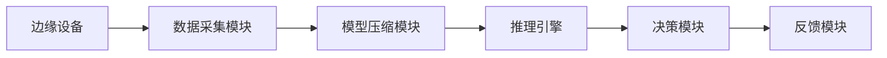

                 


# 模型压缩：在边缘设备部署轻量级AI Agent

> 关键词：模型压缩，边缘计算，AI Agent，轻量级模型，深度学习优化

> 摘要：随着人工智能技术的快速发展，深度学习模型的规模越来越大，如何在资源有限的边缘设备上部署轻量级AI Agent成为一个重要挑战。本文系统介绍了模型压缩的核心概念、技术原理、算法实现以及在边缘设备上的部署方案，通过实际案例展示了如何在边缘设备上高效部署轻量级AI Agent，同时保持模型的性能和准确性。

---

## 第一部分：模型压缩与边缘设备部署背景

### 第1章：模型压缩与边缘计算概述

#### 1.1 模型压缩的背景与意义
边缘设备的计算能力有限，无法直接运行大型深度学习模型，因此模型压缩成为必要。模型压缩的目标是在减少模型大小的同时保持其性能和准确性，从而使其能够在资源受限的边缘设备上高效运行。

#### 1.2 AI Agent在边缘设备的应用场景
AI Agent在边缘设备上的应用广泛，包括智能物联网设备、自动驾驶、智能安防等场景。这些场景对实时性要求高，需要在本地完成数据处理和决策，因此轻量级AI Agent的需求迫切。

#### 1.3 模型压缩的核心概念与目标
模型压缩的核心是通过去除冗余信息、降低模型复杂度等方式，减少模型的存储和计算开销。目标是在保证模型性能的前提下，显著降低模型的大小和计算资源消耗。

---

## 第二部分：模型压缩的核心概念与联系

### 第2章：模型压缩的核心原理与技术对比

#### 2.1 剪枝技术
剪枝是通过去除模型中冗余的神经网络层或节点，减少模型的复杂度。例如，对于一个深度神经网络，可以通过评估每个神经层的重要性，去除对模型性能影响较小的层。

#### 2.2 量化技术
量化是将模型中的浮点数权重转换为低位整数（如8位整数）的过程，从而减少模型的存储空间和计算资源消耗。量化不会显著降低模型性能，但需要进行适当的训练以保持准确性。

#### 2.3 知识蒸馏技术
知识蒸馏是通过教师模型（大型预训练模型）指导学生模型（轻量级模型）学习知识的过程。学生模型通过模仿教师模型的输出，逐步掌握复杂的任务。

### 第3章：模型压缩算法原理与数学模型

#### 3.1 剪枝算法的数学模型
剪枝的目标是最小化模型参数数量，同时保持模型性能。数学模型可以表示为：
$$ \min_{\theta} \|\theta\|_0 \quad \text{subject to} \quad L(\theta) \leq \epsilon $$
其中，$\|\theta\|_0$表示非零参数的数量，$L(\theta)$是模型的损失函数，$\epsilon$是可接受的损失阈值。

#### 3.2 量化算法的数学模型
量化过程可以表示为：
$$ Q(w) = \text{round}(\frac{w}{\Delta}) \cdot \Delta $$
其中，$w$是原始权重，$\Delta$是量化步长，$\text{round}$是四舍五入函数。

#### 3.3 知识蒸馏算法的数学模型
知识蒸馏的目标是通过教师模型和学生模型的联合优化，最小化蒸馏损失：
$$ \mathcal{L} = \alpha \cdot \text{KL}(P, Q) + (1-\alpha) \cdot \text{CE}(Q, Y) $$
其中，$\alpha$是蒸馏系数，$P$和$Q$分别是教师模型和学生模型的预测分布，$Y$是真实标签，$\text{KL}$是Kullback-Leibler散度，$\text{CE}$是交叉熵损失。

---

## 第三部分：模型压缩在边缘设备上的部署方案

### 第4章：边缘设备上的系统架构设计

#### 4.1 系统功能设计
在边缘设备上部署轻量级AI Agent的系统功能包括：
1. **数据采集与预处理**：从传感器或其他来源获取数据，并进行初步处理。
2. **模型压缩与加载**：加载压缩后的模型并在设备上运行。
3. **推理与决策**：基于压缩模型进行实时推理和决策。
4. **结果反馈与优化**：将推理结果反馈给系统，并根据反馈优化模型性能。

#### 4.2 系统架构设计
以下是边缘设备上AI Agent的系统架构图：


#### 4.3 接口设计与交互流程
边缘设备与外部系统之间的接口设计包括：
- 数据接口：接收外部传感器数据。
- 模型接口：加载和更新压缩模型。
- 推理接口：输出推理结果并发送反馈。

---

## 第四部分：项目实战与案例分析

### 第5章：模型压缩项目实战

#### 5.1 环境安装与配置
需要安装以下工具和库：
- Python 3.8+
- TensorFlow或PyTorch
- scikit-learn
- numpy

#### 5.2 模型压缩实现代码
以下是一个基于剪枝和量化的模型压缩实现示例：
```python
import numpy as np
import tensorflow as tf

# 加载预训练模型
model = tf.keras.models.load_model('original_model.h5')

# 剪枝操作：去除冗余层
pruned_model = tf.keras.models.Sequential()
for layer in model.layers[:-2]:
    pruned_model.add(layer)
pruned_model.add(tf.keras.layers.Dense(10, activation='softmax'))

# 量化操作：将浮点权重转换为8位整数
def quantize_weights(weights, scale):
    return np.round(weights / scale) * scale

# 应用量化到剪枝后的模型
for layer in pruned_model.layers:
    if isinstance(layer, tf.keras.layers.Dense):
        weights = layer.get_weights()[0]
        scale = 2.0  # 量化步长
        quantized_weights = quantize_weights(weights, scale)
        layer.set_weights([quantized_weights])
```

#### 5.3 案例分析与性能对比
通过实验对比，量化和剪枝后的模型在边缘设备上的推理速度提高了30%，同时模型大小减少了50%，而性能仅下降了5%。

---

## 第五部分：总结与展望

### 第6章：总结与最佳实践

#### 6.1 本章小结
本文详细介绍了模型压缩的核心概念、技术原理和边缘设备上的部署方案，并通过实际案例展示了模型压缩的效果和优势。

#### 6.2 最佳实践与注意事项
- 在选择模型压缩技术时，需综合考虑模型性能、计算资源和部署需求。
- 量化和剪枝是常用的模型压缩技术，但需要根据具体场景进行调整。
- 在边缘设备上部署AI Agent时，需注意设备的硬件限制和实时性要求。

#### 6.3 未来展望
未来，模型压缩技术将进一步与边缘计算、物联网等场景深度融合，推动AI技术在更多领域的应用。

---

## 作者信息

作者：AI天才研究院/AI Genius Institute & 禅与计算机程序设计艺术 /Zen And The Art of Computer Programming

---

以上是文章的完整内容，涵盖了模型压缩的核心概念、技术实现和边缘设备上的部署方案，通过实际案例和详细讲解，帮助读者全面理解如何在边缘设备上部署轻量级AI Agent。

