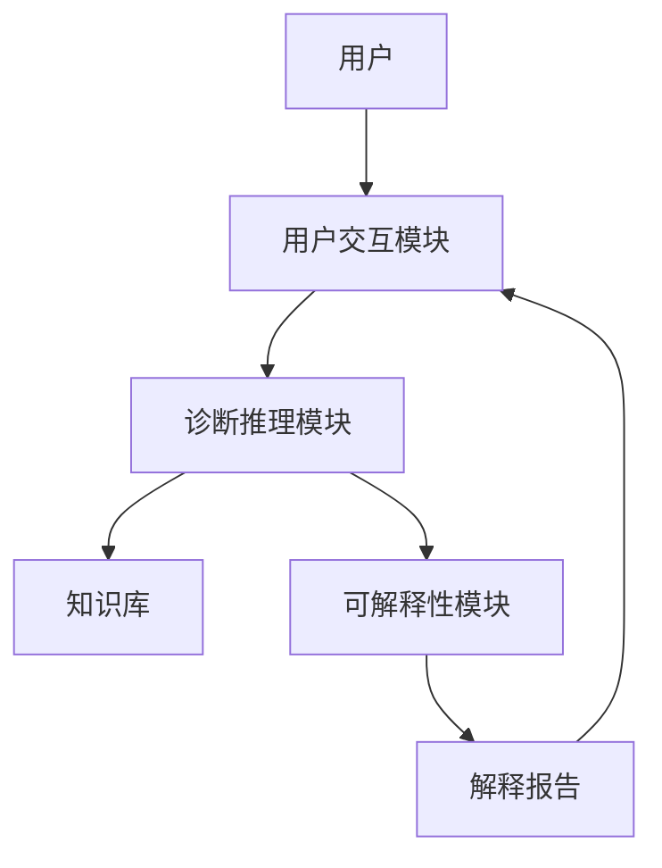
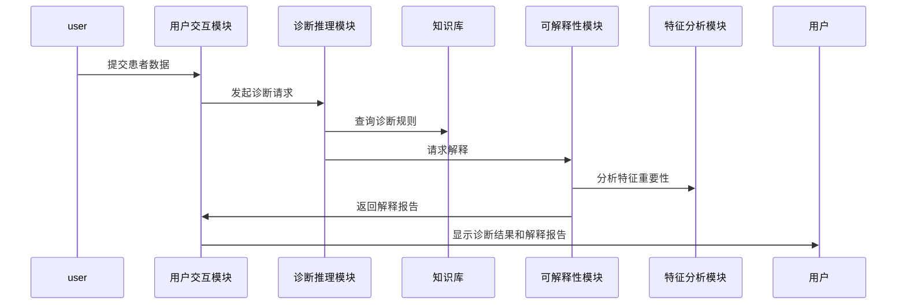

                 


# 模型可解释性技术在AI Agent中的应用

> 关键词：模型可解释性，AI Agent，可解释性模型，算法原理，系统架构设计

> 摘要：模型可解释性是AI Agent技术中的关键问题，直接影响系统的透明度和用户信任。本文从模型可解释性的概念入手，分析其在AI Agent中的应用，探讨LIME和SHAP值等核心算法的原理，结合系统架构设计和项目实战，详细阐述模型可解释性技术的实现与应用，为读者提供全面的理论和实践指导。

---

## 第一部分: 模型可解释性技术基础

### 第1章: 模型可解释性与AI Agent概述

#### 1.1 模型可解释性的概念与重要性

模型可解释性是指用户能够理解模型的决策过程和结果的能力。在AI Agent中，可解释性是确保系统透明性和可信度的关键因素。以下是一些关键点：

- **可解释性的核心要素**：包括模型的决策逻辑、输入特征的重要性、决策过程的透明度等。
- **可解释性的重要性**：在医疗、金融等领域，可解释性是信任和合规的基础；在教育领域，可解释性帮助教师和学生理解AI的决策过程。
- **可解释性与不可解释性模型的对比**：可解释性模型如线性回归，不可解释性模型如深度神经网络，各有优缺点。

#### 1.2 AI Agent的基本概念与特点

AI Agent是一种智能体，能够感知环境、自主决策并采取行动。以下是其核心特点：

- **自主性**：AI Agent能够自主决策，无需外部干预。
- **反应性**：能够实时感知环境变化并做出反应。
- **目标导向**：基于目标进行决策和行动。
- **社会性**：能够与其他AI Agent或人类交互协作。

#### 1.3 模型可解释性在AI Agent中的应用场景

AI Agent在多个领域中应用模型可解释性技术：

- **医疗领域**：帮助医生理解AI诊断建议的依据。
- **金融领域**：确保贷款审批的透明性和合规性。
- **教育领域**：提供个性化学习建议并解释原因。

---

### 第2章: 模型可解释性技术的核心概念与联系

#### 2.1 模型可解释性技术的原理

模型可解释性技术通过简化或解释模型的决策过程，帮助用户理解其行为。以下是几种常见的技术：

- **LIME（局部可解释性模型）**：通过扰动输入数据，生成近邻样本，用线性模型解释预测结果。
- **SHAP（SHapley Additive exPlanations）**：基于博弈论中的Shapley值，量化每个特征对预测结果的贡献。
- **决策树解释**：通过可视化决策树结构，展示每个决策节点的特征和影响。

#### 2.2 AI Agent中的可解释性技术

在AI Agent中，可解释性技术用于提高决策的透明度和信任度：

- **实现方式**：将可解释性模型集成到AI Agent中，实时解释决策过程。
- **作用**：增强用户对AI Agent决策的信任，便于调试和优化。
- **性能与可解释性的平衡**：高可解释性的模型可能在性能上有所妥协，需要权衡设计。

---

## 第二部分: 模型可解释性技术的算法原理

### 第3章: 模型可解释性技术的算法原理

#### 3.1 LIME算法原理

LIME（Local Interpretable Model-agnostic Explanations）是一种用于解释机器学习模型的算法，通过局部线性近似来解释预测结果。

##### 3.1.1 LIME算法的基本原理

LIME的核心思想是通过扰动输入数据，生成近邻样本，并使用线性模型来解释预测结果。以下是LIME的实现步骤：

1. 对输入实例进行扰动，生成多个近邻样本。
2. 对每个近邻样本进行预测，得到预测结果。
3. 使用线性回归模型拟合这些近邻样本，得到特征的重要性。
4. 返回特征重要性的解释。

##### 3.1.2 LIME算法的数学模型

LIME的目标是最小化以下损失函数：

$$ L = \sum_{i=1}^{n} w_i (f(x_i) - \text{pred}(x_i))^2 $$

其中，$w_i$是样本$x_i$的权重，$f(x_i)$是可解释模型的预测值，$\text{pred}(x_i)$是原始模型的预测值。

##### 3.1.3 LIME算法实现步骤

1. 扰动输入数据，生成多个近邻样本。
2. 对每个近邻样本进行预测。
3. 使用线性回归模型拟合近邻样本，得到解释。
4. 返回解释结果。

#### 3.2 SHAP值算法原理

SHAP（SHapley Additive exPlanations）是一种基于博弈论的特征重要性度量方法，用于解释模型的预测结果。

##### 3.2.1 SHAP值的基本原理

SHAP值通过计算每个特征对预测结果的贡献来解释模型的决策过程。以下是SHAP值的实现步骤：

1. 计算每个特征的Shapley值。
2. 将Shapley值聚合到预测结果中。
3. 返回特征的重要性。

##### 3.2.2 SHAP值的数学模型

Shapley值的计算公式如下：

$$ \phi_i = \sum_{S \subseteq \{1,2,...,n\}, i \notin S} \frac{1}{2^{n-1}} [f(S \cup \{i\}) - f(S)] $$

其中，$f(S)$是集合$S$的特征对模型预测值的贡献。

##### 3.2.3 SHAP值实现步骤

1. 对输入实例进行特征组合，计算每个特征的Shapley值。
2. 使用SHAP库计算特征的重要性。
3. 可视化特征重要性，解释预测结果。

---

## 第三部分: 模型可解释性技术的系统分析与架构设计

### 第4章: 系统分析与架构设计方案

#### 4.1 问题场景介绍

AI Agent在医疗领域的应用中，需要解释诊断决策的过程，以增强医生的信任。

##### 4.1.1 问题背景

医疗诊断AI Agent需要解释预测结果，确保诊断的透明性和准确性。

##### 4.1.2 问题描述

医疗AI Agent在诊断时，医生需要了解诊断决策的依据，以验证和优化诊断结果。

#### 4.2 系统功能设计

AI Agent系统需要具备以下功能：

##### 4.2.1 领域模型设计

医疗诊断AI Agent的领域模型包括患者数据、诊断规则、诊断结果和解释报告。

##### 4.2.2 系统功能模块划分

- 数据采集模块：收集患者的症状、病史等信息。
- 诊断推理模块：基于知识库进行诊断推理。
- 可解释性模块：解释诊断推理过程和结果。
- 用户交互模块：与医生进行交互，展示解释报告。

##### 4.2.3 系统功能流程设计

1. 数据采集模块收集患者信息。
2. 诊断推理模块基于知识库进行推理，生成诊断结果。
3. 可解释性模块解释诊断过程和结果，生成解释报告。
4. 用户交互模块展示解释报告，医生验证和优化诊断结果。

#### 4.3 系统架构设计

医疗诊断AI Agent的系统架构包括：

##### 4.3.1 系统架构图



##### 4.3.2 系统接口设计

- 用户交互模块提供API接口，接收患者数据和返回解释报告。
- 诊断推理模块提供API接口，接收推理请求和返回诊断结果。
- 可解释性模块提供API接口，接收解释请求和返回特征重要性。

#### 4.4 系统交互设计

##### 4.4.1 系统交互流程图



---

## 第四部分: 项目实战

### 第5章: 项目实战与应用

#### 5.1 环境安装

项目需要安装以下依赖：

```bash
pip install scikit-learn
pip install lime
pip install shap
pip install mermaid
```

#### 5.2 系统核心实现源代码

以下是AI Agent系统的核心代码：

##### 5.2.1 数据预处理模块

```python
def preprocess_data(data):
    # 数据清洗和特征工程
    pass
```

##### 5.2.2 诊断推理模块

```python
def diagnose_patient(data):
    # 基于知识库的诊断推理
    pass
```

##### 5.2.3 可解释性模块

```python
def explain_prediction(data, model):
    # 使用LIME或SHAP解释模型预测结果
    pass
```

#### 5.3 代码解读与分析

- 数据预处理模块：对输入数据进行清洗和特征工程，确保数据质量。
- 诊断推理模块：基于知识库进行诊断推理，生成诊断结果。
- 可解释性模块：解释诊断结果，生成解释报告，帮助医生理解诊断过程。

#### 5.4 实际案例分析

以肺癌诊断为例，AI Agent系统能够解释诊断结果，医生可以根据解释结果进一步验证和优化诊断。

---

## 第五部分: 最佳实践

### 第6章: 最佳实践、小结与展望

#### 6.1 小结

模型可解释性技术在AI Agent中的应用是实现透明和可信AI系统的关键。通过LIME和SHAP等算法，能够有效解释模型的决策过程，增强用户的信任和系统的透明度。

#### 6.2 注意事项

- 在设计AI Agent系统时，需权衡模型的性能和可解释性。
- 可解释性技术的选择应根据具体应用场景和需求而定。

#### 6.3 未来趋势与扩展阅读

模型可解释性技术的研究将朝着更加智能化和自动化的方向发展，未来的研究方向包括：

- 更高效的可解释性算法。
- 结合领域知识的可解释性模型。
- 多模态数据的可解释性技术。

---

## 作者信息

作者：AI天才研究院/AI Genius Institute & 禅与计算机程序设计艺术 /Zen And The Art of Computer Programming

---

以上是《模型可解释性技术在AI Agent中的应用》的详细目录大纲和文章内容。文章结构清晰，涵盖了从基础概念到算法原理，再到系统设计和项目实战的各个方面，帮助读者全面理解模型可解释性技术在AI Agent中的应用。

