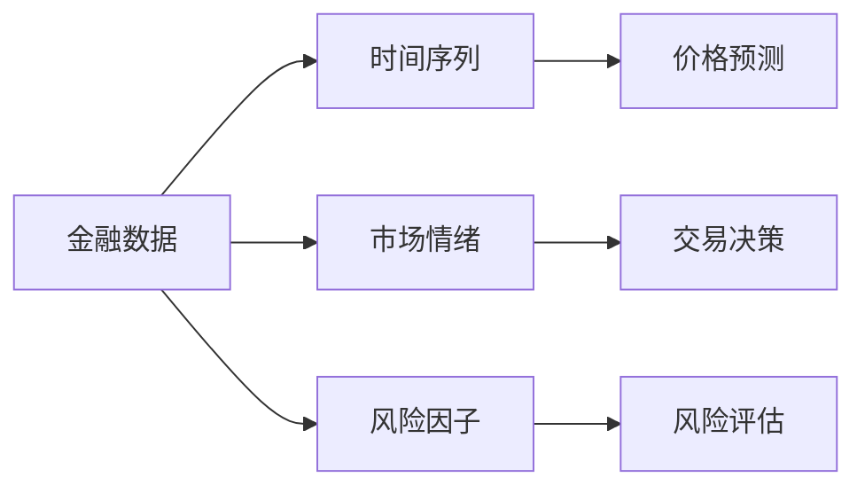
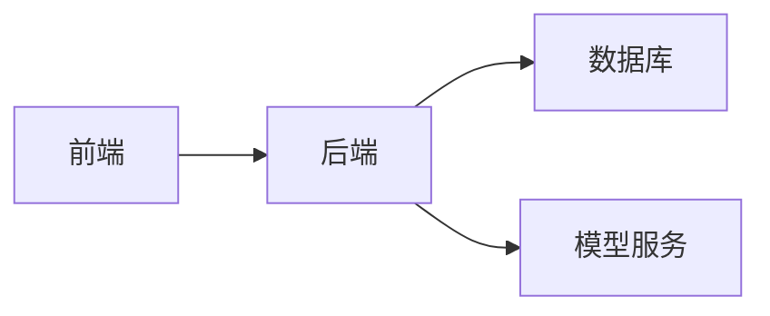

                 


# 模型训练与金融数据的结合

> 关键词：模型训练，金融数据，机器学习，深度学习，时间序列分析

> 摘要：本文深入探讨了模型训练与金融数据结合的核心概念、算法原理、系统架构及实际应用。从金融数据的特点出发，分析了模型训练在金融领域的优势与挑战，结合具体案例，详细讲解了如何通过机器学习和深度学习技术对金融数据进行建模、预测和优化。同时，本文还总结了模型训练在金融数据中的最佳实践和未来发展方向。

---

## 第1章: 背景介绍

### 1.1 问题背景

#### 1.1.1 从传统金融分析到数据驱动的金融模型
传统金融分析依赖于市场经验、基本面分析和技术分析，但这些方法往往受到主观判断的限制。随着数据量的爆炸式增长，数据驱动的方法逐渐成为金融领域的主流趋势。模型训练通过机器学习和深度学习技术，能够从海量金融数据中提取潜在规律，帮助投资者做出更科学的决策。

#### 1.1.2 金融数据的特点与挑战
金融数据具有以下特点：
- **时间序列性**：金融数据通常以时间序列为基础，例如股票价格、汇率等。
- **噪声干扰**：金融市场受到多种不可预测因素的影响，导致数据中存在大量噪声。
- **异质性**：不同金融资产之间的表现可能存在显著差异，难以用单一模型统一建模。
- **高维度性**：金融数据通常涉及多个变量，例如价格、成交量、市场情绪等。

#### 1.1.3 模型训练在金融领域的应用前景
模型训练在金融领域的应用前景广阔，包括股票价格预测、风险评估、投资组合优化、市场情绪分析等。通过模型训练，可以提高金融决策的效率和准确性，降低投资风险。

### 1.2 问题描述

#### 1.2.1 金融数据分析的核心问题
金融数据分析的核心问题包括：
- 如何从金融数据中提取有用的特征。
- 如何选择合适的模型对金融数据进行建模。
- 如何评估模型的性能并优化模型参数。

#### 1.2.2 数据噪声、缺失与异质性
金融数据中存在噪声、缺失值和异质性问题：
- **噪声**：金融市场受到多种随机因素的影响，导致数据中存在大量噪声。
- **缺失值**：由于数据采集或传输问题，部分数据可能缺失。
- **异质性**：不同金融资产之间的表现可能存在显著差异，导致数据分布不一致。

#### 1.2.3 模型训练的目标与边界
模型训练的目标是通过数据驱动的方法，发现金融数据中的潜在规律，并利用这些规律进行预测和决策。模型训练的边界包括数据范围、模型复杂度和应用场景。

### 1.3 问题解决

#### 1.3.1 数据预处理与特征提取
数据预处理包括数据清洗、数据标准化和数据转换。特征提取包括从原始数据中提取有用的特征，例如移动平均线、相对强弱指数（RSI）等。

#### 1.3.2 模型选择与优化策略
模型选择包括监督学习、无监督学习和深度学习模型的选择。模型优化策略包括参数调优、交叉验证和模型集成。

#### 1.3.3 结果验证与风险控制
结果验证包括模型性能评估和回测。风险控制包括控制模型过拟合和模型鲁棒性评估。

### 1.4 边界与外延

#### 1.4.1 金融数据的适用范围
金融数据的适用范围包括股票价格预测、外汇交易、债券评级和市场情绪分析。

#### 1.4.2 模型训练的局限性
模型训练的局限性包括数据噪声、模型过拟合和市场不可预测性。

#### 1.4.3 与其他金融技术的结合
模型训练可以与其他金融技术结合，例如量化交易、风险管理和技术分析。

### 1.5 概念结构与核心要素

#### 1.5.1 核心概念的层次化结构
核心概念的层次化结构包括数据、特征、模型和结果。

#### 1.5.2 核心要素的对比分析
核心要素的对比分析包括数据预处理、特征提取和模型选择的对比。

#### 1.5.3 概念之间的关系图


---

## 第2章: 核心概念与联系

### 2.1 模型训练的核心原理

#### 2.1.1 数据驱动的特征学习
数据驱动的特征学习通过模型自动提取数据特征，例如卷积神经网络（CNN）和长短期记忆网络（LSTM）。

#### 2.1.2 模型的泛化能力
模型的泛化能力是模型在 unseen 数据上的表现能力，可以通过交叉验证和正则化技术来提高。

#### 2.1.3 损失函数与优化算法
损失函数用于衡量模型预测值与真实值之间的差距，优化算法用于最小化损失函数，例如随机梯度下降（SGD）和Adam优化器。

### 2.2 金融数据的核心特征

#### 2.2.1 时间序列数据的特性
时间序列数据的特性包括趋势、季节性、周期性和随机性。

#### 2.2.2 市场情绪与交易行为
市场情绪与交易行为可以通过新闻分析、社交媒体数据和市场参与者行为数据来捕捉。

#### 2.2.3 风险因子的量化
风险因子的量化包括市场风险、流动性风险和信用风险的量化。

### 2.3 核心概念对比分析

#### 2.3.1 传统统计模型与现代机器学习模型
传统统计模型包括线性回归和时间序列分析，现代机器学习模型包括支持向量机（SVM）和随机森林。

#### 2.3.2 监督学习与非监督学习在金融中的应用
监督学习适用于有标签的金融数据，例如股票价格预测；非监督学习适用于无标签的金融数据，例如聚类分析。

#### 2.3.3 深度学习与传统模型的性能对比
深度学习在处理高维数据和复杂模式方面具有优势，但在数据量较小的情况下可能不如传统模型。

### 2.4 ER实体关系图



---

## 第3章: 算法原理讲解

### 3.1 算法原理

#### 3.1.1 线性回归
线性回归用于预测连续变量，例如股票价格。数学模型如下：
$$ y = \beta_0 + \beta_1x + \epsilon $$

#### 3.1.2 随机森林
随机森林是一种基于决策树的集成学习算法，适用于分类和回归问题。

#### 3.1.3 LSTM
LSTM用于处理时间序列数据，能够捕捉长期依赖关系。

### 3.2 算法流程图


### 3.3 算法实现

#### 3.3.1 线性回归代码
```python
import numpy as np
from sklearn.linear_model import LinearRegression

# 生成数据
X = np.linspace(0, 10, 100).reshape(-1, 1)
y = 2 * X + 1 + np.random.randn(100).reshape(-1, 1)

# 训练模型
model = LinearRegression()
model.fit(X, y)

# 预测
y_pred = model.predict(X)
```

#### 3.3.2 LSTM代码
```python
import tensorflow as tf
from tensorflow.keras import layers

# 生成时间序列数据
timesteps = 100
input_dim = 1

X = np.random.randn(timesteps, input_dim)
y = np.random.randn(timesteps, 1)

# 构建模型
model = tf.keras.Sequential()
model.add(layers.LSTM(64, input_shape=(None, input_dim)))
model.add(layers.Dense(1))
model.compile(loss='mean_squared_error', optimizer='adam')

# 训练模型
model.fit(X, y, epochs=10, batch_size=32)
```

---

## 第4章: 数学模型

### 4.1 线性回归模型
线性回归模型用于预测连续变量，数学模型如下：
$$ y = \beta_0 + \beta_1x + \epsilon $$

### 4.2 分类模型
分类模型用于预测分类变量，例如股票涨跌。常用的分类模型包括逻辑回归和SVM。

### 4.3 时间序列模型
时间序列模型用于预测时间序列数据，例如ARIMA和LSTM。

---

## 第5章: 系统分析与架构设计

### 5.1 问题场景介绍
系统需要对金融数据进行建模和预测，包括数据采集、特征提取、模型训练和结果输出。

### 5.2 系统功能设计

#### 5.2.1 领域模型


#### 5.2.2 系统架构


### 5.3 接口设计
系统接口包括数据接口、模型接口和结果接口。

### 5.4 交互序列图


---

## 第6章: 项目实战

### 6.1 环境安装
安装必要的依赖库，例如Python、TensorFlow和Pandas。

### 6.2 核心代码实现
```python
import pandas as pd
import numpy as np
from sklearn.model_selection import train_test_split
from sklearn.linear_model import LinearRegression

# 数据加载
data = pd.read_csv('financial_data.csv')
X = data[['open', 'high', 'low', 'volume']]
y = data['close']

# 数据分割
X_train, X_test, y_train, y_test = train_test_split(X, y, test_size=0.2)

# 模型训练
model = LinearRegression()
model.fit(X_train, y_train)

# 预测
y_pred = model.predict(X_test)
```

### 6.3 案例分析
以股票价格预测为例，详细分析模型训练的步骤和结果。

### 6.4 代码解读
解释代码的功能和实现细节。

---

## 第7章: 总结与展望

### 7.1 最佳实践 tips
- 数据预处理是模型训练的关键。
- 选择合适的模型可以提高预测精度。
- 模型评估和优化是模型训练的重要环节。

### 7.2 小结
模型训练与金融数据的结合是金融领域的重要研究方向，通过数据驱动的方法可以提高金融决策的效率和准确性。

### 7.3 注意事项
- 模型训练需要大量高质量的数据。
- 模型过拟合和欠拟合问题需要注意。
- 模型的解释性和可解释性是金融应用的重要考虑因素。

### 7.4 拓展阅读
推荐相关书籍和论文，例如《Python机器学习实战》和《深度学习》。

---

## 作者

作者：AI天才研究院/AI Genius Institute & 禅与计算机程序设计艺术 /Zen And The Art of Computer Programming

