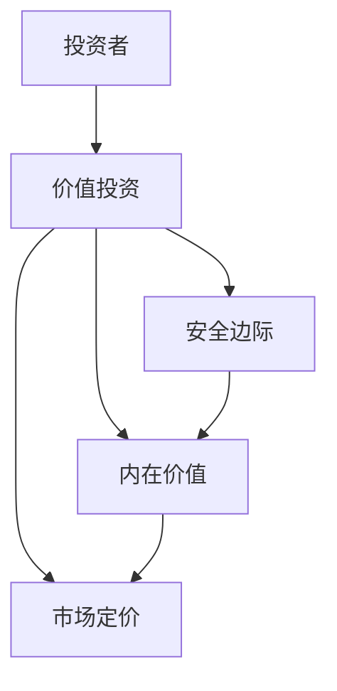
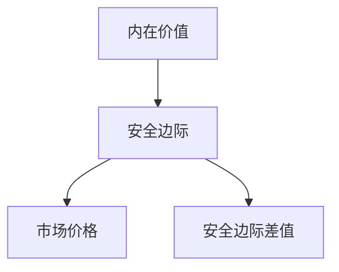
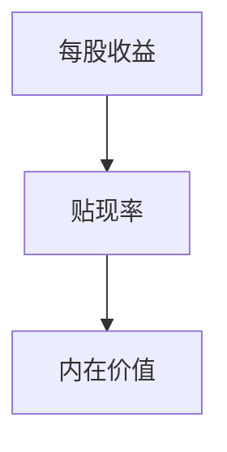
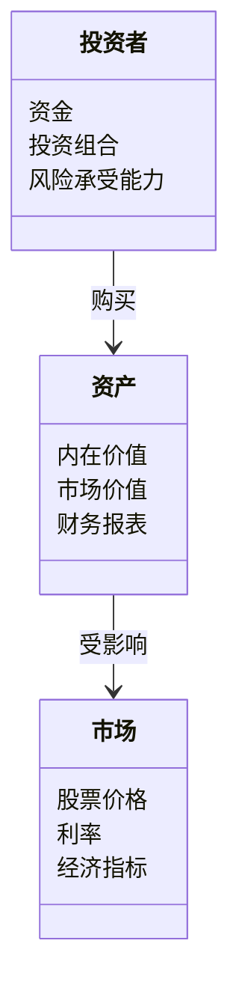
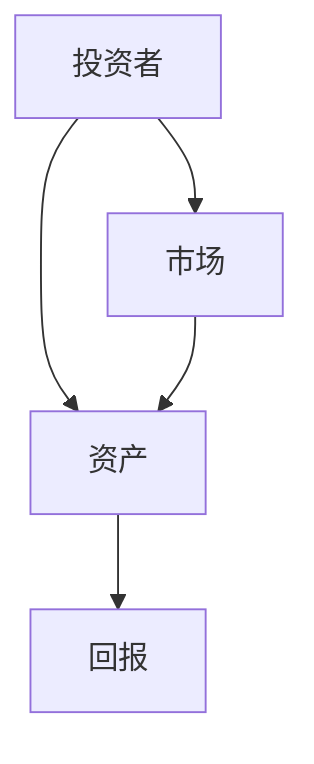

                 

# 沃伦·巴菲特：从格雷厄姆到自己的投资之路

> 关键词：沃伦·巴菲特，价值投资，本杰明·格雷厄姆，投资策略，风险管理，内在价值，数学模型

> 摘要：本文深入探讨了沃伦·巴菲特的投资哲学与实践，从其师承本杰明·格雷厄姆的价值投资理念，到逐步形成自己的独特投资体系。文章结合数学模型和系统架构设计，详细分析了巴菲特的投资策略、选股标准、风险管理方法，以及其投资心理学的核心要素。通过案例分析和系统设计，本文为读者提供了一个全面理解巴菲特投资理念的框架。

---

## 第一章：沃伦·巴菲特与价值投资的起源

### 1.1 沃伦·巴菲特的生平与投资哲学

#### 1.1.1 巴菲特的早年经历与投资启蒙

沃伦·巴菲特（Warren Buffett），1934年8月31日出生于美国堪萨斯州的奥马哈市。他从小就展现出了对数字和投资的浓厚兴趣。巴菲特的父母都是律师，父亲 Howard Buffett 是一名成功的律师和政治家，母亲 Freda Buffett 则是一位家庭主妇。巴菲特的父母在他小时候就鼓励他阅读和思考，这为他后来的投资事业奠定了基础。

巴菲特在青少年时期就开始阅读投资相关的书籍，包括本杰明·格雷厄姆（Benjamin Graham）的著作。格雷厄姆是20世纪最伟大的投资导师之一，他的价值投资理论对巴菲特的影响深远。巴菲特后来回忆说，他在10岁左右就开始研究股票市场，并在高中时期通过卖雪球껌和可乐来赚取零花钱，这些经历让他对市场和价值有了初步的认识。

#### 1.1.2 巴菲特与本杰明·格雷厄姆的师生关系

1950年代，巴菲特进入哥伦比亚大学（Columbia University）学习，师从本杰明·格雷厄姆。格雷厄姆是哥伦比亚大学商学院的教授，也是价值投资理论的创始人之一。他的“烟蒂投资法”（Cigar Butt Investing）强调以低于内在价值的价格购买股票，尤其是那些被市场忽视的低估值公司。

巴菲特在格雷厄姆门下学习期间，不仅掌握了价值投资的核心理念，还学会了如何通过分析财务报表来评估公司的内在价值。格雷厄姆的教诲让巴菲特意识到，投资的本质是寻找市场先生的错误定价。这种理念贯穿了巴菲特的整个职业生涯。

#### 1.1.3 巴菲特对价值投资的演变与创新

虽然巴菲特深受格雷厄姆的影响，但他并未完全照搬格雷厄姆的理论。在实践中，巴菲特逐渐形成了自己的投资风格。他将格雷厄姆的安全边际理论与费雪（Phil Fisher）的成长股理念相结合，发展出了一套独特的价值投资方法。

巴菲特认为，投资不仅仅是寻找低于市场价值的股票，还需要选择那些具有持续竞争优势和良好管理团队的企业。他的投资理念强调长期持有优质资产，避免短期市场的波动干扰。

### 1.2 价值投资的定义与核心要素

#### 1.2.1 价值投资的定义

价值投资是一种以低于内在价值的价格购买优质资产的投资策略。它的核心在于识别市场先生的错误定价，并通过长期持有优质资产来实现财富的增值。

#### 1.2.2 价值投资的核心要素对比表格

以下是价值投资与其他投资策略的核心要素对比：

| 投资策略      | 核心要素                                                                 |
|---------------|--------------------------------------------------------------------------|
| 价值投资      | - 以低于内在价值的价格买入资产 - 长期持有优质资产 - 重视安全边际 |
| 技术分析      | - 通过价格和成交量预测未来走势 - 短期交易为主                              |
| 成长股投资    | - 买入具有高成长潜力的公司 - 重视公司的增长率                              |

#### 1.2.3 价值投资的ER实体关系图（Mermaid流程图）

---

## 第二章：价值投资的理论基础与数学模型

### 2.1 价值投资的核心算法原理

#### 2.1.1 安全边际的计算公式（Mermaid流程图）

公式：
$$ 安全边际 = 内在价值 - 市场价格 $$

#### 2.1.2 内在价值的计算公式（Mermaid流程图）

公式：
$$ 内在价值 = \frac{每股收益}{贴现率} $$

---

## 第三章：巴菲特的投资策略与选股标准

### 3.1 巴菲特的投资策略

#### 3.1.1 长期投资策略

巴菲特强调长期持有优质资产，避免频繁交易。他认为市场的短期波动是噪音，真正的价值会在长期中体现。

#### 3.1.2 集中投资策略

巴菲特的投资组合通常集中在少数几只优质股票上，他认为集中投资可以减少风险，并充分利用大额投资的优势。

#### 3.1.3 买入并持有策略

巴菲特倾向于买入优质资产后长期持有，除非基本面发生重大变化，否则不会轻易卖出。

### 3.2 巴菲特的选股标准

#### 3.2.1 高质量企业的定义

巴菲特选股的核心是寻找具有持续竞争优势的企业，这些企业通常在各自的行业中具有领先地位，并且能够保持较高的利润率。

#### 3.2.2 财务指标分析

以下是巴菲特常用的财务指标分析：

| 指标名称      | 定义与重要性                            |
|---------------|----------------------------------------|
| 毛利率        | 反映企业的定价能力与成本控制能力      |
| 净利润率      | 反映企业的盈利能力                      |
| 资产负债率    | 反映企业的财务风险                      |
| 现金流        | 反映企业的造血能力                      |

公式：
$$ 净利润率 = \frac{净利润}{营业收入} $$

---

## 第四章：巴菲特的投资心理学与风险管理

### 4.1 巴菲特的投资心理学

#### 4.1.1 心理因素在投资中的作用

巴菲特认为，投资的成功不仅仅取决于智商，还取决于心理素质。他强调避免情绪化决策，尤其是在市场恐慌时更应该坚持自己的判断。

#### 4.1.2 情绪化决策的避免

巴菲特通过集中投资和长期持有的策略，避免了情绪化决策的影响。他认为，市场的短期波动不应该影响长期的投资决策。

#### 4.1.3 耐心与纪律在投资中的重要性

巴菲特强调，成功的投资需要耐心和纪律。他建议投资者在市场低迷时坚持持有优质资产，避免被市场的短期波动所干扰。

### 4.2 风险管理的数学模型

#### 4.2.1 风险调整后的收益公式

$$ 夏普比率 = \frac{预期收益 - 无风险利率}{波动率} $$

夏普比率是衡量投资组合风险调整后收益的重要指标。巴菲特的投资策略通常具有较高的夏普比率，表明他在承担较低风险的情况下实现了较高的收益。

---

## 第五章：巴菲特投资体系的系统分析与架构设计

### 5.1 投资决策的系统架构

#### 5.1.1 投资决策的领域模型（Mermaid类图）

#### 5.1.2 投资决策的系统架构图（Mermaid架构图）

---

## 第六章：巴菲特投资体系的总结与展望

### 6.1 巴菲特投资体系的核心要素

1. **价值投资**：以低于内在价值的价格买入优质资产。
2. **长期持有**：避免短期市场的波动干扰。
3. **集中投资**：将资金集中在少数优质资产上。
4. **风险管理**：通过安全边际和分散投资降低风险。

### 6.2 巴菲特投资体系的未来展望

随着市场的变化和技术的发展，价值投资的理念仍然具有重要的现实意义。巴菲特的成功证明了长期持有优质资产的策略是可行的。未来，投资者需要结合新的市场环境和技术工具，进一步完善自己的投资策略。

---

## 附录：巴菲特的经典语录与投资组合分析

### 附录1：巴菲特的经典语录

- “价格是暂时的，价值是永久的。”
- “我只投资那些我理解的企业。”
- “不要让市场的先生来指导你，而要指导市场先生。”

### 附录2：巴菲特投资组合分析

巴菲特的投资组合通常集中在少数几只股票上，以下是他在2023年的部分持仓：

| 股票名称 | 持股数量 | 占比 |
|----------|----------|------|
| Apple    | 88,718,000 | 40% |
| Bank of America | 1,214,125,000 | 30% |
| Coca-Cola | 400,000,000 | 15% |
| Kraft Heinz | 372,500,000 | 10% |

---

## 结论

沃伦·巴菲特的投资哲学和实践为全球投资者提供了宝贵的经验和启示。他从格雷厄姆的价值投资理念出发，逐步形成了自己独特的方法，强调长期持有优质资产和注重风险管理。通过本文的分析，我们可以看到，巴菲特的投资体系不仅是一种投资策略，更是一种生活哲学。希望本文能够为读者在投资道路上提供一些启发和指导。

---

## 作者信息

作者：AI天才研究院/AI Genius Institute & 禅与计算机程序设计艺术 /Zen And The Art of Computer Programming

