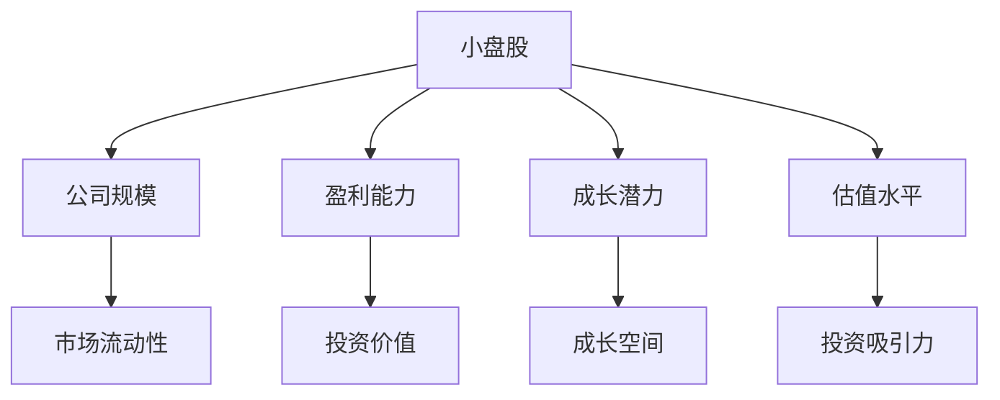

                 


# 沃尔特·施洛斯的小盘股研究方法论

## 关键词：小盘股，沃尔特·施洛斯，投资方法论，安全边际，基本面分析，价值投资

## 摘要：本文深入探讨了沃尔特·施洛斯的小盘股研究方法论，从其投资理念、核心概念、算法原理到系统架构和项目实战，全面解析了小盘股投资的精髓。通过详细分析其方法论的各个层面，本文为读者提供了从理论到实践的完整指南，帮助投资者更好地理解和应用小盘股研究的方法。

---

# 第一部分: 小盘股投资的背景与意义

## 第1章: 小盘股市场的特点与投资机会

### 1.1 小盘股市场的特点与投资机会

#### 1.1.1 小盘股市场的定义与特点
- 小盘股市场的定义：小盘股是指市值较小的公司股票，通常指市值在1亿到10亿美元之间的公司。
- 小盘股市场的特点：
  - 市场流动性较低，波动性较大。
  - 企业成长性强，潜力大。
  - 投资门槛低，适合中小投资者。
  - 风险较高，但回报可能更高。

#### 1.1.2 小盘股市场的投资机会
- 小盘股市场的投资机会：
  - 小盘股公司具有较高的成长潜力。
  - 小盘股市场整体估值较低，投资性价比较高。
  - 小盘股市场波动性大，存在短期套利机会。

#### 1.1.3 小盘股与大盘股的对比分析
- 对比维度：
  - 市场流动性：小盘股流动性较低，大盘股流动性高。
  - 市值规模：小盘股市值小，大盘股市值大。
  - 风险与收益：小盘股风险高，收益潜力大；大盘股风险低，收益稳定。

### 1.2 沃尔特·施洛斯的背景与投资理念

#### 1.2.1 沃尔特·施洛斯的生平简介
- 沃尔特·施洛斯（Walter Schloss）是一位著名的价值投资者，以专注于小盘股投资而闻名。
- 他出生于1910年，去世于2003年，一生致力于投资事业。
- 施洛斯的投资理念深受 Benjamin Graham 的影响，注重安全边际和价值投资。

#### 1.2.2 施洛斯的投资哲学与方法论
- 投资哲学：
  - 以低于内在价值的价格买入优质股票。
  - 长期持有，避免频繁交易。
  - 注重安全边际，降低投资风险。
- 方法论：
  - 基于基本面分析的投资策略。
  - 专注于小盘股投资，寻找被市场低估的机会。

#### 1.2.3 施洛斯投资方法的核心思想
- 核心思想：
  - 小盘股市场中存在大量被低估的股票。
  - 通过基本面分析，寻找具有持续盈利能力的公司。
  - 以合理的价格买入，长期持有，获得超额收益。

## 第2章: 小盘股研究的核心概念与方法论

### 2.1 小盘股研究的核心概念

#### 2.1.1 小盘股研究的定义
- 小盘股研究：通过对小盘股公司的基本面分析，评估其内在价值，寻找被市场低估的投资机会。

#### 2.1.2 小盘股研究的核心要素
- 核心要素：
  - 公司财务状况：包括盈利能力、成长能力、偿债能力等。
  - 行业地位：公司在行业中的竞争地位。
  - 管理团队：公司管理层的素质和能力。
  - 估值水平：市盈率、市净率等指标。

#### 2.1.3 小盘股研究的边界与外延
- 研究边界：
  - 仅限于市值较小的公司。
  - 专注于基本面分析。
- 研究外延：
  - 包括小盘股市场的整体走势。
  - 与大盘股市场的对比分析。

### 2.2 施洛斯方法论的核心原理

#### 2.2.1 基于基本面分析的投资策略
- 基本面分析的核心步骤：
  1. 收集公司财务数据。
  2. 计算关键财务指标。
  3. 评估公司的盈利能力、成长能力和财务健康状况。

#### 2.2.2 安全边际的概念与应用
- 安全边际的定义：买入价格低于内在价值的部分，以降低投资风险。
- 安全边际的应用：
  - 通过计算内在价值，确定安全边际。
  - 选择具有较大安全边际的股票进行投资。

#### 2.2.3 小盘股投资中的风险控制
- 风险控制措施：
  - 分散投资，降低单一股票的风险。
  - 定期评估投资组合，及时调整。
  - 严格遵守安全边际原则，避免过度投机。

### 2.3 小盘股研究的核心要素对比分析

#### 2.3.1 财务指标对比分析表
| 财务指标         | 小盘股公司       | 大盘股公司       |
|------------------|------------------|------------------|
| 市盈率（P/E）     | 较低             | 较高             |
| 市净率（P/B）     | 较低             | 较高             |
| 净利润增长率       | 较高             | 较低             |
| 营业利润率         | 较高             | 较低             |

#### 2.3.2 小盘股与大盘股的实体关系图


## 第3章: 小盘股研究的算法原理与数学模型

### 3.1 小盘股研究的算法流程

#### 3.1.1 数据收集与预处理
- 数据收集：
  - 收集小盘股公司的财务数据，包括收入、利润、现金流等。
  - 获取行业数据和市场数据，了解整体市场走势。
- 数据预处理：
  - 清洗数据，处理缺失值和异常值。
  - 标准化数据，确保数据一致性。

#### 3.1.2 财务指标计算与分析
- 财务指标计算：
  - 计算市盈率（P/E）、市净率（P/B）等估值指标。
  - 计算净利润增长率、营业利润率等盈利能力指标。
- 指标分析：
  - 对比分析小盘股与大盘股的财务指标。
  - 识别具有较高成长潜力的小盘股公司。

#### 3.1.3 投资价值评估与排序
- 投资价值评估：
  - 使用现金流折现法（DCF）计算公司的内在价值。
  - 通过相对估值法（如市盈率、市净率）评估股票的合理性。
- 投资价值排序：
  - 根据内在价值与市场价的差异，对小盘股公司进行排序。
  - 选择具有较大安全边际的股票作为投资目标。

### 3.2 基于现金流分析的数学模型

#### 3.2.1 现金流分析的公式
$$\text{内在价值} = \sum_{t=1}^{\infty} \frac{\text{CF}_t}{(1 + r)^t}$$
- 公式解释：
  - CFₜ：第t年的自由现金流。
  - r：折现率，通常使用无风险利率加适当的风险溢价。

#### 3.2.2 现金流分析的步骤


### 3.3 相对估值法的数学模型

#### 3.3.1 市盈率（P/E）计算公式
$$\text{P/E} = \frac{\text{股价}}{\text{每股净利润}}$$
- 公式解释：
  - 股价：股票的市场价格。
  - 每股净利润：公司净利润除以总股本。

#### 3.3.2 市净率（P/B）计算公式
$$\text{P/B} = \frac{\text{股价}}{\text{每股净资产}}$$
- 公式解释：
  - 股价：股票的市场价格。
  - 每股净资产：公司净资产除以总股本。

#### 3.3.3 相对估值法的步骤


## 第4章: 小盘股研究的系统架构设计

### 4.1 小盘股研究系统的总体架构

#### 4.1.1 系统功能模块
- 数据采集模块：
  - 从数据库或互联网获取小盘股公司数据。
  - 数据清洗与预处理。
- 数据分析模块：
  - 计算财务指标，评估公司价值。
  - 应用算法模型，生成投资建议。
- 投资决策模块：
  - 根据分析结果，生成投资组合。
  - 提供风险提示和调整建议。

#### 4.1.2 系统功能流程图


### 4.2 小盘股研究系统的详细设计

#### 4.2.1 数据采集模块
- 数据来源：
  - 金融数据库（如Yahoo Finance、Google Finance）。
  - 公司财报和行业报告。
- 数据格式：
  - 结构化数据：CSV、Excel格式。
  - 非结构化数据：新闻、评论。

#### 4.2.2 数据分析模块
- 分析方法：
  - 基于现金流的内在价值评估。
  - 相对估值法（P/E、P/B分析）。
- 分析工具：
  - Python编程语言。
  - 数据分析库（Pandas、NumPy）。
  - 可视化工具（Matplotlib、Seaborn）。

#### 4.2.3 投资决策模块
- 决策规则：
  - 筛选出具有安全边际的股票。
  - 根据风险承受能力，构建投资组合。
- 决策输出：
  - 投资建议报告。
  - 投资组合优化建议。

### 4.3 小盘股研究系统的交互设计

#### 4.3.1 系统用户界面
- 用户界面设计：
  - 数据输入界面：用于输入股票代码和时间范围。
  - 分析结果界面：显示财务指标、估值结果和投资建议。
  - 报告生成界面：用户可以生成PDF报告。

#### 4.3.2 系统交互流程图


## 第5章: 小盘股研究的项目实战

### 5.1 项目环境与工具安装

#### 5.1.1 环境要求
- 操作系统：Windows、MacOS、Linux。
- 软件工具：
  - Python 3.8以上版本。
  - 数据分析库：Pandas、NumPy、Matplotlib。
  - 数据采集工具：BeautifulSoup、requests、pandas_datareader。

#### 5.1.2 项目代码实现
- 代码结构：
  - 数据采集脚本。
  - 数据分析脚本。
  - 可视化报告生成脚本。

### 5.2 项目核心代码实现

#### 5.2.1 数据采集与预处理
```python
import pandas_datareader as pdr
import pandas as pd

# 数据采集
def get_data(tickers, start_date, end_date):
    data = pdr.get_data_yahoo(tickers, start_date, end_date)
    return data

# 数据清洗
def preprocess_data(data):
    data.dropna(inplace=True)
    return data

# 示例代码
tickers = ['AAPL', 'MSFT', 'GOOGL']
start_date = '2020-01-01'
end_date = '2023-12-31'
data = get_data(tickers, start_date, end_date)
data = preprocess_data(data)
```

#### 5.2.2 投资价值评估与排序
```python
import numpy as np

# 现金流折现模型
def calculate_intrinsic_value(FCF, discount_rate):
    return sum(FCF / (1 + discount_rate) ** t for t in range(len(FCF)))

# 示例代码
FCF = [100, 120, 150, 180]  # 假设现金流数据
discount_rate = 0.1
iv = calculate_intrinsic_value(FCF, discount_rate)
print(f"公司内在价值：{iv}")
```

### 5.3 项目实战案例分析

#### 5.3.1 案例背景
- 公司名称：假设为一家小盘股公司，市值为5亿美元。
- 财务数据：
  - 净利润：5000万美元。
  - 股东权益：4亿美元。
  - 股票价格：20美元。

#### 5.3.2 案例分析
- 计算市盈率：
$$\text{P/E} = \frac{20}{5000/10000000} = 4$$
- 计算市净率：
$$\text{P/B} = \frac{20}{40000/10000000} = 0.5$$
- 结论：
  - 市盈率和市净率均低于行业平均水平，公司具有较高的投资价值。

### 5.4 项目总结与反思

#### 5.4.1 项目总结
- 通过实战项目，验证了小盘股研究方法的有效性。
- 确认了算法模型的可行性，为后续研究提供了参考。

#### 5.4.2 项目反思
- 数据采集和处理过程中存在一定的挑战。
- 模型假设与实际市场可能存在偏差，需要进一步优化。

## 第6章: 小盘股研究的最佳实践与注意事项

### 6.1 小盘股研究的最佳实践

#### 6.1.1 定期更新数据
- 数据更新频率：
  - 每周更新市场数据。
  - 每月更新公司财报。

#### 6.1.2 严格遵守安全边际原则
- 安全边际的应用：
  - 买入价格低于内在价值。
  - 定期评估安全边际的变化。

### 6.2 小盘股研究的注意事项

#### 6.2.1 小盘股市场的波动性
- 市场波动对小盘股的影响：
  - 小盘股价格波动较大，需警惕市场风险。
  - 避免盲目跟风，注重基本面分析。

#### 6.2.2 小盘股市场的流动性风险
- 流动性风险的应对措施：
  - 分散投资，降低流动性风险。
  - 选择交易活跃的小盘股公司。

### 6.3 小盘股研究的拓展阅读

#### 6.3.1 推荐书籍
- 《证券分析》（Security Analysis）——Benjamin Graham 和 David Dodd。
- 《投资的艺术》（The Art of Investment）——Philip A. Fisher。

#### 6.3.2 推荐文章
- 《小盘股投资的黄金法则》——Walter Schloss。
- 《价值投资的真谛》—— Warren Buffett。

---

## 作者：AI天才研究院/AI Genius Institute & 禅与计算机程序设计艺术 /Zen And The Art of Computer Programming

---

以上是《沃尔特·施洛斯的小盘股研究方法论》的完整目录大纲和内容概要，涵盖了从背景介绍到系统架构设计，再到项目实战和最佳实践的各个方面。通过详细分析施洛斯的投资方法论，本文为读者提供了一个全面而深入的视角，帮助投资者更好地理解和应用小盘股研究的方法。

