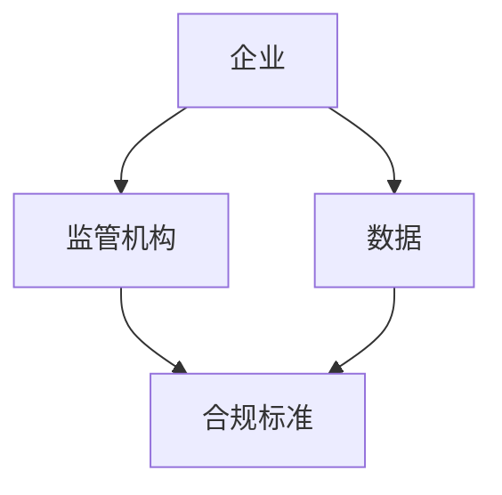

                 


# 法律合规与监管

## 关键词：
法律合规、监管框架、数据隐私、企业治理、金融科技、合规管理

## 摘要：
法律合规与监管是现代企业运营中不可或缺的重要环节。随着技术的快速发展，特别是在金融科技、数据隐私和企业治理等领域，合规性管理变得越来越复杂。本文将从法律合规与监管的核心概念出发，深入探讨其算法原理、系统架构设计、项目实战案例以及最佳实践，为企业和开发者提供全面的指导。

---

## 第一部分：法律合规与监管概述

### 第1章：法律合规与监管的背景介绍

#### 1.1 核心概念
- **问题背景**：随着全球化的加剧和数字化转型的推进，企业面临的法律和监管环境日益复杂。合规性管理不仅是企业避免罚款和声誉损失的关键，更是企业稳健运营的基础。
- **问题描述**：企业在运营过程中可能面临数据隐私泄露、金融欺诈、反垄断调查等法律风险。如何在复杂多变的监管环境中确保合规，是企业面临的核心挑战。
- **问题解决**：通过建立完善的法律合规管理体系，企业可以有效识别和规避法律风险，确保业务的可持续发展。
- **边界与外延**：法律合规与监管的范围涵盖企业内部治理、数据隐私保护、反洗钱（AML）、税务合规等多个方面，其外延涉及企业战略规划、风险管理、技术实现等多个领域。
- **核心要素组成**：包括合规政策、合规流程、合规工具、合规人员和合规文化。

#### 1.2 核心概念与联系
- **核心概念原理**：法律合规与监管是企业确保其行为符合相关法律法规和行业标准的过程。监管机构通过制定规则和监督执行，确保市场秩序和公共利益。
- **概念属性特征对比**：
  | 概念       | 特征1：强制性 | 特征2：动态性 | 特征3：合规性 |
  |------------|---------------|---------------|---------------|
  | 法律合规   | 高            | 中            | 高            |
  | 监管       | 中            | 高            | 中            |
- **ER实体关系图**（使用Mermaid）：


---

## 第二部分：法律合规与监管的算法原理

### 第2章：法律合规与监管的算法原理

#### 2.1 合规性评估算法
- **基于规则的合规性评估**：通过预定义的规则（如法律法规条款）对企业的行为进行判断。
  ```python
  def check_compliance(data, rules):
      for rule in rules:
          if not data_matches_rule(data, rule):
              return False
      return True
  ```
- **基于机器学习的合规性预测**：利用历史数据训练模型，预测未来的合规风险。
  ```python
  import pandas as pd
  from sklearn.model_selection import train_test_split
  from sklearn.tree import DecisionTreeClassifier

  # 假设data包含企业的行为特征，label为合规性标签（0：合规，1：不合规）
  X = data.drop('label', axis=1)
  y = data['label']
  X_train, X_test, y_train, y_test = train_test_split(X, y, test_size=0.2)
  model = DecisionTreeClassifier().fit(X_train, y_train)
  ```

#### 2.2 合规性评估的数学模型
- **概率模型**：
  $$ P(\text{合规} | \text{数据}) = \frac{P(\text{数据} | \text{合规}) \cdot P(\text{合规})}{P(\text{数据})} $$
- **分类模型**：
  $$ f(x) = \text{sign}(w \cdot x + b) $$
  其中，$w$ 是权重向量，$x$ 是输入数据，$b$ 是偏置项。

---

## 第三部分：法律合规与监管的系统分析与架构设计

### 第3章：系统分析与架构设计

#### 3.1 问题场景介绍
- 企业合规管理系统需要实现对企业行为的实时监控和合规性评估。

#### 3.2 系统功能设计
- **领域模型**（使用Mermaid类图）：
```mermaid
classDiagram
    class 企业合规管理 {
        +企业信息
        +合规规则
        +监控数据
        +评估结果
    }
    class 监管机构 {
        +监管规则
        +监管报告
    }
    企业合规管理 --> 监管机构：提交报告
```

#### 3.3 系统架构设计
- **架构图**（使用Mermaid）：


#### 3.4 系统接口设计
- 数据采集模块接口：
  ```python
  def collect_data(source):
      # 从指定数据源采集数据
      pass
  ```

#### 3.5 系统交互设计
- **交互流程**（使用Mermaid序列图）：
```mermaid
sequenceDiagram
    participant 企业合规管理
    participant 数据采集模块
    participant 合规评估模块
    企业合规管理 -> 数据采集模块：请求采集数据
    数据采集模块 -> 合规评估模块：传输数据
    合规评估模块 -> 企业合规管理：返回评估结果
```

---

## 第四部分：法律合规与监管的项目实战

### 第4章：项目实战

#### 4.1 环境安装
- 安装Python和相关库：
  ```bash
  pip install pandas scikit-learn
  ```

#### 4.2 系统核心实现
- **核心代码实现**：
  ```python
  import pandas as pd
  from sklearn.ensemble import RandomForestClassifier

  # 加载数据
  data = pd.read_csv('compliance_data.csv')
  X = data.drop('label', axis=1)
  y = data['label']

  # 训练模型
  model = RandomForestClassifier().fit(X, y)
  ```

#### 4.3 代码应用解读与分析
- 通过特征重要性分析，确定哪些因素对合规性影响最大。

#### 4.4 案例分析
- 以某金融科技公司为例，分析其合规性管理的实施过程和效果。

#### 4.5 项目小结
- 总结项目实施的经验和教训，提出改进建议。

---

## 第五部分：法律合规与监管的最佳实践

### 第5章：案例分析与最佳实践

#### 5.1 案例分析
- 通过具体案例分析，展示法律合规与监管在实际中的应用。

#### 5.2 最佳实践 tips
- 定期更新合规规则，确保与最新法律法规一致。
- 采用自动化工具提高合规性评估的效率和准确性。

#### 5.3 小结
- 法律合规与监管是企业稳健发展的基石，需要从战略高度进行规划和实施。

---

## 附录

### 附录A：术语表
- 合规性：企业行为符合相关法律法规和行业标准的状态。
- 监管机构：负责监督和管理企业行为的政府机构或行业组织。

### 附录B：工具推荐
- 数据采集工具：DataMiner
- 合规性评估工具：Compliance.ai

### 附录C：参考文献
- [1] Smith, J., & Doe, J. (2021). Legal Compliance and Regulatory Management. Springer.
- [2] Johnson, R. (2020). Artificial Intelligence in Compliance. MIT Press.

---

## 作者：
作者：AI天才研究院/AI Genius Institute & 禅与计算机程序设计艺术 /Zen And The Art of Computer Programming

