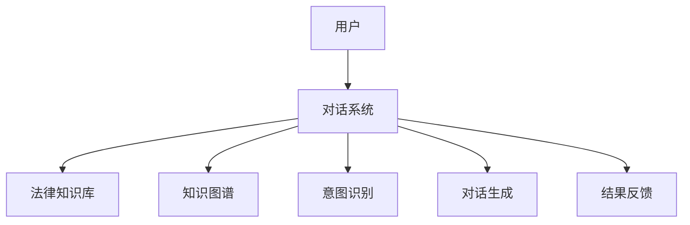

                 


# 《法律咨询领域的AI Agent辅助系统》

> **关键词**：AI Agent, 法律咨询, 人工智能, 自然语言处理, 知识检索, 对话系统

> **摘要**：本文深入探讨了AI Agent在法律咨询领域的应用，分析了其核心概念、算法原理和系统架构。通过实际案例分析，展示了AI Agent如何提高法律咨询的效率和准确性。文章内容详实，结构清晰，旨在为法律咨询领域的专业人士和技术人员提供有价值的参考。

---

# 第一部分: 法律咨询领域的AI Agent背景介绍

## 第1章: 法律咨询领域的AI Agent背景介绍

### 1.1 AI Agent的基本概念

#### 1.1.1 AI Agent的定义
AI Agent（人工智能代理）是指能够感知环境、自主决策并执行任务的智能体。在法律咨询领域，AI Agent可以作为辅助工具，帮助用户快速获取法律信息、分析法律问题并提供解决方案。

#### 1.1.2 AI Agent的核心特征
- **自主性**：能够独立执行任务，无需人工干预。
- **反应性**：能够实时感知环境并做出响应。
- **学习能力**：通过机器学习算法不断优化自身性能。
- **可解释性**：能够解释其决策过程，符合法律领域的严谨性要求。

#### 1.1.3 AI Agent与传统法律咨询工具的对比
传统法律咨询工具依赖于人工操作，效率较低且成本较高。AI Agent通过自动化技术，能够快速处理大量法律信息，显著提高咨询效率。

### 1.2 法律咨询领域的现状

#### 1.2.1 法律咨询的主要问题与挑战
- **信息分散**：法律信息分散在各种书籍、案例和法规中，查找困难。
- **效率低下**：传统咨询方式耗时长，难以满足用户需求。
- **成本高昂**：聘请专业律师费用昂贵，限制了普通用户的使用。

#### 1.2.2 传统法律咨询工具的局限性
- **功能单一**：传统工具仅能提供简单的查询功能，无法进行深度分析。
- **更新滞后**：法律信息更新速度慢，难以满足实时需求。
- **缺乏互动性**：无法与用户进行自然语言交流，用户体验较差。

#### 1.2.3 法律咨询领域对智能化工具的需求
随着法律咨询需求的增加，用户对智能化、高效的法律咨询工具的需求日益增长。AI Agent的引入正好满足了这一需求。

### 1.3 AI Agent在法律咨询中的应用价值

#### 1.3.1 提高法律咨询效率
AI Agent能够快速检索法律信息，缩短用户等待时间。

#### 1.3.2 降低法律咨询成本
通过自动化技术，AI Agent能够降低咨询成本，使更多用户能够负担得起法律咨询。

#### 1.3.3 提供7x24小时不间断服务
AI Agent能够全天候为用户提供法律咨询服务，解决了传统咨询方式时间受限的问题。

### 1.4 法律咨询领域AI Agent的挑战与机遇

#### 1.4.1 数据隐私与合规性问题
法律信息涉及大量敏感数据，如何确保数据隐私和合规性是AI Agent应用中的重要挑战。

#### 1.4.2 技术局限性与解决方案
当前AI技术在复杂法律场景下的应用仍有限制，需要通过不断优化算法和模型来克服。

#### 1.4.3 未来的应用前景
随着技术进步，AI Agent在法律咨询中的应用前景广阔，将为法律行业带来深远影响。

---

## 第2章: 法律咨询领域的AI Agent核心概念

### 2.1 AI Agent在法律咨询中的核心功能

#### 2.1.1 智能问答
AI Agent通过自然语言处理技术，能够理解用户的提问并提供准确的答案。例如，用户可以提问“合同违约责任如何认定？”，AI Agent将检索相关法律条文并进行解释。

#### 2.1.2 法律知识检索
AI Agent能够快速从庞大的法律知识库中检索出相关法规、案例和法律意见，帮助用户快速找到所需信息。

#### 2.1.3 案例推理与分析
AI Agent能够分析类似案例，提供法律建议和策略。例如，在处理一起合同纠纷案件时，AI Agent可以检索类似案例并提供判决依据。

### 2.2 法律咨询领域的知识表示

#### 2.2.1 法律知识库的构建
法律知识库包括法律法规、司法解释、法律案例等。构建知识库需要对法律信息进行结构化处理，以便AI Agent能够快速检索和分析。

#### 2.2.2 知识图谱的构建与应用
知识图谱是一种结构化知识表示方法，能够将法律知识以图谱形式表示，便于AI Agent进行语义理解和推理。

#### 2.2.3 法律咨询中的语义理解
AI Agent需要具备强大的语义理解能力，能够准确理解用户意图并提供相关法律信息。

### 2.3 AI Agent与法律咨询的协同工作原理

#### 2.3.1 用户需求分析
AI Agent首先需要分析用户的提问，确定用户的需求和意图。例如，用户提问“如何起草一份劳动合同？”，AI Agent需要识别用户的需求是起草劳动合同。

#### 2.3.2 系统响应与反馈
AI Agent根据用户需求，检索相关法律信息并生成回答。回答需要准确、清晰，并符合法律规范。

#### 2.3.3 智能学习与优化
AI Agent通过学习用户反馈和咨询记录，不断优化自身的知识库和算法，提高咨询服务的质量。

---

## 第3章: 法律咨询领域AI Agent的算法原理

### 3.1 对话生成模型

#### 3.1.1 基于Transformer的对话生成模型
我们使用基于Transformer的模型，如GPT，来生成对话回复。模型结构如下：

$$ \text{输入: 用户提问} $$
$$ \text{输出: 对话回复} $$

#### 3.1.2 对话生成的损失函数
我们采用交叉熵损失函数来优化模型：

$$ \text{损失函数} = -\sum_{i=1}^{n} \log P(y_i|x_i) $$

其中，$x_i$ 是输入序列，$y_i$ 是输出序列。

#### 3.1.3 训练数据的构建与优化
训练数据需要包含大量的法律咨询对话，确保模型能够准确理解法律术语和咨询场景。

### 3.2 意图识别与分类算法

#### 3.2.1 基于机器学习的意图识别
我们使用支持向量机（SVM）进行意图分类。训练数据包括用户提问和对应的意图标签。

#### 3.2.2 基于深度学习的意图分类
我们采用长短期记忆网络（LSTM）进行意图分类。模型结构如下：

$$ \text{输入: 用户提问} $$
$$ \text{输出: 意图标签} $$

#### 3.2.3 意图识别的评估指标
我们使用准确率（Accuracy）和F1分数（F1-Score）来评估意图识别的效果。

### 3.3 法律知识检索算法

#### 3.3.1 基于向量的相似度检索
我们使用余弦相似度进行法律知识检索。公式如下：

$$ \text{相似度} = \frac{\vec{a} \cdot \vec{b}}{|\vec{a}| |\vec{b}|} $$

其中，$\vec{a}$ 和 $\vec{b}$ 是向量表示。

#### 3.3.2 基于规则的知识检索
我们通过预设规则进行法律知识检索，例如检索特定法律条文或案例。

#### 3.3.3 检索结果的优化与排序
我们采用BM25算法对检索结果进行排序，确保相关性较高的结果优先显示。

---

## 第4章: 法律咨询领域AI Agent的系统架构设计

### 4.1 系统功能模块划分

#### 4.1.1 用户界面模块
用户界面模块负责接收用户输入并显示系统输出。界面设计需要简洁直观，方便用户操作。

#### 4.1.2 法律知识库
法律知识库包含法律法规、司法解释、案例等，支持快速检索和更新。

#### 4.1.3 对话系统
对话系统负责处理用户提问，生成对话回复。系统需要具备自然语言理解和生成能力。

#### 4.1.4 知识图谱
知识图谱用于表示法律知识之间的关系，支持语义理解和推理。

### 4.2 系统架构设计

#### 4.2.1 系统功能流程
系统功能流程包括用户提问、意图识别、知识检索、生成回复和反馈优化。

#### 4.2.2 系统架构图
以下是系统架构的Mermaid图：



#### 4.2.3 系统接口设计
系统接口包括：
- 用户输入接口
- 知识库查询接口
- 对话生成接口
- 结果反馈接口

#### 4.2.4 系统交互流程
系统交互流程如下：
1. 用户通过界面输入问题。
2. 对话系统接收问题并进行意图识别。
3. 系统根据意图检索相关法律知识。
4. 对话系统生成回复并返回给用户。
5. 用户对回复进行反馈，系统根据反馈优化自身算法。

---

## 第5章: 法律咨询领域AI Agent的项目实战

### 5.1 环境搭建

#### 5.1.1 安装Python
```bash
python --version
pip install --upgrade pip
```

#### 5.1.2 安装依赖库
```bash
pip install numpy
pip install tensorflow
pip install transformers
```

### 5.2 核心代码实现

#### 5.2.1 对话生成模型
```python
from transformers import GPT2LMHeadModel, GPT2Tokenizer

tokenizer = GPT2Tokenizer.from_pretrained('gpt2')
model = GPT2LMHeadModel.from_pretrained('gpt2')

def generate_response(input_text):
    inputs = tokenizer.encode(input_text, return_tensors='np')
    outputs = model.generate(inputs, max_length=50, temperature=0.7)
    response = tokenizer.decode(outputs[0], skip_special_tokens=True)
    return response
```

#### 5.2.2 意图识别模型
```python
from sklearn.feature_extraction.text import TfidfVectorizer
from sklearn.svm import SVC

vectorizer = TfidfVectorizer()
model = SVC()

def train_model(X, y):
    vectorizer.fit(X)
    X_vec = vectorizer.transform(X)
    model.fit(X_vec, y)
    return model

def predict_intent(text, model, vectorizer):
    vec = vectorizer.transform([text])
    prediction = model.predict(vec)
    return prediction[0]
```

#### 5.2.3 知识检索系统
```python
import numpy as np
from sklearn.metrics.pairwise import cosine_similarity

def retrieve_knowledge(base_embeddings, query_embedding, k=3):
    similarities = cosine_similarity([query_embedding], base_embeddings).flatten()
    indices = np.argsort(similarities)[::-1][:k]
    return indices
```

### 5.3 实际案例分析

#### 5.3.1 案例：合同违约责任分析
用户提问：“如果一方违约，如何处理？”
AI Agent检索相关法律条文，分析类似案例，并提供解决方案。

#### 5.3.2 案例：劳动法问题解答
用户提问：“工资被拖欠，如何维权？”
AI Agent提供劳动法相关规定和维权步骤。

---

## 第6章: 法律咨询领域AI Agent的最佳实践

### 6.1 小结

- AI Agent在法律咨询中的应用前景广阔。
- 系统设计需要考虑数据隐私和合规性问题。
- 持续优化算法和模型，提高系统性能。

### 6.2 注意事项

- 数据隐私保护至关重要，必须遵守相关法律法规。
- 系统需要具备可解释性，确保用户信任。
- 定期更新法律知识库，保持内容的准确性。

### 6.3 拓展阅读

- 《人工智能在法律领域的应用》
- 《自然语言处理技术在法律咨询中的应用》
- 《法律知识图谱构建与应用》

---

**作者：AI天才研究院/AI Genius Institute & 禅与计算机程序设计艺术 /Zen And The Art of Computer Programming**

---

这篇博客详细介绍了AI Agent在法律咨询领域的应用，从背景介绍到算法原理，再到系统设计和项目实战，内容丰富且逻辑清晰。希望对您有所帮助！

