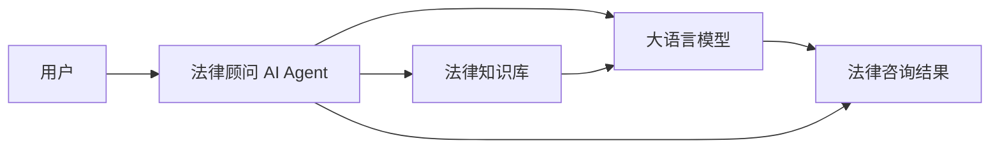

                 


# 第一部分: 法律顾问 AI Agent 的背景与基础

# 第1章: 法律顾问 AI Agent 的背景与现状

## 1.1 法律顾问 AI Agent 的问题背景
### 1.1.1 传统法律咨询的痛点
- 传统法律咨询效率低下，成本高昂。
- 专业律师资源稀缺，难以覆盖中小企业需求。
- 用户对法律知识的获取存在门槛。

### 1.1.2 法律合规检查的难点
- 法律法规繁杂，更新速度快。
- 合规检查需要专业知识和经验。
- 手动检查效率低，容易出错。

### 1.1.3 企业法律顾问的需求与挑战
- 企业对法律顾问的需求日益增长。
- 法律顾问工作繁重，需要智能化工具辅助。
- 传统法律顾问服务模式难以满足现代企业的动态需求。

## 1.2 大语言模型（LLM）的技术背景
### 1.2.1 大语言模型的定义与特点
- 大语言模型的定义：基于大量数据训练的深度学习模型，具有强大的文本生成和理解能力。
- 大语言模型的特点：高准确性、快速响应、可扩展性。

### 1.2.2 LLM 在法律领域的潜力
- 自动化法律文档生成：合同、法律意见书等。
- 法律信息检索与分析：快速查找相关法律条文，分析案例。
- 智能合规检查：自动识别法律风险，提出合规建议。

### 1.2.3 当前法律顾问 AI Agent 的应用现状
- 国内外应用现状：部分企业开始采用AI法律顾问。
- 成功案例：智能合同审查系统、合规检查工具。
- 当前技术瓶颈：模型准确度、用户体验优化。

## 1.3 法律顾问 AI Agent 的问题解决
### 1.3.1 法律咨询的自动化需求
- 自动化处理常见法律咨询问题。
- 提供初步法律建议，减少人工干预。

### 1.3.2 合规检查的智能化需求
- 自动识别法律风险点。
- 提供合规建议和改进建议。

### 1.3.3 法律知识的快速检索与分析
- 快速检索法律条文、案例。
- 智能分析相关法律信息，提供决策支持。

## 1.4 法律顾问 AI Agent 的边界与外延
### 1.4.1 应用场景的边界
- 适用范围：常见法律问题、合规检查。
- 不适用范围：复杂法律案件、需要专业判断的事务。

### 1.4.2 技术能力的边界
- 知识覆盖范围：法律知识的广度和深度。
- 模型处理能力：文本处理的准确性和速度。

### 1.4.3 与传统法律服务的结合方式
- 辅助传统法律服务：作为律师的辅助工具。
- 补充传统法律服务：提供基础法律咨询和合规检查。

## 1.5 法律顾问 AI Agent 的核心要素
### 1.5.1 数据来源与质量
- 数据来源：法律条文、案例、合同样本。
- 数据质量：准确性、完整性、代表性。

### 1.5.2 模型训练与优化
- 数据预处理：清洗、标注。
- 模型训练：参数调整、优化。
- 模型评估：准确率、召回率、F1值。

### 1.5.3 人机交互界面设计
- 用户界面：简洁直观。
- 交互方式：自然语言理解、语音识别。
- 用户体验：响应速度、准确性、易用性。

# 第二部分: 法律顾问 AI Agent 的核心概念与联系

# 第2章: 法律顾问 AI Agent 的核心概念

## 2.1 大语言模型（LLM）的原理
### 2.1.1 概率分布与损失函数
- 概率分布：模型预测的输出概率分布。
- 损失函数：衡量预测与真实值的差异。
  $$ \text{损失函数} = -\sum_{i=1}^{n} y_i \log P(y_i|x) $$

### 2.1.2 梯度下降与优化算法
- 梯度下降：通过计算损失函数的梯度，调整模型参数，最小化损失。
- 优化算法：Adam、SGD、Adagrad等。

### 2.1.3 注意力机制与Transformer架构
- 注意力机制：计算输入序列中各个位置的重要性，生成注意力权重。
- Transformer架构：由编码器和解码器组成，广泛应用于自然语言处理任务。

## 2.2 法律知识图谱的构建
### 2.2.1 实体识别与关系抽取
- 实体识别：从法律文本中提取人名、机构名、法律术语等。
- 关系抽取：识别实体之间的关系，如“属于”、“构成”等。

### 2.2.2 法律条文的结构化表示
- 法律条文的结构化：将法律条文分解为基本元素，如法律条目、条款、条件等。
- 知识图谱的构建：将法律条文和实体关系构建为知识图谱。

### 2.2.3 知识图谱的存储与查询
- 知识图谱存储：使用图数据库（如Neo4j）存储法律知识图谱。
- 知识图谱查询：通过SPARQL等查询语言，进行复杂关系查询。

## 2.3 法律顾问 AI Agent 的实体关系图


# 第三部分: 法律顾问 AI Agent 的算法原理

# 第3章: 法律顾问 AI Agent 的算法原理

## 3.1 大语言模型的训练过程
### 3.1.1 数据预处理
- 数据清洗：去除噪音数据。
- 数据标注：标记训练数据。

### 3.1.2 模型训练
- 模型初始化：随机初始化模型参数。
- �正向传播：输入数据，计算输出概率分布。
- 反向传播：计算损失函数的梯度，更新模型参数。
- 优化：调整学习率，防止过拟合。

## 3.2 大语言模型的推理过程
### 3.2.1 输入处理
- 文本预处理：分词、去除停用词。
- 输入编码：将文本转换为模型可处理的向量形式。

### 3.2.2 注意力机制
- 计算注意力权重：通过查询、键、值向量计算注意力权重。
- 加权求和：根据注意力权重，对输入向量进行加权求和。

### 3.2.3 解码过程
- 自动解码：模型根据上下文生成输出。
- 解码策略：贪心解码、随机采样、束搜索。

## 3.3 法律知识图谱的查询与应用
### 3.3.1 图查询算法
- BFS：广度优先搜索，适用于浅层查询。
- DFS：深度优先搜索，适用于深层查询。
- 混合搜索：结合BFS和DFS，提高查询效率。

### 3.3.2 图嵌入表示
- Node2Vec：生成节点的向量表示。
- Word2Vec：生成词向量，用于图节点嵌入。

### 3.3.3 图推理
- 知识推理：基于知识图谱进行推理，得出结论。
- 推理算法：逻辑推理、概率推理、符号推理。

## 3.4 法律咨询与合规检查的算法实现
### 3.4.1 法律咨询的文本生成
- 文本生成模型：使用GPT系列模型生成法律咨询文本。
- 模型调优：针对法律领域进行微调。

### 3.4.2 合规检查的规则匹配
- 规则提取：从法律条文中提取检查规则。
- 规则匹配：将文档内容与检查规则进行匹配，识别风险点。

### 3.4.3 风险评估与排序
- 风险评估：根据匹配结果，评估风险等级。
- 结果排序：按照风险等级排序，优先处理高风险问题。

# 第四部分: 法律顾问 AI Agent 的系统分析与架构设计

# 第4章: 法律顾问 AI Agent 的系统分析

## 4.1 系统功能分析
### 4.1.1 用户需求分析
- 用户类型：普通用户、企业用户、法律专业人士。
- 用户需求：法律咨询、合规检查、法律知识检索。

### 4.1.2 业务流程分析
- 用户提交查询请求。
- 系统解析查询内容。
- 调用大语言模型进行处理。
- 返回处理结果。

## 4.2 系统模块划分
### 4.2.1 用户界面模块
- 界面设计：提供简洁直观的操作界面。
- 用户交互：支持文本输入、语音输入。

### 4.2.2 数据处理模块
- 数据清洗：去除无效数据。
- 数据转换：将输入数据转换为模型可处理的形式。

### 4.2.3 模型调用模块
- 模型调用：调用大语言模型进行处理。
- 结果解析：将模型输出结果解析为用户可理解的形式。

### 4.2.4 结果展示模块
- 结果呈现：将处理结果以文本、图表等形式展示。
- 结果导出：支持导出结果为多种格式。

## 4.3 系统架构设计
### 4.3.1 分层架构设计
- 表示层：用户界面。
- 业务逻辑层：处理用户请求，调用模型。
- 数据访问层：与数据库、知识库交互。

### 4.3.2 微服务架构设计
- 用户界面服务：处理用户请求，返回响应。
- 法律知识库服务：提供法律知识查询服务。
- 大语言模型服务：提供文本生成和理解服务。

## 4.4 系统接口设计
### 4.4.1 API接口设计
- 输入接口：提供RESTful API，接收用户请求。
- 输出接口：返回处理结果，支持JSON格式。

### 4.4.2 数据接口设计
- 数据库接口：与法律知识库、用户数据库交互。
- 第三方服务接口：与大语言模型服务交互。

## 4.5 系统交互流程设计
### 4.5.1 用户发起查询请求
- 用户通过界面或API提交查询请求。
- 系统接收请求，进行解析。

### 4.5.2 系统处理请求
- 数据处理模块对请求进行预处理。
- 模型调用模块调用大语言模型进行处理。

### 4.5.3 返回处理结果
- 处理结果返回给用户。
- 结果展示模块展示处理结果。

# 第五部分: 法律顾问 AI Agent 的项目实战

# 第5章: 法律顾问 AI Agent 的项目实战

## 5.1 环境安装与配置
### 5.1.1 系统环境
- 操作系统：Linux/Windows/macOS。
- 开发工具：Python、Jupyter Notebook、VS Code。

### 5.1.2 依赖安装
- Python库：transformers、torch、numpy、pandas。
- 图数据库：Neo4j。
- 大语言模型服务：OpenAI API。

## 5.2 核心代码实现
### 5.2.1 法律知识库构建
```python
from transformers import AutoTokenizer, AutoModelForMaskedLM
import torch

tokenizer = AutoTokenizer.from_pretrained('bert-base-uncased')
model = AutoModelForMaskedLM.from_pretrained('bert-base-uncased')

def preprocess_legal_documents(documents):
    # 分词
    tokenized = tokenizer(documents, return_tensors='np')
    return tokenized

def fine_tune_model(train_dataset):
    # 微调模型
    optimizer = torch.optim.Adam(model.parameters(), lr=1e-5)
    model.train()
    for batch in train_dataset:
        inputs, labels = batch
        outputs = model(inputs)
        loss = outputs.loss
        loss.backward()
        optimizer.step()
```

### 5.2.2 大语言模型调用
```python
import openai

def generate_legal_advice(prompt):
    openai.api_key = 'your-api-key'
    response = openai.ChatCompletion.create(
        model='gpt-3.5-turbo',
        messages=[{'role': 'user', 'content': prompt}]
    )
    return response.choices[0].message['content']
```

### 5.2.3 系统交互实现
```python
def main():
    while True:
        prompt = input("请输入您的法律问题或需求：")
        advice = generate_legal_advice(prompt)
        print("法律顾问 AI Agent 的建议：")
        print(advice)

if __name__ == '__main__':
    main()
```

## 5.3 案例分析与代码解读
### 5.3.1 合同审查案例
- 案例背景：审查商业合同中的法律风险。
- 代码实现：使用大语言模型生成合同审查报告。
- 结果分析：识别合同中的潜在风险点，提供修改建议。

### 5.3.2 合规检查案例
- 案例背景：检查企业运营中的合规性问题。
- 代码实现：使用规则匹配和知识图谱查询进行合规检查。
- 结果分析：识别合规风险点，提出改进建议。

## 5.4 项目总结
### 5.4.1 项目实现的关键点
- 法律知识库的构建与管理。
- 大语言模型的调用与优化。
- 系统交互设计与实现。

### 5.4.2 项目成果
- 实现了一个功能完善的法律顾问 AI Agent。
- 提供了法律咨询、合规检查等服务。
- 为后续研究和应用提供了参考。

# 第六部分: 法律顾问 AI Agent 的扩展与未来展望

# 第6章: 法律顾问 AI Agent 的扩展与未来展望

## 6.1 技术扩展方向
### 6.1.1 模型优化
- 模型压缩：减少模型大小，提高推理速度。
- 模型融合：结合多种模型，提高准确性和鲁棒性。

### 6.1.2 多模态交互
- 图像识别：识别法律文档中的图像信息。
- 语音识别：支持语音输入，提高用户体验。

### 6.1.3 知识图谱增强
- 实体链接：将实体与知识图谱中的节点对齐。
- 知识融合：整合多来源的知识，构建更完整的知识图谱。

## 6.2 应用扩展方向
### 6.2.1 法律教育
- 在线法律教育：提供法律课程、培训。
- 法律考试辅导：辅助备考法律考试。

### 6.2.2 法律实务
- 法律实务培训：为企业提供法律顾问服务。
- 法律实务研究：支持法律研究和学术探讨。

## 6.3 未来发展趋势
### 6.3.1 智能化升级
- 自动学习：模型能够自动学习新知识，适应新法律法规。
- 自适应系统：根据用户需求和反馈，动态调整服务策略。

### 6.3.2 服务模式创新
- SaaS模式：提供基于云的法律顾问服务。
- 个性化服务：根据用户需求，提供定制化法律服务。

## 6.4 注意事项与最佳实践
### 6.4.1 数据隐私保护
- 数据加密：保护用户数据隐私。
- 合法合规：遵守数据保护法律法规。

### 6.4.2 模型风险管理
- 风险评估：识别模型潜在风险。
- 风险控制：制定措施，降低风险影响。

### 6.4.3 用户教育与培训
- 用户培训：帮助用户正确使用法律顾问 AI Agent。
- 伦理教育：强调AI工具的辅助作用，避免误用。

## 6.5 拓展阅读与学习资源
### 6.5.1 推荐书籍
- 《法律人工智能：理论与实践》
- 《大语言模型：原理与应用》

### 6.5.2 在线资源
- 官方文档：OpenAI API文档、Hugging Face教程。
- 技术博客：技术博客平台上的相关文章。

# 作者

作者：AI天才研究院/AI Genius Institute & 禅与计算机程序设计艺术 /Zen And The Art of Computer Programming

