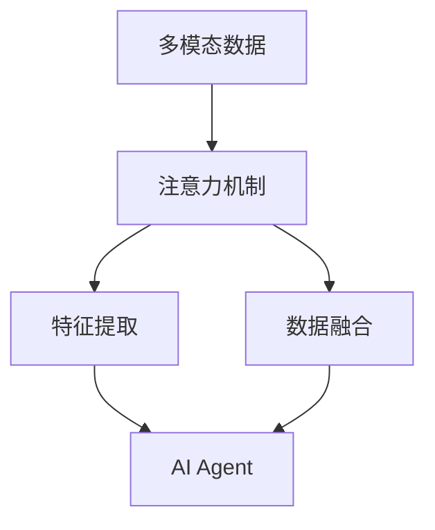
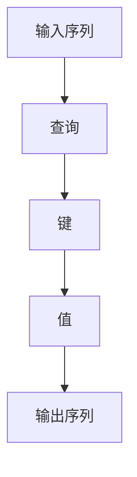
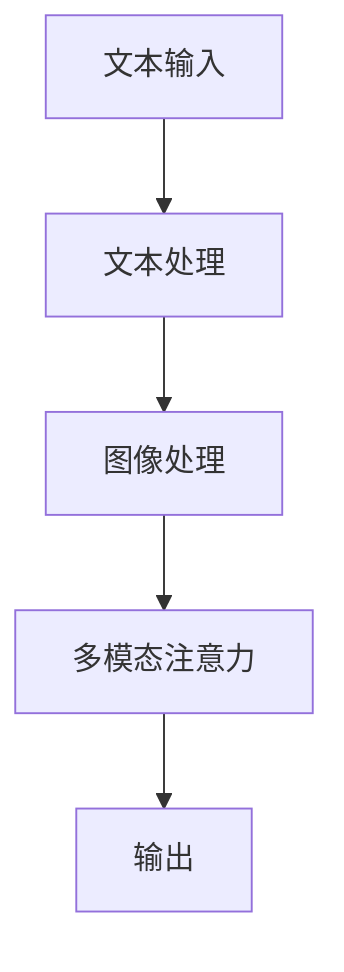
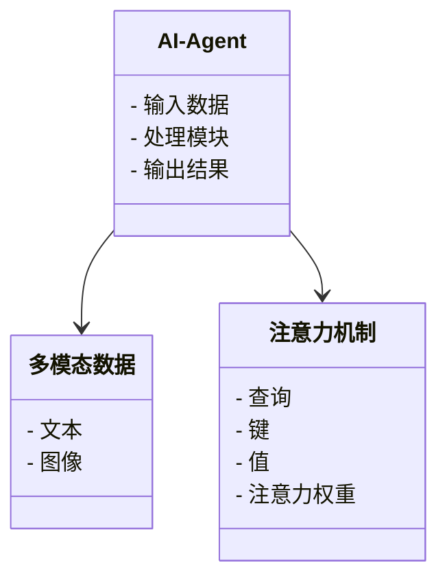
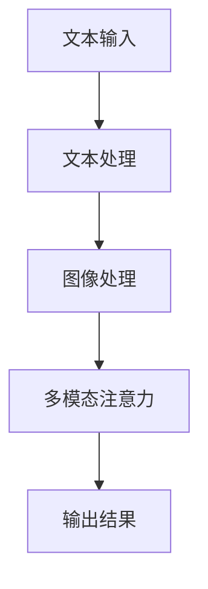
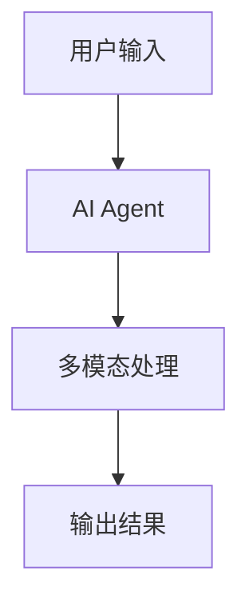

                 


# 注意力机制在AI Agent多模态融合中的应用

## 关键词：注意力机制，多模态融合，AI Agent，自注意力，多模态Transformer

## 摘要：注意力机制作为一种强大的深度学习技术，近年来在自然语言处理、计算机视觉等领域取得了显著成果。本文探讨了注意力机制在AI Agent多模态融合中的应用，分析了其核心原理、算法实现，并通过实际案例展示了其在多模态数据处理中的优势，为AI Agent的设计提供了新的思路。

---

# 第一部分：注意力机制在AI Agent多模态融合中的应用背景

## 第1章：背景介绍

### 1.1 问题背景

#### 1.1.1 多模态数据的定义与特点
多模态数据指的是来自不同感官渠道的信息，如文本、图像、语音、视频等。这些数据的特点是异构性、互补性和多样性，能够提供更全面的信息。

#### 1.1.2 AI Agent的定义与特点
AI Agent是一种智能体，能够感知环境、执行任务、与用户交互。其特点是自主性、反应性、目标导向和社会能力。

#### 1.1.3 注意力机制的定义与特点
注意力机制是一种模拟人类注意力的机制，能够聚焦于输入数据的重要部分。其特点包括自适应性、选择性和上下文感知。

### 1.2 问题描述

#### 1.2.1 多模态数据融合的挑战
多模态数据来自不同的模态，具有异构性和多样性，融合时需要考虑如何协调不同模态的信息。

#### 1.2.2 AI Agent在多模态数据处理中的需求
AI Agent需要处理多模态数据，以提高其感知能力和任务执行效率。

#### 1.2.3 注意力机制在多模态数据处理中的作用
注意力机制能够帮助AI Agent聚焦于重要的模态信息，提高处理效率和准确性。

### 1.3 问题解决

#### 1.3.1 注意力机制在多模态数据融合中的应用
注意力机制可以用于多模态数据的特征提取和信息融合，帮助AI Agent更好地理解输入数据。

#### 1.3.2 AI Agent如何利用注意力机制进行多模态数据处理
AI Agent可以通过注意力机制对不同模态的信息进行加权，生成更准确的表示。

#### 1.3.3 注意力机制在多模态数据处理中的优势
注意力机制能够捕捉到数据中的重要信息，减少计算复杂度，提高模型的性能。

### 1.4 边界与外延

#### 1.4.1 注意力机制的边界
注意力机制主要用于数据处理和特征提取，其边界在于如何与其他技术结合使用。

#### 1.4.2 多模态数据融合的边界
多模态数据融合的边界在于如何处理不同模态的数据异构性。

#### 1.4.3 AI Agent的边界
AI Agent的边界在于其任务执行能力和环境感知能力。

### 1.5 概念结构与核心要素

#### 1.5.1 注意力机制的核心要素
注意力机制的核心要素包括查询、键、值和注意力权重。

#### 1.5.2 多模态数据融合的核心要素
多模态数据融合的核心要素包括数据预处理、特征提取和信息融合。

#### 1.5.3 AI Agent的核心要素
AI Agent的核心要素包括感知能力、决策能力和执行能力。

---

## 第2章：注意力机制的核心概念与联系

### 2.1 注意力机制的原理

#### 2.1.1 自注意力机制
自注意力机制通过对输入序列的全局依赖进行建模，生成注意力权重。

#### 2.1.2 多模态注意力机制
多模态注意力机制结合了不同模态的信息，生成跨模态的注意力权重。

#### 2.1.3 注意力机制的数学模型
自注意力机制的数学模型如下：

$$
\text{Attention}(Q, K, V) = \text{softmax}\left(\frac{QK^T}{\sqrt{d_k}}\right)V
$$

其中，$Q$、$K$、$V$分别是查询、键和值矩阵，$d_k$是键的维度。

### 2.2 核心概念对比

#### 2.2.1 注意力机制与传统特征提取方法的对比
| 对比维度 | 注意力机制 | 传统特征提取方法 |
|----------|------------|------------------|
| 灵活性 | 高 | 低 |
| 信息利用 | 全局 | 局部 |

#### 2.2.2 自注意力机制与多模态注意力机制的对比
| 对比维度 | 自注意力机制 | 多模态注意力机制 |
|----------|--------------|------------------|
| 输入 | 单一模态 | 多模态 |
| 输出 | 单一模态 | 跨模态 |

#### 2.2.3 注意力机制在不同场景中的应用对比
| 场景 | 自然语言处理 | 多模态数据处理 |
|------|--------------|------------------|
| 技术 | 自注意力机制 | 多模态注意力机制 |

### 2.3 ER实体关系图



---

## 第3章：注意力机制的算法原理

### 3.1 自注意力机制



自注意力机制的实现步骤如下：

1. 将输入序列分别映射为查询、键和值矩阵。
2. 计算查询与键的点积，得到注意力权重。
3. 对注意力权重进行Softmax归一化。
4. 将注意力权重与值矩阵相乘，得到最终的注意力输出。

### 3.2 多模态注意力机制



多模态注意力机制的实现步骤如下：

1. 对不同模态的输入分别进行处理，生成对应的特征表示。
2. 将特征表示输入到多模态注意力层，生成跨模态的注意力权重。
3. 根据注意力权重对各模态的特征进行加权求和，得到最终的融合结果。

### 3.3 注意力机制的对比分析

| 对比维度 | 自注意力机制 | 多模态注意力机制 |
|----------|--------------|------------------|
| 输入 | 单一模态 | 多模态 |
| 输出 | 单一模态 | 跨模态 |

---

## 第4章：系统分析与架构设计

### 4.1 问题场景介绍

#### 4.1.1 问题场景描述
AI Agent需要处理多模态数据，如文本和图像，以提高其理解和决策能力。

#### 4.1.2 项目介绍
本项目旨在设计一个基于注意力机制的AI Agent多模态融合系统。

### 4.2 系统功能设计

#### 4.2.1 系统功能模块
系统功能模块包括数据预处理、特征提取、注意力计算和结果融合。

### 4.2.2 领域模型（类图）



### 4.3 系统架构设计

#### 4.3.1 系统架构图



### 4.4 接口设计

#### 4.4.1 接口描述
系统接口包括输入接口（接收多模态数据）和输出接口（输出处理结果）。

### 4.5 交互流程

#### 4.5.1 交互流程图



---

## 第5章：项目实战

### 5.1 环境安装

```bash
pip install numpy
pip install matplotlib
pip install pymermaid
```

### 5.2 核心代码实现

#### 5.2.1 注意力机制实现

```python
import numpy as np

def attention(Q, K, V):
    dk = K.shape[-1]
    scores = np.dot(Q, K.T) / np.sqrt(dk)
    attention_weights = np.softmax(scores, axis=-1)
    output = np.dot(attention_weights, V)
    return output
```

#### 5.2.2 多模态Transformer实现

```python
class MultiModalTransformer:
    def __init__(self, d_model, n_heads):
        self.n_heads = n_heads
        self.d_model = d_model
        self.dk = d_model // n_heads
    
    def forward(self, X_modals):
        Q = self.get_query(X_modals)
        K = self.get_key(X_modals)
        V = self.get_value(X_modals)
        output = attention(Q, K, V)
        return output
```

### 5.3 案例分析

#### 5.3.1 案例描述
本案例实现一个多模态对话系统，结合文本和语音进行处理。

#### 5.3.2 实现步骤
1. 数据预处理：将文本和语音数据进行预处理。
2. 特征提取：提取文本和语音的特征。
3. 注意力计算：计算多模态注意力权重。
4. 结果融合：将注意力加权后的特征进行融合，生成最终的输出。

### 5.4 项目总结

#### 5.4.1 项目成果
实现了基于注意力机制的多模态融合系统，提高了AI Agent的处理能力。

#### 5.4.2 经验总结
注意力机制在多模态数据处理中表现出色，能够有效捕捉重要信息。

---

## 第6章：扩展阅读

### 6.1 研究热点

#### 6.1.1 多模态注意力机制的研究进展
近年来，多模态注意力机制在自然语言处理和计算机视觉领域取得了显著进展。

#### 6.1.2 基于Transformer的多模态模型
基于Transformer的多模态模型在图像描述生成和视频理解中表现优异。

### 6.2 未来展望

#### 6.2.1 跨模态注意力机制的优化
未来的研究方向包括优化跨模态注意力机制，提高模型的表达能力。

#### 6.2.2 多模态数据处理的新方法
未来可能会出现更多创新的多模态数据处理方法，如图神经网络和知识图谱的结合。

---

## 作者：AI天才研究院/AI Genius Institute & 禅与计算机程序设计艺术 /Zen And The Art of Computer Programming

---

以上是完整的博客文章大纲，涵盖了从背景介绍到项目实战的各个方面，结合理论与实践，深入浅出地讲解了注意力机制在AI Agent多模态融合中的应用。

