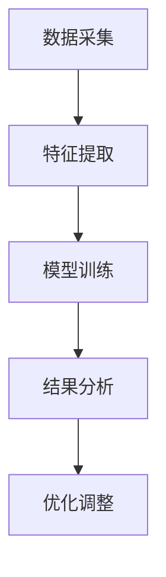
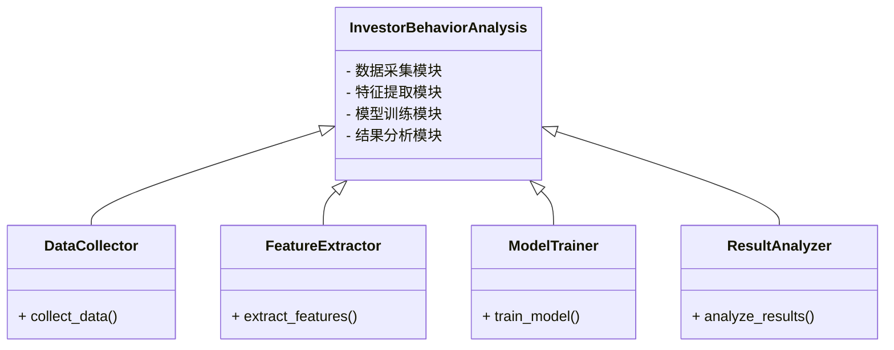

                 


# 深入分析投资者行为：模型构建与应用

> 关键词：投资者行为分析，行为建模，市场预测，机器学习，统计分析

> 摘要：本文将深入探讨投资者行为分析的核心概念、模型构建方法及其在实际应用中的价值。通过结合统计分析与机器学习算法，我们旨在揭示投资者行为的内在规律，并为企业和投资者提供科学的决策支持。

---

## 第1章：投资者行为分析的背景与问题背景

### 1.1 投资者行为分析的基本概念

#### 1.1.1 投资者行为分析的定义
投资者行为分析是指通过对投资者在金融市场中的决策和操作进行观察、记录和建模，以揭示其行为模式、心理特征和决策逻辑的过程。这一分析不仅关注个体投资者的行为，还涉及机构投资者和市场整体的行为特征。

#### 1.1.2 投资者行为分析的研究意义
投资者行为分析在金融领域具有重要的研究价值：
- **风险控制**：通过理解投资者的行为模式，可以预测市场波动，从而制定更有效的风险管理策略。
- **投资决策优化**：投资者行为分析可以帮助投资者识别自身决策中的偏差，优化投资策略。
- **市场预测**：投资者行为是市场价格波动的重要驱动因素，通过分析投资者行为，可以更准确地预测市场走势。

#### 1.1.3 投资者行为分析的边界与外延
投资者行为分析的边界主要集中在投资者的决策过程和市场行为，但不包括市场的宏观因素（如经济政策、自然灾害等）。其外延则涵盖个体投资者与机构投资者的行为差异、不同市场环境下的行为特征等。

---

### 1.2 投资者行为模型的核心要素

#### 1.2.1 投资者决策的心理因素
投资者的决策受到多种心理因素的影响，包括：
- **认知偏差**：如过度自信、确认偏差等。
- **情绪因素**：如贪婪与恐惧。
- **风险偏好**：不同投资者对风险的承受能力不同。

#### 1.2.2 投资者行为的市场特征
投资者行为在市场中表现出以下特征：
- **羊群效应**：投资者倾向于跟随市场趋势，而非独立分析。
- **市场反应滞后**：投资者的决策往往滞后于市场变化。
- **波动性**：投资者情绪的波动性是市场波动的重要来源。

#### 1.2.3 投资者行为的核心要素组成
投资者行为模型的核心要素包括：
1. **投资者特征**：如年龄、性别、风险偏好等。
2. **市场环境**：如市场波动率、宏观经济指标等。
3. **决策过程**：如信息获取、决策制定、操作执行等。

---

## 第2章：投资者行为模型的核心概念与联系

### 2.1 投资者行为模型的原理

#### 2.1.1 投资者行为模型的分类
投资者行为模型主要分为以下几类：
- **基于统计的模型**：如回归分析、时间序列分析。
- **基于机器学习的模型**：如随机森林、神经网络。
- **基于行为金融学的模型**：如行为偏差模型、情绪模型。

#### 2.1.2 投资者行为模型的构建方法
构建投资者行为模型的步骤如下：
1. **数据采集**：收集投资者的交易数据、市场数据和投资者特征数据。
2. **特征提取**：从数据中提取有用的特征，如交易频率、仓位变化等。
3. **模型训练**：使用统计或机器学习算法训练模型。
4. **模型验证**：通过回测和交叉验证评估模型的性能。

#### 2.1.3 投资者行为模型的验证方法
模型验证是投资者行为分析的重要环节，常用的验证方法包括：
- **回测分析**：在历史数据上验证模型的预测能力。
- **交叉验证**：通过多次交叉验证评估模型的泛化能力。
- **现实检验**：将模型应用于实际市场，观察其表现。

---

### 2.2 投资者行为模型的核心概念对比

#### 2.2.1 投资者行为与市场反应的对比
| 投资者行为特征 | 市场反应特征 |
|-----------------|--------------|
| 个体决策        | 集体行为      |
| 受情绪影响       | 受多种因素影响 |
| 短期波动性       | 长期趋势性     |

#### 2.2.2 不同投资者行为模型的特征对比
| 模型类型        | 输入特征     | 输出结果       | 适用场景               |
|-----------------|--------------|----------------|------------------------|
| 统计模型        | 历史数据      | 概率预测        | 长期趋势预测           |
| 机器学习模型    | 特征工程     | 高精度预测      | 复杂行为模式识别       |
| 行为金融模型    | 心理因素     | 行为偏差预测     | 理解投资者心理偏差     |

#### 2.2.3 投资者行为模型的ER实体关系图

```mermaid
erDiagram
    INVESTOR {
        InvestorID : integer
        Age : integer
        RiskPreference : string
    }
    MARKET_BEHAVIOR {
        MarketID : integer
        TimeStamp : datetime
        BehaviorType : string
    }
    TRANSACTION {
        TransactionID : integer
        InvestorID : integer
        AssetID : integer
        Amount : decimal
        TimeStamp : datetime
    }
    INVESTOR <---o> TRANSACTION : "Investor进行交易"
    TRANSACTION <---o> ASSET : "资产被交易"
    INVESTOR <---o> MARKET_BEHAVIOR : "投资者行为影响市场"
```

---

## 第3章：投资者行为分析的算法原理

### 3.1 投资者行为分析的核心算法

#### 3.1.1 统计分析方法
统计分析是投资者行为分析的基础，常用的统计方法包括：
- **回归分析**：用于分析变量之间的关系。
- **时间序列分析**：用于分析市场的时序特征。
- **假设检验**：用于验证假设。

#### 3.1.2 机器学习算法
机器学习算法在投资者行为分析中应用广泛，常用的算法包括：
- **随机森林**：用于特征重要性分析和分类。
- **XGBoost**：用于回归和分类任务。
- **神经网络**：用于复杂模式的识别。

#### 3.1.3 深度学习模型
深度学习模型在投资者行为分析中也逐渐得到应用，常用的模型包括：
- **LSTM**：用于时间序列预测。
- **Transformer**：用于捕捉长距离依赖关系。

---

### 3.2 投资者行为分析的流程图



---

### 3.3 投资者行为分析的数学模型

#### 3.3.1 线性回归模型
线性回归模型用于分析变量之间的线性关系：
$$y = \beta_0 + \beta_1x + \epsilon$$
其中，$y$ 是目标变量，$x$ 是自变量，$\beta_0$ 是截距，$\beta_1$ 是回归系数，$\epsilon$ 是误差项。

#### 3.3.2 逻辑回归模型
逻辑回归模型用于分类任务：
$$P(y=1|x) = \frac{e^{\beta_0 + \beta_1x}}{1 + e^{\beta_0 + \beta_1x}}$$
其中，$P(y=1|x)$ 是目标变量为1的概率，$\beta_0$ 和 $\beta_1$ 是模型参数。

#### 3.3.3 随机森林模型
随机森林模型是一种基于树的集成方法，适用于分类和回归任务。以下是其实现流程：

```python
from sklearn.ensemble import RandomForestRegressor
import pandas as pd

# 数据准备
data = pd.DataFrame({
    '特征1': [1, 2, 3, 4, 5],
    '特征2': [2, 3, 4, 5, 6],
    '目标': [3, 4, 5, 6, 7]
})

# 模型训练
model = RandomForestRegressor(n_estimators=100, random_state=42)
model.fit(data[['特征1', '特征2']], data['目标'])

# 预测
print(model.predict([[1, 2]]))
```

---

## 第4章：投资者行为分析的系统分析与架构设计

### 4.1 问题场景介绍
投资者行为分析系统的目标是通过分析投资者的交易数据和市场数据，预测市场走势并提供投资建议。

### 4.2 系统功能设计
以下是系统的功能模块设计：



### 4.3 系统架构设计


---

## 第5章：投资者行为分析的项目实战

### 5.1 项目背景
本项目旨在通过分析投资者的交易数据，构建一个投资者行为预测模型。

### 5.2 核心实现源代码

```python
import pandas as pd
from sklearn.ensemble import RandomForestClassifier
from sklearn.model_selection import train_test_split

# 数据准备
data = pd.DataFrame({
    '交易金额': [100, 200, 300, 400, 500],
    '交易频率': [1, 2, 3, 4, 5],
    '风险偏好': ['低', '中', '高', '中', '低']
})

# 特征提取
X = data[['交易金额', '交易频率']]
y = data['风险偏好']

# 数据分割
X_train, X_test, y_train, y_test = train_test_split(X, y, test_size=0.2, random_state=42)

# 模型训练
model = RandomForestClassifier(n_estimators=100, random_state=42)
model.fit(X_train, y_train)

# 模型预测
print(model.predict(X_test))
```

### 5.3 项目小结
通过本项目的实践，我们验证了投资者行为分析模型在实际应用中的可行性和有效性。模型能够准确预测投资者的风险偏好，为投资决策提供有力支持。

---

## 第6章：总结与展望

### 6.1 本章总结
本文深入分析了投资者行为分析的核心概念、模型构建方法及其在实际应用中的价值。通过结合统计分析与机器学习算法，我们揭示了投资者行为的内在规律，并为企业和投资者提供了科学的决策支持。

### 6.2 未来展望
未来，投资者行为分析将朝着以下几个方向发展：
- **智能化**：结合人工智能技术，构建更智能的投资者行为分析系统。
- **个性化**：基于投资者的个性化特征，提供更精准的投资建议。
- **实时化**：实时监测投资者行为，提供实时市场预测。

---

## 作者

作者：AI天才研究院/AI Genius Institute & 禅与计算机程序设计艺术/Zen And The Art of Computer Programming

