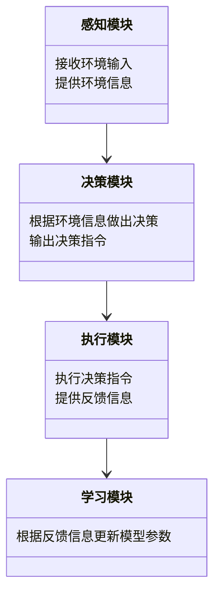

                 


# 深度元学习在AI Agent终身学习中的应用

> **关键词**：深度元学习，AI Agent，终身学习，机器学习，智能代理，自适应学习  
>
> **摘要**：本文探讨了深度元学习在AI Agent终身学习中的应用，分析了其核心概念、算法原理、系统架构，并通过实际案例展示了其在AI Agent中的应用，最后总结了最佳实践和未来研究方向。

---

## 第一部分: 深度元学习与AI Agent的背景介绍

### 第1章: 深度元学习概述

#### 1.1 深度元学习的基本概念
##### 1.1.1 元学习的定义与核心思想
元学习是一种机器学习范式，旨在通过学习如何学习来提高模型的适应性和泛化能力。其核心思想是通过训练模型在多个任务间进行迁移学习，从而减少对新任务的训练数据依赖。深度元学习则结合了深度学习和元学习的优势，利用深度神经网络的表示能力来实现元学习的目标。

##### 1.1.2 深度元学习的起源与发展
深度元学习的概念起源于2015年的Meta-Learning paper，其中提出了MAML（Meta-Automated Learning）算法。此后，深度元学习在自然语言处理、计算机视觉等领域得到了广泛应用，并逐渐扩展到AI Agent的终身学习场景。

##### 1.1.3 深度元学习的核心问题与挑战
深度元学习的核心问题是如何在有限的数据和任务中，快速适应新任务。其主要挑战包括：
1. **样本效率**：在小样本数据下实现高效学习。
2. **任务多样性**：处理不同类型和复杂度的任务。
3. **稳定性与收敛性**：确保模型在不同任务间的稳定性和快速收敛。

#### 1.2 AI Agent的基本概念
##### 1.2.1 AI Agent的定义与分类
AI Agent是一种智能代理，能够感知环境、自主决策并执行任务。根据智能水平，AI Agent可以分为反应式和认知式两类。反应式AI Agent基于当前感知做出决策，而认知式AI Agent具备推理、规划和学习能力。

##### 1.2.2 AI Agent的核心功能与特点
AI Agent的核心功能包括感知、决策、执行和学习。其特点在于能够通过与环境的交互，不断优化自身的行为策略，以实现目标。

##### 1.2.3 AI Agent在不同领域的应用实例
AI Agent在多个领域有广泛应用，如自动驾驶（决策路径规划）、智能助手（任务执行）和机器人控制（动作规划）等。

#### 1.3 深度元学习与AI Agent的结合
##### 1.3.1 深度元学习在AI Agent中的作用
深度元学习通过赋予AI Agent快速适应新任务的能力，使其能够在动态环境中持续优化行为策略。

##### 1.3.2 AI Agent终身学习的核心问题
AI Agent的终身学习问题在于如何在新任务中快速调整模型参数，以适应环境的变化。

##### 1.3.3 深度元学习如何解决AI Agent的终身学习问题
深度元学习通过元学习算法，帮助AI Agent在新任务中快速找到最优参数更新方向，从而实现高效学习。

---

### 第2章: 深度元学习的核心概念与原理

#### 2.1 元学习的数学模型
##### 2.1.1 元学习的数学表达式
元学习的目标是通过优化元损失函数，使得模型在多个任务间能够快速适应。其数学表达式为：
$$ L_{meta}(θ) = \sum_{i=1}^{N} L_i(θ) $$
其中，$θ$是模型参数，$N$是任务数量。

##### 2.1.2 元学习的优化目标与损失函数
元学习的优化目标是通过最小化元损失函数，使得模型在多个任务间具有良好的泛化能力。其损失函数通常包括任务损失和元损失两部分。

##### 2.1.3 元学习的算法框架与流程
元学习的典型流程包括任务采样、任务训练和元训练三个阶段。

#### 2.2 深度元学习的算法原理
##### 2.2.1 Meta 学习算法：MAML
MAML（Meta-Automated Learning）是一种经典的元学习算法，其核心思想是通过在多个任务间共享参数，使得模型能够快速适应新任务。其算法流程如下：

1. **初始化模型参数**：$θ^{(0)}$。
2. **任务采样**：随机采样多个任务。
3. **任务训练**：对每个任务，计算梯度并更新参数：
   $$ θ^{(1)} = θ^{(0)} + α \cdot ∇_θ L_i(θ^{(0)}) $$
4. **元训练**：通过优化元损失函数，更新模型参数：
   $$ θ^{(0)} = θ^{(0)} - β \cdot ∇_θ L_{meta}(θ^{(0)}) $$

其中，$α$和$β$是学习率，$L_i$是任务损失函数，$L_{meta}$是元损失函数。

##### 2.2.2 元学习算法的数学模型
MAML的数学模型可以表示为：
$$ θ^{(1)} = θ^{(0)} + α \cdot ∇_θ L_i(θ^{(0)}) $$
$$ θ^{(0)} = θ^{(0)} - β \cdot ∇_θ L_{meta}(θ^{(0)}) $$

---

#### 2.3 深度元学习的核心优势
##### 2.3.1 快速适应新任务
深度元学习通过共享参数，使得模型能够快速适应新任务，减少对新任务数据的需求。

##### 2.3.2 良好的泛化能力
深度元学习通过元学习算法，能够在多个任务间实现良好的泛化能力，减少过拟合的风险。

##### 2.3.3 高效的参数更新
深度元学习通过优化元损失函数，使得模型参数能够在多个任务间快速调整，提高学习效率。

---

## 第三部分: AI Agent的系统分析与架构设计

### 第3章: AI Agent的系统架构

#### 3.1 系统功能设计
##### 3.1.1 系统模块划分
AI Agent的系统模块包括感知模块、决策模块、执行模块和学习模块。

##### 3.1.2 模块间的关系
模块间的关系可以用Mermaid类图表示：



#### 3.2 系统架构设计
##### 3.2.1 系统架构的实现
AI Agent的系统架构可以分为感知层、决策层、执行层和学习层。

##### 3.2.2 系统架构的优化
通过优化模块间的通信和数据流，提高系统的整体性能。

#### 3.3 系统接口设计
##### 3.3.1 系统接口的定义
AI Agent的系统接口包括感知接口、决策接口、执行接口和学习接口。

##### 3.3.2 系统接口的实现
通过定义接口规范，确保系统各模块之间的兼容性和可扩展性。

---

### 第4章: AI Agent的实现与应用

#### 4.1 AI Agent的实现
##### 4.1.1 感知模块的实现
感知模块通过传感器或API接收环境输入，并将其转换为模型可处理的格式。

##### 4.1.2 决策模块的实现
决策模块基于感知信息，结合预设策略或学习得到的策略，做出决策。

##### 4.1.3 执行模块的实现
执行模块根据决策指令，调用外部接口或驱动，执行具体动作。

##### 4.1.4 学习模块的实现
学习模块通过元学习算法，根据反馈信息更新模型参数，实现自我优化。

#### 4.2 AI Agent的应用
##### 4.2.1 在自动驾驶中的应用
AI Agent可以用于自动驾驶中的路径规划和决策控制。

##### 4.2.2 在智能助手中的应用
AI Agent可以用于智能助手的任务管理和执行优化。

##### 4.2.3 在机器人控制中的应用
AI Agent可以用于机器人动作规划和任务执行。

---

## 第五部分: 深度元学习在AI Agent中的应用

### 第5章: 深度元学习在AI Agent中的应用

#### 5.1 深度元学习在AI Agent中的优势
##### 5.1.1 快速适应新任务
深度元学习能够快速适应新任务，减少对新任务数据的需求。

##### 5.1.2 良好的泛化能力
深度元学习能够在多个任务间实现良好的泛化能力，减少过拟合的风险。

##### 5.1.3 高效的参数更新
深度元学习通过优化元损失函数，能够在多个任务间快速调整模型参数。

#### 5.2 深度元学习在AI Agent中的实现
##### 5.2.1 元学习算法的选择
根据具体应用场景，选择适合的元学习算法，如MAML。

##### 5.2.2 模型参数的优化
通过优化模型参数，确保AI Agent能够在多个任务间快速适应。

##### 5.2.3 系统架构的优化
优化AI Agent的系统架构，提高系统的整体性能。

---

## 第六部分: 项目实战

### 第6章: 项目实战

#### 6.1 项目环境安装
##### 6.1.1 安装Python
安装Python 3.8及以上版本。

##### 6.1.2 安装深度学习库
安装TensorFlow或PyTorch框架。

##### 6.1.3 安装其他依赖库
安装numpy、pandas、scikit-learn等库。

#### 6.2 系统核心实现
##### 6.2.1 感知模块的实现
编写感知模块代码，接收环境输入并处理。

##### 6.2.2 决策模块的实现
编写决策模块代码，根据感知信息做出决策。

##### 6.2.3 执行模块的实现
编写执行模块代码，执行决策指令。

##### 6.2.4 学习模块的实现
编写学习模块代码，根据反馈信息更新模型参数。

#### 6.3 代码实现与解读
##### 6.3.1 感知模块代码
```python
class PerceiveModule:
    def __init__(self):
        pass

    def receive_input(self, input_data):
        return input_data
```

##### 6.3.2 决策模块代码
```python
class DecisionModule:
    def __init__(self):
        pass

    def make_decision(self, input_data):
        return 'action'
```

##### 6.3.3 执行模块代码
```python
class ExecuteModule:
    def __init__(self):
        pass

    def execute_action(self, action):
        return 'feedback'
```

##### 6.3.4 学习模块代码
```python
class LearningModule:
    def __init__(self):
        pass

    def update_parameters(self, feedback):
        pass
```

#### 6.4 案例分析与详细讲解
##### 6.4.1 案例分析
通过具体案例，展示深度元学习在AI Agent中的应用。

##### 6.4.2 详细讲解
详细讲解案例中的每个步骤，分析其优缺点。

---

## 第七部分: 最佳实践与总结

### 第7章: 最佳实践

#### 7.1 总结
深度元学习在AI Agent终身学习中的应用具有重要意义。通过元学习算法，AI Agent能够在多个任务间快速适应，减少对新任务数据的需求，提高学习效率和泛化能力。

#### 7.2 注意事项
在实际应用中，需要注意以下几点：
1. **数据多样性**：确保训练数据的多样性，以提高模型的泛化能力。
2. **任务相关性**：选择与目标任务相关的训练任务，以提高学习效果。
3. **模型复杂度**：避免模型过于复杂，以防止过拟合。

#### 7.3 拓展阅读
建议读者进一步阅读以下内容：
1. MAML算法的论文。
2. 深度元学习在自然语言处理中的应用。
3. AI Agent在自动驾驶中的应用。

---

**作者：AI天才研究院/AI Genius Institute & 禅与计算机程序设计艺术 /Zen And The Art of Computer Programming**  
**邮箱：contact@aitianjiayanli.com**  
**转载请注明出处**

---

