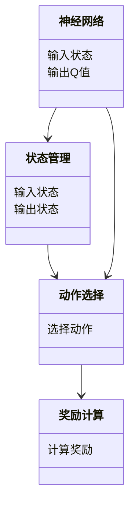

                 


# 深度强化学习在AI Agent决策优化中的应用

> 关键词：深度强化学习，AI Agent，决策优化，强化学习算法，智能体，马尔可夫决策过程

> 摘要：深度强化学习（Deep Reinforcement Learning）作为一种结合了深度学习和强化学习的新兴技术，正在迅速改变人工智能领域。本文将详细介绍深度强化学习在AI Agent决策优化中的应用，涵盖从理论基础到实际应用的各个方面，包括核心算法、系统架构设计、项目实战以及未来发展方向。

---

## 第1章: 深度强化学习与AI Agent概述

### 1.1 深度强化学习的基本概念

深度强化学习是人工智能领域的一个重要分支，结合了深度学习和强化学习的优势。它通过神经网络来逼近复杂的策略或值函数，从而在动态环境中做出最优决策。

#### 1.1.1 强化学习的定义与特点
- **强化学习**：通过智能体与环境交互，智能体通过试错的方式学习策略，以最大化累积奖励。
- **特点**：
  - 延迟反馈：奖励通常在多个步骤后才给出。
  - 动态环境：环境状态和奖励可能随时间变化。
  - 高维状态空间：深度学习擅长处理高维数据。

#### 1.1.2 AI Agent的定义与分类
- **AI Agent**：能够感知环境并采取行动以实现目标的智能实体。
- **分类**：
  - 单智能体与多智能体。
  - 基于模型与无模型。
  - 行为决策型与价值评估型。

#### 1.1.3 深度强化学习的核心思想
- 将强化学习与深度学习结合，利用神经网络直接逼近策略或值函数。
- 通过端到端的学习方式，处理高维复杂状态空间。

### 1.2 深度强化学习与传统机器学习的对比

| 对比维度       | 传统机器学习          | 深度强化学习          |
|----------------|-----------------------|-----------------------|
| 数据需求       | 需要大量标注数据       | 数据可在线生成         |
| 任务类型       | 监督学习               | 强化学习，注重交互与奖励|
| 决策方式       | 预测型                | 行动决策型             |
| 环境复杂度     | 低维或结构化           | 高维或非结构化         |

### 1.3 深度强化学习的应用场景

#### 1.3.1 游戏AI与智能体控制
- 在游戏如《星际争霸》中，深度强化学习帮助AI实现复杂的策略决策。
- 在机器人控制中，DRL用于实时路径规划和动作选择。

#### 1.3.2 机器人决策与自主导航
- 自主导航中的路径规划和避障问题。
- 多机器人协作中的任务分配与协调。

#### 1.3.3 推荐系统与动态优化
- 动态推荐系统中，DRL用于实时优化推荐策略。
- 在金融交易中，用于实时决策和风险控制。

### 1.4 本章小结

深度强化学习结合了深度学习的特征提取能力和强化学习的决策优化能力，为AI Agent提供了强大的工具。其在游戏、机器人和推荐系统中的广泛应用，展现了其巨大的潜力。

---

## 第2章: 强化学习的基本原理

### 2.1 马尔可夫决策过程（MDP）

#### 2.1.1 MDP的定义
- **状态空间**（S）：环境中的可能状态集合。
- **动作空间**（A）：智能体在每个状态可执行的动作集合。
- **转移概率**（P）：从当前状态执行某个动作后转移到下一个状态的概率。
- **奖励函数**（R）：智能体执行动作后获得的奖励。

#### 2.1.2 动作与奖励的定义
- **动作**：智能体在特定状态下的决策。
- **奖励**：智能体行为的反馈，指导优化方向。

#### 2.1.3 动态规划与策略评估
- **动态规划**：通过迭代计算值函数，评估当前策略的优劣。
- **策略评估**：计算在特定策略下的值函数。

### 2.2 深度强化学习的核心算法

#### 2.2.1 Q-Learning算法
- **定义**：基于值函数的强化学习算法。
- **更新规则**：
$$ Q(s,a) = Q(s,a) + \alpha (r + \gamma \max Q(s',a') - Q(s,a)) $$
- **优缺点**：
  - 优点：简单、稳定。
  - 缺点：收敛速度慢、无法处理高维状态。

#### 2.2.2 Deep Q-Networks（DQN）
- **网络结构**：
  - 输入：状态s。
  - 输出：Q值，表示动作a的期望奖励。
- **损失函数**：
$$ \text{损失函数} = \mathbb{E}[(r + \gamma Q(s',a') - Q(s,a))^2] $$

#### 2.2.3 策略梯度方法（PG）
- **核心思想**：直接优化策略，通过梯度上升方法更新参数。
- **优缺点**：
  - 优点：适合处理高维状态空间。
  - 缺点：计算复杂度高。

### 2.3 深度强化学习的数学模型

#### 2.3.1 Q-Learning的数学公式
$$ Q(s,a) = Q(s,a) + \alpha (r + \gamma \max Q(s',a') - Q(s,a)) $$

#### 2.3.2 DQN的网络结构与损失函数
- 输入：状态s。
- 输出：Q值。
- 损失函数：
$$ \text{损失函数} = \mathbb{E}[(r + \gamma Q(s',a') - Q(s,a))^2] $$

### 2.4 本章小结

强化学习通过定义明确的目标函数，提供了从试错中学习的能力。深度强化学习通过神经网络的强大表达能力，解决了传统强化学习在高维状态空间中的局限性。

---

## 第3章: 基于深度强化学习的决策优化方法

### 3.1 值函数与策略优化

#### 3.1.1 值函数的深度网络实现
- 使用神经网络近似值函数，通过梯度下降优化。
- 示例：DQN中的深度神经网络。

#### 3.1.2 策略梯度方法的优缺点
- **优点**：直接优化策略，适用于高维状态空间。
- **缺点**：计算复杂度高，收敛速度慢。

#### 3.1.3 Actor-Critic架构的原理
- **Actor**：负责选择动作。
- **Critic**：评估当前动作的Q值。
- 结合两者，实现策略优化。

### 3.2 深度强化学习在AI Agent中的应用

#### 3.2.1 多智能体协作
- **挑战**：多个智能体之间的协调与合作。
- **解决方案**：使用多智能体强化学习算法，如分布式价值分解（Distributed Value Decomposition）。

#### 3.2.2 人机协作
- **挑战**：人类与机器的交互与协调。
- **解决方案**：结合人类反馈的强化学习方法，如Inverse Reinforcement Learning。

### 3.3 本章小结

深度强化学习通过多种算法实现AI Agent的决策优化，其中Actor-Critic架构和多智能体强化学习是当前研究的热点。

---

## 第4章: AI Agent的系统架构设计

### 4.1 问题场景介绍
- **智能客服对话系统**：通过自然语言处理与深度强化学习结合，实现智能对话。

### 4.2 系统功能设计
- **领域模型**：用Mermaid类图展示系统功能模块。



### 4.3 系统架构设计
- **系统架构图**：用Mermaid架构图展示整体结构。

```mermaid
[系统架构图]
```

### 4.4 系统接口设计
- **输入接口**：接收环境状态。
- **输出接口**：输出动作或决策。

### 4.5 本章小结

系统架构设计是实现深度强化学习在AI Agent中的关键步骤，合理的架构设计能够提高系统的可扩展性和可维护性。

---

## 第5章: 项目实战

### 5.1 智能客服对话系统

#### 5.1.1 环境配置
- 安装Python、TensorFlow、OpenAI Gym等库。

#### 5.1.2 核心代码实现
```python
import numpy as np
import tensorflow as tf

class DQN:
    def __init__(self, state_space, action_space):
        self.state_space = state_space
        self.action_space = action_space
        self.model = self.build_model()
        self.memory = []
    
    def build_model(self):
        model = tf.keras.Sequential([
            tf.keras.layers.Dense(64, activation='relu'),
            tf.keras.layers.Dense(32, activation='relu'),
            tf.keras.layers.Dense(self.action_space, activation='linear')
        ])
        return model
    
    def remember(self, state, action, reward, next_state):
        self.memory.append((state, action, reward, next_state))
    
    def act(self, state):
        q_values = self.model.predict(state)
        return np.argmax(q_values[0])
    
    def replay(self, batch_size):
        batch = np.random.choice(len(self.memory), batch_size)
        for i in batch:
            state, action, reward, next_state = self.memory[i]
            target = self.model.predict(state)
            target[0][action] = reward + gamma * np.max(self.model.predict(next_state)[0])
            self.model.fit(state, target, epochs=1, verbose=0)
```

#### 5.1.3 系统测试与优化
- 测试系统在不同场景下的表现。
- 优化网络结构和超参数。

### 5.2 本章小结

通过项目实战，读者可以理解深度强化学习在实际系统中的应用，掌握从环境配置到代码实现的全过程。

---

## 第6章: 总结与展望

### 6.1 总结
- 深度强化学习在AI Agent中的应用广泛且高效。
- 通过结合深度学习和强化学习，解决了传统方法在复杂环境中的局限性。

### 6.2 未来展望
- **多智能体协作**：研究如何在多智能体环境中实现高效协作。
- **人机协作**：探索人类与机器协同决策的新方法。
- **实时决策优化**：提升系统在动态环境中的实时决策能力。

### 6.3 最佳实践 Tips
- **数据质量**：确保训练数据的多样性和代表性。
- **算法选择**：根据具体问题选择合适的深度强化学习算法。
- **系统设计**：注重系统架构的可扩展性和可维护性。

---

## 作者：AI天才研究院 & 禅与计算机程序设计艺术

通过本文，读者可以全面了解深度强化学习在AI Agent决策优化中的应用，从理论到实践，从算法到系统设计，逐步掌握这一领域的核心内容。

