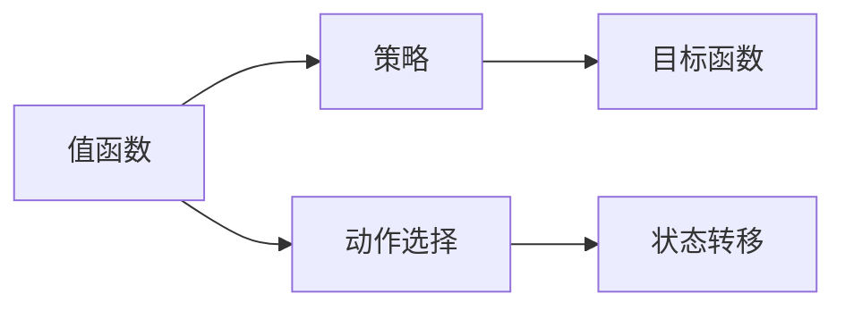
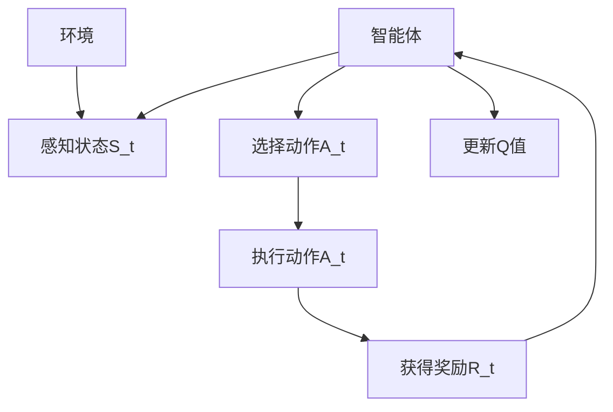
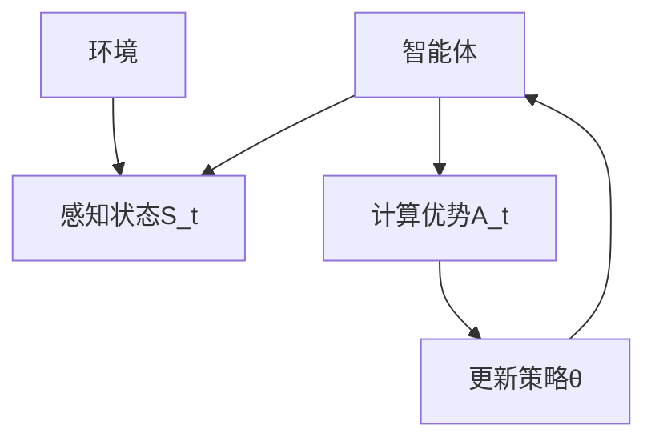
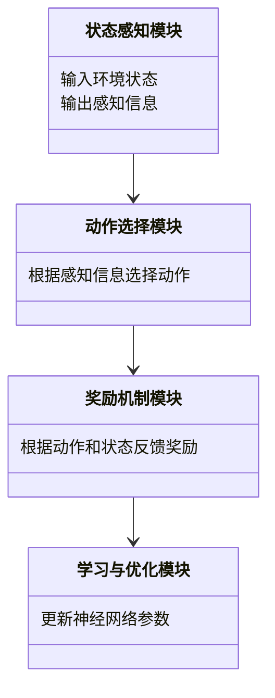
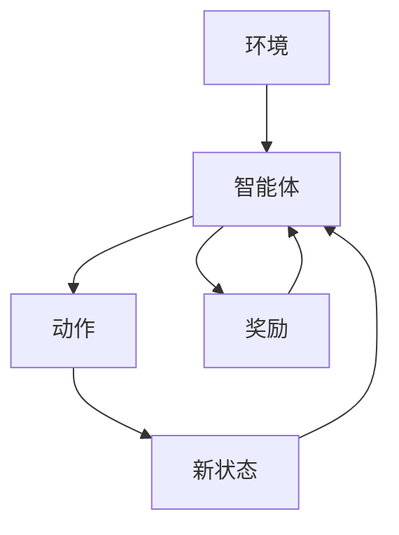
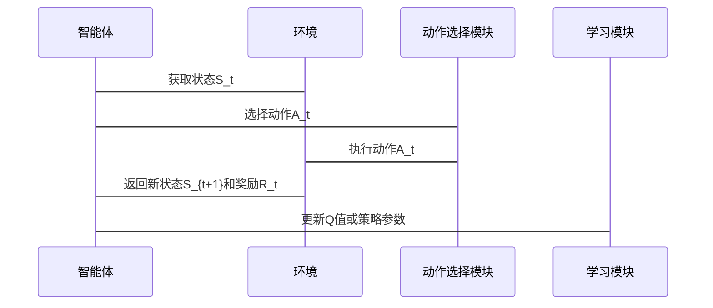

                 


# 深度强化学习在AI Agent长期规划中的应用

## 关键词：深度强化学习，AI Agent，长期规划，强化学习算法，系统架构设计，项目实战

## 摘要：本文探讨深度强化学习在AI Agent长期规划中的应用，涵盖核心概念、算法原理、系统设计和项目实现，分析其在复杂决策问题中的优势，结合实际案例，总结经验教训，展望未来发展方向。

---

# 第一部分：深度强化学习与AI Agent的背景介绍

# 第1章：深度强化学习概述

## 1.1 深度强化学习的定义与特点

### 1.1.1 深度强化学习的定义

深度强化学习（Deep Reinforcement Learning，Deep RL）结合了深度学习和强化学习的优势，通过神经网络处理高维状态空间，学习策略或值函数。

### 1.1.2 深度强化学习的核心特点

| 特点 | 描述 |
|------|------|
| 高维状态处理 | 神经网络处理高维输入 |
| 强化学习框架 | 通过奖励机制优化策略 |
| 连续控制 | 处理连续动作空间 |
| 自适应学习 | 在动态环境中自适应调整 |

### 1.1.3 深度强化学习与传统强化学习的区别

表格对比：

| 属性           | 传统RL                     | 深度RL                     |
|----------------|----------------------------|----------------------------|
| 状态空间        | 低维或结构化               | 高维或非结构化             |
| 处理方式        | 特征提取                   | 神经网络直接处理           |
| 应用场景        | 简单环境                   | 复杂现实环境               |

---

## 1.2 AI Agent的长期规划问题

### 1.2.1 AI Agent的基本概念

AI Agent：智能体，具备感知环境、决策、执行动作的能力，分为简单反射型、基于模型型、目标驱动型和实用驱动型。

### 1.2.2 长期规划问题的定义

长期规划：智能体在动态环境中，通过序列决策实现长期目标，涉及多步推理和全局规划，避免短视行为。

### 1.2.3 深度强化学习在长期规划中的应用

- 复杂环境建模
- 多步推理
- 全局优化

---

# 第2章：核心概念与联系

## 2.1 深度强化学习的核心概念

### 2.1.1 值函数与策略

| 概念       | 定义                             | 作用                         |
|------------|----------------------------------|------------------------------|
| 值函数     | 状态或动作的期望收益           | 指导策略选择最优动作         |
| 策略       | 动作选择的概率分布             | 实现目标驱动的决策           |

### 2.1.2 探索与利用

| 概念       | 定义                             | 目的                         |
|------------|----------------------------------|------------------------------|
| 探索       | 尝试未访问或次优的动作           | 避免陷入局部最优             |
| 利用       | 选择当前最优的动作               | 最大化累积奖励               |

### 2.1.3 重要概念之间的关系

Mermaid图：



---

## 2.2 长期规划与深度强化学习的关系

| 关系维度     | 长期规划                     | 深度强化学习                 |
|--------------|----------------------------|----------------------------|
| 优化目标     | 长期目标                     | 即时奖励最大化               |
| 决策方式     | 全局优化                     | 局部优化                     |
| 适用场景     | 复杂动态环境                 | 离散或连续动作空间           |

---

# 第3章：算法原理讲解

## 3.1 DQN算法

### 3.1.1 DQN算法的基本原理

- 使用两个神经网络：主网络和目标网络
- 经验回放：存储历史经验，随机采样训练
- 探索与利用：平衡探索新动作和利用当前最优动作

### 3.1.2 DQN算法的数学模型

经验回放缓冲区：

$$ S_t, A_t, R_t, S_{t+1} $$

损失函数：

$$ L = \mathbb{E}[(r + \gamma Q(S_{t+1}, A')) - Q(S_t, A)]^2 $$

### 3.1.3 DQN算法流程图



---

## 3.2 PPO算法

### 3.2.1 PPO算法的基本原理

- 使用策略梯度方法
- 允许策略在一定范围内变化
- 分离旧策略和新策略，计算比值优势

### 3.2.2 PPO算法的数学模型

策略更新：

$$ J(\theta) = \mathbb{E}[\text{min}(r_t, \hat{r}_t)] $$

其中，$\hat{r}_t = r_t + \beta A_t$

### 3.2.3 PPO算法流程图



---

# 第4章：系统分析与架构设计方案

## 4.1 项目介绍

### 4.1.1 项目背景

智能体在复杂环境中进行长期规划，如自动驾驶、机器人控制等。

### 4.1.2 项目目标

实现一个基于深度强化学习的AI Agent，具备长期规划能力。

## 4.2 系统功能设计

### 4.2.1 功能模块

- 状态感知模块
- 动作选择模块
- 奖励机制模块
- 学习与优化模块

### 4.2.2 功能模块类图



## 4.3 系统架构设计

### 4.3.1 系统架构图



## 4.4 系统交互设计

### 4.4.1 系统交互流程



---

# 第5章：项目实战

## 5.1 环境配置与安装

- 使用OpenAI Gym环境
- 安装必要的Python库：numpy、tensorflow、keras、gym

## 5.2 核心代码实现

### 5.2.1 DQN实现代码

```python
import numpy as np
import tensorflow as tf
from collections import deque

class DQNAgent:
    def __init__(self, state_space, action_space, epsilon=1.0, gamma=0.99, lr=0.001):
        self.state_space = state_space
        self.action_space = action_space
        self.epsilon = epsilon
        self.gamma = gamma
        self.lr = lr
        
        # 神经网络模型
        self.model = self.build_model()
        self.target_model = self.build_model()
        
    def build_model(self):
        model = tf.keras.Sequential([
            tf.keras.layers.Dense(24, activation='relu', input_shape=(self.state_space,)),
            tf.keras.layers.Dense(24, activation='relu'),
            tf.keras.layers.Dense(self.action_space, activation='linear')
        ])
        model.compile(optimizer=tf.keras.optimizers.Adam(self.lr), loss='mse')
        return model
    
    def act(self, state):
        if np.random.random() < self.epsilon:
            return np.random.randint(0, self.action_space)
        q_values = self.model.predict(np.array([state]))
        return np.argmax(q_values[0])
    
    def remember(self, state, action, reward, next_state):
        self.memory.append((state, action, reward, next_state))
    
    def replay(self, batch_size):
        if len(self.memory) < batch_size:
            return
        minibatch = random.sample(self.memory, batch_size)
        states = np.array([t[0] for t in minibatch])
        actions = np.array([t[1] for t in minibatch])
        rewards = np.array([t[2] for t in minibatch])
        next_states = np.array([t[3] for t in minibatch])
        
        target = self.target_model.predict(next_states)
        target_q = rewards + self.gamma * np.argmax(target, axis=1)
        target_q = target_q.reshape(-1, 1)
        
        self.model.fit(states, target_q, epochs=1, verbose=0)
    
    def update_target_model(self):
        self.target_model.set_weights(self.model.get_weights())
```

### 5.2.2 系统测试与结果分析

- 训练过程中的奖励曲线
- 最终策略的稳定性测试
- 系统在不同环境下的适应性分析

## 5.3 案例分析

### 5.3.1 实际案例

自动驾驶中的路径规划问题，使用DQN算法进行长期规划，优化路径选择和避障策略。

### 5.3.2 实验结果

- 收敛速度分析
- 策略稳定性测试
- 环境适应性评估

---

# 第6章：总结与展望

## 6.1 全文总结

深度强化学习在AI Agent的长期规划中展现了强大的能力，通过神经网络处理复杂环境，结合多步推理和全局优化，显著提升了决策系统的性能和稳定性。

## 6.2 未来展望

### 6.2.1 研究方向

- 更高效的算法设计
- 多智能体协作优化
- 跨模态学习与人机交互

### 6.2.2 技术发展趋势

- 算法的实时性和效率提升
- 系统的可解释性和透明性增强
- 多模态数据的融合应用

## 6.3 注意事项与建议

- 合理设计奖励机制，避免误导性奖励
- 系统测试要全面，确保算法的鲁棒性
- 注重数据安全和隐私保护

---

作者：AI天才研究院/AI Genius Institute & 禅与计算机程序设计艺术 /Zen And The Art of Computer Programming

---

# 结束语

深度强化学习在AI Agent的长期规划中具有广阔的应用前景，通过不断的研究和实践，我们有望在复杂决策问题中实现更高效的解决方案，推动人工智能技术的进一步发展。

