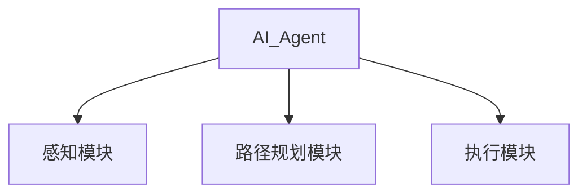
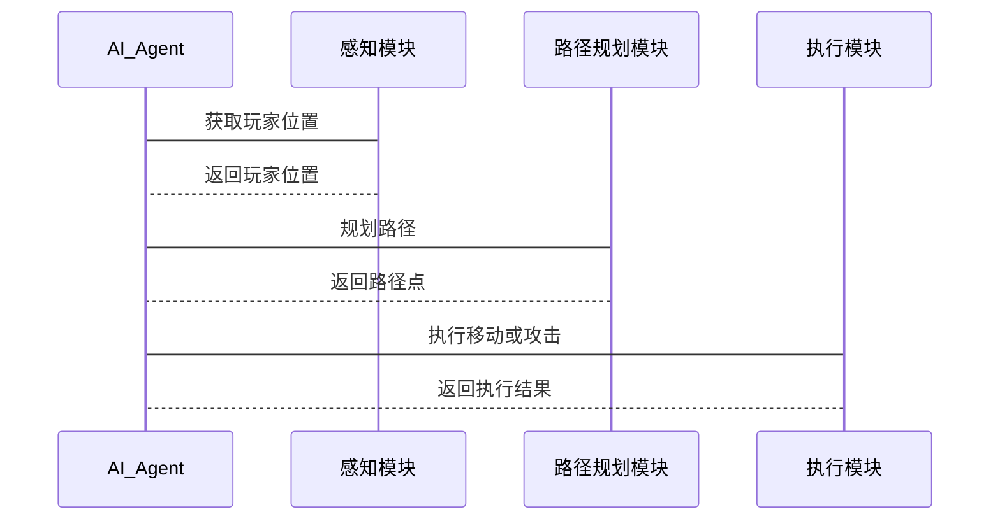

                 


# 游戏开发中的AI Agent非玩家角色

> 关键词：游戏AI Agent，非玩家角色，智能体，行为树，路径规划，数学模型

> 摘要：本文将深入探讨游戏开发中的AI Agent非玩家角色（NPC）的核心概念、算法原理、系统设计与实现。通过分析AI Agent的行为模型、决策机制、环境感知等关键问题，结合实际案例，详细讲解如何设计和实现具备智能行为的NPC。文章内容涵盖从基础概念到高级算法，从系统架构到项目实战的完整流程，旨在帮助读者全面掌握游戏AI Agent的开发技术。

---

# 第一部分: 游戏开发中的AI Agent非玩家角色概述

## 第1章: 游戏AI Agent的基本概念

### 1.1 游戏AI Agent的定义与作用

#### 1.1.1 游戏AI Agent的定义
游戏AI Agent（Artificial Intelligence Agent）是非玩家角色（NPC）的核心技术，是指在游戏环境中能够自主决策、执行任务、与玩家互动的智能体。它通过感知游戏环境和玩家行为，做出相应的反应，从而提升游戏的沉浸感和可玩性。

#### 1.1.2 游戏中AI Agent的作用
- 提供游戏互动性：NPC通过与玩家的交互，增强游戏的趣味性和挑战性。
- 增加游戏复杂性：通过复杂的决策逻辑，让NPC的行为更加多样化和不可预测。
- 降低开发成本：AI Agent可以通过预设规则和算法，减少手动编写脚本的工作量。

#### 1.1.3 游戏AI Agent的分类
- **基于规则的AI Agent**：通过预设的规则和条件判断进行行为决策。
- **基于状态的AI Agent**：根据当前状态和触发条件切换行为模式。
- **基于目标的AI Agent**：通过设定目标，自主规划路径和行为。
- **基于学习的AI Agent**：通过机器学习算法，从经验中学习优化行为。

### 1.2 游戏AI Agent的核心属性

#### 1.2.1 智能性
AI Agent需要具备一定的智能性，能够根据环境变化和玩家行为做出合理的反应。

#### 1.2.2 行为驱动
AI Agent的行为驱动是其决策的核心，包括任务驱动、目标驱动和事件驱动。

#### 1.2.3 环境感知
AI Agent需要感知游戏环境中的关键信息，如玩家位置、障碍物、目标位置等，从而做出合理的决策。

### 1.3 游戏AI Agent的发展历程

#### 1.3.1 从简单逻辑到复杂AI的演变
早期的NPC行为简单，基于规则和状态机实现。随着技术的进步，AI Agent逐渐引入了更复杂的算法，如行为树、路径规划、机器学习等。

#### 1.3.2 现代游戏AI的特征
- 行为多样化：NPC能够根据环境和玩家行为动态调整策略。
- 知识表示：通过知识库和规则引擎，实现更复杂的决策逻辑。
- 实时性：AI Agent能够在游戏运行时实时响应，提供流畅的互动体验。

#### 1.3.3 游戏AI Agent的未来趋势
- 更加智能化：引入强化学习、深度学习等技术，提升NPC的自主决策能力。
- 多智能体协作：多个AI Agent协同工作，模拟更真实的社会行为。
- 环境适应性：AI Agent能够根据不同的游戏环境和玩家行为动态调整策略。

### 1.4 本章小结
本章从基本概念、核心属性和发展历程三个方面，介绍了游戏AI Agent的定义、作用和分类。通过分析，我们明确了AI Agent在游戏开发中的重要性，以及其未来的发展趋势。

---

## 第2章: 游戏AI Agent的核心概念

### 2.1 智能体的结构与功能

#### 2.1.1 智能体的组成要素
AI Agent的结构通常包括感知模块、决策模块和执行模块。

- **感知模块**：负责获取游戏环境中的信息，如玩家位置、目标位置、障碍物等。
- **决策模块**：根据感知到的信息，结合预设规则或算法，制定行为策略。
- **执行模块**：将决策结果转化为具体的行为动作，如移动、攻击、对话等。

#### 2.1.2 智能体的感知与行动
AI Agent需要通过感知模块获取环境信息，并通过执行模块对外界产生影响。感知和行动是智能体与环境交互的核心环节。

#### 2.1.3 智能体的决策机制
决策机制是AI Agent的核心，包括基于规则的决策、基于状态的决策和基于目标的决策。

---

### 2.2 游戏AI Agent的行为模型

#### 2.2.1 基于规则的行为模型
基于规则的行为模型通过预设的规则和条件判断来决定AI Agent的行为。例如，当玩家靠近时，AI Agent会触发“攻击”规则。

- 优点：简单易懂，实现成本低。
- 缺点：规则复杂时，维护成本高，且难以应对非预期的情况。

#### 2.2.2 基于状态的行为模型
基于状态的行为模型通过状态机实现，AI Agent根据当前状态和触发条件切换行为模式。

- 优点：能够处理复杂的行为逻辑，且状态之间的切换清晰明确。
- 缺点：状态机设计复杂，且难以扩展。

#### 2.2.3 基于目标的行为模型
基于目标的行为模型通过设定目标，自主规划路径和行为。例如，AI Agent的目标是追捕玩家，路径规划算法（如A*算法）用于找到最优路径。

- 优点：能够实现自主决策，适应性强。
- 缺点：目标设定和路径规划需要复杂的算法实现。

---

### 2.3 游戏AI Agent与环境的交互

#### 2.3.1 环境建模
环境建模是AI Agent感知环境的基础，通常包括地图信息、障碍物、目标位置等。

#### 2.3.2 行为规划
行为规划是AI Agent根据环境信息和目标，制定具体的行为策略。例如，AI Agent需要规划路径避开障碍物，同时靠近玩家。

#### 2.3.3 实时反馈与调整
AI Agent需要根据实时的环境变化和玩家行为，动态调整策略。例如，当玩家移动时，AI Agent需要实时更新路径规划。

---

## 第3章: 游戏AI Agent的算法原理

### 3.1 基于规则的AI Agent算法

#### 3.1.1 规则的定义与实现
基于规则的AI Agent通过预设的规则和条件判断来决定行为。例如，当玩家进入攻击范围时，AI Agent触发“攻击”规则。

#### 3.1.2 规则的优缺点分析
- 优点：简单易懂，实现成本低。
- 缺点：规则复杂时，维护成本高，且难以应对非预期的情况。

#### 3.1.3 规则在游戏中的应用案例
例如，在MOBA游戏中，AI Agent可以通过规则判断玩家的位置和行为，决定是否进行协助攻击或撤退。

---

### 3.2 基于状态的AI Agent算法

#### 3.2.1 状态机的定义与实现
基于状态的AI Agent通过状态机实现，AI Agent根据当前状态和触发条件切换行为模式。

#### 3.2.2 状态机的优缺点分析
- 优点：能够处理复杂的行为逻辑，且状态之间的切换清晰明确。
- 缺点：状态机设计复杂，且难以扩展。

#### 3.2.3 状态机在游戏中的应用案例
例如，在RPG游戏中，AI Agent可以根据玩家的行为切换“巡逻”、“战斗”、“逃跑”等状态。

---

### 3.3 基于目标的AI Agent算法

#### 3.3.1 目标驱动的行为模型
基于目标的AI Agent通过设定目标，自主规划路径和行为。例如，AI Agent的目标是追捕玩家，路径规划算法（如A*算法）用于找到最优路径。

#### 3.3.2 目标驱动的优缺点分析
- 优点：能够实现自主决策，适应性强。
- 缺点：目标设定和路径规划需要复杂的算法实现。

#### 3.3.3 目标驱动在游戏中的应用案例
例如，在 FPS 游戏中，AI Agent可以通过设定“追捕玩家”的目标，利用A*算法规划路径，避开障碍物，同时靠近玩家。

---

## 第4章: 游戏AI Agent的数学模型与公式

### 4.1 概率论与随机行为

#### 4.1.1 概率论的基本概念
概率论是AI Agent实现随机行为的重要工具。例如，AI Agent可以通过概率选择不同的行为模式，增加行为的多样性。

#### 4.1.2 概率分布的数学模型
- 均匀分布：每个行为的概率相同。
- 正态分布：行为概率呈钟型曲线。

#### 4.1.3 概率论在游戏中的应用案例
例如，在RPG游戏中，AI Agent可以通过概率选择不同的对话选项，增加互动的多样性。

---

### 4.2 路径规划算法

#### 4.2.1 A*算法的基本原理
A*算法是一种常见的路径规划算法，通过评估节点的优先级，找到从起点到终点的最短路径。

#### 4.2.2 A*算法的数学模型
- **f(n)**：评估函数，表示从起点到终点的总成本。
- **g(n)**：从起点到节点n的实际成本。
- **h(n)**：从节点n到终点的估算成本。

#### 4.2.3 A*算法的实现步骤
1. 初始化优先队列，将起点加入队列。
2. 取出队列中优先级最高的节点，评估其邻居节点。
3. 将邻居节点加入队列，直到找到终点。

#### 4.2.4 A*算法在游戏中的应用案例
例如，在RPG游戏中，AI Agent可以通过A*算法规划路径，避开障碍物，找到最优路径。

---

### 4.3 机器学习与强化学习

#### 4.3.1 机器学习的基本概念
机器学习是一种通过数据训练模型，实现预测和分类的技术。例如，AI Agent可以通过机器学习模型预测玩家的行为，调整自己的策略。

#### 4.3.2 强化学习的基本概念
强化学习是一种通过奖励机制，优化决策策略的技术。例如，AI Agent可以通过强化学习，根据玩家的行为调整自己的策略。

#### 4.3.3 机器学习与强化学习在游戏中的应用案例
例如，在MOBA游戏中，AI Agent可以通过强化学习，根据玩家的行为调整自己的策略，实现更智能的决策。

---

## 第5章: 游戏AI Agent的系统分析与架构设计

### 5.1 问题场景介绍

#### 5.1.1 项目介绍
本项目旨在设计一个具备智能行为的AI Agent，应用于RPG游戏中的战斗NPC。

#### 5.1.2 问题场景
- NPC需要根据玩家的行为，动态调整自己的策略。
- NPC需要具备路径规划能力，避开障碍物，追捕玩家。

### 5.2 系统功能设计

#### 5.2.1 领域模型
领域模型是系统设计的核心，明确了系统的需求和功能。例如，AI Agent需要具备感知玩家位置、规划路径、执行攻击等核心功能。

#### 5.2.2 系统架构设计
系统架构设计通过模块化的方式，明确各个模块的功能和交互。例如，AI Agent模块负责决策和执行，感知模块负责获取玩家位置，路径规划模块负责规划路径。

#### 5.2.3 系统架构图


### 5.3 系统接口设计

#### 5.3.1 系统接口
- 感知接口：获取玩家位置、障碍物信息。
- 路径规划接口：规划路径，返回路径点。
- 执行接口：根据路径点，执行移动或攻击行为。

#### 5.3.2 系统交互流程


---

## 第6章: 游戏AI Agent的项目实战

### 6.1 环境配置

#### 6.1.1 开发环境
- 操作系统：Windows 10
- 开发工具：PyCharm
- 游戏引擎：Unity 3D
- AI框架：Python的AI库（如scipy、numpy）

### 6.2 核心实现

#### 6.2.1 AI Agent的核心代码实现
```python
import heapq

class Node:
    def __init__(self, x, y):
        self.x = x
        self.y = y
        self.cost = 0
        self.parent = None

def a_star_search(start, end, obstacles):
    open_heap = []
    heapq.heappush(open_heap, (0, start))
    start.cost = 0
    visited = set()

    while open_heap:
        current_cost, current_node = heapq.heappop(open_heap)
        if current_node in visited:
            continue
        visited.add(current_node)

        if current_node == end:
            return reconstruct_path(current_node)

        for neighbor in get_neighbors(current_node):
            new_cost = current_cost + 1
            if neighbor not in visited:
                neighbor.cost = new_cost
                heapq.heappush(open_heap, (new_cost, neighbor))
                neighbor.parent = current_node

    return None

def get_neighbors(node):
    neighbors = []
    # 假设网格是二维的，邻居包括上下左右四个方向
    directions = [(0, 1), (1, 0), (0, -1), (-1, 0)]
    for dx, dy in directions:
        x = node.x + dx
        y = node.y + dy
        neighbor = Node(x, y)
        if (x, y) not in obstacles:
            neighbors.append(neighbor)
    return neighbors

def reconstruct_path(end_node):
    path = []
    current = end_node
    while current is not None:
        path.append((current.x, current.y))
        current = current.parent
    return path[::-1]
```

#### 6.2.2 游戏引擎中的实现
在Unity 3D中，通过编写脚本实现AI Agent的行为逻辑。例如，AI Agent可以通过脚本获取玩家位置，调用路径规划算法，规划路径，并通过动画系统执行移动或攻击行为。

### 6.3 案例分析与详细解读

#### 6.3.1 项目小结
通过本项目，我们实现了具备智能行为的AI Agent，能够根据玩家的行为动态调整策略，并通过路径规划算法实现自主移动。这为后续的游戏AI Agent开发奠定了基础。

---

## 第7章: 游戏AI Agent的优化与扩展

### 7.1 性能优化

#### 7.1.1 算法优化
通过优化路径规划算法，减少计算量，提高运行效率。例如，采用启发式搜索，减少不必要的节点扩展。

#### 7.1.2 并行计算
通过并行计算技术，提升AI Agent的运行效率。例如，利用多核处理器，实现并行路径规划。

### 7.2 多智能体协作

#### 7.2.1 多智能体协作的定义
多智能体协作是指多个AI Agent协同工作，共同完成任务。例如，在MMORPG游戏中，多个AI Agent可以协同攻击玩家。

#### 7.2.2 多智能体协作的实现
通过分布式计算和通信机制，实现多智能体之间的协作。例如，AI Agent之间可以通过消息队列进行通信，协调行为。

### 7.3 其他技术的结合

#### 7.3.1 VR与AI Agent
通过虚拟现实技术，实现更加沉浸式的AI Agent互动体验。例如，AI Agent可以通过手势和表情，与玩家进行更自然的互动。

#### 7.3.2 云游戏与AI Agent
通过云游戏技术，实现AI Agent的远程渲染和计算。例如，AI Agent可以通过云端服务器，实现实时的路径规划和行为决策。

### 7.4 最佳实践 Tips

- **模块化设计**：通过模块化设计，提高系统的可维护性和扩展性。
- **性能优化**：通过算法优化和并行计算，提升系统的运行效率。
- **测试与调试**：通过详细的测试和调试，确保AI Agent的行为符合预期。

---

## 第8章: 游戏AI Agent的总结与展望

### 8.1 本章总结
本文从游戏AI Agent的基本概念、算法原理、系统设计、项目实战等多个方面，全面探讨了游戏AI Agent的核心技术。通过分析，我们明确了AI Agent在游戏开发中的重要性，以及其未来的发展趋势。

### 8.2 未来展望
随着技术的进步，游戏AI Agent将更加智能化和多样化。未来的研究方向包括：
- 更加复杂的AI算法，如强化学习、深度学习。
- 多智能体协作，实现更复杂的社会行为。
- VR与云游戏的结合，提供更加沉浸式的互动体验。

---

## 作者：AI天才研究院/AI Genius Institute & 禅与计算机程序设计艺术 /Zen And The Art of Computer Programming

---

以上是《游戏开发中的AI Agent非玩家角色》的技术博客文章的完整目录和内容概要。

