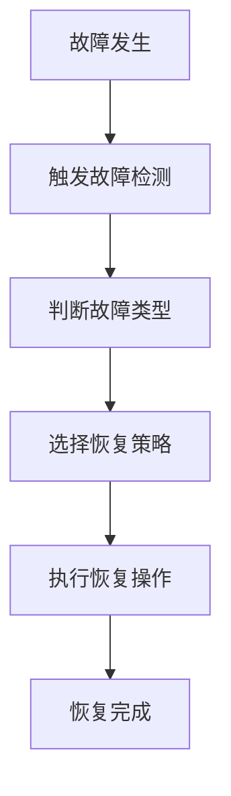
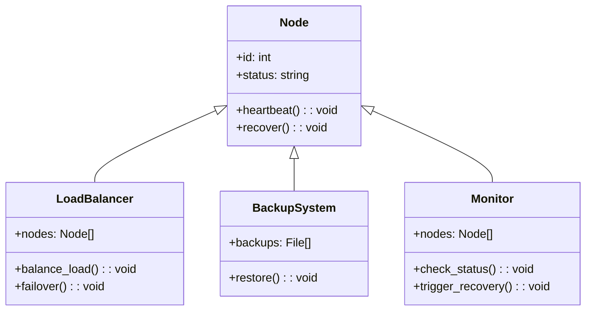
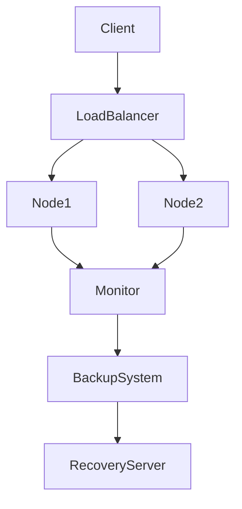
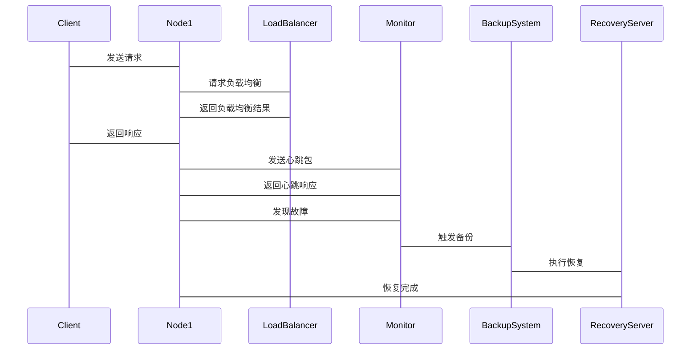

                 


---

# 灾难恢复：确保AI Agent服务的高可用性

> 关键词：AI Agent服务、灾难恢复、高可用性、故障检测、自愈算法、系统架构

> 摘要：本文章详细探讨了AI Agent服务的高可用性实现，重点分析了灾难恢复的核心原理与方法，结合实际案例，详细讲解了故障检测与自愈算法的设计与实现，以及系统架构的优化与容灾策略的制定。文章内容涵盖理论与实践，旨在为AI Agent服务的设计者和运维人员提供系统的指导和参考。

---

## 目录大纲

### 第一部分：灾难恢复与高可用性背景

#### 第1章：灾难恢复与高可用性概述

##### 1.1 灾难恢复的定义与核心概念

- 1.1.1 灾难恢复的定义
  - 灾难恢复是通过技术手段，在系统发生故障或灾难性事件后，快速恢复系统到正常运行状态的过程。
  - 灾难恢复的核心目标是确保数据的完整性和业务的连续性。

- 1.1.2 灾难恢复的核心要素
  - 数据备份：确保数据在灾难发生后能够快速恢复。
  - 故障检测：及时发现系统故障，触发恢复机制。
  - 恢复策略：制定合理的恢复步骤和时间规划。

- 1.1.3 灾难恢复的边界与外延
  - 边界：灾难恢复仅针对系统层面的故障，不包括人为操作失误或数据泄露。
  - 外延：包括数据备份、容灾、冗余设计等多个方面。

##### 1.2 高可用性系统的特点与目标

- 1.2.1 高可用性的定义
  - 高可用性系统是指在故障发生时，系统能够在极短时间内自动切换到备用系统，确保服务不中断。
  - 高可用性系统的目标是将故障恢复时间（MTTR）降到最低。

- 1.2.2 高可用性系统的特征
  - 系统冗余：通过冗余设计，确保单点故障不影响整体系统。
  - 故障隔离：快速检测并隔离故障节点，防止故障扩散。
  - 自动恢复：系统能够在故障发生后自动启动恢复机制。

- 1.2.3 高可用性系统的实现
  - 负载均衡：通过负载均衡技术，实现服务的自动分配和故障转移。
  - 容器化技术：利用容器化技术（如Docker）实现服务的快速部署和弹性伸缩。
  - 分布式架构：采用分布式架构，避免单点故障。

##### 1.3 AI Agent服务的高可用性需求

- 1.3.1 AI Agent服务的特点
  - AI Agent服务通常运行在分布式系统中，依赖于多个组件协同工作。
  - AI Agent服务对实时性要求较高，任何服务中断都可能导致用户体验的严重下降。

- 1.3.2 高可用性对AI Agent服务的重要性
  - 确保服务的连续性，避免因故障导致的业务中断。
  - 提高系统的可靠性，增强用户信任度。
  - 支持业务的扩展性，应对突发的流量高峰。

- 1.3.3 灾难恢复在AI Agent服务中的应用
  - 数据备份与恢复：确保AI Agent服务的核心数据能够快速恢复。
  - 故障检测与自愈：通过自动检测和修复机制，减少人工干预。
  - 容灾设计：在异地部署备用系统，确保在主系统故障时能够快速切换。

##### 1.4 本章小结

- 本章从灾难恢复和高可用性的基本概念入手，详细介绍了AI Agent服务的高可用性需求，并为后续章节的展开奠定了基础。

---

### 第二部分：核心概念与联系

#### 第2章：灾难恢复与高可用性原理

##### 2.1 灾难恢复的核心原理

- 2.1.1 灾难恢复的机制
  - 灾难恢复的核心机制包括数据备份、故障检测、恢复策略制定和恢复执行。
  - 数据备份是灾难恢复的基础，确保在灾难发生后有数据可恢复。

- 2.1.2 灾难恢复的策略
  - 数据备份策略：制定合理的备份频率和备份存储方案。
  - 故障检测策略：通过监控系统状态，及时发现故障。
  - 恢复策略：根据故障的严重程度，制定相应的恢复方案。

- 2.1.3 灾难恢复的实现方式
  - 数据备份实现：采用增量备份、差异备份等方式，减少存储空间占用。
  - 故障检测实现：通过心跳机制、状态监控等方式，实时检测系统状态。
  - 恢复实现：通过脚本、自动化工具等方式，实现数据恢复和系统重启。

##### 2.2 高可用性系统的架构设计

- 2.2.1 高可用性系统的架构特点
  - 分布式架构：通过分布式部署，避免单点故障。
  - 系统冗余：在关键节点部署冗余设备，确保系统可靠性。
  - 故障隔离：通过熔断机制、限流策略等方式，隔离故障节点。

- 2.2.2 系统容错与冗余设计
  - 容错设计：通过冗余设计，确保系统在部分节点故障时仍能正常运行。
  - 冗余设计：在关键组件部署备用设备，确保系统在故障发生时能够快速切换。

- 2.2.3 系统切换与恢复机制
  - 故障切换：通过负载均衡、路由切换等方式，将故障节点的流量转移到正常节点。
  - 系统恢复：通过自动重启、数据恢复等方式，快速恢复系统到正常状态。

##### 2.3 灾难恢复与高可用性的关系

- 2.3.1 灾难恢复与高可用性的区别与联系
  - 区别：灾难恢复是应对大规模灾难性事件的恢复机制，而高可用性是应对日常故障的快速恢复机制。
  - 联系：高可用性系统需要依赖灾难恢复机制，确保在故障发生时能够快速恢复。

- 2.3.2 灾难恢复在高可用性系统中的作用
  - 灾难恢复是高可用性系统的重要组成部分，确保系统在严重故障发生时仍能保持可用性。

- 2.3.3 高可用性系统对灾难恢复的需求
  - 高可用性系统需要灾难恢复机制作为后盾，确保系统在故障发生时能够快速恢复。

##### 2.4 核心概念对比分析

- 2.4.1 可用性与容灾的对比
  - 可用性：关注日常的系统可用性，通过冗余设计和故障隔离实现。
  - 容灾：关注大规模灾难性事件的恢复，通过异地备份和灾难恢复实现。

- 2.4.2 灾难恢复与备份恢复的对比
  - 灾难恢复：强调系统整体的恢复，包括数据恢复和系统重启。
  - 备份恢复：强调数据的恢复，通常不涉及系统的整体重启。

- 2.4.3 高可用性与业务连续性的关系
  - 高可用性是业务连续性的基础，确保业务在日常故障中仍能正常运行。
  - 业务连续性是高可用性的延伸，确保业务在灾难性事件中仍能持续。

##### 2.5 本章小结

- 本章详细介绍了灾难恢复和高可用性的核心原理，并分析了两者之间的关系，为后续章节的算法设计和系统实现奠定了理论基础。

---

### 第三部分：算法原理与数学模型

#### 第3章：故障检测与自愈算法

##### 3.1 故障检测算法

- 3.1.1 心跳机制
  - 心跳机制通过定期发送心跳包，检测系统节点的存活状态。
  - 心跳包的内容包括时间戳、节点状态等信息。

- 3.1.2 基于日志的故障检测
  - 通过分析系统日志，发现异常行为，触发故障检测。
  - 日志分析算法包括模式匹配、异常检测等技术。

- 3.1.3 基于状态监控的故障检测
  - 通过监控系统的资源使用情况（CPU、内存、磁盘等），发现资源耗尽或异常波动，触发故障检测。

##### 3.2 自愈算法

- 3.2.1 自动切换机制
  - 自动切换机制通过负载均衡、路由切换等方式，将故障节点的流量转移到正常节点。
  - 自动切换算法包括负载均衡算法（轮询、随机、加权等）和路由切换算法（哈希、一致性哈希等）。

- 3.2.2 基于负载均衡的自愈
  - 负载均衡自愈算法通过动态调整负载分发策略，确保系统的负载均衡。
  - 负载均衡算法包括静态负载均衡和动态负载均衡。

- 3.2.3 基于冗余的自愈
  - 红余自愈算法通过冗余部署的节点，自动切换到备用节点。
  - 红余算法包括主备模式、双主模式等。

##### 3.3 算法流程图（Mermaid）



##### 3.4 算法实现代码

```python
import time

def heartbeat_monitor():
    while True:
        # 发送心跳包
        send_heartbeat()
        # 检查心跳响应
        response = receive_heartbeat()
        if not response:
            trigger_failure_recovery()
        time.sleep(1)

def trigger_failure_recovery():
    # 判断故障类型
    failure_type = detect_failure_type()
    # 选择恢复策略
    recovery_strategy = select_recovery_strategy(failure_type)
    # 执行恢复操作
    execute_recovery(recovery_strategy)

def detect_failure_type():
    # 通过日志分析和状态监控，检测故障类型
    log_analysis = analyze_logs()
    status_monitor = monitor_system_status()
    failure_type = determine_failure_type(log_analysis, status_monitor)
    return failure_type

def select_recovery_strategy(failure_type):
    # 根据故障类型选择恢复策略
    if failure_type == 'node_failure':
        return 'node_recovery'
    elif failure_type == 'network_failure':
        return 'network_recovery'
    else:
        return 'default_recovery'

def execute_recovery(recovery_strategy):
    if recovery_strategy == 'node_recovery':
        # 启用备用节点
        start_standby_node()
    elif recovery_strategy == 'network_recovery':
        # 修复网络连接
        repair_network_connection()
    else:
        # 默认恢复策略
        restart_system()
```

##### 3.5 数学模型与公式

- 灾难恢复的恢复时间目标（RTO）和恢复点目标（RPO）：
  - RTO = 故障检测时间 + 恢复操作时间
  - RPO = 数据备份时间 + 数据恢复时间

- 故障检测的概率：
  - P(故障检测) = 1 - (1 - P(detected))^n
  - 其中n为检测次数，P(detected)为每次检测的成功概率。

##### 3.6 本章小结

- 本章详细介绍了故障检测与自愈算法的设计与实现，通过流程图和代码示例，展示了算法的实现过程，并通过数学模型和公式，分析了算法的性能和可靠性。

---

### 第四部分：系统分析与架构设计

#### 第4章：系统分析与架构设计

##### 4.1 问题场景介绍

- AI Agent服务运行在分布式系统中，依赖于多个组件协同工作。
- 系统可能发生节点故障、网络中断、数据丢失等故障，导致服务中断。
- 灾难恢复的目标是确保系统在故障发生后能够快速恢复，保证服务的连续性。

##### 4.2 系统功能设计

- 领域模型设计（Mermaid类图）



- 系统架构设计（Mermaid架构图）



- 系统接口设计
  - API接口：提供心跳检测、故障报告、数据备份等接口。
  - 接口协议：采用HTTP、gRPC等协议实现。

- 系统交互设计（Mermaid序列图）



##### 4.3 本章小结

- 本章通过系统分析和架构设计，展示了AI Agent服务在灾难恢复和高可用性实现中的具体应用，为后续章节的项目实战奠定了基础。

---

### 第五部分：项目实战

#### 第5章：项目实战与案例分析

##### 5.1 环境安装与配置

- 安装必要的软件和工具：
  - 安装Python和相关库（如 requests、pyyaml）。
  - 安装监控工具（如Prometheus、Grafana）。
  - 安装负载均衡工具（如Nginx、HAProxy）。

- 配置环境变量：
  - 设置监控服务器地址、备份服务器地址等。
  - 配置心跳检测间隔、故障检测阈值等参数。

##### 5.2 核心代码实现

- 心跳检测代码

```python
import requests
import yaml
import time

def send_heartbeat(node_id):
    data = {
        'node_id': node_id,
        'timestamp': time.time()
    }
    response = requests.post('http://monitor:8080/heartbeat', json=data)
    return response.status_code == 200

def heartbeat_monitor(node_id):
    while True:
        if not send_heartbeat(node_id):
            trigger_recovery(node_id)
        time.sleep(1)
```

- 故障恢复代码

```python
def trigger_recovery(node_id):
    # 触发恢复流程
    response = requests.post('http://monitor:8080/recovery', json={'node_id': node_id})
    if response.status_code == 200:
        print(f"Node {node_id} recovery triggered")
    else:
        print(f"Failed to trigger recovery for node {node_id}")

def recover_node(node_id):
    # 恢复节点
    response = requests.post('http://recovery-server:8081/recover', json={'node_id': node_id})
    return response.status_code == 200
```

##### 5.3 实际案例分析

- 案例背景：某AI Agent服务因网络中断导致部分节点故障。
- 案例分析：
  - 故障检测：心跳检测发现部分节点无法连接。
  - 恢复策略：触发网络恢复流程，修复网络连接。
  - 恢复完成：系统自动切换到备用节点，恢复服务。

- 案例总结：
  - 快速检测故障并触发恢复流程，确保服务不中断。
  - 通过冗余设计和自动切换，减少人工干预，提高系统可靠性。

##### 5.4 本章小结

- 本章通过实际案例分析，展示了灾难恢复和高可用性在AI Agent服务中的具体应用，帮助读者理解理论与实践的结合。

---

### 第六部分：最佳实践与总结

#### 第6章：最佳实践与总结

##### 6.1 最佳实践

- **数据备份与恢复**：确保数据的完整性和一致性，采用增量备份和定期测试恢复策略。
- **故障检测与隔离**：通过心跳机制、状态监控等方式，快速检测故障并隔离故障节点，防止故障扩散。
- **自动恢复与切换**：通过自动化工具和脚本，实现故障的快速恢复和系统的自动切换，减少人工干预。
- **系统监控与日志分析**：实时监控系统状态，分析日志信息，及时发现潜在问题，提前采取措施。

##### 6.2 小结

- 灾难恢复和高可用性是确保AI Agent服务稳定运行的重要保障。
- 通过合理的系统设计和算法实现，能够有效降低故障发生的风险，并在故障发生后快速恢复系统。

##### 6.3 注意事项

- 灾难恢复方案的设计需要结合实际业务需求，确保方案的可行性和可扩展性。
- 在实际应用中，需要定期测试灾难恢复方案，确保其有效性和可靠性。
- 灾难恢复方案的实施需要团队协作，确保各个部分的协调配合。

##### 6.4 拓展阅读

- 《容灾系统设计与实现》
- 《高可用性系统架构与实践》
- 《故障检测与自愈算法研究》

---

### 作者

作者：AI天才研究院/AI Genius Institute & 禅与计算机程序设计艺术/Zen And The Art of Computer Programming

