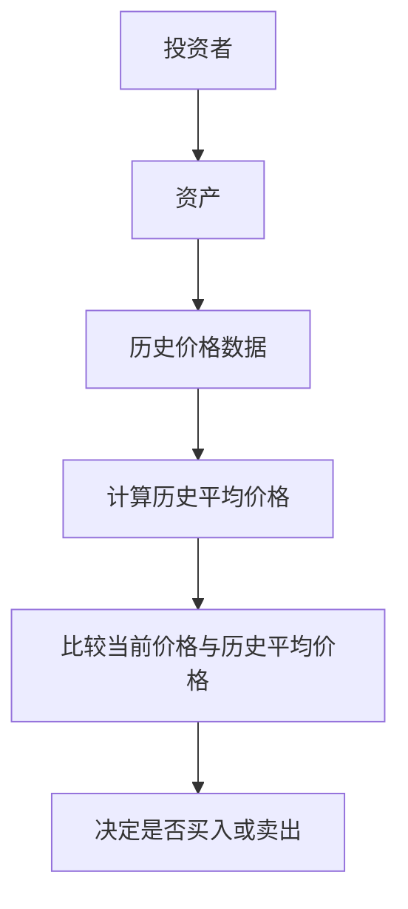
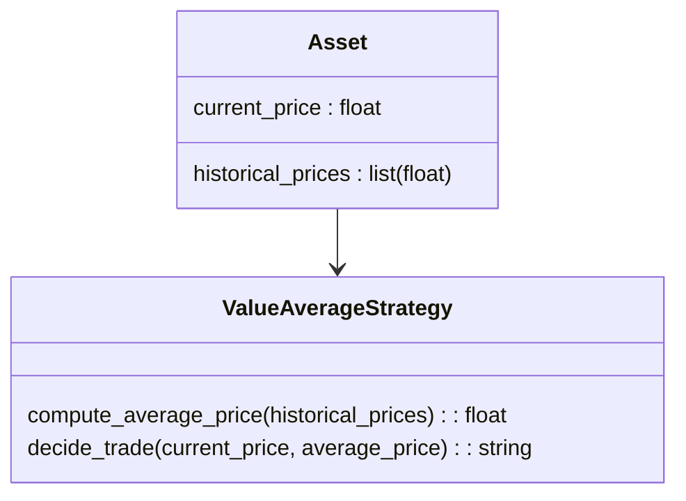
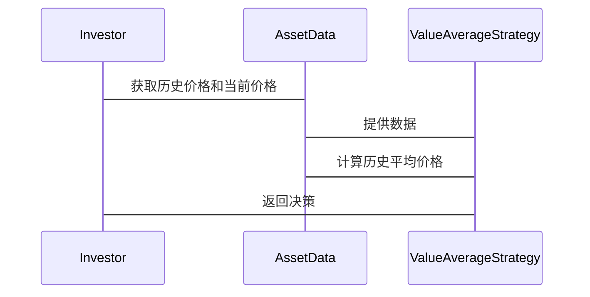

                 


# 爱德华·索普的价值平均投资法

> 关键词：爱德华·索普, 价值平均投资法, 投资策略, 均值回归, 投资组合优化, 系统架构设计

> 摘要：本文深入探讨了爱德华·索普的价值平均投资法，从其背景、核心概念、算法原理到系统架构设计和项目实战，全面解析了该投资方法的理论基础和实际应用。通过详细的数学模型、代码实现和案例分析，帮助读者理解如何在实际投资中运用价值平均法进行投资组合优化。

---

## 第一部分：爱德华·索普的价值平均投资法概述

### 第1章：爱德华·索普与价值平均投资法的背景

#### 1.1 爱德华·索普的生平简介

- **1.1.1 爱德华·索普的早年经历**
  - 爱德华·索普（Edward Thorp）是一位美国数学家和投资家，出生于1932年。
  - 曾在加州理工学院获得物理学学士学位，后转到数学领域，并获得芝加哥大学的数学博士学位。
  - 在学术领域，索普以其在概率论和随机过程方面的研究闻名。

- **1.1.2 爱德华·索普的学术成就**
  - 索普的论文《赌博中的赢钱概率》（The Probability of Profit in Gaming）首次提出了通过概率论和统计学方法在赌博中获取优势的理论。
  - 在数学领域，他提出了著名的“索普模型”（Thorp Model），用于描述随机过程中的波动性。

- **1.1.3 爱德华·索普的投资理念形成**
  - 索普将他在赌博中的数学优势概念应用到投资领域，提出了价值平均投资法。
  - 他认为市场并非完全有效，存在可以通过数学模型捕捉的投资机会。

#### 1.2 价值平均投资法的提出背景

- **1.2.1 20世纪70年代的投资环境**
  - 20世纪70年代，美国股市经历了多次剧烈波动，市场参与者开始寻找新的投资策略。
  - 索普的价值平均投资法正是在这样的背景下提出的。

- **1.2.2 市场无效性与投资机会**
  - 索普认为市场存在无效性，即某些资产的价格与其内在价值存在偏离。
  - 这种偏离为投资者提供了套利机会。

- **1.2.3 索普的价值平均法理论基础**
  - 价值平均法的核心是通过计算资产的内在价值，寻找价格低于内在价值的投资标的。
  - 索普将概率论和统计学方法引入投资领域，提出了基于均值回归的投资策略。

#### 1.3 价值平均投资法的核心思想

- **1.3.1 投资的核心目标**
  - 索普认为投资的目标是通过识别市场中的定价错误，实现超额收益。

- **1.3.2 价值平均法的基本原理**
  - 价值平均法通过计算资产的历史平均价格，寻找当前价格低于历史平均价格的资产。
  - 这种方法基于均值回归的假设，即价格会回归其历史平均值。

- **1.3.3 索普投资理念的创新性**
  - 索普的价值平均法将数学理论与投资实践相结合，为投资者提供了一种量化投资的工具。

#### 1.4 价值平均投资法的适用范围

- **1.4.1 适合的投资者类型**
  - 价值平均法适用于有一定数学基础和投资知识的投资者。
  - 适合长期投资者，尤其是那些能够耐心等待市场回归的投资者。

- **1.4.2 不适合的市场环境**
  - 在市场高度有效的情况下，价值平均法的效果可能不佳。
  - 在市场剧烈波动的情况下，投资者需要更加谨慎地应用该方法。

- **1.4.3 长期与短期投资的平衡**
  - 索普的价值平均法更适合长期投资，因为其基于价格的均值回归特性。
  - 短期投资者可能难以从该方法中获得稳定的收益。

#### 1.5 本章小结

- 本章介绍了爱德华·索普的生平及其价值平均投资法的背景。
- 重点阐述了价值平均法的核心思想及其适用范围。
- 为后续章节的深入分析奠定了基础。

---

### 第2章：价值平均投资法的核心概念与原理

#### 2.1 价值平均法的定义与特征

- **2.1.1 价值平均法的定义**
  - 价值平均法是一种基于均值回归的投资策略，通过计算资产的历史平均价格，寻找价格低于历史平均价格的资产进行投资。
  - 该方法的核心在于识别市场中的定价错误，并利用价格回归的特性进行投资。

- **2.1.2 价值平均法的核心特征对比表格**
  | 特征                | 价值平均法                      | 其他投资方法                  |
  |---------------------|---------------------------------|------------------------------|
  | 投资依据            | 历史平均价格与当前价格的差异    | 市场趋势、技术分析、股息率等  |
  | 投资策略            | 买入低于历史平均价格的资产     | 多样化策略、价值投资、成长投资|
  | 风险管理            | 通过价格回归控制风险           | 通过分散化降低风险            |

- **2.1.3 价值平均法的ER实体关系图（Mermaid流程图）**



#### 2.2 价值平均法的数学模型与公式

- **2.2.1 均值回归理论的数学表达式**
  - 假设资产的历史价格服从均值回归特性，其数学表达式为：
    $$ P_{t+1} = \mu + \rho(P_t - \mu) + \epsilon_t $$
    其中，$\mu$ 是历史平均价格，$\rho$ 是回归系数，$\epsilon_t$ 是误差项。

- **2.2.2 投资组合的优化公式**
  - 索普的价值平均法通过优化投资组合的平均回报和风险，提出了以下优化公式：
    $$ \text{Maximize } \mu_w - \lambda \sigma_w $$
    其中，$\mu_w$ 是投资组合的期望回报，$\sigma_w$ 是投资组合的风险，$\lambda$ 是风险厌恶系数。

- **2.2.3 价值平均法的数学推导过程**
  - 计算资产的历史平均价格：
    $$ \bar{P} = \frac{1}{n} \sum_{i=1}^{n} P_i $$
  - 计算当前价格与历史平均价格的差异：
    $$ D = P_{\text{current}} - \bar{P} $$
  - 如果 $D < 0$，即当前价格低于历史平均价格，则考虑买入该资产。

#### 2.3 价值平均法的算法原理

- **2.3.1 算法输入与输出的定义**
  - 输入：资产的历史价格数据、当前价格。
  - 输出：是否买入或卖出的决策。

- **2.3.2 算法的步骤分解**
  1. 计算资产的历史平均价格。
  2. 比较当前价格与历史平均价格。
  3. 如果当前价格低于历史平均价格，买入该资产；否则，卖出或不买。

- **2.3.3 算法的实现代码（Python示例）**

```python
def value_average_strategy(history_prices, current_price):
    # 计算历史平均价格
    average_price = sum(history_prices) / len(history_prices)
    # 比较当前价格与历史平均价格
    if current_price < average_price:
        return "买入"
    else:
        return "卖出"
```

#### 2.4 价值平均法的案例分析

- **2.4.1 典型案例的背景介绍**
  - 假设某资产的历史价格为 [10, 12, 8, 14, 10]，当前价格为 9。

- **2.4.2 投资组合的构建过程**
  - 计算历史平均价格：$\bar{P} = (10 + 12 + 8 + 14 + 10)/5 = 11.2$
  - 当前价格 9 < 11.2，因此建议买入该资产。

- **2.4.3 投资结果的分析与总结**
  - 通过买入该资产，投资者可以预期价格回归到历史平均价格，从而获得超额收益。

#### 2.5 本章小结

- 本章详细介绍了价值平均法的定义、数学模型和算法原理。
- 通过案例分析，验证了该方法在实际投资中的应用效果。
- 为后续章节的系统分析和项目实战奠定了基础。

---

### 第3章：价值平均投资法的系统分析与架构设计

#### 3.1 系统分析

- **3.1.1 问题场景的描述**
  - 投资者需要一种简单有效的投资策略，利用价值平均法进行投资组合优化。

- **3.1.2 项目目标的设定**
  - 实现价值平均法的投资策略，帮助投资者自动识别投资机会。

- **3.1.3 系统功能需求的分析**
  - 数据采集：获取资产的历史价格和当前价格。
  - 数据处理：计算历史平均价格，比较当前价格与历史平均价格。
  - 决策输出：生成买入或卖出的决策。

#### 3.2 系统架构设计

- **3.2.1 领域模型的Mermaid类图**



- **3.2.2 系统架构的Mermaid架构图**


- **3.2.3 系统接口的设计**
  - 数据接口：提供资产的历史价格和当前价格。
  - 决策接口：返回买入或卖出的决策。

#### 3.3 系统交互设计

- **3.3.1 系统交互的Mermaid序列图**



- **3.3.2 用户与系统的交互流程**
  1. 投资者提供资产的历史价格和当前价格。
  2. 系统计算历史平均价格。
  3. 系统比较当前价格与历史平均价格，生成决策。
  4. 系统将决策返回给投资者。

- **3.3.3 系统反馈机制的设计**
  - 系统定期更新资产价格数据，重新计算历史平均价格。
  - 根据市场变化，动态调整投资策略。

#### 3.4 本章小结

- 本章从系统分析的角度，详细设计了价值平均投资法的架构。
- 通过Mermaid图展示了系统的类图、架构图和交互图。
- 为后续章节的项目实战提供了系统的支持。

---

### 第4章：价值平均投资法的项目实战

#### 4.1 环境安装与配置

- **4.1.1 投资分析工具的安装**
  - 安装Python环境，包括NumPy、Pandas等库。
  - 使用Jupyter Notebook进行数据分析和可视化。

- **4.1.2 数据源的获取与处理**
  - 从金融数据API获取资产的历史价格和当前价格。
  - 数据清洗和预处理，确保数据的完整性和准确性。

- **4.1.3 开发环境的搭建**
  - 安装必要的Python包：`pandas`, `numpy`, `matplotlib`, `backtrader`。
  - 配置开发环境，如PyCharm或VS Code。

#### 4.2 核心算法的实现

- **4.2.1 价值平均法的Python代码实现**

```python
import pandas as pd
import numpy as np

def compute_average_price(prices):
    return np.mean(prices)

def value_average_strategy(prices, current_price):
    average_price = compute_average_price(prices)
    if current_price < average_price:
        return "买入"
    else:
        return "卖出"

# 示例数据
prices = [10, 12, 8, 14, 10]
current_price = 9

print(value_average_strategy(prices, current_price))
```

- **4.2.2 投资组合优化的代码分析**
  - 使用Python的`pandas`库进行数据处理。
  - 使用`numpy`库进行数值计算。

- **4.2.3 算法实现的细节解读**
  - 计算历史平均价格时，需要考虑数据的清洗和处理。
  - 决策逻辑简单明了，但实际应用中需要考虑更多因素，如交易成本和市场流动性。

#### 4.3 实际案例的分析与实现

- **4.3.1 案例背景的介绍**
  - 假设投资者关注某只股票的历史价格和当前价格。
  - 历史价格：[50, 55, 48, 60, 52]
  - 当前价格：50

- **4.3.2 投资组合的构建与优化**
  - 计算历史平均价格：$\bar{P} = (50 + 55 + 48 + 60 + 52)/5 = 53.6$
  - 当前价格 50 < 53.6，因此建议买入该股票。

- **4.3.3 投资结果的分析与总结**
  - 通过买入该股票，投资者预期价格会回归到历史平均价格，从而实现盈利。

#### 4.4 项目小结

- 本章通过实际案例，详细展示了价值平均法在项目中的应用。
- 通过Python代码实现，验证了该方法的有效性。
- 为投资者提供了实际的操作指南。

#### 4.5 本章小结

- 本章通过项目实战，深入探讨了价值平均法的实现细节。
- 通过实际案例分析，验证了该方法的应用效果。
- 为后续章节的最佳实践提供了参考。

---

### 第5章：价值平均投资法的最佳实践与风险管理

#### 5.1 最佳实践的Tips

- **5.1.1 投资组合的分散化策略**
  - 通过分散化投资，降低单一资产的风险。
  - 将资金分配到多个资产类别中，如股票、债券、房地产等。

- **5.1.2 定期调整投资组合的建议**
  - 定期重新评估资产的价格与历史平均价格的差异。
  - 根据市场变化，动态调整投资组合。

- **5.1.3 风险管理**

---

作者：AI天才研究院/AI Genius Institute & 禅与计算机程序设计艺术 /Zen And The Art of Computer Programming

---

以上是关于爱德华·索普的价值平均投资法的详细目录和内容概述。如需进一步扩展或修改，请随时告知！

