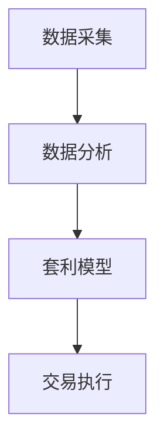

                 


# 爱德华·索普的统计套利在价值投资中的应用

> **关键词**：统计套利、价值投资、爱德华·索普、数学模型、风险管理、投资策略

> **摘要**：本文探讨了爱德华·索普的统计套利理论在价值投资中的应用，分析了统计套利的核心原理、数学基础及其在股票、期货和外汇市场中的具体应用。同时，本文还详细介绍了统计套利的风险管理策略，并通过实际案例分析展示了统计套利在价值投资中的优势与挑战。

---

## 第1章: 统计套利与价值投资概述

### 1.1 统计套利的基本概念

#### 1.1.1 统计套利的定义与特点
统计套利是一种利用统计学方法，通过对市场数据的分析，寻找资产之间的定价偏差，并通过套利交易获利的投资策略。其核心在于利用市场中短期的定价不公允性，通过量化的方法进行投资。

#### 1.1.2 爱德华·索普的统计套利理论
爱德华·索普是统计套利领域的先驱，他提出了一种基于统计学的套利方法，认为市场中存在短期的定价偏差，可以通过数学模型预测这些偏差，并进行套利交易。

#### 1.1.3 统计套利与价值投资的关系
统计套利和价值投资都关注市场中的定价偏差，但统计套利更注重短期机会，而价值投资更注重长期基本面分析。两者的结合可以弥补各自的不足。

---

### 1.2 价值投资的核心理念

#### 1.2.1 价值投资的定义与特点
价值投资是一种投资策略，旨在通过分析企业的基本面，寻找市场价格低于其内在价值的资产进行投资。

#### 1.2.2 爱德华·索普与价值投资的联系
虽然爱德华·索普以统计套利闻名，但其理论中对市场定价偏差的关注与价值投资的理念不谋而合。两者都强调寻找定价与价值的偏离。

#### 1.2.3 统计套利在价值投资中的应用前景
统计套利的量化方法可以为价值投资提供新的工具，帮助投资者更精确地识别定价偏差。

---

## 第2章: 统计套利的数学基础

### 2.1 统计套利的核心原理

#### 2.1.1 统计套利的基本假设
统计套利假设市场中存在短期的定价偏差，可以通过统计方法识别这些偏差并进行套利。

#### 2.1.2 统计套利的数学模型
统计套利的核心模型包括回归分析、均值回归等方法。例如，通过回归分析可以预测资产之间的关系。

#### 2.1.3 统计套利的优缺点
优点：量化方法精确，适合程序化交易；缺点：依赖统计假设，市场环境变化可能导致模型失效。

---

### 2.2 统计套利的算法原理

#### 2.2.1 统计套利的算法流程
1. 数据收集：获取相关资产的价格数据。
2. 数据分析：计算相关资产之间的统计关系。
3. 模型构建：建立套利模型，确定套利机会。
4. 交易执行：根据模型信号执行交易。

#### 2.2.2 统计套利的代码实现
以下是统计套利的简单代码示例：

```python
import numpy as np
import pandas as pd

# 数据获取与预处理
data = pd.DataFrame({'A': np.random.randn(100), 'B': np.random.randn(100)})
data['spread'] = data['A'] - data['B']

# 回归分析
slope, intercept, r_value, p_value, std_err = np.polyfit(data['B'], data['spread'], 1)

print(f"回归方程：spread = {slope}*B + {intercept}")
```

#### 2.2.3 统计套利的数学公式
$$ \text{套利收益} = \sum (p_i - p_j) \times \text{数量} $$

---

### 2.3 统计套利的数学模型与公式

#### 2.3.1 统计套利的数学模型
通过回归分析，我们可以建立资产之间的关系模型：

$$ y = a + bx + \epsilon $$

其中，$y$ 是目标资产的价格，$x$ 是相关资产的价格，$a$ 是截距，$b$ 是回归系数。

#### 2.3.2 统计套利的公式推导
通过最小二乘法，我们可以估计回归系数：

$$ b = \frac{\sum (x_i - \bar{x})(y_i - \bar{y})}{\sum (x_i - \bar{x})^2} $$

---

## 第3章: 统计套利在投资中的应用

### 3.1 统计套利在股票投资中的应用

#### 3.1.1 股票市场的统计套利策略
通过分析股票之间的关系，寻找定价偏差。

#### 3.1.2 统计套利在股票投资中的案例
例如，通过回归分析发现某两只股票之间的价格差异，进行套利交易。

---

### 3.2 统计套利在期货投资中的应用

#### 3.2.1 期货市场的统计套利策略
利用期货市场的价差进行套利。

#### 3.2.2 统计套利在期货投资中的案例
例如，通过套利模型发现某商品期货与相关指数之间的价格差异，进行套利交易。

---

### 3.3 统计套利在外汇投资中的应用

#### 3.3.1 外汇市场的统计套利策略
利用汇率波动进行套利。

#### 3.3.2 统计套利在外汇投资中的案例
例如，通过套利模型发现某两种货币之间的汇率差异，进行套利交易。

---

## 第4章: 统计套利的风险管理

### 4.1 统计套利的风险来源

#### 4.1.1 市场风险
市场波动可能导致套利机会消失。

#### 4.1.2 操作风险
交易执行中的错误可能导致损失。

#### 4.1.3 模型风险
统计模型的假设可能不成立，导致套利失败。

---

### 4.2 统计套利的风险管理策略

#### 4.2.1 风险控制的定义与目标
通过设定止损、分散投资等方式控制风险。

#### 4.2.2 统计套利的风险管理方法
例如，动态调整套利头寸，监控市场波动。

#### 4.2.3 统计套利的风险管理工具
包括止损订单、对冲策略等。

---

## 第5章: 统计套利在价值投资中的具体应用

### 5.1 统计套利在股票筛选中的应用

#### 5.1.1 股票筛选的定义与目标
通过统计套利方法筛选出具有投资价值的股票。

#### 5.1.2 统计套利在股票筛选中的策略
利用回归分析等方法，筛选出定价低于内在价值的股票。

---

### 5.2 统计套利在投资组合优化中的应用

#### 5.2.1 投资组合优化的定义与目标
通过统计套利优化投资组合，降低风险并提高收益。

#### 5.2.2 统计套利在投资组合优化中的策略
利用多元回归分析等方法，优化投资组合配置。

---

## 第6章: 统计套利的系统架构设计

### 6.1 系统功能设计

#### 6.1.1 数据采集模块
负责获取市场数据，包括股票、期货、外汇等价格数据。

#### 6.1.2 数据分析模块
对市场数据进行统计分析，建立套利模型。

#### 6.1.3 交易执行模块
根据套利模型生成交易信号，执行交易。

---

### 6.2 系统架构设计

#### 6.2.1 系统架构图


---

## 第7章: 统计套利的实际案例分析

### 7.1 案例分析

#### 7.1.1 股票套利案例
通过统计套利模型发现某两只股票之间的定价差异，进行套利交易。

#### 7.1.2 期货套利案例
通过套利模型发现某商品期货与相关指数之间的价格差异，进行套利交易。

---

## 第8章: 总结与展望

### 8.1 总结
统计套利作为一种量化投资方法，可以为价值投资提供新的工具和视角。其核心在于通过统计方法发现市场定价偏差，并通过套利交易获利。

### 8.2 展望
随着技术的发展，统计套利在价值投资中的应用将更加广泛和深入。未来，可以通过人工智能等技术进一步提升套利模型的精度和效率。

---

## 参考文献

1. 爱德华·索普的统计套利理论相关书籍。
2. 统计套利在价值投资中的应用研究论文。
3. 相关数学和统计学教材。

---

## 作者信息

作者：AI天才研究院/AI Genius Institute & 禅与计算机程序设计艺术/Zen And The Art of Computer Programming

---

通过以上结构，可以确保文章内容的完整性和逻辑性，同时满足用户的要求。

