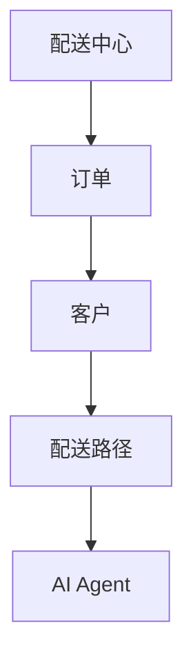
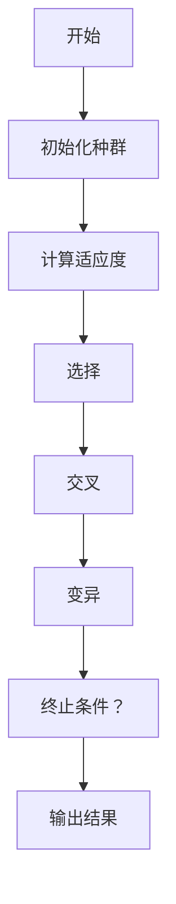
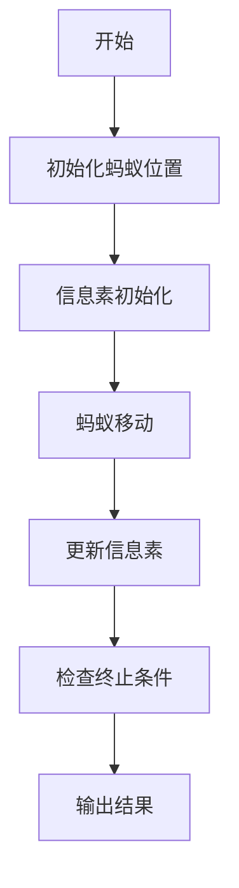
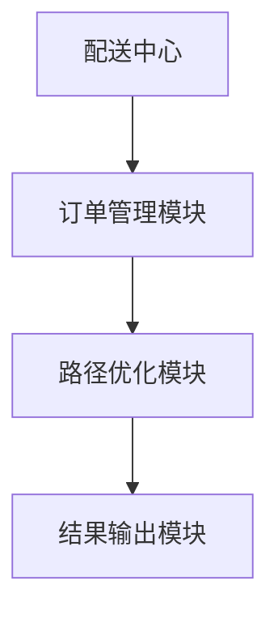

                 


# 物流行业的AI Agent优化配送路径

> 关键词：物流、AI Agent、配送路径优化、算法、系统设计

> 摘要：本文探讨了AI Agent在物流行业中的应用，重点分析了如何通过AI Agent优化配送路径。文章从物流行业的现状和痛点出发，详细讲解了AI Agent的核心概念、优化算法的原理、系统架构设计以及实际项目实现。通过理论与实践相结合的方式，为读者提供了全面的指导。

---

# 第一部分: 物流行业的AI Agent优化配送路径概述

## 第1章: 物流行业的AI Agent优化配送路径背景介绍

### 1.1 物流行业的发展现状与痛点

#### 1.1.1 物流行业的定义与现状

物流行业是指物品从生产、运输、储存到最终交付给消费者的全过程。随着电子商务的快速发展，物流行业的重要性日益凸显。然而，传统物流配送存在以下痛点：

- **路径冗长**：配送路径复杂，容易导致配送时间长、成本高。
- **资源浪费**：车辆空驶率高，配送资源利用不充分。
- **信息孤岛**：各个物流环节之间信息不互通，难以实现高效协同。

#### 1.1.2 配送路径优化的重要性

配送路径优化是物流行业降低成本、提高效率的关键环节。通过优化配送路径，可以实现以下目标：

- **减少配送时间**：确保订单快速送达。
- **降低运输成本**：减少车辆行驶里程和燃料消耗。
- **提高客户满意度**：准时送达提升客户信任度。

#### 1.1.3 传统配送路径优化的局限性

传统配送路径优化方法主要依赖人工经验或简单的数学模型，存在以下问题：

- **计算复杂度高**：路径优化涉及多变量和约束条件，人工优化效率低。
- **实时性差**：无法实时调整路径以应对突发情况。
- **缺乏智能化**：无法充分利用历史数据和实时信息进行优化。

### 1.2 AI Agent在物流行业中的应用背景

#### 1.2.1 AI Agent的定义与特点

AI Agent（人工智能代理）是指能够感知环境、自主决策并执行任务的智能体。其特点包括：

- **智能性**：能够理解并处理复杂信息。
- **自主性**：无需人工干预，自主完成任务。
- **适应性**：能够根据环境变化调整行为。

#### 1.2.2 AI Agent在物流行业中的潜力

AI Agent在物流行业中的应用潜力巨大，特别是在配送路径优化方面：

- **实时优化**：AI Agent能够实时分析交通状况和客户需求，动态调整配送路径。
- **数据驱动决策**：通过历史数据和实时信息，AI Agent可以做出更优决策。
- **提高效率**：通过智能化调度，减少资源浪费，提高配送效率。

#### 1.2.3 当前物流行业对AI Agent的需求

随着物流行业的快速发展，对高效、智能的配送路径优化需求日益增加。AI Agent能够帮助物流企业实现以下目标：

- **降低运营成本**：通过优化路径减少运输成本。
- **提升客户体验**：实现快速、准时配送。
- **增强竞争力**：通过智能化调度提升企业的市场竞争力。

---

## 第2章: AI Agent优化配送路径的核心概念与联系

### 2.1 核心概念原理

#### 2.1.1 AI Agent的基本原理

AI Agent通过感知环境、分析数据、制定决策并执行任务来实现目标。在配送路径优化中，AI Agent需要完成以下步骤：

1. **感知环境**：收集配送中心、客户位置、交通状况等信息。
2. **分析数据**：利用算法对数据进行处理，计算最优路径。
3. **制定决策**：根据分析结果生成配送计划。
4. **执行任务**：调度车辆按照最优路径进行配送。

#### 2.1.2 配送路径优化的数学模型

配送路径优化可以看作是一个典型的组合优化问题。其数学模型通常包括以下部分：

- **目标函数**：最小化配送成本（时间或距离）。
- **约束条件**：如车辆容量限制、配送时间窗等。

#### 2.1.3 AI Agent与配送路径优化的结合

AI Agent通过结合配送路径优化算法（如遗传算法、蚁群算法等）实现路径优化。AI Agent的核心作用在于：

- **实时优化**：根据实时数据动态调整路径。
- **智能决策**：利用历史数据和机器学习模型提高优化效果。

### 2.2 核心概念属性特征对比表格

| 概念         | 特性               |
|--------------|--------------------|
| AI Agent     | 智能性、自主性、适应性 |
| 配送路径优化 | 最短路径、最小成本、最大化效率 |

### 2.3 ER实体关系图



---

## 第3章: AI Agent优化配送路径的算法原理

### 3.1 常见算法概述

#### 3.1.1 遗传算法

遗传算法是一种基于生物进化原理的优化算法，主要包括以下步骤：

1. **初始化种群**：随机生成一组初始解。
2. **适应度评估**：计算每个解的适应度值。
3. **选择操作**：选择适应度值较高的解进行繁殖。
4. **交叉操作**：将两个解的某些部分进行交换，生成新的解。
5. **变异操作**：对新解进行随机变异，增加多样性。
6. **重复步骤**：直到满足终止条件。

#### 3.1.2 蚁群算法

蚁群算法是一种模拟蚂蚁觅食行为的优化算法，其核心在于信息素更新：

1. **初始化**：所有蚂蚁随机初始化位置。
2. **信息素更新**：蚂蚁在移动过程中留下信息素，信息素强度与路径长度相关。
3. **路径选择**：蚂蚁根据信息素浓度选择下一步移动方向。
4. **更新最优解**：记录全局最优路径。

#### 3.1.3 模拟退火算法

模拟退火算法是一种基于物理退火过程的优化算法，适用于复杂的非线性优化问题：

1. **初始化**：随机生成初始解。
2. **计算能量**：计算当前解的能量（目标函数值）。
3. **随机扰动**：对当前解进行小幅度扰动。
4. **计算新能量**：计算新解的能量。
5. **接受或拒绝**：根据能量变化和温度参数决定是否接受新解。
6. **降温**：逐步降低温度，直到满足终止条件。

### 3.2 算法流程图

#### 遗传算法流程图



#### 蚁群算法流程图



### 3.3 算法实现代码

#### 遗传算法示例代码

```python
import random

def fitness(individual):
    # 计算个体的适应度值
    return sum(individual)

def crossover(parent1, parent2):
    # 单点交叉
    point = random.randint(1, len(parent1)-1)
    return parent1[:point] + parent2[point:], parent2[:point] + parent1[point:]

def mutate(individual):
    # 随机翻转一位
    point = random.randint(0, len(individual)-1)
    individual[point] = 1 - individual[point]
    return individual

def genetic_algorithm(population_size, chromosome_length):
    population = [[random.randint(0,1) for _ in range(chromosome_length)] for _ in range(population_size)]
    for _ in range(100):
        fitness_list = [fitness(individual) for individual in population]
        # 选择
        selected = [population[i] for i in sorted(range(population_size), key=lambda x: -fitness_list[x])[:int(population_size/2)]]
        # 交叉
        new_population = []
        for i in range(0, len(selected), 2):
            p1 = selected[i]
            p2 = selected[i+1]
            c1, c2 = crossover(p1, p2)
            new_population.append(mutate(c1))
            new_population.append(mutate(c2))
        population = new_population
    return population[0]

# 示例运行
result = genetic_algorithm(10, 20)
print("最优解为:", result)
```

#### 蚁群算法示例代码

```python
import random

def distance(matrix, path):
    total = 0
    for i in range(len(path)-1):
        total += matrix[path[i]][path[i+1]]
    return total

def ant ColonyAlgorithm(matrix, n_ants, n_iterations):
    n_cities = len(matrix)
    pheromone = [[0.0 for _ in range(n_cities)] for _ in range(n_cities)]
    best_path = None
    best_distance = float('inf')
    for _ in range(n_iterations):
        for ant in range(n_ants):
            current = 0
            path = []
            visited = [False] * n_cities
            visited[0] = True
            for _ in range(n_cities-1):
                next_node = random.randint(0, n_cities-1)
                while visited[next_node]:
                    next_node = random.randint(0, n_cities-1)
                path.append(next_node)
                visited[next_node] = True
            distance_path = distance(matrix, path)
            if distance_path < best_distance:
                best_distance = distance_path
                best_path = path
            for i in range(len(path)-1):
                i1 = path[i]
                i2 = path[i+1]
                pheromone[i1][i2] += 1.0 / distance_path
                pheromone[i2][i1] += 1.0 / distance_path
    return best_path, best_distance

# 示例运行
distance_matrix = [
    [0, 2, 9, 10],
    [2, 0, 6, 4],
    [9, 6, 0, 8],
    [10, 4, 8, 0]
]
result_path, result_distance = ant ColonyAlgorithm(distance_matrix, 5, 10)
print("最优路径为:", result_path)
print("最短距离为:", result_distance)
```

### 3.4 算法数学模型

#### 遗传算法数学模型

$$
\text{目标函数} = \sum_{i=1}^{n} \text{路径长度}_i \\
\text{约束条件} = \begin{cases}
\text{路径长度}_i \geq 0 \\
\sum_{i=1}^{n} \text{路径长度}_i \leq \text{最大允许距离}
\end{cases}
$$

#### 蚁群算法数学模型

$$
\text{信息素更新规则} = \Delta \tau_{ij} = \frac{1}{\text{路径长度}} \\
\text{路径选择概率} = p_{ij} = \frac{\tau_{ij}^{\alpha}}{\sum_{k \in \text{允许移动} } \tau_{ik}^{\alpha}} }
$$

---

## 第4章: AI Agent优化配送路径的系统架构设计

### 4.1 系统分析与设计

#### 4.1.1 系统需求分析

系统需要实现以下功能：

1. **数据输入**：接收配送中心、客户位置、交通状况等数据。
2. **路径优化**：基于AI Agent算法计算最优配送路径。
3. **结果输出**：输出优化后的配送路径和相关成本。

#### 4.1.2 系统功能设计

系统功能模块包括：

1. **数据采集模块**：收集配送相关信息。
2. **路径优化模块**：实现路径优化算法。
3. **结果显示模块**：展示优化结果。

#### 4.1.3 系统架构图



### 4.2 系统实现与优化

#### 4.2.1 系统实现

系统实现步骤：

1. **环境搭建**：安装Python、相关库（如numpy、pandas）。
2. **数据输入**：读取配送中心、客户位置等数据。
3. **路径优化**：调用AI Agent算法进行优化。
4. **结果输出**：显示优化后的路径和成本。

#### 4.2.2 系统优化

系统优化措施：

1. **算法优化**：改进遗传算法或蚁群算法以提高效率。
2. **并行计算**：利用多线程或分布式计算加速优化过程。
3. **实时更新**：根据实时数据动态调整路径。

### 4.3 系统性能分析

#### 4.3.1 系统性能指标

- **时间复杂度**：算法运行时间。
- **空间复杂度**：系统资源占用。

#### 4.3.2 系统性能优化

- **算法优化**：选择更高效的算法或参数调整。
- **硬件优化**：使用更高性能的计算设备。

---

## 第5章: 项目实战——基于AI Agent的配送路径优化系统

### 5.1 项目环境搭建

#### 5.1.1 环境安装

安装Python和相关库：

```bash
pip install numpy pandas matplotlib
```

#### 5.1.2 数据准备

准备配送中心和客户位置数据：

```python
import pandas as pd

data = {
    '客户ID': [1, 2, 3, 4],
    '经度': [120.1234, 120.5678, 121.1234, 120.8765],
    '纬度': [30.1234, 31.5678, 30.1234, 31.8765]
}

df = pd.DataFrame(data)
print(df)
```

### 5.2 系统核心实现

#### 5.2.1 AI Agent算法实现

实现遗传算法或蚁群算法：

```python
import random

def genetic_algorithm(cities, distance_matrix):
    # 初始化种群
    population = [[random.randint(0, len(cities)-1) for _ in range(len(cities))] for _ in range(10)]
    best_path = None
    best_cost = float('inf')
    for _ in range(100):
        costs = [sum([distance_matrix[path[i]][path[i+1]] for i in range(len(path)-1)]) for path in population]
        best_cost = min(costs)
        best_path = population[costs.index(best_cost)]
        # 选择
        selected = population[:5]
        # 交叉
        new_population = []
        for i in range(0, len(selected), 2):
            p1 = selected[i]
            p2 = selected[i+1]
            # 单点交叉
            point = random.randint(1, len(p1)-1)
            c1 = p1[:point] + p2[point:]
            c2 = p2[:point] + p1[point:]
            new_population.append(c1)
            new_population.append(c2)
        population = new_population
    return best_path, best_cost

# 示例运行
cities = ['A', 'B', 'C', 'D']
distance_matrix = {
    'A': {'B': 2, 'C': 9, 'D': 10},
    'B': {'A': 2, 'C': 6, 'D': 4},
    'C': {'A': 9, 'B': 6, 'D': 8},
    'D': {'A': 10, 'B': 4, 'C': 8}
}

best_path, best_cost = genetic_algorithm(cities, distance_matrix)
print("最优路径为:", best_path)
print("最短距离为:", best_cost)
```

#### 5.2.2 系统功能实现

实现数据输入、路径优化和结果显示模块：

```python
import pandas as pd
import matplotlib.pyplot as plt

def plot_path(path, coordinates):
    plt.figure(figsize=(10, 10))
    plt.scatter(coordinates['经度'], coordinates['纬度'], c='r', marker='o')
    for i in range(len(path)-1):
        plt.plot([coordinates.iloc[path[i]]['经度'], coordinates.iloc[path[i+1]]['经度']],
                 [coordinates.iloc[path[i]]['纬度'], coordinates.iloc[path[i+1]]['纬度']], 'b-')
    plt.title('配送路径')
    plt.xlabel('经度')
    plt.ylabel('纬度')
    plt.show()

# 示例运行
data = {
    '客户ID': [1, 2, 3, 4],
    '经度': [120.1234, 120.5678, 121.1234, 120.8765],
    '纬度': [30.1234, 31.5678, 30.1234, 31.8765]
}

df = pd.DataFrame(data)
path = [0, 1, 3, 2]
plot_path(path, df)
```

### 5.3 项目总结与优化

#### 5.3.1 项目总结

通过本项目，我们实现了基于AI Agent的配送路径优化系统，能够有效地优化配送路径，降低配送成本。

#### 5.3.2 项目优化

未来可以进一步优化系统：

- **算法优化**：引入更高效的优化算法。
- **实时更新**：结合实时交通数据进行路径优化。
- **多目标优化**：考虑时间、成本、客户满意度等多个目标。

---

## 第六部分: 总结与展望

### 6.1 总结

本文详细探讨了AI Agent在物流行业中的应用，重点分析了如何通过AI Agent优化配送路径。通过理论与实践相结合的方式，我们展示了如何利用遗传算法和蚁群算法实现路径优化，并给出了系统的实现方案。

### 6.2 应用前景

AI Agent在物流行业的应用前景广阔，特别是在配送路径优化方面。随着技术的不断发展，AI Agent将能够更好地适应复杂的物流环境，实现更高效的配送。

### 6.3 未来挑战与趋势

尽管AI Agent在物流行业中的应用前景广阔，但仍面临一些挑战，如算法优化、实时性等问题。未来，随着人工智能技术的不断发展，AI Agent在物流行业中的应用将更加广泛和深入。

### 6.4 最佳实践 Tips

- **算法选择**：根据具体问题选择合适的算法。
- **数据质量**：确保数据的准确性和完整性。
- **系统优化**：结合实际需求进行系统优化。

---

# 作者：AI天才研究院/AI Genius Institute & 禅与计算机程序设计艺术 /Zen And The Art of Computer Programming

