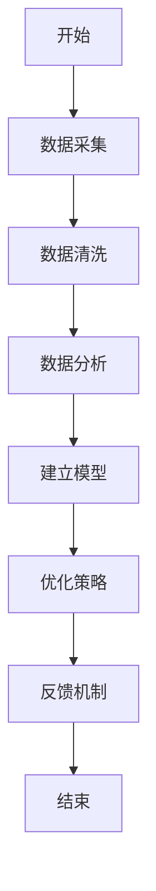
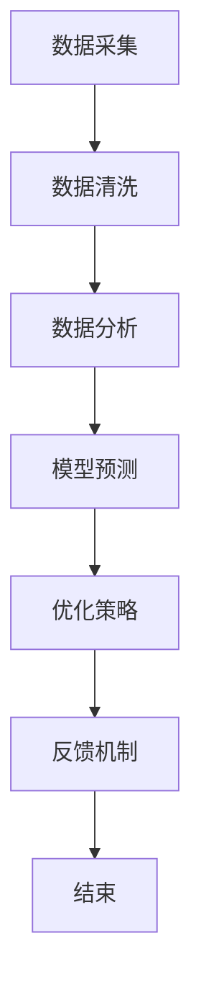

                 


# 特价股票投资中的智慧城市与数字公民参与度整合方法

## 关键词：特价股票投资，智慧城市，数字公民参与度，整合方法，系统设计，项目实战

## 摘要：本文探讨了如何将特价股票投资与智慧城市中的数字公民参与度进行整合，通过系统设计和算法优化，提出了具体的整合方法和实现方案，为投资者和城市管理者提供了参考。

---

# 第1章: 特价股票投资与智慧城市背景

## 1.1 特价股票投资的基本概念

### 1.1.1 特价股票的定义与特点

特价股票是指市场价格相对较低，具有较大上涨潜力的股票。其特点包括低估值、高成长性和较高的安全边际。投资者通常通过基本面分析和技术分析来选择合适的特价股票。

### 1.1.2 特价股票投资的常见策略

1. **价值投资**：寻找被市场低估的股票，长期持有。
2. **趋势投资**：跟随市场趋势，利用技术分析进行买卖决策。
3. **事件驱动投资**：基于公司特定事件（如并购、重组）进行投资。

### 1.1.3 特价股票投资的市场现状

当前市场中，特价股票投资受到越来越多投资者的关注，尤其是在经济不确定性增加的情况下，投资者更倾向于寻找具有稳定收益的股票。

---

## 1.2 智慧城市的核心概念

### 1.2.1 智慧城市的定义与特征

智慧城市是通过信息技术优化城市资源配置、提高居民生活质量的城市形态。其特征包括数字化、智能化、网络化和高效化。

### 1.2.2 智慧城市的主要组成部分

1. **物联网基础设施**：如智能交通、环境监测。
2. **大数据平台**：用于数据采集、分析和决策。
3. **人工智能应用**：如智能安防、智能医疗。

### 1.2.3 智慧城市的发展趋势

智慧城市建设正在向深度融合化、服务化和生态化方向发展，依托5G、AI和区块链等技术，推动城市治理能力提升。

---

## 1.3 数字公民参与度的整合意义

### 1.3.1 数字公民的概念与内涵

数字公民是指能够利用数字技术参与社会事务的公民。其参与度反映了公民对数字化服务的使用程度和参与积极性。

### 1.3.2 数字公民参与度的衡量标准

1. **参与频率**：市民使用数字平台的频率。
2. **参与深度**：市民参与的事务种类和复杂程度。
3. **满意度**：市民对数字服务的满意度。

### 1.3.3 特价股票投资与数字公民参与度的整合意义

通过整合特价股票投资与数字公民参与度，可以提高投资者的决策效率，同时提升市民对智慧城市服务的参与度，形成良性互动。

---

## 1.4 本章小结

本章介绍了特价股票投资、智慧城市和数字公民参与度的基本概念，并探讨了它们的整合意义。接下来，将深入分析这些概念的核心原理和整合方法。

---

# 第2章: 特价股票投资与智慧城市的核心概念

## 2.1 特价股票投资的理论基础

### 2.1.1 市场定价理论

市场定价理论认为，股票价格反映公司的内在价值。投资者需要通过分析公司财务数据和市场环境来判断股票的合理价格。

### 2.1.2 投资组合理论

投资组合理论强调通过分散投资降低风险。投资者可以通过组合不同类型的股票来优化投资回报。

### 2.1.3 特价股票投资的数学模型

$$ P = \alpha \times E + \beta \times R_f $$

其中，P为股票价格，E为公司预期收益，R_f为无风险利率，α和β为系数。

---

## 2.2 智慧城市的核心技术

### 2.2.1 大数据技术

大数据技术用于采集、存储和分析城市数据，为智慧城市建设提供支持。

### 2.2.2 人工智能技术

人工智能技术应用于智能决策、模式识别等领域，提升城市管理效率。

### 2.2.3 物联网技术

物联网技术通过传感器和设备连接，实现城市设施的智能化管理。

---

## 2.3 数字公民参与度的分析模型

### 2.3.1 参与度的定义与测量

数字公民参与度可以通过市民对数字平台的使用频率、深度和满意度来衡量。

### 2.3.2 数字公民参与度的影响因素

1. **技术因素**：数字平台的可用性和易用性。
2. **社会因素**：市民的教育水平和数字化意识。
3. **政策因素**：政府的数字化政策支持。

### 2.3.3 参与度与特价股票投资的关系

数字公民参与度高的城市，投资者更容易获得实时数据和政策支持，从而提高投资决策的准确性。

---

## 2.4 核心概念对比分析

### 2.4.1 特价股票投资与智慧城市的对比

| 特性      | 特价股票投资               | 智慧城市                 |
|-----------|---------------------------|--------------------------|
| 核心目标   | 获取投资回报               | 提高城市管理效率         |
| 技术依赖   | 金融分析技术               | 大数据、人工智能技术     |
| 参与主体   | 投资者                     | 市民、政府、企业         |

### 2.4.2 数字公民参与度与智慧城市的关联

数字公民参与度是智慧城市成功的关键因素之一，高参与度的市民能够提供更多的数据支持和反馈，促进智慧城市的优化。

### 2.4.3 核心概念的ER实体关系图

```mermaid
er
    entity 特价股票投资 {
        key: 股票代码
        attribute: 投资回报率
    }
    entity 智慧城市 {
        key: 城市ID
        attribute: 城市数据
    }
    entity 数字公民参与度 {
        key: 市民ID
        attribute: 参与度
    }
    relation 关系_投资_城市 {
        from: 特价股票投资
        to: 智慧城市
        role: 投资行为
    }
    relation 关系_市民_城市 {
        from: 数字公民参与度
        to: 智慧城市
        role: 参与行为
    }
```

---

## 2.5 本章小结

本章详细介绍了特价股票投资、智慧城市和数字公民参与度的核心概念，并通过对比分析和ER图展示了它们之间的关系。下一章将探讨这些概念的整合方法。

---

# 第3章: 特价股票投资与智慧城市整合方法

## 3.1 整合方法概述

整合方法包括数据采集、分析、优化和反馈四个步骤，旨在通过技术手段提高投资决策的准确性和效率。

---

## 3.2 数据采集与处理

### 3.2.1 数据来源

数据来源包括股票市场数据、城市经济数据和市民参与度数据。

### 3.2.2 数据清洗

通过去除异常值和缺失值，确保数据的准确性和完整性。

### 3.2.3 数据转换

将数据转换为适合分析的格式，如标准化和归一化处理。

---

## 3.3 数据分析与建模

### 3.3.1 数据分析方法

使用回归分析、聚类分析和时间序列分析等方法，挖掘数据中的规律。

### 3.3.2 数据分析模型

建立基于机器学习的预测模型，用于股票价格预测和市民参与度预测。

---

## 3.4 优化与反馈

### 3.4.1 优化策略

根据分析结果，优化投资组合和城市政策，提高投资回报率和市民参与度。

### 3.4.2 反馈机制

建立反馈机制，实时监测投资效果和市民参与度变化，及时调整策略。

---

## 3.5 整合方法的流程图



---

## 3.6 本章小结

本章详细介绍了整合方法的步骤和流程，并通过流程图展示了整合过程。下一章将深入探讨算法原理。

---

# 第4章: 特价股票投资与智慧城市整合的算法原理

## 4.1 算法选择与原理

### 4.1.1 机器学习算法

选择随机森林和神经网络算法，用于股票价格预测和市民参与度预测。

### 4.1.2 算法原理

随机森林通过构建多棵决策树进行投票，提高预测的准确性和鲁棒性。神经网络通过多层感知机模拟非线性关系，捕捉数据中的复杂模式。

---

## 4.2 算法实现

### 4.2.1 数据预处理

对数据进行标准化和归一化处理，确保算法输入格式一致。

### 4.2.2 模型训练

使用训练数据训练随机森林和神经网络模型，调整超参数优化模型性能。

### 4.2.3 模型评估

通过交叉验证和ROC曲线评估模型的准确性和区分能力。

---

## 4.3 算法优化

### 4.3.1 参数优化

通过网格搜索和随机搜索优化模型参数，提高预测精度。

### 4.3.2 模型集成

将随机森林和神经网络模型进行集成，进一步提高预测的准确性和稳定性。

---

## 4.4 算法实现的代码示例

```python
import pandas as pd
from sklearn.ensemble import RandomForestClassifier
from sklearn.neural_networks import MLPClassifier
from sklearn.metrics import accuracy_score

# 数据加载与预处理
data = pd.read_csv('data.csv')
X = data.drop('target', axis=1)
y = data['target']

# 模型训练
rf_model = RandomForestClassifier().fit(X, y)
mlp_model = MLPClassifier().fit(X, y)

# 模型预测
rf_pred = rf_model.predict(X)
mlp_pred = mlp_model.predict(X)

# 模型评估
rf_accuracy = accuracy_score(y, rf_pred)
mlp_accuracy = accuracy_score(y, mlp_pred)

print(f'Random Forest Accuracy: {rf_accuracy}')
print(f'MLP Accuracy: {mlp_accuracy}')
```

---

## 4.5 本章小结

本章详细介绍了整合方法的算法原理和实现步骤，展示了如何利用机器学习技术提高投资决策的准确性和效率。

---

# 第5章: 系统分析与架构设计

## 5.1 系统分析

### 5.1.1 问题场景介绍

投资者需要在智慧城市建设中找到具有投资价值的特价股票，同时需要考虑市民参与度的影响。

### 5.1.2 系统需求分析

系统需要实现数据采集、分析、预测和反馈功能，满足投资者和城市管理者的需求。

---

## 5.2 系统功能设计

### 5.2.1 功能模块划分

1. **数据采集模块**：采集股票市场数据和市民参与度数据。
2. **数据分析模块**：对数据进行清洗、转换和分析。
3. **模型预测模块**：基于机器学习算法进行股票价格和参与度预测。
4. **反馈优化模块**：根据预测结果优化投资策略和城市政策。

### 5.2.2 系统功能流程图



---

## 5.3 系统架构设计

### 5.3.1 系统架构图


### 5.3.2 接口设计

系统提供API接口，供投资者和城市管理者调用数据和模型预测结果。

### 5.3.3 交互流程图

```mermaid
sequence
    Client -> Server: 发送请求
    Server -> Database: 查询数据
    Server -> Third-party API: 调用接口
    Server -> Client: 返回结果
```

---

## 5.4 本章小结

本章详细介绍了系统的功能设计和架构设计，展示了如何通过技术手段实现整合方法。

---

# 第6章: 项目实战

## 6.1 环境搭建

### 6.1.1 开发环境

安装Python、Jupyter Notebook和相关机器学习库（如Scikit-learn、XGBoost）。

### 6.1.2 数据集准备

收集股票市场数据和市民参与度数据，存储在CSV文件中。

---

## 6.2 核心代码实现

### 6.2.1 数据预处理

```python
import pandas as pd

data = pd.read_csv('data.csv')
X = data.drop('target', axis=1)
y = data['target']
```

### 6.2.2 模型训练与预测

```python
from sklearn.ensemble import RandomForestClassifier
from sklearn.neural_networks import MLPClassifier

rf_model = RandomForestClassifier().fit(X, y)
mlp_model = MLPClassifier().fit(X, y)

rf_pred = rf_model.predict(X)
mlp_pred = mlp_model.predict(X)
```

### 6.2.3 模型评估

```python
from sklearn.metrics import accuracy_score

rf_accuracy = accuracy_score(y, rf_pred)
mlp_accuracy = accuracy_score(y, mlp_pred)

print(f'Random Forest Accuracy: {rf_accuracy}')
print(f'MLP Accuracy: {mlp_accuracy}')
```

---

## 6.3 实际案例分析

### 6.3.1 数据来源

假设我们有一个包含股票价格、公司财务数据和市民参与度的CSV数据集。

### 6.3.2 模型训练

训练随机森林和神经网络模型，分别预测股票价格和市民参与度。

### 6.3.3 案例分析

通过实际数据验证模型的预测能力，优化模型参数，提高预测精度。

---

## 6.4 项目总结

本项目通过技术手段实现了特价股票投资与智慧城市中数字公民参与度的整合，验证了整合方法的有效性。

---

# 第7章: 最佳实践与小结

## 7.1 最佳实践

1. **数据质量**：确保数据的准确性和完整性。
2. **模型选择**：根据具体场景选择合适的算法。
3. **反馈机制**：建立实时反馈机制，优化投资策略和城市政策。

## 7.2 小结

本文通过系统分析和项目实战，展示了如何将特价股票投资与智慧城市中的数字公民参与度进行整合。整合方法和算法原理为投资者和城市管理者提供了参考。

## 7.3 注意事项

在实际应用中，需要注意数据隐私和模型的实时性，确保系统的安全性和稳定性。

## 7.4 拓展阅读

建议读者进一步研究多目标优化算法和分布式计算技术，以提升系统的性能和扩展性。

---

# 作者：AI天才研究院/AI Genius Institute & 禅与计算机程序设计艺术 /Zen And The Art of Computer Programming

---

以上是《特价股票投资中的智慧城市与数字公民参与度整合方法》的完整目录大纲，希望对您有所帮助！

