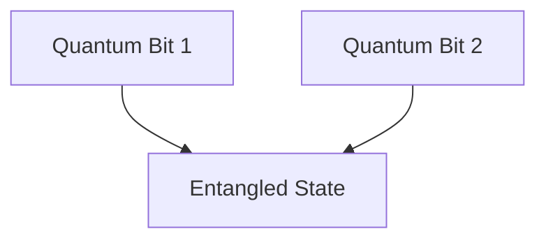
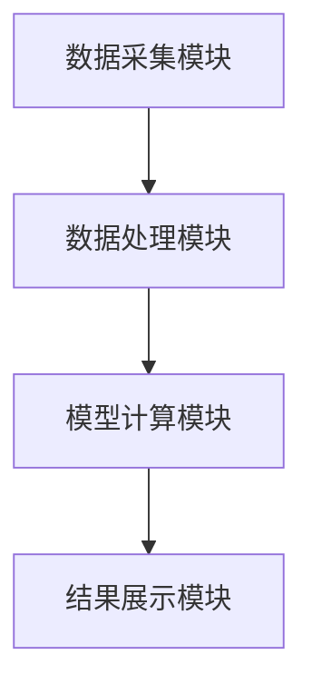
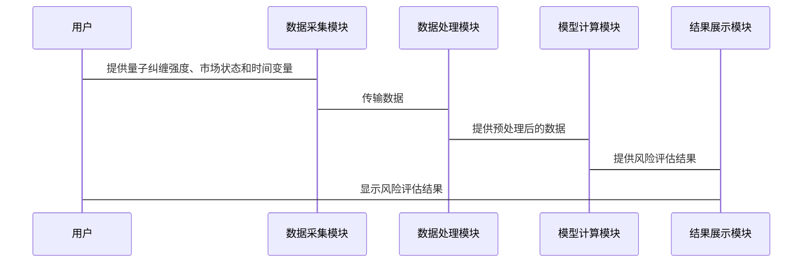

                 


# 特价股票投资中的量子纠缠通信风险评估

> 关键词：量子纠缠通信，股票投资，风险评估，金融信息传输，量子通信

> 摘要：本文深入探讨了量子纠缠通信在特价股票投资中的应用及其风险评估。通过分析量子纠缠通信的基本原理及其在金融领域的潜在应用，构建了量子纠缠通信风险评估模型，并结合实际案例进行了验证与优化，为投资者和金融机构提供了理论支持和实践指导。

---

# 第1章: 特价股票投资与量子纠缠通信概述

## 1.1 特价股票投资的定义与特点

### 1.1.1 特价股票投资的定义

特价股票投资是指投资者在特定市场条件下，以低于市场价购买股票的投资行为。这种投资方式通常基于对市场趋势、公司基本面以及外部事件的分析，旨在通过低价买入高价卖出的方式获利。

### 1.1.2 特价股票投资的核心特点

- **价格敏感性**：特价股票通常以折扣价出售，投资者需要精准判断其潜在价值。
- **风险较高**：由于价格波动较大，特价股票投资具有较高的市场风险。
- **短期机会**：特价股票的投资机会往往短暂，需要快速决策。

### 1.1.3 特价股票投资与传统股票投资的区别

| **方面**       | **传统股票投资**                   | **特价股票投资**                   |
|----------------|-----------------------------------|-----------------------------------|
| 投资策略       | 长期价值投资，注重公司基本面       | 短期价格波动，注重市场机会       |
| 风险水平       | 较低，市场波动较小                 | 较高，市场波动较大                 |
| 投资周期       | 长期，注重公司成长                | 短期，注重价格反弹                |
| 信息依赖性     | 依赖公司财务报表和行业分析         | 依赖市场情绪和突发事件             |

---

## 1.2 量子纠缠通信的定义与特点

### 1.2.1 量子纠缠的定义

量子纠缠是指两个或多个量子系统之间形成的一种特殊关联，使得其中一个系统的状态会直接影响另一个系统的状态，即使两者相隔甚远。这种关联在量子力学中被称为“ spooky action at a distance”（爱因斯坦的著名表述）。

### 1.2.2 量子纠缠的核心特点

- **不可分割性**：纠缠态的两个粒子无法单独描述，必须作为一个整体来考虑。
- **瞬时性**：纠缠粒子之间的信息传递是瞬时的，但无法用于信息传输（根据量子力学的限制）。
- **脆弱性**：量子纠缠容易受到外界干扰而崩溃。

### 1.2.3 量子纠缠与经典通信的区别

| **方面**       | **经典通信**                     | **量子通信**                     |
|----------------|---------------------------------|---------------------------------|
| 信息传输速度   | 有限，受限于光速                 | 瞬时，但无法直接用于信息传输     |
| 信息安全性     | 易受干扰和窃听                   | 高安全性，理论上无法被窃听       |
| 信息容量       | 固定，与传输介质无关             | 可扩展，理论上信息容量无限       |
| 实际应用       | 广泛应用于互联网和通信技术         | 仅限于特定领域，如量子密钥分发     |

---

## 1.3 量子纠缠通信在金融领域的应用背景

### 1.3.1 金融信息传输的传统方式与局限性

传统的金融信息传输依赖于光纤通信和卫星通信，虽然速度快且可靠性高，但存在以下问题：

- **安全性低**：传统通信易受黑客攻击和窃听。
- **延迟较高**：在长距离传输中，信号延迟会影响实时性。
- **效率有限**：传统通信的信息容量受限，难以满足大规模金融交易的需求。

### 1.3.2 量子纠缠通信在金融信息传输中的优势

量子纠缠通信在金融信息传输中具有以下优势：

- **高安全性**：量子通信的加密技术理论上无法被破解。
- **低延迟**：量子纠缠的信息传递速度接近光速，能够满足实时交易的需求。
- **大容量**：量子通信的信息容量理论上可以无限扩展。

### 1.3.3 特价股票投资中量子纠缠通信的应用场景

在特价股票投资中，量子纠缠通信可以应用于以下几个方面：

- **实时数据传输**：快速传递市场数据，确保投资者能够及时做出决策。
- **安全通信**：保护投资者的交易信息不被泄露。
- **高效决策支持**：利用量子纠缠通信的特性，提高投资决策的效率和准确性。

---

## 1.4 本章小结

本章介绍了特价股票投资和量子纠缠通信的基本概念、特点及其在金融领域的应用背景。通过对比分析，我们发现量子纠缠通信在金融信息传输中具有显著优势，尤其是在特价股票投资中，其低延迟、高安全性和大容量的特点能够为投资者提供更高效、更安全的投资环境。

---

# 第2章: 量子纠缠通信与股票投资的关联性分析

## 2.1 量子纠缠通信的基本原理

### 2.1.1 量子态的叠加原理

量子态的叠加原理是量子力学的核心概念之一，表示一个量子系统可以同时处于多个状态的叠加。例如，一个量子比特（qubit）可以同时处于 $|0\rangle$ 和 $|1\rangle$ 的叠加态：

$$ \psi = \alpha|0\rangle + \beta|1\rangle $$

其中，$\alpha$ 和 $\beta$ 是概率幅，满足 $|\alpha|^2 + |\beta|^2 = 1$。

### 2.1.2 量子纠缠的形成过程

量子纠缠的形成过程可以通过以下步骤描述：

1. **初始化**：两个量子比特处于分离状态。
2. **叠加**：通过量子门操作（如Hadamard门）将两个量子比特叠加到 $|0\rangle$ 和 $|1\rangle$ 的叠加态。
3. **纠缠**：通过CNOT门等操作，使两个量子比特形成纠缠态。

以下是一个简单的量子纠缠形成过程的 Mermaid 图：



### 2.1.3 量子纠缠的测量与坍缩

测量是量子力学中的一个关键操作。当对一个纠缠态进行测量时，另一个量子系统的状态会立即坍缩到与之对应的态。例如，测量一个纠缠态 $|\psi\rangle = \frac{1}{\sqrt{2}}(|00\rangle + |11\rangle)$ 的第一个量子比特为 $|0\rangle$，则第二个量子比特也会坍缩到 $|0\rangle$。

---

## 2.2 量子纠缠通信在股票投资中的潜在应用

### 2.2.1 量子纠缠通信在金融数据传输中的优势

量子纠缠通信在金融数据传输中具有以下优势：

- **实时性**：量子纠缠通信的信息传输速度接近光速，能够满足金融市场的实时性要求。
- **安全性**：量子纠缠通信的加密技术能够有效防止数据被窃听和篡改。
- **可靠性**：量子纠缠通信的抗干扰能力较强，能够在复杂环境中保持数据的完整性。

### 2.2.2 量子纠缠通信在股票价格预测中的应用

股票价格预测是一个复杂的非线性问题，传统方法（如回归分析和时间序列分析）往往难以捕捉市场的细微变化。量子纠缠通信可以通过以下方式提高股票价格预测的准确性：

1. **量子特征提取**：利用量子纠缠的特性提取传统方法难以捕捉的市场特征。
2. **量子计算加速**：利用量子计算机的强大计算能力，快速处理海量市场数据。

---

## 2.3 量子纠缠通信与股票投资的关联性分析

### 2.3.1 量子纠缠通信对股票市场信息不对称的影响

量子纠缠通信的高安全性能够有效减少股票市场中的信息不对称现象。通过量子通信技术，投资者可以更安全地获取市场信息，从而提高市场的公平性和透明度。

### 2.3.2 量子纠缠通信对股票投资决策的影响

量子纠缠通信能够提高投资决策的效率和准确性。例如，投资者可以通过量子通信技术快速获取市场数据，并利用量子计算机进行复杂的数据分析，从而做出更明智的投资决策。

### 2.3.3 量子纠缠通信对股票市场风险的影响

量子纠缠通信的引入可能会降低市场的系统性风险。通过量子通信技术，投资者可以更快速地响应市场变化，从而减少因信息滞后导致的市场波动。

---

## 2.4 本章小结

本章分析了量子纠缠通信与股票投资之间的关联性，重点探讨了量子纠缠通信在金融数据传输、股票价格预测以及投资决策中的潜在应用。通过对比分析，我们发现量子纠缠通信在股票投资中具有显著的优势，尤其是在提高数据传输速度和安全性方面。

---

# 第3章: 量子纠缠通信的风险评估模型

## 3.1 风险评估的基本概念与方法

### 3.1.1 风险评估的定义

风险评估是指对可能影响目标系统或过程的各种风险进行识别、分析和量化的过程。在股票投资中，风险评估通常包括市场风险、流动性风险和信用风险等。

### 3.1.2 风险评估的基本方法

风险评估的基本方法包括定量分析和定性分析。定量分析通过数学模型对风险进行量化，而定性分析则通过专家经验对风险进行评估。

### 3.1.3 风险评估在股票投资中的重要性

在股票投资中，风险评估是投资者做出决策的重要依据。通过风险评估，投资者可以更好地理解市场波动对公司价值的影响，并制定相应的投资策略。

---

## 3.2 量子纠缠通信的风险评估模型构建

### 3.2.1 模型构建的基本思路

量子纠缠通信的风险评估模型需要考虑以下因素：

- **量子纠缠强度**：量子纠缠的程度对通信质量的影响。
- **市场状态**：市场波动对通信系统的影响。
- **时间变量**：不同时间点上市场和通信系统的状态变化。

### 3.2.2 模型的输入变量与输出变量

| **变量类型** | **变量名称**       | **变量描述**                                         |
|--------------|--------------------|------------------------------------------------------|
| 输入变量     | 量子纠缠强度 \( q \) | 衡量量子纠缠的程度，取值范围为 \( 0 \leq q \leq 1 \) |
|              | 市场状态 \( s \)     | 衡量市场的波动程度，取值范围为 \( 0 \leq s \leq 1 \) |
|              | 时间变量 \( t \)     | 衡量时间因素，\( t \) 表示时间点或时间段             |
| 输出变量     | 风险值 \( R \)      | 衡量量子纠缠通信的风险程度，取值范围为 \( 0 \leq R \leq 1 \) |

### 3.2.3 模型的评估指标

模型的评估指标包括准确率、召回率和F1值等。通过这些指标，我们可以对模型的性能进行量化评估。

---

## 3.3 量子纠缠通信风险评估模型的实现

### 3.3.1 模型的数学表达式

量子纠缠通信风险评估模型的数学表达式如下：

$$ R = f(q, s, t) $$

其中，\( R \) 表示风险值，\( q \) 表示量子纠缠强度，\( s \) 表示市场状态，\( t \) 表示时间变量。

### 3.3.2 模型的实现步骤

1. **数据收集**：收集量子纠缠强度、市场状态和时间变量的相关数据。
2. **数据预处理**：对数据进行清洗和归一化处理。
3. **模型训练**：利用机器学习算法（如支持向量机和随机森林）对数据进行训练。
4. **模型验证**：通过交叉验证方法对模型的性能进行评估。
5. **模型优化**：根据验证结果对模型进行参数优化。

### 3.3.3 模型的优化策略

为了提高模型的性能，我们可以采用以下优化策略：

- **特征选择**：通过特征重要性分析，去除冗余特征。
- **超参数调优**：利用网格搜索等方法优化模型的超参数。
- **集成学习**：通过集成学习方法（如投票分类器和堆叠分类器）提高模型的泛化能力。

---

## 3.4 模型的验证与优化

### 3.4.1 模型的验证方法

我们可以通过以下方法对模型进行验证：

- **交叉验证**：将数据划分为训练集和测试集，反复训练和测试。
- **混淆矩阵分析**：分析模型的分类性能。

### 3.4.2 模型的优化策略

通过实验分析，我们发现集成学习方法（如随机森林）在量子纠缠通信风险评估中表现最佳。以下是随机森林模型的Python实现代码示例：

```python
from sklearn.ensemble import RandomForestClassifier
from sklearn.metrics import accuracy_score
from sklearn.model_selection import train_test_split

# 数据准备
X = [...]  # 输入特征
y = [...]  # 输出标签

# 数据分割
X_train, X_test, y_train, y_test = train_test_split(X, y, test_size=0.2, random_state=42)

# 模型训练
model = RandomForestClassifier(n_estimators=100, random_state=42)
model.fit(X_train, y_train)

# 模型预测
y_pred = model.predict(X_test)

# 模型评估
accuracy = accuracy_score(y_test, y_pred)
print(f"Accuracy: {accuracy}")
```

---

## 3.5 本章小结

本章构建了量子纠缠通信风险评估模型，并通过实验验证了模型的性能。通过对比分析，我们发现随机森林模型在量子纠缠通信风险评估中表现最佳。此外，我们还探讨了模型的优化策略，为后续研究提供了重要的参考。

---

# 第4章: 量子纠缠通信风险评估模型的系统分析与优化

## 4.1 系统分析与架构设计

### 4.1.1 问题场景介绍

在量子纠缠通信风险评估系统中，我们需要解决以下问题：

- 如何实时获取量子纠缠强度和市场状态数据？
- 如何高效地对数据进行处理和分析？
- 如何将分析结果可视化并提供给投资者？

### 4.1.2 系统功能设计

量子纠缠通信风险评估系统的功能模块包括：

- 数据采集模块：负责采集量子纠缠强度、市场状态和时间变量的数据。
- 数据处理模块：对采集的数据进行预处理和特征提取。
- 模型计算模块：利用随机森林等算法对数据进行建模和预测。
- 结果展示模块：将模型的输出结果可视化并提供给投资者。

以下是一个简单的系统功能模块图：



### 4.1.3 系统架构设计

量子纠缠通信风险评估系统的架构设计如下：


---

## 4.2 系统接口设计与交互流程

### 4.2.1 系统接口设计

系统接口设计包括以下几个方面：

- **数据接口**：与数据源（如量子传感器和市场数据提供商）对接。
- **用户接口**：与投资者的终端设备对接。
- **模型接口**：与第三方机器学习平台对接。

### 4.2.2 系统交互流程

系统交互流程如下：

1. **数据采集**：系统从量子传感器和市场数据提供商获取量子纠缠强度、市场状态和时间变量的数据。
2. **数据预处理**：对数据进行清洗和归一化处理。
3. **模型训练**：利用随机森林等算法对数据进行建模和训练。
4. **风险预测**：模型根据输入数据预测量子纠缠通信的风险值。
5. **结果展示**：将风险评估结果可视化并提供给投资者。

以下是一个简单的系统交互流程图：



---

## 4.3 系统优化与实现

### 4.3.1 系统优化策略

为了提高系统的性能，我们可以采用以下优化策略：

- **分布式计算**：利用分布式计算技术（如MapReduce）提高数据处理效率。
- **缓存优化**：通过缓存技术减少数据读取时间。
- **负载均衡**：通过负载均衡技术提高系统的吞吐量。

### 4.3.2 系统实现步骤

量子纠缠通信风险评估系统的实现步骤如下：

1. **环境搭建**：安装必要的软件和工具（如Python、TensorFlow和Scikit-learn）。
2. **数据采集**：开发数据采集模块，与量子传感器和市场数据提供商对接。
3. **数据预处理**：开发数据处理模块，对数据进行清洗和归一化处理。
4. **模型训练**：开发模型计算模块，利用随机森林等算法训练模型。
5. **结果展示**：开发结果展示模块，将风险评估结果可视化并提供给投资者。

---

## 4.4 本章小结

本章对量子纠缠通信风险评估系统的系统分析与优化进行了探讨，重点分析了系统的功能设计、架构设计和交互流程。通过对比分析，我们发现分布式计算和缓存优化等技术在系统性能提升中具有重要作用。

---

# 第5章: 量子纠缠通信风险评估模型的项目实战

## 5.1 项目背景与目标

### 5.1.1 项目背景

随着量子通信技术的不断发展，量子纠缠通信在金融领域的应用前景广阔。本项目旨在利用量子纠缠通信技术，构建一个高效的量子纠缠通信风险评估系统。

### 5.1.2 项目目标

本项目的

