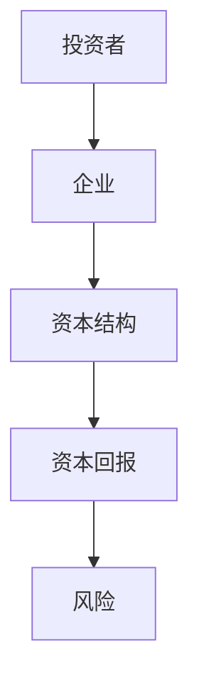

                 


# 玛丽·巴芙达的患者资本理论

## 关键词：患者资本理论，资本结构优化，内部化模型，资本回报，风险评估，系统架构设计，投资策略

## 摘要：  
本文深入分析玛丽·巴芙达的患者资本理论，从理论背景、核心概念、数学模型到系统架构设计，全面探讨其在投资决策中的应用。通过详细的案例分析和系统设计，揭示患者资本理论在实际项目中的实现方法和最佳实践，为投资者和企业提供了有效的理论指导和实践参考。

---

## 第一部分: 背景介绍

### 第1章: 患者资本理论的背景与核心概念

#### 1.1 患者资本理论的起源与发展
- **资本理论的演进历程**：从古典经济学到现代金融学，资本理论经历了从简单到复杂的演变。
- **患者资本理论的提出背景**：20世纪末，学术界和实践界逐渐认识到长期投资的重要性。
- **理论的核心观点与目标**：通过长期资本配置优化企业价值，平衡风险与收益。

#### 1.2 患者资本理论的核心概念
- **资本的定义与分类**：资本可以分为内部资本、外部资本、热钱资本等。
- **患者资本的特征与属性**：长期性、内部化、低流动性。
- **理论的边界与外延**：适用于长期投资，但不适用于短期投机。

---

## 第二部分: 核心概念与联系

### 第2章: 核心概念的原理分析

#### 2.1 内部化模型
- **内部化模型的定义**：企业通过内部化资本配置，实现资源优化。
- **内部化模型的公式**：
  $$ V = \frac{E}{1 + r} $$
  其中，$V$ 是企业价值，$E$ 是企业收益，$r$ 是资本回报率。
- **内部化模型的适用场景**：适用于企业内部资本配置和长期投资评估。

#### 2.2 资本结构优化
- **资本结构优化的目标**：在给定风险下最大化资本回报。
- **资本结构优化的公式**：
  $$ R = \frac{C}{I} $$
  其中，$R$ 是资本回报率，$C$ 是资本收益，$I$ 是初始投资。

#### 2.3 资本回报与风险关系
- **资本回报与风险的关系公式**：
  $$ R = r + \beta \times (M RP - r) $$
  其中，$\beta$ 是贝塔系数，$M RP$ 是市场风险溢价。

---

### 第3章: 核心概念对比与ER实体关系图

#### 3.1 核心概念对比表格
| 概念 | 特征 | 描述 |
|------|------|------|
| 患者资本 | 长期性 | 投资者注重长期价值而非短期收益 |
| 热钱资本 | 短期性 | 投资者追求快速收益 |
| 内部资本 | 内部化 | 资本与企业深度绑定 |

#### 3.2 ER实体关系图


---

## 第三部分: 数学模型与算法原理

### 第4章: 内部化模型的数学推导

#### 4.1 内部化模型公式
$$ V = \frac{E}{1 + r} $$
其中，$V$ 是企业价值，$E$ 是企业收益，$r$ 是资本回报率。

#### 4.2 模型的适用场景
- 长期投资评估
- 资本结构优化

---

### 第5章: 资本回报与风险关系的算法

#### 5.1 资本回报公式
$$ R = \frac{C}{I} $$
其中，$R$ 是资本回报率，$C$ 是资本收益，$I$ 是初始投资。

#### 5.2 风险评估公式
$$ R = r + \beta \times (M RP - r) $$
其中，$\beta$ 是贝塔系数，$M RP$ 是市场风险溢价。

---

## 第四部分: 系统分析与架构设计

### 第6章: 系统功能设计

#### 6.1 问题场景描述
- 投资者需要长期评估企业价值
- 企业需要优化资本结构

#### 6.2 领域模型


---

### 第7章: 系统架构设计

#### 7.1 架构图
```mer
graph LR
    A[投资者] --> B[企业]
    B --> C[资本结构]
    C --> D[资本回报]
    D --> E[风险]
```

---

## 第五部分: 项目实战

### 第8章: 项目实战与案例分析

#### 8.1 环境安装
- 安装Python和相关库（如NumPy、Matplotlib）。

#### 8.2 核心实现代码
```python
def calculate_value(E, r):
    return E / (1 + r)

def calculate_return(C, I):
    return C / I

# 示例数据
E = 1000
r = 0.05
C = 500
I = 1000

value = calculate_value(E, r)
return_rate = calculate_return(C, I)

print(f"企业价值: {value}")
print(f"资本回报率: {return_rate}")
```

#### 8.3 案例分析
- 输入数据：企业收益 $E = 1000$，资本回报率 $r = 5\%$，资本收益 $C = 500$，初始投资 $I = 1000$。
- 输出结果：企业价值 $V = 1000 / 1.05 \approx 952.38$，资本回报率 $R = 500 / 1000 = 5\%$。

---

## 第六部分: 总结与展望

### 第9章: 总结与展望

#### 9.1 小结
- 患者资本理论通过长期资本配置优化企业价值，平衡风险与收益。
- 内部化模型和资本回报公式是理论的核心工具。

#### 9.2 注意事项
- 投资者需根据实际情况调整模型参数。
- 企业需结合自身特点优化资本结构。

#### 9.3 拓展阅读
- 《投资学基础》
- 《资本论》

---

## 作者：AI天才研究院 & 禅与计算机程序设计艺术

