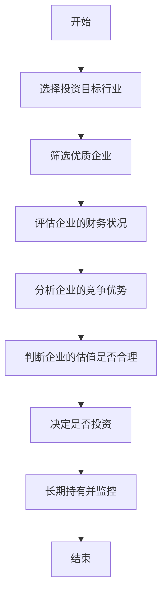
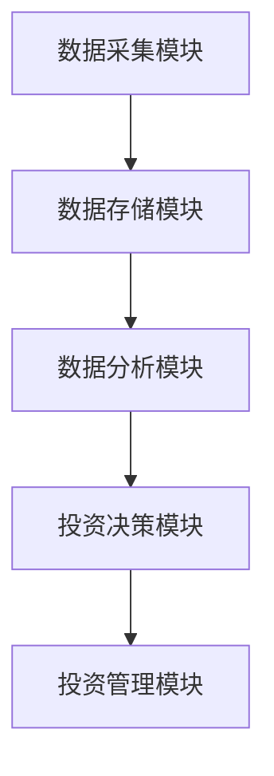

                 


# 玛丽·巴芙达的质量投资：寻找优质企业

> **关键词**：质量投资、玛丽·巴芙达、优质企业、投资策略、财务分析  
> 
> **摘要**：本文深入探讨了玛丽·巴芙达的质量投资理念，分析了她寻找优质企业的核心方法论，结合实际案例和系统设计，为读者提供了从理论到实践的全面指导。通过详细阐述质量投资的标准、算法原理和系统架构，本文旨在帮助读者掌握高质量企业的识别方法，并在实际投资中应用这些策略。

---

## 第1章：质量投资的背景与核心理念

### 1.1 投资的基本概念与重要性

#### 1.1.1 投资的基本概念
投资是通过将资金投入到企业、项目或金融资产中，以期获得未来收益的行为。投资的本质在于通过价值创造或资本增值实现财富增长。投资的种类包括股票、债券、房地产、私募基金等多种形式。

#### 1.1.2 玛丽·巴芙达的背景与成就
玛丽·巴芙达（Mary Buffett）是全球著名的投资专家，被誉为“巴菲特的女婿”。她继承了巴菲特的价值投资理念，并进一步发展了自己的质量投资方法。她通过长期持有优质企业股票，实现了超越市场的投资收益。

#### 1.1.3 投资在个人与企业中的作用
对于个人而言，投资是实现财富增值的重要手段；对企业而言，投资是优化资产配置、实现可持续发展的关键策略。质量投资通过关注企业的内在价值，帮助投资者在长期获得超额收益。

---

### 1.2 质量投资的核心概念与标准

#### 1.2.1 质量投资的定义与特点
质量投资是一种以企业质量为核心的投资策略。它强调通过分析企业的财务状况、竞争优势和市场地位，选择那些具有持续盈利能力的优质企业进行投资。

#### 1.2.2 玛丽·巴芙达的质量投资标准
玛丽·巴芙达提出了一套系统的企业质量评估标准，包括以下五个维度：
1. **财务健康**：企业是否有稳定的现金流、健康的资产负债表和可持续的盈利能力。
2. **竞争优势**：企业是否具有独特的竞争优势，例如品牌、技术或成本优势。
3. **管理团队**：企业管理层是否具备优秀的能力和诚信。
4. **行业地位**：企业在行业中的地位是否稳固，是否具有龙头效应。
5. **估值合理**：企业的估值是否合理，是否具有长期增值潜力。

#### 1.2.3 质量投资与价值投资的区别
价值投资关注的是市场的非理性波动和企业内在价值的低估，而质量投资更注重企业的内在质量和长期盈利能力。质量投资是对企业未来价值的判断，而不仅仅是对当前价格的分析。

---

## 第2章：质量投资的核心方法论

### 2.1 玛丽·巴芙达的投资策略

#### 2.1.1 长期投资与价值发现
玛丽·巴芙达强调长期投资的重要性，认为短期市场的波动不应影响投资者的决策。她主张通过长期持有优质企业股票，分享企业的成长收益。

#### 2.1.2 买入并持有的策略
质量投资的核心是买入并持有优质企业的股票，通过企业的长期增长实现资本增值。这种策略要求投资者对企业有深入了解，并具备长期持有的耐心。

#### 2.1.3 高质量企业的筛选标准
玛丽·巴芙达提出了一个系统的企业筛选标准，包括以下几个方面：
- **盈利能力**：企业是否具备持续的盈利能力。
- **财务状况**：企业的财务是否健康，是否具备抗风险能力。
- **竞争优势**：企业是否具备独特的竞争优势。
- **管理团队**：企业管理层是否具备优秀的能力和诚信。

---

### 2.2 质量投资的数学模型与分析工具

#### 2.2.1 财务指标分析模型
玛丽·巴芙达常用以下财务指标来评估企业的质量：
- **市盈率（P/E）**：市盈率 = 股价 / 每股净利润。市盈率低的企业可能具有投资价值。
- **市净率（P/B）**：市净率 = 股价 / 每股净资产。市净率低的企业可能被市场低估。
- **现金流**：企业是否具备稳定的现金流，现金流是企业健康的重要指标。

#### 2.2.2 算法原理与流程图
以下是质量投资的算法流程图：



#### 2.2.3 投资组合的构建与优化
玛丽·巴芙达建议投资者通过分散投资来降低风险。她推荐将资金分配到不同行业和不同规模的企业中，以实现投资组合的优化。

---

## 第3章：质量投资的系统分析与架构设计

### 3.1 投资系统的整体架构

#### 3.1.1 系统目标与范围
投资系统的目标是通过对企业质量的评估，帮助投资者选择优质企业进行投资。系统的范围包括数据采集、分析、决策支持和投资管理。

#### 3.1.2 系统功能模块划分
投资系统主要包括以下几个功能模块：
1. **数据采集模块**：收集企业的财务数据、市场数据和行业数据。
2. **数据分析模块**：对企业的质量进行评估和分析。
3. **投资决策模块**：根据分析结果制定投资策略。
4. **投资管理模块**：监控投资组合并进行调整。

#### 3.1.3 系统架构的层次结构
以下是投资系统的架构图：



---

## 第4章：质量投资的项目实战

### 4.1 环境安装与配置

#### 4.1.1 投资分析工具的安装
安装常用的财务分析工具，例如Excel、Python、Matplotlib等。

#### 4.1.2 数据库的搭建与配置
搭建MySQL数据库，用于存储企业的财务数据和分析结果。

#### 4.1.3 系统环境的优化
优化系统性能，确保数据处理和分析的高效性。

---

### 4.2 核心功能的实现

#### 4.2.1 企业质量评估的实现
编写Python脚本，实现对企业财务数据的分析和评估。

```python
def calculate_P_E(stock_price, earnings_per_share):
    return stock_price / earnings_per_share

# 示例计算
stock_price = 100
earnings_per_share = 10
pe_ratio = calculate_P_E(stock_price, earnings_per_share)
print(f"市盈率 = {pe_ratio}")
```

#### 4.2.2 投资策略制定的实现
根据企业的质量评估结果，制定投资策略。

#### 4.2.3 风险管理与监控的实现
建立风险管理机制，定期监控投资组合的表现。

---

### 4.3 代码实现与解读

#### 4.3.1 数据分析与处理的代码
```python
import pandas as pd

# 读取数据
data = pd.read_csv('stock_data.csv')

# 计算市盈率
data['PE'] = data['股价'] / data['每股收益']
```

#### 4.3.2 投资策略的实现代码
```python
def investment_strategy(data):
    # 筛选市盈率低于行业平均水平的企业
    industry_pe = data['PE'].mean()
    selected_stocks = data[data['PE'] < industry_pe]
    return selected_stocks

# 示例调用
selected_stocks = investment_strategy(data)
print(selected_stocks)
```

---

## 第5章：质量投资的最佳实践与注意事项

### 5.1 实际案例分析
以苹果公司为例，分析玛丽·巴芙达的质量投资策略如何应用于实际投资。

### 5.2 投资策略的调整与优化
根据市场变化和企业情况，定期调整投资组合。

### 5.3 风险管理与心理建设
投资者需要具备长期持有的耐心，并做好心理准备应对市场的波动。

---

## 第6章：总结与展望

### 6.1 总结
质量投资是一种以企业质量为核心的投资策略，通过长期持有优质企业股票，实现资本的长期增值。玛丽·巴芙达的投资理念为我们提供了系统的指导和实践方法。

### 6.2 展望
随着市场的发展和技术的进步，质量投资将更加注重企业的创新能力和可持续发展能力。未来的投资策略需要结合更多的数据和分析工具，以应对更加复杂的市场环境。

---

## 作者

**作者：AI天才研究院/AI Genius Institute & 禅与计算机程序设计艺术 /Zen And The Art of Computer Programming**

