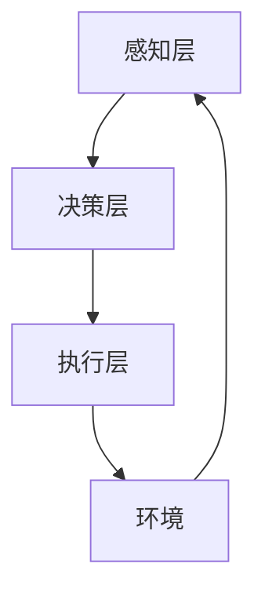

                 


# 理解AI Agent：定义、特征与基本原理

> 关键词：AI Agent, 人工智能, 智能系统, 强化学习, 自主决策, 反应式系统

> 摘要：本文深入探讨AI Agent的核心概念、特征和基本原理，通过背景介绍、核心概念、算法原理、系统架构、项目实战和最佳实践等多维度分析，帮助读者全面理解AI Agent的设计与实现。

---

## 第1章：AI Agent 的背景与概念

### 1.1 AI Agent 的起源与现状

#### 1.1.1 AI Agent 的起源
人工智能（AI）的概念最早可以追溯到20世纪50年代，但AI Agent的概念是在80年代末期逐渐形成的。AI Agent是一种能够感知环境、自主决策并执行任务的智能实体。早期的专家系统和知识推理系统为AI Agent的发展奠定了基础。

#### 1.1.2 当前发展现状
如今，AI Agent已广泛应用于多个领域：
- **学术界**：研究集中在强化学习、多智能体系统和人机交互。
- **工业界**：在自动驾驶、智能助手、机器人等领域有广泛应用。
- **开源社区**：如OpenAI的GPT系列和深度求索（DeepMind）的Alpha系列，推动了AI Agent技术的普及。

#### 1.1.3 未来趋势
未来，AI Agent将朝着多模态、可解释性和人机协作的方向发展。AI Agent将更注重与人类的协作，解决复杂问题。

---

### 1.2 AI Agent 的核心概念

#### 1.2.1 AI Agent 的定义
AI Agent是一种能够感知环境、自主决策并执行任务的智能实体。它通过与环境交互，实现目标。

#### 1.2.2 核心特征对比
| 特征 | 描述 |
|------|------|
| 自主性 | 能够独立决策，无需外部干预 |
| 反应性 | 根据环境反馈实时调整行为 |
| 目标驱动性 | 通过实现目标来优化行为 |
| 社会性 | 能与其他智能体或人类协作 |

---

## 第2章：AI Agent 的基本原理

### 2.1 感知与决策过程

#### 2.1.1 感知层
AI Agent通过传感器或API获取环境信息，并将其转化为可处理的数据。

#### 2.1.2 决策层
基于感知信息，AI Agent选择最优动作。常见的决策算法包括Q-learning和深度强化学习。

#### 2.1.3 执行层
AI Agent执行决策动作，并观察环境反馈，用于后续优化。

### 2.2 核心算法原理

#### 2.2.1 Q-learning算法
Q-learning是一种经典的强化学习算法，通过状态-动作表格更新策略。

```python
def q_learning():
    initialize Q(s, a) for all s, a
    while True:
        observe state s
        choose action a from Q(s, ·)
        take action a, get reward r and next state s'
        Q(s, a) = Q(s, a) + α(r + γ * max Q(s', ·))
```

其数学模型为：
$$ Q(s, a) = Q(s, a) + \alpha (r + \gamma \cdot \max Q(s', a')) $$

#### 2.2.2 状态空间与动作空间
状态空间（S）是所有可能状态的集合，动作空间（A）是所有可能动作的集合。AI Agent通过状态转移模型学习策略。

---

## 第3章：AI Agent 的系统架构

### 3.1 系统构成

#### 3.1.1 感知层
通过传感器或API获取环境数据。

#### 3.1.2 决策层
基于感知信息，选择最优动作。

#### 3.1.3 执行层
执行决策动作，并观察反馈。

### 3.2 系统架构设计

#### 3.2.1 系统功能设计
- 环境感知
- 状态识别
- 动作选择
- 反馈处理

#### 3.2.2 系统架构图


---

## 第4章：AI Agent 的项目实战

### 4.1 项目背景

#### 4.1.1 项目目标
设计一个智能助手，帮助用户完成日常任务。

#### 4.1.2 项目环境
安装Python、TensorFlow和OpenAI库。

### 4.2 核心代码实现

#### 4.2.1 环境感知
```python
def get_environment_state():
    # 获取环境数据
    return state
```

#### 4.2.2 动作选择
```python
def choose_action(state):
    # 选择最优动作
    return action
```

#### 4.2.3 反馈处理
```python
def process_feedback(feedback):
    # 更新模型参数
    pass
```

### 4.3 案例分析

#### 4.3.1 功能解读
智能助手通过感知用户需求，选择最优动作，如发送邮件或提醒任务。

#### 4.3.2 案例分析
分析智能助手在不同场景下的表现，优化算法参数。

---

## 第5章：AI Agent 的最佳实践

### 5.1 设计注意事项

#### 5.1.1 数据质量
确保训练数据的多样性和代表性。

#### 5.1.2 算法选择
根据任务需求选择合适的算法，如Q-learning或强化学习。

#### 5.1.3 系统安全性
确保系统在运行过程中的安全性和稳定性。

---

## 第6章：小结

AI Agent是一种强大的工具，通过感知、决策和执行实现智能目标。理解其定义、特征和基本原理，有助于我们更好地设计和实现AI Agent系统。

---

作者：AI天才研究院 & 禅与计算机程序设计艺术

