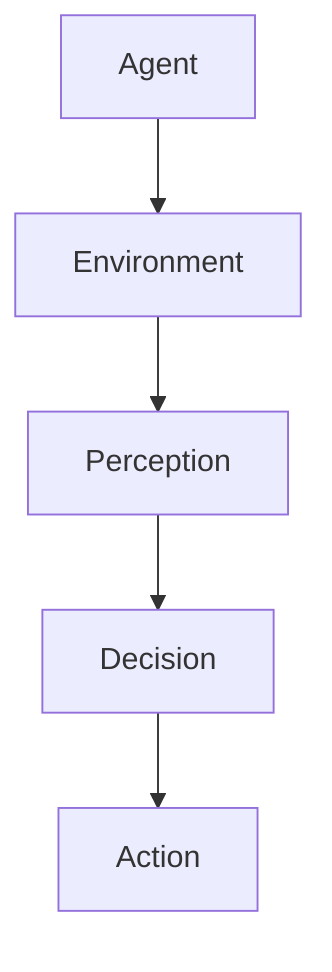
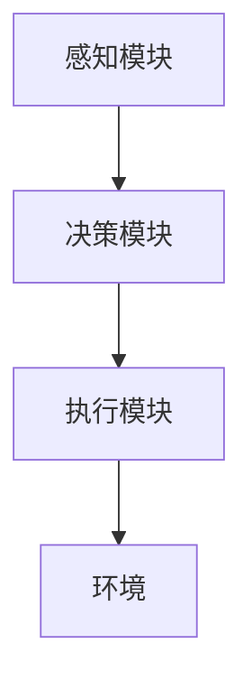
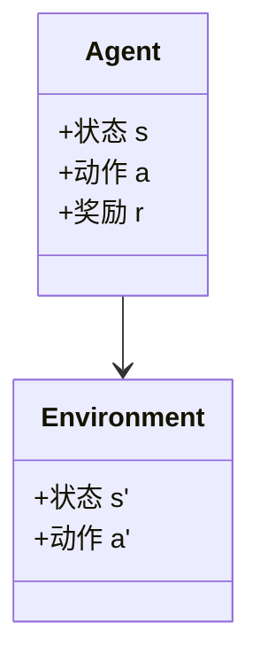

                 


# 理解AI Agent：核心概念与基本原理

> 关键词：AI Agent, 强化学习, 决策机制, 系统架构, 实际应用

> 摘要：本文将从AI Agent的基本概念、核心原理、算法实现、系统架构到实际应用进行全面解析，帮助读者深入理解AI Agent的核心概念与基本原理。

---

## 第1章: AI Agent的背景与基本概念

### 1.1 AI Agent的定义与特点

#### 1.1.1 AI Agent的定义
AI Agent（人工智能代理）是一种能够感知环境、自主决策并采取行动以实现目标的智能实体。它可以是一个软件程序，也可以是一个物理设备，其核心目标是通过与环境交互来完成特定任务。

#### 1.1.2 AI Agent的核心特点
- **自主性**：AI Agent能够在没有外部干预的情况下独立运行。
- **反应性**：能够实时感知环境并做出反应。
- **目标导向性**：所有行为都以实现特定目标为导向。
- **学习能力**：能够通过经验改进自身的决策能力。

#### 1.1.3 AI Agent与相关概念的区分
- **智能体（Agent）**：AI Agent是智能体的一种，但AI Agent强调基于人工智能的技术实现。
- **传统程序**：传统程序依赖于明确的规则和逻辑，而AI Agent能够通过学习和适应来处理复杂问题。

#### 1.1.4 AI Agent的分类与应用场景
- **简单反射型Agent**：基于当前感知做出反应，适用于简单任务。
- **基于模型的反射型Agent**：利用内部模型进行决策，适用于复杂任务。
- **目标驱动型Agent**：基于目标进行决策和行动，适用于复杂场景。
- **实用驱动型Agent**：通过最大化效用函数进行决策，适用于优化问题。

---

### 1.2 AI Agent的核心概念

#### 1.2.1 感知、决策、行动的统一
AI Agent通过感知环境获取信息，基于感知信息做出决策，并通过行动影响环境。这三个过程是AI Agent的核心循环。

#### 1.2.2 AI Agent的内部机制
AI Agent的内部机制包括：
- **感知模块**：负责接收和处理环境输入。
- **决策模块**：基于感知信息生成行动计划。
- **行动模块**：执行决策模块生成的行动。

#### 1.2.3 AI Agent的外部环境交互
AI Agent与外部环境的交互是通过传感器和执行器完成的。传感器负责感知环境，执行器负责执行行动。

---

## 第2章: AI Agent的核心概念与联系

### 2.1 AI Agent的核心概念原理

#### 2.1.1 感知机制
感知机制是AI Agent获取环境信息的关键。常见的感知方式包括：
- **视觉感知**：通过摄像头获取图像信息。
- **听觉感知**：通过麦克风获取音频信息。
- **触觉感知**：通过传感器获取物理接触信息。

#### 2.1.2 决策机制
决策机制是AI Agent的核心部分，负责根据感知信息生成行动计划。常见的决策方法包括：
- **规则驱动**：基于预定义的规则进行决策。
- **基于模型**：利用数学模型进行决策。
- **基于学习**：通过机器学习算法进行决策。

#### 2.1.3 行动机制
行动机制是AI Agent通过执行器对外界施加影响的过程。常见的执行器包括：
- **执行器**：如马达、扬声器等。
- **软件执行器**：如发送消息、修改数据等。

### 2.2 AI Agent的概念属性特征对比表格

| 概念   | 属性       | 特征                           |
|--------|------------|--------------------------------|
| 感知   | 输入       | 数据采集与处理                 |
| 决策   | 计算       | 策略生成与选择                 |
| 行动   | 输出       | 动作执行与反馈                 |

### 2.3 AI Agent的ER实体关系图



---

## 第3章: AI Agent的算法原理

### 3.1 AI Agent的核心算法

#### 3.1.1 强化学习算法
强化学习是一种通过试错机制来优化决策策略的方法。AI Agent通过与环境交互，逐步学习最优策略。

#### 3.1.2 监督学习算法
监督学习是一种通过标注数据进行训练的方法。AI Agent通过学习标注数据，生成预测结果。

#### 3.1.3 无监督学习算法
无监督学习是一种通过发现数据内在结构进行训练的方法。AI Agent通过发现数据的规律，生成新的知识。

### 3.2 基于强化学习的AI Agent算法

#### 3.2.1 Q-learning算法
Q-learning是一种经典的强化学习算法，适用于离散状态和动作空间的问题。

- **算法步骤**：
  1. 初始化Q表。
  2. 选择动作。
  3. 执行动作并获取奖励。
  4. 更新Q表。
  5. 重复上述步骤直到收敛。

- **算法公式**：
  $$ Q(s, a) = r + \gamma \max Q(s', a') $$

其中：
- \( Q(s, a) \)：状态-动作对的价值
- \( r \)：即时奖励
- \( \gamma \)：折扣因子
- \( Q(s', a') \)：后续状态-动作对的价值

### 3.3 强化学习数学模型

#### 3.3.1 状态空间
状态空间是所有可能状态的集合，表示环境的状态。

#### 3.3.2 动作空间
动作空间是所有可能动作的集合，表示AI Agent可以执行的动作。

#### 3.3.3 奖励函数
奖励函数是定义在状态-动作对上的函数，表示执行某个动作后所获得的奖励。

#### 3.3.4 策略
策略是AI Agent在给定状态下选择动作的概率分布。

---

## 第4章: AI Agent的系统分析与架构设计

### 4.1 AI Agent的系统架构

#### 4.1.1 分层架构
分层架构将AI Agent的系统划分为多个层次，每个层次负责不同的功能。

- **感知层**：负责感知环境信息。
- **决策层**：负责生成行动计划。
- **执行层**：负责执行行动计划。

#### 4.1.2 模块化设计
模块化设计将AI Agent的系统划分为多个模块，每个模块负责不同的功能。

- **感知模块**：负责接收和处理环境输入。
- **决策模块**：负责生成行动计划。
- **执行模块**：负责执行行动计划。

### 4.2 AI Agent的系统架构图



### 4.3 AI Agent的系统功能设计

#### 4.3.1 领域模型
领域模型是AI Agent所处领域的抽象表示，用于描述领域中的实体及其关系。



#### 4.3.2 系统架构
系统架构是AI Agent的总体结构，描述系统中各个模块之间的关系。


---

## 第5章: AI Agent的项目实战

### 5.1 环境安装与配置

#### 5.1.1 环境需求
- **Python**：3.6+
- **TensorFlow**：2.0+
- **OpenAI Gym**：0.15.0

#### 5.1.2 安装步骤
```bash
pip install numpy
pip install gym
pip install tensorflow
```

### 5.2 核心代码实现

#### 5.2.1 Q-learning算法实现

```python
import numpy as np
import gym

# 初始化环境
env = gym.make('CartPole-v0')
env.seed(1)
np.random.seed(1)

# 初始化Q表
Q = np.zeros([env.observation_space.shape[0], env.action_space.n])

# 参数设置
alpha = 0.1
gamma = 0.9
epsilon = 0.1

# Q-learning算法
for episode in range(1000):
    state = env.reset()
    for _ in range(1000):
        # 选择动作
        if np.random.random() < epsilon:
            action = np.random.randint(0, env.action_space.n)
        else:
            action = np.argmax(Q[state])
        
        # 执行动作
        next_state, reward, done, _ = env.step(action)
        
        # 更新Q表
        Q[state, action] += alpha * (reward + gamma * np.max(Q[next_state]) - Q[state, action])
        
        state = next_state
        if done:
            break
```

### 5.3 功能解读与分析

#### 5.3.1 状态空间
状态空间是所有可能状态的集合，表示环境的状态。

#### 5.3.2 动作空间
动作空间是所有可能动作的集合，表示AI Agent可以执行的动作。

#### 5.3.3 奖励函数
奖励函数是定义在状态-动作对上的函数，表示执行某个动作后所获得的奖励。

### 5.4 实际案例分析

#### 5.4.1 案例背景
本案例以CartPole-v0环境为例，展示Q-learning算法在AI Agent中的应用。

#### 5.4.2 案例分析
通过Q-learning算法，AI Agent能够逐步学会控制小车保持平衡。

#### 5.4.3 代码实现
```python
# 初始化环境
env = gym.make('CartPole-v0')
env.seed(1)
np.random.seed(1)

# 初始化Q表
Q = np.zeros([env.observation_space.shape[0], env.action_space.n])

# 参数设置
alpha = 0.1
gamma = 0.9
epsilon = 0.1

# Q-learning算法
for episode in range(1000):
    state = env.reset()
    for _ in range(1000):
        # 选择动作
        if np.random.random() < epsilon:
            action = np.random.randint(0, env.action_space.n)
        else:
            action = np.argmax(Q[state])
        
        # 执行动作
        next_state, reward, done, _ = env.step(action)
        
        # 更新Q表
        Q[state, action] += alpha * (reward + gamma * np.max(Q[next_state]) - Q[state, action])
        
        state = next_state
        if done:
            break
```

### 5.5 项目小结

通过本案例，我们可以看到AI Agent的核心算法在实际应用中的具体实现。Q-learning算法通过不断与环境交互，逐步优化自身的决策策略，最终实现目标。

---

## 第6章: 最佳实践与注意事项

### 6.1 最佳实践

#### 6.1.1 算法选择
根据具体问题选择合适的算法，如强化学习适用于需要试错的问题，监督学习适用于有标注数据的问题。

#### 6.1.2 系统设计
系统设计要注重模块化和可扩展性，方便后续优化和维护。

#### 6.1.3 环境配置
确保环境配置正确，避免因为环境问题导致算法无法正常运行。

### 6.2 小结

通过本文的讲解，我们深入理解了AI Agent的核心概念与基本原理，从算法实现到系统架构，再到实际应用，为读者提供了全面的指导。

### 6.3 注意事项

- **算法选择**：根据具体问题选择合适的算法。
- **系统设计**：注重模块化和可扩展性。
- **环境配置**：确保环境配置正确。

### 6.4 拓展阅读

- 《Reinforcement Learning: Theory and Algorithms》
- 《Deep Learning: Methods and Applications》
- 《Artificial Intelligence: A Modern Approach》

---

## 作者信息

作者：AI天才研究院/AI Genius Institute & 禅与计算机程序设计艺术 /Zen And The Art of Computer Programming

---

通过本文的详细讲解，我们希望读者能够深入理解AI Agent的核心概念与基本原理，并能够在实际应用中灵活运用这些知识。

