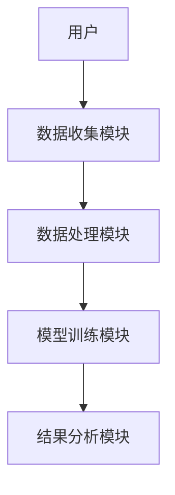

                 


# 用户反馈分析：从用户视角优化AI Agent

## 关键词：用户反馈分析、AI Agent、用户体验优化、情感分析、机器学习、用户行为分析

## 摘要：  
本文深入探讨了用户反馈分析在优化AI Agent中的关键作用。通过分析用户的反馈数据，我们可以更好地理解用户需求和偏好，从而提升AI Agent的性能和用户体验。文章从背景介绍、核心概念、算法原理、系统架构到项目实战，全面解析了用户反馈分析的方法和实践。通过具体案例和代码实现，展示了如何从用户视角优化AI Agent，使其更加智能和高效。

---

# 第1章：用户反馈分析的背景与重要性

## 1.1 用户反馈分析的背景

### 1.1.1 数字化产品中的用户反馈概念
在数字化产品中，用户反馈是用户对产品或服务的评价、建议或投诉。这些反馈通常以文本、评分或行为数据的形式存在，是理解用户需求的重要来源。

### 1.1.2 AI Agent的崛起与用户反馈的重要性
AI Agent（智能代理）是一种能够执行任务的计算机程序，它通过与用户的交互来提供服务。随着AI技术的发展，AI Agent在各个领域的应用越来越广泛。然而，AI Agent的性能依赖于数据和算法，而用户反馈是优化这些数据和算法的关键。

### 1.1.3 用户反馈分析的定义与范围
用户反馈分析是通过对用户反馈数据的收集、处理和分析，提取有价值的信息，用于改进产品或服务的过程。其范围包括情感分析、行为分析、偏好分析等。

## 1.2 用户反馈分析的必要性

### 1.2.1 提升用户体验的核心作用
用户反馈分析可以帮助开发者理解用户的需求和痛点，从而优化产品设计，提升用户体验。

### 1.2.2 优化AI Agent性能的关键性
通过分析用户反馈，可以发现AI Agent在交互中的不足，例如响应速度慢、理解错误等，从而优化其算法和模型。

### 1.2.3 数据驱动决策的优势
用户反馈分析提供了一种数据驱动的方法，通过量化用户需求和偏好，帮助开发者做出科学的决策。

---

# 第2章：用户反馈分析的核心概念

## 2.1 用户反馈的分类与特征

### 2.1.1 正面反馈、负面反馈与中性反馈
- **正面反馈**：用户对AI Agent的表现表示满意或认可。
- **负面反馈**：用户对AI Agent的表现表示不满或失望。
- **中性反馈**：用户对AI Agent的表现没有明显的正面或负面情绪。

### 2.1.2 显性反馈与隐性反馈的对比
- **显性反馈**：用户明确表达的反馈，例如评分、直接评价。
- **隐性反馈**：用户通过行为（如点击、停留时间）间接表达的反馈。

### 2.1.3 用户行为数据与情感数据的关联
用户行为数据（如点击、滑动）可以反映用户的偏好和情绪。例如，用户快速滑动页面可能表示对内容不感兴趣。

## 2.2 用户反馈分析的关键指标

### 2.2.1 用户满意度（NPS、CSAT）
- **NPS**（净推荐值）：用户推荐产品或服务给他人时的评分。
- **CSAT**（客户满意度）：用户对产品或服务的满意度评分。

### 2.2.2 用户留存率与流失率
用户留存率反映了用户对产品的忠诚度，流失率则反映了用户对产品的不满意程度。

### 2.2.3 用户反馈的及时性与准确性
及时收集和处理用户反馈可以快速优化AI Agent，而准确的反馈分析则能确保优化方向的正确性。

---

# 第3章：AI Agent的用户反馈分析模型

## 3.1 用户反馈分析模型的构建

### 3.1.1 数据收集模块的设计
数据收集模块需要从多个渠道（如用户评价、日志数据）收集反馈数据，并进行初步的清洗和预处理。

### 3.1.2 数据预处理与清洗方法
- **文本清洗**：去除噪声（如停用词、标点符号）。
- **数据归一化**：将不同来源的数据统一格式。

### 3.1.3 模型训练与优化策略
使用机器学习算法（如情感分析模型）对反馈数据进行训练，优化模型的准确性和鲁棒性。

## 3.2 用户反馈分析的关键算法

### 3.2.1 情感分析算法（如SVM、LSTM）
- **SVM**（支持向量机）：用于分类任务，可以将情感分析任务分为正面、负面、中性。
- **LSTM**（长短期记忆网络）：用于处理序列数据，适用于复杂的情感分析任务。

### 3.2.2 反馈分类算法（如随机森林、朴素贝叶斯）
- **随机森林**：一种集成学习方法，适用于分类任务。
- **朴素贝叶斯**：基于概率论的分类算法，适用于文本分类任务。

### 3.2.3 用户行为预测模型（如协同过滤）
协同过滤是一种基于用户行为的推荐算法，可以预测用户的偏好和行为趋势。

---

# 第4章：用户反馈分析的算法实现

## 4.1 情感分析算法

### 4.1.1 基于词袋模型的情感分析
词袋模型将文本表示为词汇的集合，忽略词序。情感分析基于这些词汇的权重进行分类。

### 4.1.2 基于词嵌入（如Word2Vec）的情感分析
Word2Vec将词汇表示为向量，捕捉词汇之间的语义关系。情感分析基于这些向量进行分类。

### 4.1.3 深度学习模型（如LSTM）
LSTM是一种循环神经网络，适用于处理长序列数据。情感分析任务中，LSTM可以捕捉文本的情感变化。

## 4.2 情感分析的实现代码

```python
from sklearn.svm import SVC
from sklearn.feature_extraction.text import TfidfVectorizer
import pandas as pd

# 数据加载
data = pd.read_csv('feedback.csv')
X = data['text']
y = data['label']

# 特征提取
vectorizer = TfidfVectorizer()
X_vec = vectorizer.fit_transform(X)

# 模型训练
model = SVC()
model.fit(X_vec, y)

# 预测与评估
from sklearn.metrics import accuracy_score
y_pred = model.predict(X_vec)
print('Accuracy:', accuracy_score(y, y_pred))
```

---

# 第5章：用户反馈分析的系统设计

## 5.1 系统架构设计

### 5.1.1 系统架构图


### 5.1.2 功能模块设计
- **数据收集模块**：从多个渠道收集用户反馈数据。
- **数据处理模块**：清洗和预处理数据，提取特征。
- **模型训练模块**：使用机器学习算法训练模型，优化性能。
- **结果分析模块**：分析模型输出，生成优化建议。

---

# 第6章：用户反馈分析的项目实战

## 6.1 项目背景与目标
本项目旨在通过用户反馈分析，优化一个智能客服AI Agent的性能，提升用户体验。

## 6.2 环境配置与数据加载

```python
# 安装依赖
pip install scikit-learn nltk pandas

# 数据加载
import pandas as pd
data = pd.read_csv('feedback.csv')
```

## 6.3 数据预处理与特征提取

```python
from sklearn.feature_extraction.text import TfidfVectorizer
import nltk

nltk.download('stopwords')
vectorizer = TfidfVectorizer(stop_words='english')
X_vec = vectorizer.fit_transform(data['text'])
```

## 6.4 模型训练与优化

```python
from sklearn.svm import SVC
from sklearn.metrics import accuracy_score

model = SVC()
model.fit(X_vec, data['label'])
y_pred = model.predict(X_vec)
print('Accuracy:', accuracy_score(data['label'], y_pred))
```

---

# 第7章：优化与进阶

## 7.1 模型优化策略
- **超参数调优**：使用网格搜索优化模型参数。
- **集成学习**：结合多种算法的结果，提升模型性能。
- **深度学习模型**：使用更复杂的深度学习模型（如BERT）进行情感分析。

## 7.2 复杂场景的处理
- **多语言支持**：处理多种语言的用户反馈。
- **实时反馈分析**：在实时交互中快速处理用户反馈，优化AI Agent的响应。

## 7.3 未来趋势
随着AI技术的发展，用户反馈分析将更加智能化和自动化。未来的优化方向包括：
- 更加精准的情感分析模型。
- 结合用户行为数据的多模态分析。

---

# 第8章：总结与展望

## 8.1 全文总结
用户反馈分析是优化AI Agent的重要手段。通过分析用户反馈数据，我们可以更好地理解用户需求，优化模型性能，提升用户体验。

## 8.2 未来展望
随着技术的进步，用户反馈分析将更加智能化和个性化。未来的优化方向包括：
- 更加精准的情感分析模型。
- 结合用户行为数据的多模态分析。
- 实时反馈分析的应用场景扩展。

---

# 作者：AI天才研究院/AI Genius Institute & 禅与计算机程序设计艺术 /Zen And The Art of Computer Programming

