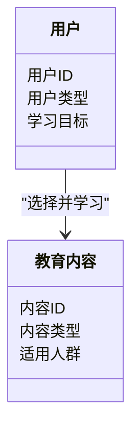
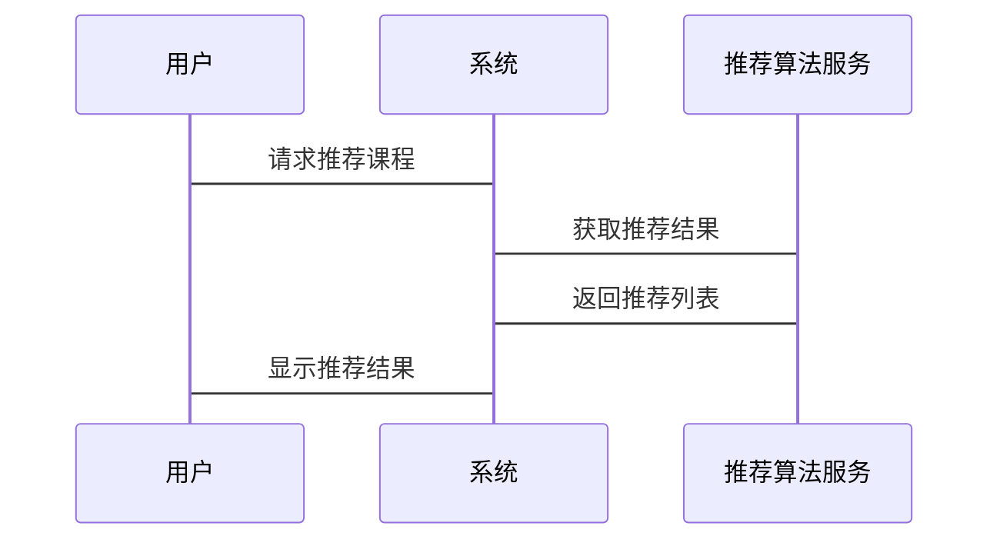

                 


# 用户教育与培训

> 关键词：用户教育，培训方法，教育技术，推荐算法，系统架构

> 摘要：用户教育与培训是信息技术领域中的重要组成部分，本文从背景、核心概念、算法实现等多方面进行深入分析，探讨如何有效进行用户教育与培训，提升用户的技术能力和知识水平。

---

# 第一部分: 用户教育与培训的背景与概念

## 第1章: 用户教育与培训的背景与概念

### 1.1 用户教育与培训的定义与核心要素

#### 1.1.1 什么是用户教育与培训
用户教育与培训是指通过系统化的方法和手段，向用户传授必要的知识和技能，帮助用户更好地理解和使用相关技术或产品。用户教育与培训的核心目标是提升用户的自主学习能力和问题解决能力。

#### 1.1.2 用户教育与培训的核心要素
- **用户需求分析**：了解用户的学习目标和实际需求。
- **教育内容设计**：根据用户需求设计合适的教育内容。
- **教学方法选择**：选择适合的教育方法和工具。
- **效果评估**：通过测试和反馈评估教育效果。

#### 1.1.3 用户教育与培训的边界与外延
用户教育与培训的边界包括教育的目标、内容和方法，外延则涉及教育的实施过程和效果评估。

### 1.2 用户教育与培训的背景与重要性

#### 1.2.1 信息技术发展对用户教育的需求
随着信息技术的快速发展，用户需要掌握更多的技术知识和技能，以适应新技术的使用和应用。

#### 1.2.2 用户教育与培训在企业中的作用
在企业中，用户教育与培训能够提升员工的技术能力，提高企业的竞争力和创新能力。

#### 1.2.3 用户教育与培训的社会意义
用户教育与培训不仅有助于个人职业发展，还能促进社会技术进步和经济发展。

### 1.3 用户教育与培训的目标与实现方式

#### 1.3.1 用户教育的目标体系
- 知识传递
- 技能提升
- 思维培养
- 行为改变

#### 1.3.2 用户教育与培训的主要实现方式
- **在线教育**：通过网络平台提供课程和学习资源。
- **面授培训**：通过现场讲座和实践操作进行教育。
- **混合式教育**：结合在线和面授的方式，提供灵活的学习方式。

#### 1.3.3 用户教育与培训的效果评估
- 学习效果测试
- 用户反馈与满意度调查
- 实践应用能力评估

### 1.4 本章小结
本章从用户教育与培训的定义、核心要素、背景、目标和实现方式等方面进行了全面分析，为后续的深入探讨奠定了基础。

---

# 第二部分: 用户教育与培训的核心概念与方法论

## 第2章: 用户教育与培训的核心概念

### 2.1 用户教育与培训的核心概念体系

#### 2.1.1 用户需求分析
用户需求分析是用户教育与培训的第一步，需要了解用户的背景、学习目标和现有知识水平。

#### 2.1.2 用户认知模型
用户认知模型是基于用户的学习能力和认知特点，设计适合用户的教育内容和方法。

#### 2.1.3 用户学习路径
用户学习路径是根据用户的需求和认知模型，设计一条逐步引导用户掌握知识和技能的路径。

### 2.2 用户教育与培训的核心要素对比

#### 2.2.1 不同教育目标的对比分析
- **知识型目标**：侧重理论知识的传授。
- **技能型目标**：侧重实践能力的培养。
- **态度型目标**：侧重学习态度和习惯的培养。

#### 2.2.2 不同培训方法的优劣势对比
- **讲授法**：优点是信息传递快，缺点是互动性差。
- **讨论法**：优点是互动性强，缺点是效率较低。
- **案例分析法**：优点是实用性强，缺点是耗时较长。

#### 2.2.3 用户特征与教育内容的匹配度分析
- 用户特征包括：学习动机、学习风格、知识基础等。
- 教育内容需要根据用户特征进行调整和优化。

### 2.3 用户教育与培训的ER实体关系图

```mermaid
erDiagram
    actor 用户角色 {
        <属性> 用户ID
        <属性> 用户类型
        <属性> 学习目标
    }
    actor 教育内容 {
        <属性> 内容ID
        <属性> 内容类型
        <属性> 适用人群
    }
    用户角色 --> 教育内容 : "选择并学习"
    用户角色 --> 教育目标 : "达成目标"
```

### 2.4 本章小结
本章通过分析用户教育与培训的核心概念，探讨了用户需求分析、认知模型和学习路径，以及不同教育目标和培训方法的对比分析。

---

# 第三部分: 用户教育与培训的算法与技术实现

## 第3章: 用户教育与培训的推荐算法

### 3.1 基于协同过滤的推荐算法

#### 3.1.1 协同过滤算法的基本原理
协同过滤算法通过分析用户的行为和偏好，找到与目标用户相似的用户群体，推荐相似的教育内容。

#### 3.1.2 用户-物品协同过滤的实现步骤
1. 收集用户行为数据。
2. 计算用户相似度或物品相似度。
3. 根据相似度推荐教育内容。

#### 3.1.3 基于模型的协同过滤算法
基于模型的协同过滤算法通过构建用户和物品的隐式表示，进行推荐。

### 3.2 基于内容的推荐算法

#### 3.2.1 基于内容特征的推荐原理
基于内容的推荐算法通过分析教育内容的特征，找到与用户兴趣相符的内容进行推荐。

#### 3.2.2 文本挖掘在内容推荐中的应用
文本挖掘技术可以提取教育内容的关键字和主题，用于推荐系统的优化。

#### 3.2.3 基于向量空间模型的推荐实现
通过将教育内容表示为向量空间中的点，计算用户和内容之间的相似度进行推荐。

### 3.3 混合推荐算法

#### 3.3.1 混合推荐算法的概念
混合推荐算法结合协同过滤和内容推荐的优点，通过融合两种方法的结果进行推荐。

#### 3.3.2 混合推荐算法的实现流程
1. 分别使用协同过滤和内容推荐算法生成推荐结果。
2. 根据一定的融合策略，综合两种推荐结果。

#### 3.3.3 混合推荐算法的优缺点分析
- 优点：推荐结果更准确，能够兼顾用户偏好和内容特征。
- 缺点：实现复杂，需要处理大量数据。

### 3.4 算法实现

#### 3.4.1 协同过滤算法的Python实现

```python
import numpy as np

# 示例数据：用户-物品评分矩阵
user_item_matrix = np.array([[4, 3, 0],
                               [2, 0, 3],
                               [1, 4, 2]])

# 计算用户相似度
user_similarity = np.corrcoef(user_item_matrix)

# 根据用户相似度推荐
def recommend(user_id, user_similarity, threshold=0.5):
    similar_users = np.where(user_similarity[user_id] > threshold)
    average_ratings = np.mean(user_item_matrix[similar_users], axis=0)
    return average_ratings.argsort()[::-1]

recommended = recommend(0, user_similarity)
print("推荐结果：", recommended)
```

#### 3.4.2 基于内容的推荐算法的Python实现

```python
from sklearn.feature_extraction.text import TfidfVectorizer

# 示例数据：教育内容描述
content_descriptions = ["数学基础", "编程入门", "算法设计"]

# 使用TF-IDF提取内容特征
vectorizer = TfidfVectorizer()
content_features = vectorizer.fit_transform(content_descriptions)

# 计算内容相似度
cosine_similarity = (content_features * content_features.T).A

# 根据内容相似度推荐
def content_recommend(content_id, cosine_similarity):
    similar_contents = np.argsort(cosine_similarity[content_id])[::-1]
    return similar_contents[:3]

recommended = content_recommend(0, cosine_similarity)
print("推荐结果：", recommended)
```

### 3.5 本章小结
本章通过介绍协同过滤、基于内容的推荐算法和混合推荐算法，展示了如何利用推荐算法提升用户教育与培训的效果。

---

# 第四部分: 用户教育与培训的系统分析与架构设计

## 第4章: 用户教育与培训的系统分析与架构设计

### 4.1 系统功能设计

#### 4.1.1 领域模型


#### 4.1.2 系统架构
```mermaid
containerDiagram
    container 用户端 {
        组件 用户界面
        组件 用户数据管理
    }
    container 服务端 {
        组件 教育内容管理
        组件 推荐算法服务
        组件 效果评估服务
    }
    用户端 --> 服务端 : "请求"
    服务端 --> 用户端 : "响应"
```

### 4.2 系统接口设计

#### 4.2.1 用户接口
- API接口：用于用户注册、登录、课程选择。
- 接口示例：
  - POST /api/register
  - GET /api/courses
  - POST /api/recommend

#### 4.2.2 系统接口
- API接口：用于教育内容管理、推荐算法调用。
- 接口示例：
  - POST /api/course/create
  - POST /api/recommend/run
  - GET /api/course/recommend

### 4.3 系统交互设计

#### 4.3.1 用户与系统交互流程


### 4.4 本章小结
本章通过系统功能设计、架构设计和交互设计，展示了用户教育与培训系统的实现过程。

---

# 第五部分: 用户教育与培训的项目实战

## 第5章: 用户教育与培训的项目实战

### 5.1 项目背景与需求分析

#### 5.1.1 项目背景
本项目旨在开发一个用户教育与培训系统，帮助用户快速掌握所需的技术知识和技能。

#### 5.1.2 项目需求
- 提供多种教育内容和学习方式。
- 实现个性化推荐功能。
- 支持用户学习效果评估。

### 5.2 项目核心实现

#### 5.2.1 环境安装
- 安装Python和必要的开发工具。
- 安装机器学习库（如scikit-learn、TensorFlow）。

#### 5.2.2 核心代码实现

##### 5.2.2.1 推荐算法实现

```python
from sklearn.metrics.pairwise import cosine_similarity

# 示例数据：用户-内容评分矩阵
user_content_matrix = np.array([[4, 3, 0],
                                 [2, 0, 3],
                                 [1, 4, 2]])

# 计算余弦相似度
similarity_matrix = cosine_similarity(user_content_matrix)

# 推荐函数
def recommend(user_id, similarity_matrix):
    recommended_indices = np.argsort(similarity_matrix[user_id])[::-1]
    return recommended_indices[:3]

recommended = recommend(0, similarity_matrix)
print("推荐结果：", recommended)
```

##### 5.2.2.2 系统架构实现

```python
from flask import Flask, request, jsonify

app = Flask(__name__)

@app.route('/api/register', methods=['POST'])
def register():
    # 处理注册请求
    return jsonify({'status': 'success', 'message': '用户注册成功'})

@app.route('/api/course/create', methods=['POST'])
def create_course():
    # 处理课程创建请求
    return jsonify({'status': 'success', 'message': '课程创建成功'})

if __name__ == '__main__':
    app.run(debug=True)
```

### 5.3 项目小结
本章通过实际项目案例，展示了用户教育与培训系统的实现过程，包括环境安装、核心代码实现和系统架构设计。

---

# 第六部分: 用户教育与培训的案例分析与最佳实践

## 第6章: 用户教育与培训的案例分析与最佳实践

### 6.1 案例分析

#### 6.1.1 案例背景
某企业希望通过用户教育与培训提升员工的技术能力，采用混合式教育模式，结合在线和面授方式进行培训。

#### 6.1.2 实施过程
1. 需求分析：了解员工的技术水平和学习需求。
2. 教育内容设计：根据需求设计课程内容。
3. 教学实施：采用混合式教育模式进行培训。
4. 效果评估：通过测试和反馈评估培训效果。

#### 6.1.3 实施效果
- 员工技术水平显著提升。
- 学习效果较好，反馈满意度高。

### 6.2 最佳实践

#### 6.2.1 教育内容设计
- 知识点清晰明确。
- 内容结构合理，逻辑性强。

#### 6.2.2 教学方法选择
- 结合多种教学方法，提高学习效果。
- 增加互动环节，提升学习兴趣。

#### 6.2.3 学习效果评估
- 定期测试评估。
- 收集用户反馈，不断优化教育内容和方法。

### 6.3 本章小结
本章通过案例分析和最佳实践，总结了用户教育与培训的有效实施方法和经验。

---

# 第七部分: 总结与展望

## 第7章: 总结与展望

### 7.1 本研究的主要成果
- 提出了用户教育与培训的系统化方法。
- 探讨了多种推荐算法在用户教育中的应用。
- 展示了用户教育与培训系统的实际实现。

### 7.2 研究的局限性
- 研究范围有限，部分方法需要进一步验证。
- 算法实现中数据量较小，实际应用中可能需要优化。

### 7.3 未来研究方向
- 探讨更多推荐算法在用户教育中的应用。
- 研究用户教育与培训的智能化和个性化发展。

### 7.4 本章小结
本章总结了研究的主要成果，分析了研究的局限性，并展望了未来的研究方向。

---

# 作者：AI天才研究院/AI Genius Institute & 禅与计算机程序设计艺术 /Zen And The Art of Computer Programming

