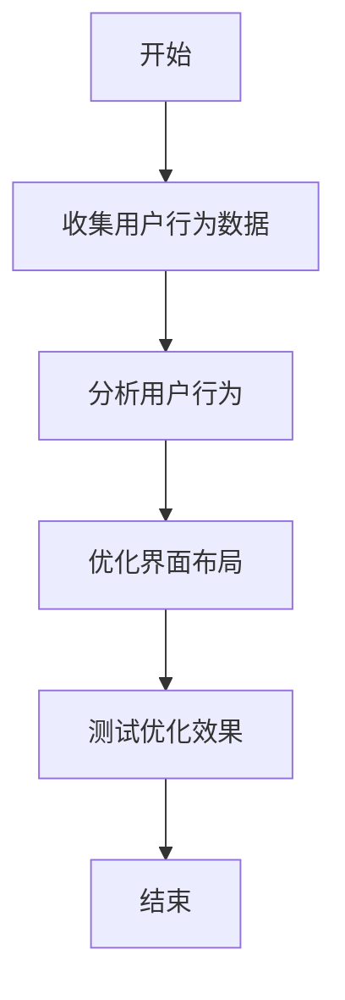
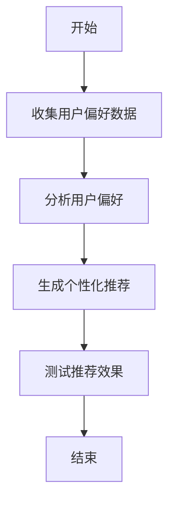
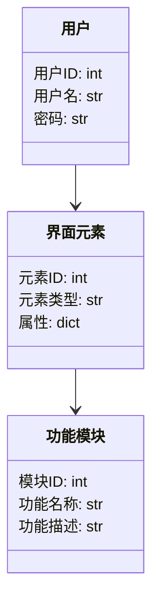

                 


# 用户界面设计

> 关键词：用户界面设计, UI设计原则, 交互设计, 视觉设计, 用户体验, 响应式设计, 界面架构

> 摘要：用户界面设计是连接用户与产品的重要桥梁，涉及信息架构、交互设计和视觉设计等多个方面。本文将从基础概念出发，逐步深入探讨设计原则、交互流程、视觉元素、响应式设计以及实际项目中的应用。通过丰富的案例和详细的分析，帮助读者掌握用户界面设计的核心技能。

---

# 第1章: 用户界面设计概述

## 1.1 用户界面设计的基本概念

### 1.1.1 用户界面的定义与分类
用户界面（User Interface, UI）是用户与产品交互的媒介，包括图形用户界面（GUI）、文本用户界面（TUI）和语音用户界面（VUI）等。图形用户界面是最常见的形式，广泛应用于计算机、手机、智能家居设备等。

### 1.1.2 用户界面设计的重要性
良好的用户界面设计能提升用户体验，降低学习成本，提高产品易用性和用户满意度。界面设计直接影响用户的行为和情感，是产品成功的关键因素之一。

### 1.1.3 用户界面设计的历史演变
从早期的命令行界面到图形用户界面的演变，用户界面设计经历了从简单到复杂的过程。随着技术的发展，界面设计越来越注重用户体验和人机交互的优化。

## 1.2 用户界面设计的核心要素

### 1.2.1 信息架构设计
信息架构是用户界面设计的基础，涉及如何组织和呈现信息。通过信息架构设计，确保用户能够快速找到所需信息，提升操作效率。

### 1.2.2 交互流程设计
交互流程设计关注用户在使用产品时的操作路径，设计直观的交互流程，减少用户的学习成本，提升操作体验。

### 1.2.3 视觉元素设计
视觉元素设计包括颜色、字体、图标等，通过合理的视觉设计，吸引用户注意力，传递信息，增强用户体验。

## 1.3 用户界面设计的原则

### 1.3.1 可用性原则
设计界面时，首要原则是确保界面的可用性。界面操作应简单直观，符合用户习惯，减少用户的学习成本。

### 1.3.2 一致性原则
一致性原则要求界面元素在风格、布局和操作逻辑上保持一致，避免用户在使用过程中产生混淆。

### 1.3.3 反馈机制原则
界面应提供及时的反馈机制，让用户了解操作的结果，增强用户的信心和操作体验。

## 1.4 用户界面设计与其他领域的区别

### 1.4.1 与用户体验（UX）的区别
用户体验注重整体体验，包括界面设计、功能实现和用户心理等多方面。而用户界面设计更关注视觉和交互的具体实现。

### 1.4.2 与用户界面（UI）的区别
UI设计是用户界面设计的核心内容，注重界面的美观和布局。而用户界面设计还包括信息架构和交互设计等更广泛的内容。

### 1.4.3 与视觉设计的区别
视觉设计注重色彩、字体等视觉元素的搭配，而用户界面设计则更关注这些元素如何服务于用户体验和功能实现。

## 1.5 本章小结
本章从用户界面设计的基本概念、核心要素和设计原则等方面进行了详细讲解，帮助读者建立了用户界面设计的基本认知。

---

# 第2章: 用户界面设计的核心概念与联系

## 2.1 用户界面设计的核心概念

### 2.1.1 信息架构设计
信息架构设计是通过合理的组织和分类，确保信息在界面中呈现清晰、易懂的结构。

### 2.1.2 交互设计
交互设计关注用户与界面的互动方式，设计直观的操作流程，提升用户体验。

### 2.1.3 视觉设计
视觉设计通过色彩、字体、图标等元素，营造美观、吸引人的界面，增强用户的视觉体验。

## 2.2 核心概念原理

### 2.2.1 信息架构设计的原理
信息架构设计遵循用户认知规律，通过分类、导航等方式，帮助用户快速找到所需信息。

### 2.2.2 交互设计的原理
交互设计基于用户行为和需求，设计符合逻辑的操作流程，减少用户误操作的可能性。

### 2.2.3 视觉设计的原理
视觉设计遵循美学原则，通过色彩搭配、排版设计等，提升界面的美观性和可读性。

## 2.3 概念属性特征对比表格

| 概念       | 信息架构设计 | 交互设计 | 视觉设计 |
|------------|--------------|----------|----------|
| 定义       | 信息的组织与分类 | 用户与界面的互动设计 | 色彩、字体等视觉元素的设计 |
| 目标       | 提高信息的可查找性 | 提升用户体验 | 提升界面的美观性 |
| 工具       | 信息地图、导航设计 | 用户流程图 | 软件设计工具（如Photoshop） |

## 2.4 ER实体关系图架构

```mermaid
erDiagram
    user [*<->> ] role
    role [*<->> ] permission
    user [*<->> ] interface_element
    role [*<->> ] interface_element
    permission [*<->> ] interface_element
```

## 2.5 本章小结
本章通过对比和分析用户界面设计的核心概念，帮助读者理解信息架构、交互设计和视觉设计之间的联系和区别。

---

# 第3章: 用户界面设计的算法原理讲解

## 3.1 算法原理概述

### 3.1.1 基于用户行为的界面优化算法
通过分析用户的点击、浏览等行为，优化界面布局和功能呈现，提升用户体验。

### 3.1.2 基于数据挖掘的用户偏好分析算法
通过数据挖掘技术，分析用户的偏好，个性化推荐界面元素，满足用户需求。

## 3.2 算法流程图

### 3.2.1 用户行为分析算法流程图



### 3.2.2 用户偏好分析算法流程图



## 3.3 算法实现代码

### 3.3.1 用户行为分析

```python
import pandas as pd

# 假设我们有一个用户行为数据集
data = pd.DataFrame({
    '用户ID': [1, 2, 3, 4, 5],
    '操作类型': ['点击', '滑动', '点击', '长按', '滑动'],
    '时间戳': [1000, 2000, 3000, 4000, 5000]
})

# 分析用户行为
clicks = data[data['操作类型'] == '点击']
clicks_count = clicks['用户ID'].value_counts()

print("用户点击行为分析：")
print(clicks_count)
```

### 3.3.2 用户偏好分析

```python
from sklearn.cluster import KMeans

# 假设我们有一个用户偏好数据集
X = [[2, 3], [5, 8], [1, 2], [7, 9], [4, 6]]

# 使用K均值算法进行聚类分析
kmeans = KMeans(n_clusters=2)
kmeans.fit(X)

print("聚类结果：")
print(kmeans.labels_)
```

## 3.4 本章小结
本章通过算法原理和代码实现，展示了如何通过用户行为分析和数据挖掘技术优化用户界面设计，提升用户体验。

---

# 第4章: 系统分析与架构设计方案

## 4.1 问题场景介绍

### 4.1.1 项目背景
随着移动互联网的发展，用户对界面设计的要求越来越高，设计一个高效、美观的界面成为企业竞争的关键因素之一。

### 4.1.2 项目目标
通过用户需求分析和界面设计，打造一个用户友好、功能完善的界面，提升用户体验和产品竞争力。

## 4.2 系统功能设计

### 4.2.1 领域模型设计



### 4.2.2 系统架构设计


### 4.2.3 系统接口设计
系统接口设计包括用户登录接口、数据查询接口和数据提交接口，确保界面与后端系统的高效交互。

## 4.3 系统交互设计

### 4.3.1 交互流程设计
从用户登录到操作完成的交互流程，确保每一步操作都有明确的反馈。

### 4.3.2 交互设计工具
使用Figma、Sketch等工具进行界面设计和交互原型制作。

## 4.4 本章小结
本章通过系统分析和架构设计，展示了如何从整体角度优化用户界面设计，确保界面的功能性和用户体验。

---

# 第5章: 项目实战

## 5.1 环境安装

### 5.1.1 开发工具安装
安装Figma、Sketch、Adobe XD等界面设计工具，以及Git版本控制工具。

### 5.1.2 依赖库安装
安装必要的开发库，如Python的Pillow库用于图像处理，Flask框架用于后端开发。

## 5.2 系统核心实现源代码

### 5.2.1 界面设计代码
使用Figma进行界面设计，导出JSON格式的组件代码。

### 5.2.2 交互设计代码
使用JavaScript实现界面的动态效果，如点击按钮后的反馈动画。

## 5.3 代码应用解读与分析

### 5.3.1 界面设计代码解读
解读Figma导出的JSON代码，分析界面组件的结构和属性设置。

### 5.3.2 交互设计代码解读
分析JavaScript代码，理解按钮点击事件的触发和反馈机制。

## 5.4 实际案例分析和详细讲解剖析

### 5.4.1 案例背景
以一个移动应用的登录界面设计为例，详细分析设计过程。

### 5.4.2 设计过程
从需求分析、原型设计到最终实现，详细记录每一步的操作和思考。

### 5.4.3 优化与迭代
根据用户反馈，持续优化界面设计，提升用户体验。

## 5.5 本章小结
本章通过实际项目案例，展示了用户界面设计的整个流程，从需求分析到设计实现，帮助读者掌握实际操作技能。

---

# 第6章: 用户界面设计的前沿趋势与未来发展

## 6.1 人工智能在用户界面设计中的应用

### 6.1.1 AI驱动的界面设计工具
AI工具可以根据用户需求自动生成界面设计，提升设计效率。

### 6.1.2 个性化推荐系统
通过AI算法分析用户行为，个性化推荐界面元素，满足用户个性化需求。

## 6.2 无障碍设计与包容性设计

### 6.2.1 无障碍设计的重要性
设计包容性强的界面，满足不同用户的使用需求，包括残障人士。

### 6.2.2 包容性设计的实现
通过调整界面元素的可配置性，满足不同用户的需求。

## 6.3 用户行为分析与界面优化

### 6.3.1 用户行为分析的重要性
通过分析用户行为，优化界面布局和功能呈现，提升用户体验。

### 6.3.2 数据驱动的设计优化
利用数据分析结果，指导界面设计的优化方向，实现数据驱动的设计。

## 6.4 本章小结
本章探讨了用户界面设计的前沿趋势，包括人工智能、无障碍设计和用户行为分析，展示了未来发展的方向。

---

# 第7章: 最佳实践、小结与注意事项

## 7.1 最佳实践 tips

### 7.1.1 设计工具推荐
推荐使用Figma、Sketch、Adobe XD等专业的界面设计工具。

### 7.1.2 常见误区
避免过度设计，保持界面简洁，确保功能优先。

### 7.1.3 学习资源
推荐学习UI设计的经典书籍和在线课程，不断提升自己的设计能力。

## 7.2 小结
用户界面设计是一个复杂而有趣的过程，需要综合运用信息架构、交互设计和视觉设计等多方面的知识。

## 7.3 注意事项

### 7.3.1 用户为中心
始终以用户需求为中心，设计符合用户习惯和偏好的界面。

### 7.3.2 反馈机制
确保界面提供及时的反馈机制，增强用户的操作信心。

### 7.3.3 持续优化
通过用户反馈和数据分析，持续优化界面设计，提升用户体验。

---

# 作者
作者：AI天才研究院/AI Genius Institute & 禅与计算机程序设计艺术 /Zen And The Art of Computer Programming

