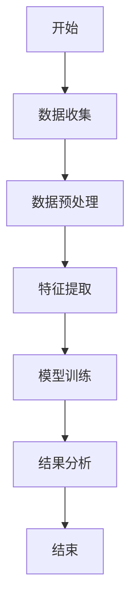

                 


# 用户行为分析

> 关键词：用户行为分析，数据挖掘，机器学习，用户画像，行为建模

> 摘要：用户行为分析是通过对用户在系统或产品中的操作数据进行收集、处理、分析和建模，以理解用户的行为模式、偏好和需求，从而为产品优化、用户体验提升和商业决策提供数据支持。本文将从用户行为分析的背景、核心概念、算法原理、系统架构设计到项目实战，全面深入地探讨这一领域。

---

# 第一部分: 用户行为分析背景与核心概念

## 第1章: 用户行为分析的背景与重要性

### 1.1 什么是用户行为分析
用户行为分析是通过对用户在系统或产品中的操作数据进行收集、处理、分析和建模，以理解用户的行为模式、偏好和需求，从而为产品优化、用户体验提升和商业决策提供数据支持。

### 1.2 用户行为分析的重要性
1. **优化用户体验**：通过分析用户行为，可以识别用户在使用产品时遇到的问题，从而进行针对性优化。
2. **提升产品价值**：了解用户的行为模式，有助于设计更符合用户需求的功能，提升产品的市场竞争力。
3. **支持商业决策**：用户行为数据可以为市场营销、运营策略和商业模式创新提供数据支持。

### 1.3 用户行为分析的背景与发展趋势
随着互联网和大数据技术的快速发展，用户行为分析从传统的基于规则的分析逐渐向数据驱动的智能化分析转变。现代用户行为分析结合了机器学习、深度学习等技术，能够更精准地预测用户行为和需求。

---

## 第2章: 用户行为分析的核心概念

### 2.1 用户行为的定义与分类
用户行为是指用户在使用系统或产品时所进行的一系列操作。根据行为的性质和目的，可以将用户行为分为以下几类：
1. **浏览行为**：用户查看产品或服务的过程。
2. **交互行为**：用户与系统或产品进行互动的操作，如点击、提交、注册等。
3. **购买行为**：用户在电商平台上完成购买的过程。
4. **留存行为**：用户在一段时间内多次使用产品或服务的行为。

### 2.2 用户行为分析的维度
用户行为分析可以从以下几个维度进行：
1. **时间维度**：分析用户行为的时间分布，如高峰期、低谷期等。
2. **空间维度**：分析用户行为的空间分布，如不同地区的用户行为差异。
3. **用户维度**：分析不同用户群体的行为特征，如新用户与老用户的差异。
4. **行为维度**：分析具体行为的频率、时长、路径等。

### 2.3 用户行为分析的边界与外延
用户行为分析的边界主要集中在用户与系统或产品之间的互动数据。外延则包括对用户行为的影响因素，如用户画像、环境因素等。

---

## 第3章: 用户行为分析的核心概念与联系

### 3.1 用户行为分析的实体关系图
```mermaid
er
    actor 用户
    actor 系统
    actor 数据源
    entity 用户行为数据
    entity 用户特征
    entity 行为模式
    用户 -> 用户行为数据: 产生
    系统 -> 用户行为数据: 收集
    用户行为数据 -> 用户特征: 提取
    用户特征 -> 行为模式: 分析
```

### 3.2 用户行为分析的流程图


### 3.3 用户行为分析的核心要素对比表
| 核心要素 | 定义 | 特性 | 示例 |
|----------|------|------|------|
| 用户 | 行为的主体 | 可以是人或系统 | 电商用户 |
| 行为 | 用户的操作或互动 | 包括点击、浏览、购买等 | 加购商品 |
| 时间 | 行为发生的时间 | 包括实时和离线 | 用户在线时间 |
| 场景 | 行为发生的环境 | 包括PC端和移动端 | 移动端购物 |

---

## 第4章: 用户行为分析的基本方法

### 4.1 数据收集方法
1. **日志采集**：通过日志记录用户在系统中的操作行为。
2. **问卷调查**：通过问卷收集用户的行为数据和反馈。
3. **埋点监测**：在系统中埋设监测点，记录用户的操作行为。

### 4.2 数据预处理方法
1. **数据清洗**：去除无效数据和异常数据。
2. **数据转换**：将数据转换为适合分析的形式，如时间戳转换为分钟数。
3. **数据归一化**：对数据进行标准化处理，使其具有可比性。

### 4.3 数据分析方法
1. **描述性分析**：对用户行为进行基本的统计分析，如平均点击次数、用户留存率等。
2. **诊断性分析**：分析用户行为背后的原因，如用户流失的原因。
3. **预测性分析**：利用机器学习算法预测用户的未来行为。

---

## 第5章: 用户行为分析的应用场景

### 5.1 电商行业的用户行为分析
电商行业通过分析用户的浏览、点击、加购、下单、支付等行为，优化推荐算法、提升转化率和客单价。

### 5.2 金融行业的用户行为分析
金融行业通过分析用户的交易行为、风险行为等，识别异常交易、防范金融风险。

### 5.3 社交媒体的用户行为分析
社交媒体通过分析用户的发帖、点赞、评论、分享等行为，优化内容推荐、提升用户活跃度。

---

## 第6章: 用户行为分析的工具与技术

### 6.1 数据采集工具
1. **日志采集工具**：如Flume、Logstash等。
2. **埋点监测工具**：如Google Analytics、Mixpanel等。
3. **数据库工具**：如MySQL、MongoDB等。

### 6.2 数据分析工具
1. **数据可视化工具**：如Tableau、Power BI等。
2. **数据挖掘工具**：如Python的Pandas、Scikit-learn等。
3. **机器学习框架**：如TensorFlow、PyTorch等。

---

## 第7章: 用户行为分析的挑战与解决方案

### 7.1 数据隐私与安全问题
用户行为分析涉及大量用户数据，如何保护用户隐私和数据安全是一个重要的挑战。

### 7.2 数据量与计算复杂度问题
随着用户行为数据的快速增长，如何高效处理和分析海量数据是一个技术挑战。

### 7.3 模型的可解释性问题
复杂的机器学习模型往往缺乏可解释性，如何让模型的预测结果更具可解释性是一个重要问题。

---

## 第8章: 用户行为分析的未来发展

### 8.1 数据智能分析的深度发展
未来的用户行为分析将更加依赖于人工智能和深度学习技术，实现更精准的用户行为预测和个性化推荐。

### 8.2 用户行为分析的实时性增强
随着实时数据分析技术的发展，用户行为分析将更加注重实时性，能够快速响应用户行为变化。

### 8.3 用户行为分析的伦理与规范
未来的用户行为分析将更加注重数据伦理和用户隐私保护，建立更加规范的数据使用和分析标准。

---

## 第9章: 总结与展望

### 9.1 本章总结
用户行为分析是数据驱动决策的重要手段，通过对用户行为数据的收集、处理、分析和建模，可以为产品优化、用户体验提升和商业决策提供有力支持。

### 9.2 未来展望
随着技术的不断发展，用户行为分析将更加智能化、实时化和个性化，为各行业带来更大的价值。

---

## 附录: 参考文献

1. [1] 《数据挖掘导论》
2. [2] 《机器学习实战》
3. [3] 《用户行为分析与数据挖掘》

---

**作者：AI天才研究院/AI Genius Institute & 禅与计算机程序设计艺术 /Zen And The Art of Computer Programming**

---

通过上述目录结构，我们可以看到，用户行为分析涵盖了从基础概念到实际应用的全过程，结合了理论与实践，适合技术专家、数据科学家以及对用户行为分析感兴趣的读者阅读。

