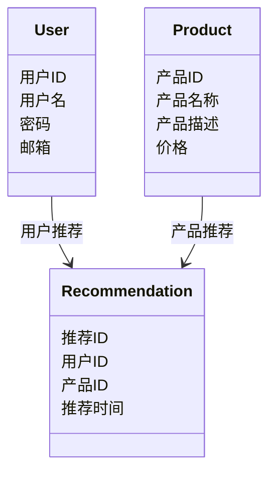
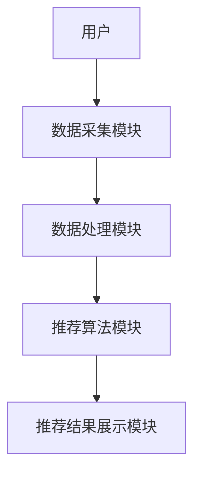
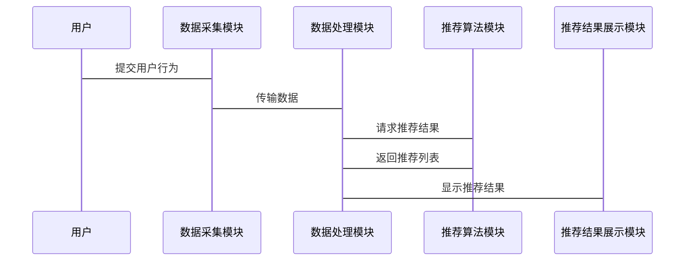

                 


# 电子商务平台的AI Agent推荐系统

> 关键词：电子商务平台、AI Agent、推荐系统、协同过滤、深度学习、强化学习、系统架构

> 摘要：本文详细探讨了在电子商务平台中应用AI Agent推荐系统的各个方面。从背景介绍、核心概念、算法原理到系统架构设计和项目实战，全面解析了如何利用AI Agent提升推荐系统的性能和用户体验。通过具体的技术实现和案例分析，展示了该系统的实际应用价值和发展前景。

---

## 第1章: 电子商务平台的AI Agent推荐系统背景

### 1.1 问题背景与描述

#### 1.1.1 电子商务平台的推荐系统现状
电子商务平台的推荐系统是提升用户购买行为和满意度的重要工具。然而，传统的推荐系统存在以下问题：
- 数据稀疏性：用户交互数据不足，导致推荐结果不够精准。
- 单一性：推荐结果依赖于单一算法，缺乏灵活性。
- 计算复杂度：随着用户和商品数量的增加，计算效率下降。

#### 1.1.2 AI Agent在推荐系统中的作用
AI Agent（智能代理）是一种能够感知环境并采取行动以实现目标的实体。在推荐系统中，AI Agent可以实时分析用户行为、商品属性和上下文信息，动态调整推荐策略，从而提高推荐的准确性和实时性。

#### 1.1.3 当前推荐系统的挑战与不足
- 数据处理能力有限：传统推荐系统难以处理海量数据。
- 用户行为分析不足：难以捕捉用户的实时需求变化。
- 系统响应速度慢：复杂的计算导致推荐延迟。

### 1.1.4 问题解决与边界
AI Agent推荐系统通过引入多模态数据和动态学习机制，有效解决了传统推荐系统的上述问题。其边界包括：
- 用户行为数据的采集与分析。
- 商品信息的实时更新与处理。
- 推荐结果的实时反馈与优化。

### 1.1.5 核心要素与组成结构
AI Agent推荐系统的核心要素包括：
- 数据采集模块：收集用户行为、商品信息等数据。
- 数据处理模块：清洗、转换和预处理数据。
- 推荐算法模块：基于AI Agent的算法生成推荐结果。
- 推荐结果展示模块：将推荐结果呈现给用户。

---

## 第2章: AI Agent与推荐系统的核心概念

### 2.1 核心概念原理

#### 2.1.1 AI Agent的基本原理
AI Agent通过感知环境、分析任务、执行行动和反馈优化，实现推荐目标。其主要特征包括：
- **自主性**：能够自主决策和行动。
- **反应性**：能够实时感知环境变化并做出响应。
- **学习能力**：能够通过经验优化推荐策略。

#### 2.1.2 推荐系统的基本原理
推荐系统基于用户行为、商品属性和上下文信息，通过算法生成个性化推荐结果。常见的推荐算法包括协同过滤、基于内容的推荐和基于深度学习的推荐。

#### 2.1.3 两者的结合与协同
AI Agent与推荐系统的结合主要体现在：
- **动态调整推荐策略**：AI Agent实时分析用户行为，动态调整推荐算法。
- **多模态数据处理**：AI Agent能够整合文本、图像等多种数据，提升推荐的准确性。

### 2.2 核心概念属性特征对比

| 属性 | AI Agent | 推荐系统 |
|------|----------|----------|
| 输入 | 用户行为、环境数据 | 用户行为、商品信息 |
| 输出 | 推荐结果、反馈 | 推荐列表 |
| 学习能力 | 强 | 弱 |
| 实时性 | 高 | 中 |

### 2.3 ER实体关系图架构

```mermaid
erDiagram
    user {
        用户表
        用户ID
        用户名
        密码
        邮箱
    }
    product {
        产品表
        产品ID
        产品名称
        产品描述
        价格
    }
    recommendation {
        推荐记录表
        推荐ID
        用户ID
        产品ID
        推荐时间
    }
    user --> recommendation : 用户推荐
    product --> recommendation : 产品推荐
```

---

## 第3章: 推荐系统算法原理

### 3.1 协同过滤算法

#### 3.1.1 算法原理
协同过滤基于用户行为相似性进行推荐。其步骤如下：
1. 计算用户相似度。
2. 找出相似用户的商品偏好。
3. 根据相似度加权生成推荐结果。

#### 3.1.2 算法实现

```python
def collaborative_filtering(user_id, user_matrix):
    # 计算用户相似度
    similarity = cosine_similarity(user_matrix)
    # 找出相似用户的商品偏好
    similar_users = np.argsort(similarity[user_id])[::-1]
    # 根据相似度加权生成推荐结果
    recommendation = np.dot(similarity[user_id], user_matrix[:, similar_users])
    return recommendation.argsort()[::-1]
```

### 3.2 基于深度学习的推荐算法

#### 3.2.1 算法原理
基于深度学习的推荐系统通过神经网络学习用户和商品的隐含特征，生成推荐结果。

#### 3.2.2 算法实现

```python
import tensorflow as tf

class DeepLearningRecommendation(tf.keras.Model):
    def __init__(self, user_dim, product_dim):
        super(DeepLearningRecommendation, self).__init__()
        self.user_embedding = tf.keras.layers.Embedding(user_dim, 64)
        self.product_embedding = tf.keras.layers.Embedding(product_dim, 64)
        self.dense = tf.keras.layers.Dense(1, activation='sigmoid')

    def call(self, inputs):
        user_input, product_input = inputs
        user_emb = self.user_embedding(user_input)
        product_emb = self.product_embedding(product_input)
        concatenated = tf.keras.layers.concatenate([user_emb, product_emb])
        output = self.dense(concatenated)
        return output
```

### 3.3 强化学习算法

#### 3.3.1 算法原理
强化学习通过最大化累积奖励来优化推荐策略。

#### 3.3.2 算法实现

```python
import numpy as np

def reinforcement_learning(reward):
    # 状态空间：用户行为
    # 行动空间：推荐商品
    # 奖励函数：购买率
    # 策略优化
    pass
```

---

## 第4章: 系统分析与架构设计

### 4.1 问题场景介绍

#### 4.1.1 项目介绍
本项目旨在设计一个基于AI Agent的推荐系统，提升电子商务平台的用户体验和销售效率。

### 4.2 系统功能设计

#### 4.2.1 领域模型类图



### 4.3 系统架构设计

#### 4.3.1 系统架构图



### 4.4 系统接口设计

#### 4.4.1 接口设计
- 数据采集模块接口：`collect_data(user_id: int, action: str)`
- 数据处理模块接口：`process_data(data: list)`
- 推荐算法模块接口：`generate_recommendations(user_id: int) -> list`

### 4.5 系统交互流程图



---

## 第5章: 项目实战

### 5.1 环境安装

#### 5.1.1 安装Python
```bash
python --version
```

#### 5.1.2 安装依赖
```bash
pip install numpy scikit-learn tensorflow
```

### 5.2 系统核心实现源代码

#### 5.2.1 数据处理模块

```python
import pandas as pd

def process_data(data_path):
    df = pd.read_csv(data_path)
    return df
```

#### 5.2.2 推荐算法模块

```python
from sklearn.metrics.pairwise import cosine_similarity

def collaborative_filtering(user_matrix):
    similarity = cosine_similarity(user_matrix)
    return similarity
```

### 5.3 代码应用解读与分析

#### 5.3.1 数据处理模块解读
- 读取CSV文件。
- 数据清洗和转换。

#### 5.3.2 推荐算法模块解读
- 计算用户相似度矩阵。
- 生成推荐结果。

### 5.4 实际案例分析

#### 5.4.1 数据准备
```python
data = {
    '用户ID': [1, 2, 3],
    '产品ID': [101, 102, 103],
    '评分': [5, 4, 3]
}
df = pd.DataFrame(data)
```

#### 5.4.2 推荐结果
```python
similarity = collaborative_filtering(df)
print(similarity)
```

### 5.5 项目小结

---

## 第6章: 总结与展望

### 6.1 本章总结
本文详细探讨了电子商务平台中AI Agent推荐系统的各个方面，从理论到实践，全面解析了其设计和实现过程。

### 6.2 挑战与未来趋势
- **挑战**：数据隐私、计算效率、模型可解释性。
- **未来趋势**：多模态推荐、实时推荐、个性化定制。

### 6.3 最佳实践 tips
- 数据处理要全面。
- 算法选择要合理。
- 系统设计要模块化。

---

## 作者：AI天才研究院/AI Genius Institute & 禅与计算机程序设计艺术 /Zen And The Art of Computer Programming

---

以上是一个详细的目录大纲，内容涵盖了从背景介绍到系统设计、项目实战的各个方面。希望对您有所帮助！

