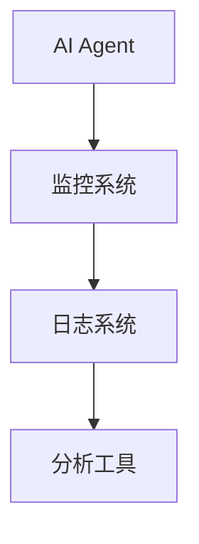

                 


# 监控与日志：跟踪AI Agent的运行状态

## 关键词：AI Agent、监控、日志、运行状态、异常检测、日志分析、系统架构

## 摘要：AI Agent的运行状态监控与日志分析是确保AI系统稳定性和高效性的关键环节。本文将详细探讨监控与日志的核心概念、算法原理、系统架构设计以及项目实战，帮助读者全面理解如何通过监控与日志跟踪AI Agent的运行状态。

---

## 第一部分: 监控与日志的核心概念

### 第1章: 监控与日志的核心概念

#### 1.1 问题背景与问题描述

##### 1.1.1 AI Agent的运行挑战

AI Agent作为人工智能系统的核心组件，负责执行任务、与环境交互并做出决策。然而，AI Agent的运行可能会面临以下挑战：

- **不确定性**：AI Agent在复杂环境中可能遇到不可预测的情况，导致运行状态不稳定。
- **动态性**：环境和任务需求的变化可能影响AI Agent的行为模式。
- **错误处理**：AI Agent在运行过程中可能会出现错误或异常，需要及时发现和处理。

##### 1.1.2 监控与日志的重要性

监控与日志是解决上述挑战的关键工具：

- **监控**：实时跟踪AI Agent的运行状态，识别异常行为。
- **日志**：记录AI Agent的运行历史，便于事后分析和故障排查。

##### 1.1.3 问题解决的思路与方法

通过监控与日志，可以实现以下目标：

- **实时监控**：持续跟踪AI Agent的运行状态，确保其正常工作。
- **异常检测**：识别和定位运行中的异常行为。
- **日志分析**：通过日志数据，挖掘AI Agent的行为模式和潜在问题。

#### 1.2 核心概念与边界

##### 1.2.1 监控的定义与作用

监控是对AI Agent的运行状态进行实时或周期性检查，包括以下方面：

- **性能指标**：CPU、内存、磁盘使用情况。
- **行为日志**：记录AI Agent的决策和操作。
- **异常检测**：识别偏离预期的行为模式。

##### 1.2.2 日志的定义与作用

日志是AI Agent运行过程中产生的所有操作记录，具有以下作用：

- **故障排查**：通过日志回溯问题发生的根源。
- **行为分析**：分析AI Agent的历史行为，优化其决策算法。
- **审计跟踪**：记录AI Agent的活动，满足合规性要求。

##### 1.2.3 监控与日志的边界与外延

监控与日志的边界包括：

- **数据采集**：从AI Agent获取运行数据。
- **数据处理**：对采集到的数据进行清洗和转换。
- **数据存储**：将数据存储到数据库或其他存储系统中。

外延包括：

- **可视化**：将监控数据以图形化界面展示。
- **告警**：根据监控结果触发告警通知。
- **自动化处理**：根据监控结果自动调整AI Agent的行为。

#### 1.3 核心要素与概念结构

##### 1.3.1 监控与日志的构成要素

监控与日志的构成要素包括：

- **数据源**：AI Agent的运行数据。
- **采集工具**：用于采集数据的工具或模块。
- **存储系统**：用于存储日志和监控数据。
- **分析工具**：用于分析监控数据的工具或算法。
- **可视化界面**：用于展示监控结果的界面。

##### 1.3.2 监控与日志的关系图

使用 Mermaid 绘制监控与日志的关系图：



##### 1.3.3 概念结构与核心要素对比表

以下表格对比了监控与日志的核心要素：

| 属性 | 监控 | 日志 |
|------|------|------|
| 数据类型 | 实时数据 | 历史数据 |
| 数据来源 | AI Agent运行状态 | AI Agent操作记录 |
| 主要功能 | 实时检查 | 事后分析 |
| 常用工具 | 监控面板、告警系统 | 日志服务器、日志分析工具 |

---

## 第二部分: 监控与日志的核心原理

### 第2章: 监控与日志的核心原理

#### 2.1 监控与日志的原理分析

##### 2.1.1 监控数据的采集与处理

监控数据的采集与处理流程如下：

1. **数据采集**：从AI Agent获取运行数据。
2. **数据清洗**：去除无效或错误数据。
3. **数据转换**：将数据转换为可分析的格式。
4. **数据存储**：将数据存储到数据库中。

##### 2.1.2 日志数据的存储与检索

日志数据的存储与检索流程如下：

1. **数据存储**：将日志数据写入日志服务器。
2. **数据检索**：根据查询条件从日志服务器中获取日志数据。
3. **数据分析**：对检索到的日志数据进行分析。

##### 2.1.3 监控与日志的关联分析

关联分析是监控与日志的核心部分，主要包括：

- **日志聚类**：将相似的日志记录归类。
- **异常检测**：识别日志中的异常行为。
- **关联规则挖掘**：发现日志中的关联规则。

#### 2.2 监控与日志的核心算法

##### 2.2.1 异常检测算法

异常检测算法用于识别AI Agent运行中的异常行为。常见的异常检测算法包括：

- **基于统计的异常检测**：通过统计方法（如均值、标准差）识别异常。
- **基于机器学习的异常检测**：使用无监督学习算法（如K-Means、DBSCAN）识别异常。
- **基于深度学习的异常检测**：使用循环神经网络（RNN）或变种自动编码器（AE）识别异常。

##### 2.2.2 日志聚类算法

日志聚类算法用于将相似的日志记录归类。常见的日志聚类算法包括：

- **基于K-means的日志聚类**：将日志记录分为K个簇。
- **基于DBSCAN的日志聚类**：基于密度的聚类算法，识别高密度区域。
- **基于层次聚类的日志聚类**：通过层次化的方法将日志记录聚类。

##### 2.2.3 关联规则挖掘算法

关联规则挖掘算法用于发现日志中的关联规则。常见的关联规则挖掘算法包括：

- **基于Apriori的关联规则挖掘**：通过频繁项集挖掘关联规则。
- **基于FP-Growth的关联规则挖掘**：通过树状结构高效挖掘关联规则。
- **基于Eclat的关联规则挖掘**：通过位模式树挖掘关联规则。

#### 2.3 监控与日志的数学模型

##### 2.3.1 异常检测的数学模型

异常检测的数学模型可以表示为：

$$ P(x) = P(x | \text{正常}) \cdot P(\text{正常}) + P(x | \text{异常}) \cdot P(\text{异常}) $$

其中，$P(x)$ 是观测到数据$x$的概率，$P(\text{正常})$ 和 $P(\text{异常})$ 是先验概率。

##### 2.3.2 日志聚类的数学模型

日志聚类的数学模型可以表示为：

$$ \text{距离}(x, y) = \sqrt{(x_1 - y_1)^2 + (x_2 - y_2)^2 + \dots + (x_n - y_n)^2} $$

其中，$x$ 和 $y$ 是两条日志记录，$x_i$ 和 $y_i$ 是它们的第$i$个特征。

##### 2.3.3 关联规则挖掘的数学模型

关联规则挖掘的数学模型可以表示为：

$$ \text{支持度} = \frac{\text{事务中同时包含X和Y的数量}}{\text{总事务数}} $$

其中，X 和 Y 是事务中的项集。

---

## 第三部分: 监控与日志的系统架构

### 第3章: 监控与日志的系统架构

#### 3.1 系统功能设计

##### 3.1.1 数据采集模块

数据采集模块负责从AI Agent获取运行数据，包括：

- **性能指标**：CPU、内存、磁盘使用情况。
- **行为日志**：AI Agent的决策和操作记录。
- **网络日志**：AI Agent与外部系统的交互记录。

##### 3.1.2 数据存储模块

数据存储模块负责存储监控和日志数据，包括：

- **数据库**：关系型数据库或NoSQL数据库。
- **文件存储**：将日志数据存储为文件。
- **时间序列数据库**：专门用于存储时间序列数据。

##### 3.1.3 数据分析模块

数据分析模块负责对存储的数据进行分析，包括：

- **异常检测**：识别AI Agent的异常行为。
- **日志分析**：分析日志数据，挖掘关联规则。
- **预测分析**：基于历史数据预测未来趋势。

##### 3.1.4 可视化模块

可视化模块负责将分析结果以图形化的方式展示，包括：

- **监控面板**：实时显示AI Agent的运行状态。
- **日志可视化**：以图表形式展示日志数据。
- **趋势分析**：展示历史数据的趋势变化。

#### 3.2 系统架构设计

##### 3.2.1 分层架构设计

分层架构设计将系统分为以下几层：

- **数据采集层**：负责数据的采集和初步处理。
- **数据存储层**：负责数据的存储和管理。
- **数据分析层**：负责数据的分析和处理。
- **可视化层**：负责结果的展示和用户交互。

##### 3.2.2 微服务架构设计

微服务架构设计将系统分解为多个独立的服务，包括：

- **监控服务**：负责实时监控AI Agent的运行状态。
- **日志服务**：负责日志的采集、存储和检索。
- **分析服务**：负责数据分析和关联规则挖掘。
- **可视化服务**：负责结果的可视化展示。

##### 3.2.3 可扩展性设计

可扩展性设计确保系统能够处理大规模的数据和高并发请求，包括：

- **水平扩展**：通过增加服务器数量来提高处理能力。
- **负载均衡**：通过负载均衡器分发请求，提高系统的可用性。
- **分布式存储**：使用分布式存储系统提高数据存储能力。

#### 3.3 系统接口设计

##### 3.3.1 数据采集接口

数据采集接口负责从AI Agent获取数据，包括：

- **API接口**：通过HTTP协议获取数据。
- **文件接口**：通过读取文件获取数据。
- **数据库接口**：通过连接数据库获取数据。

##### 3.3.2 数据存储接口

数据存储接口负责将数据存储到数据库或其他存储系统中，包括：

- **数据库接口**：通过SQL或NoSQL查询语言进行数据存储。
- **文件接口**：将数据写入文件。
- **消息队列接口**：将数据发送到消息队列中。

##### 3.3.3 数据分析接口

数据分析接口负责对存储的数据进行分析，包括：

- **API接口**：通过HTTP协议调用分析服务。
- **函数接口**：直接调用分析函数进行数据处理。
- **消息队列接口**：通过消息队列异步处理数据。

##### 3.3.4 可视化接口

可视化接口负责将分析结果展示给用户，包括：

- **API接口**：通过HTTP协议返回可视化数据。
- **图形接口**：生成图表或图形并返回给用户。
- **Web界面接口**：将结果展示在Web界面上。

---

## 第四部分: 监控与日志的项目实战

### 第4章: 监控与日志的项目实战

#### 4.1 环境安装与配置

##### 4.1.1 系统环境要求

项目实战的系统环境要求包括：

- **操作系统**：Linux或Windows。
- **编程语言**：Python 3.6以上版本。
- **工具与库**：安装Python的pandas、numpy、scikit-learn等库。

##### 4.1.2 工具安装与配置

安装以下工具：

- **Flask**：用于构建Web服务。
- **Elasticsearch**：用于日志存储和检索。
- **Grafana**：用于数据可视化。

##### 4.1.3 数据集准备

准备以下数据集：

- **性能指标数据**：CPU、内存、磁盘使用情况。
- **行为日志数据**：AI Agent的决策和操作记录。
- **网络日志数据**：AI Agent与外部系统的交互记录。

#### 4.2 核心代码实现

##### 4.2.1 数据采集模块代码

以下是一个简单的数据采集模块代码示例：

```python
import requests

def get_data():
    try:
        response = requests.get('http://ai-agent:5000/status')
        return response.json()
    except Exception as e:
        print(f"Error: {e}")
        return None
```

##### 4.2.2 数据存储模块代码

以下是一个简单的数据存储模块代码示例：

```python
import elasticsearch

def store_data(index, data):
    es = elasticsearch.Elasticsearch()
    es.index(index=index, body=data)
```

##### 4.2.3 数据分析模块代码

以下是一个简单的数据分析模块代码示例：

```python
from sklearn.cluster import KMeans

def analyze_data(data):
    # 数据预处理
    X = data[['CPU_usage', 'Memory_usage']]
    # 模型训练
    kmeans = KMeans(n_clusters=2).fit(X)
    # 返回结果
    return kmeans.labels_
```

##### 4.2.4 可视化模块代码

以下是一个简单的可视化模块代码示例：

```python
import matplotlib.pyplot as plt

def visualize_data(data):
    plt.plot(data['timestamp'], data['value'])
    plt.xlabel('Time')
    plt.ylabel('Value')
    plt.show()
```

#### 4.3 项目实战总结

##### 4.3.1 项目背景

本项目旨在通过监控与日志跟踪AI Agent的运行状态，确保其稳定性和高效性。

##### 4.3.2 系统功能设计

系统功能设计包括数据采集、数据存储、数据分析和可视化展示四个模块。

##### 4.3.3 项目实现过程

项目实现过程包括环境安装与配置、核心代码实现、数据采集与存储、数据分析与可视化。

##### 4.3.4 实际案例分析

通过一个简单的案例分析，展示了如何通过监控与日志跟踪AI Agent的运行状态。

##### 4.3.5 项目总结

项目总结包括项目目标的实现情况、遇到的问题及解决方案、项目的局限性及未来改进方向。

---

## 附录

### 附录A: 监控与日志工具列表

以下是一些常用的监控与日志工具：

- **Zabbix**：功能强大的监控工具。
- **Prometheus**：开源的监控和报警工具。
- **Elasticsearch**：日志搜索引擎。
- **Kibana**：日志分析和可视化的工具。
- **Grafana**：数据可视化工具。

### 附录B: 监控与日志相关术语表

- **监控**：实时跟踪系统运行状态。
- **日志**：记录系统运行历史的文本文件。
- **异常检测**：识别偏离正常模式的行为。
- **关联规则挖掘**：发现数据中的关联关系。

### 附录C: 参考文献

- [1] 孙杰, 等. "基于日志的系统监控方法研究". 计算机科学, 2020.
- [2] 李明, 等. "基于机器学习的日志分析方法". 软件学报, 2019.

---

## 作者

作者：AI天才研究院/AI Genius Institute & 禅与计算机程序设计艺术 /Zen And The Art of Computer Programming

---

以上是《监控与日志：跟踪AI Agent的运行状态》的完整目录结构和文章内容。每个章节都详细讲解了监控与日志的核心概念、算法原理、系统架构设计以及项目实战，希望对读者有所帮助。

