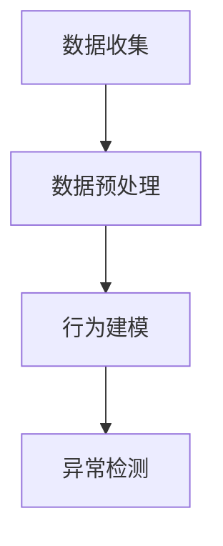
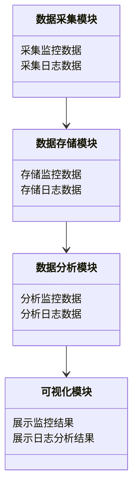

                 


# 监控与日志：追踪AI Agent的行为与性能

> 关键词：AI Agent, 监控, 日志, 行为分析, 性能优化, 日志分析, 监控系统

> 摘要：本文将探讨如何通过监控与日志管理来追踪AI Agent的行为与性能。我们从AI Agent的基本概念出发，介绍监控与日志的重要性，深入分析行为建模与异常检测，讨论性能监控与优化策略，以及如何通过日志关联行为与性能。我们还将探讨监控系统的架构设计，结合项目实战，介绍如何使用ELK Stack进行监控与日志分析。最后，我们将总结监控与日志管理的未来趋势和最佳实践。

---

## 第1章：AI Agent与监控日志概述

### 1.1 AI Agent的基本概念
- 1.1.1 AI Agent的定义与分类
  - AI Agent的定义：智能体（Agent）是指在环境中能够感知并自主行动以实现目标的实体。
  - 分类：基于智能水平分为简单反射Agent和复杂推理Agent；基于应用领域分为软件Agent和物理Agent。

- 1.1.2 监控与日志在AI Agent中的作用
  - 监控：实时跟踪Agent的状态和行为，确保其正常运行。
  - 日志：记录Agent的操作历史，用于故障排查和性能分析。

- 1.1.3 本书的核心主题与目标
  - 目标：探讨如何利用监控与日志技术，有效追踪AI Agent的行为与性能，提升系统的可靠性和效率。

---

## 第2章：监控与日志的基础知识

### 2.1 监控的目的与作用
- 2.1.1 监控的基本概念
  - 监控：实时或定期收集系统状态数据，进行分析和展示。

- 2.1.2 监控在AI Agent中的具体应用
  - 监控指标：响应时间、错误率、吞吐量、资源使用情况。

- 2.1.3 监控对系统性能和行为的影响
  - 监控可以帮助识别瓶颈，优化系统性能。

### 2.2 日志的类型与结构
- 2.2.1 日志的分类
  - 操作日志：记录用户的操作行为。
  - 错误日志：记录系统出现的错误信息。
  - 调试日志：用于开发和调试的日志。

- 2.2.2 日志的结构与格式
  - 常见格式：JSON、Logstash、Syslog。

- 2.2.3 日志在问题排查中的作用
  - 日志是故障排查的重要依据，能够帮助开发者定位问题。

### 2.3 监控工具与技术概述
- 2.3.1 常见监控工具
  - Prometheus：开源的监控和报警工具。
  - Grafana：可视化界面，用于展示监控数据。

- 2.3.2 日志管理工具
  - ELK Stack：Elasticsearch、Logstash、Kibana，用于日志收集、存储和可视化。

- 2.3.3 监控与日志分析的技术趋势
  - 人工智能与机器学习在监控与日志分析中的应用。

---

## 第3章：AI Agent行为分析的理论与方法

### 3.1 行为建模与分析
- 3.1.1 行为建模的基本概念
  - 行为模型：描述Agent在特定环境下的行为模式。

- 3.1.2 基于日志的行为分析方法
  - 日志分析：通过分析日志数据，识别Agent的行为模式和异常情况。

- 3.1.3 行为分析的流程与步骤
  1. 数据收集：获取Agent的日志和监控数据。
  2. 数据预处理：清洗数据，去除噪声。
  3. 行为建模：建立行为模型，描述Agent的行为模式。
  4. 异常检测：识别与预期行为不符的情况。

#### 图3.1：行为分析流程图


---

## 第4章：性能监控与优化

### 4.1 性能监控指标
- 4.1.1 响应时间
  - 响应时间：Agent完成任务所需的时间。
  - 公式：响应时间 = 响应开始时间 - 响应结束时间。

- 4.1.2 错误率
  - 错误率：单位时间内发生错误的次数占总操作次数的比例。

- 4.1.3 吞吐量
  - 吞吐量：单位时间内完成的任务数量。

- 4.1.4 资源使用情况
  - CPU使用率、内存使用率、磁盘I/O等。

### 4.2 性能分析方法
- 4.2.1 基于日志的性能分析
  - 日志分析：通过分析日志，识别性能瓶颈。

- 4.2.2 性能优化策略
  - 代码优化：优化算法和数据结构，减少资源消耗。
  - 系统调优：调整系统配置，提高性能。

---

## 第5章：日志分析与行为关联

### 5.1 日志分析方法
- 5.1.1 基于时间序列的分析
  - 时间序列分析：通过分析日志的时间戳，识别行为模式。

- 5.1.2 基于事件关联的分析
  - 事件关联：分析日志中的事件之间的关联性，识别复杂行为。

### 5.2 行为与性能的关联分析
- 5.2.1 行为与性能的相互影响
  - 行为模式影响系统性能，性能问题又会影响行为。

- 5.2.2 日志关联分析
  - 通过日志关联分析，识别行为与性能之间的关系。

---

## 第6章：监控系统的架构与实现

### 6.1 系统设计
- 6.1.1 系统功能设计
  - 数据采集模块：负责采集监控数据和日志数据。
  - 数据存储模块：存储采集到的数据。
  - 数据分析模块：分析数据，生成报告。
  - 可视化模块：展示分析结果。

#### 图6.1：系统功能设计类图


### 6.2 系统架构设计
- 6.2.1 基于微服务的架构
  - 微服务架构：将系统分解为多个独立的服务，每个服务负责特定的功能。

- 6.2.2 系统架构图
  ```mermaid
  graph TD
      A[数据采集服务] --> B[数据存储服务]
      B --> C[数据分析服务]
      C --> D[可视化服务]
  ```

### 6.3 系统接口设计
- 6.3.1 数据采集接口
  - REST API：用于采集监控数据和日志数据。

- 6.3.2 数据分析接口
  - REST API：用于分析数据，生成报告。

---

## 第7章：项目实战——使用ELK Stack进行监控与日志分析

### 7.1 环境搭建
- 7.1.1 安装Elasticsearch
  - 命令：`sudo apt-get install elasticsearch`

- 7.1.2 安装Logstash
  - 命令：`sudo apt-get install logstash`

- 7.1.3 安装Kibana
  - 命令：`sudo apt-get install kibana`

### 7.2 核心代码实现
- 7.2.1 日志采集
  ```python
  import logging

  # 配置日志
  logging.basicConfig(
      level=logging.INFO,
      filename='agent.log',
      format='%(asctime)s - %(levelname)s - %(message)s'
  )

  # 记录日志
  logging.info('AI Agent启动')
  ```

- 7.2.2 日志分析
  ```python
  from elasticsearch import Elasticsearch

  es = Elasticsearch()

  # 查询日志
  body = {
      "query": {
          "match_all": {}
      }
  }

  res = es.search(index="logs", body=body)
  print(res['hits']['hits'])
  ```

### 7.3 案例分析
- 7.3.1 案例背景
  - 某AI Agent系统出现性能瓶颈，响应时间变长。

- 7.3.2 日志分析
  - 通过ELK Stack分析日志，发现错误率升高。

- 7.3.3 问题定位
  - 通过日志分析，定位到数据库查询延迟问题。

- 7.3.4 优化措施
  - 优化数据库查询逻辑，提高查询效率。

### 7.4 代码解读与分析
- 7.4.1 日志采集代码
  - 使用Python的`logging`模块，配置日志文件和格式。

- 7.4.2 日志分析代码
  - 使用Elasticsearch的Python客户端，连接Elasticsearch服务，查询日志数据。

---

## 第8章：监控与日志管理的未来趋势与最佳实践

### 8.1 未来趋势
- 8.1.1 AI与监控的结合
  - 使用机器学习算法，预测系统故障，提前采取措施。

- 8.1.2 智能化监控工具
  - 自动化监控工具，能够自适应系统变化，智能识别异常。

### 8.2 最佳实践 tips
- 8.2.1 定期备份日志
  - 日志是故障排查的重要依据，定期备份以防数据丢失。

- 8.2.2 优化日志格式
  - 使用结构化日志格式（如JSON），便于后续分析。

- 8.2.3 培训相关人员
  - 提高相关人员的日志分析能力，确保能够快速定位问题。

### 8.3 小结
- 通过监控与日志管理，可以有效追踪AI Agent的行为与性能，提升系统的可靠性和效率。

---

## 作者：AI天才研究院/AI Genius Institute & 禅与计算机程序设计艺术 /Zen And The Art of Computer Programming

---

# 结语

通过以上目录大纲，我们系统地介绍了监控与日志在追踪AI Agent行为与性能中的应用。从理论到实践，从工具到系统设计，我们为读者提供了全面的知识和实用的技能，帮助他们在实际工作中更好地应用这些技术。

