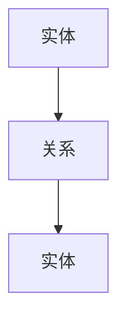
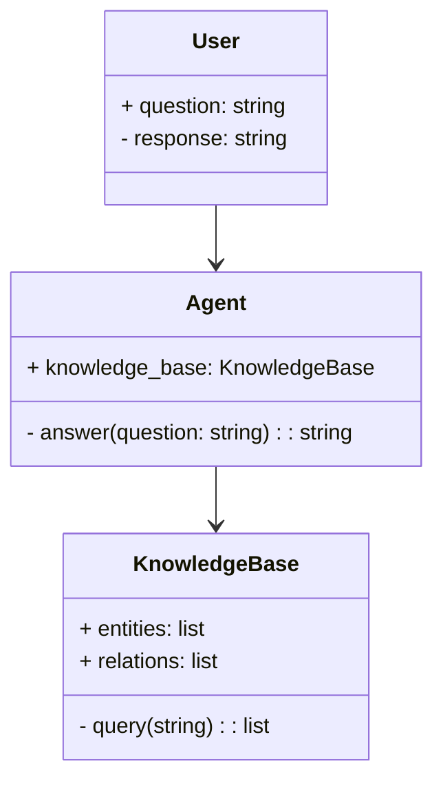
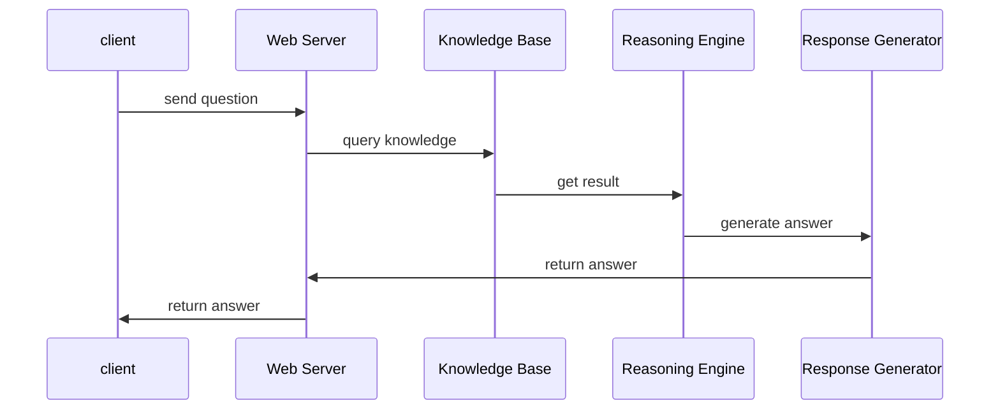

                 


# 知识图谱在AI Agent中的应用

## 关键词：
知识图谱, AI Agent, 知识抽取, 推理算法, 对话生成, 系统架构, 实践案例

## 摘要：
知识图谱作为一种结构化的知识表示方法，为AI Agent提供了强大的语义理解和推理能力。本文将从知识图谱的基本概念和AI Agent的核心原理出发，深入探讨两者结合的应用场景、算法原理、系统架构以及实际案例。通过详细分析，我们将展示知识图谱如何赋能AI Agent，使其在智能问答、推荐系统等领域展现出更强大的能力。

---

## 第一部分：知识图谱与AI Agent的背景介绍

### 第1章：知识图谱的基本概念

#### 1.1 知识图谱的定义与特点
知识图谱是一种以图结构形式表示知识的数据库，其中节点表示实体或概念，边表示实体之间的关系。其特点包括：
- **结构化**：以图的形式组织知识，便于计算机理解和推理。
- **语义丰富**：通过实体间的关系，提供深层语义信息。
- **可扩展性**：支持大规模知识的构建和更新。

#### 1.2 知识图谱的应用领域
知识图谱在多个领域有广泛应用，如搜索引擎优化、智能问答、推荐系统等。

#### 1.3 知识图谱的构建方法
构建知识图谱的步骤包括数据收集、数据清洗、知识抽取和知识融合。

### 第2章：AI Agent的基本概念

#### 2.1 AI Agent的定义与分类
AI Agent是一种能够感知环境并采取行动以实现目标的智能实体。常见类型包括基于规则的Agent、基于模型的Agent和基于学习的Agent。

#### 2.2 AI Agent的核心技术
- **感知技术**：通过传感器或数据输入获取环境信息。
- **推理技术**：基于知识库进行逻辑推理。
- **规划技术**：制定行动计划以实现目标。

### 第3章：知识图谱与AI Agent的结合背景
知识图谱为AI Agent提供了丰富的知识库，使其能够进行语义理解、推理和决策。这种结合使得AI Agent在智能问答、自动化系统等领域更具竞争力。

---

## 第二部分：核心概念与联系

### 第4章：知识图谱与AI Agent的核心概念
#### 4.1 知识图谱的原理
知识图谱通过节点和边表示实体及其关系，构建了一个语义网络。

#### 4.2 AI Agent的原理
AI Agent通过感知环境、推理和行动来实现目标。

#### 4.3 两者的关系
知识图谱为AI Agent提供知识支持，AI Agent利用知识图谱进行推理和决策。

#### 4.4 核心概念对比
| 特性 | 知识图谱 | AI Agent |
|------|----------|-----------|
| 核心目标 | 表示知识 | 完成任务 |
| 技术基础 | 图结构 | 知识库+推理 |

#### 4.5 实体关系图


---

## 第三部分：算法原理讲解

### 第5章：知识抽取算法
#### 5.1 知识抽取流程
1. **分词**：将文本分割成词语。
2. **实体识别**：识别文本中的实体。
3. **关系抽取**：识别实体间的关系。

#### 5.2 实现代码
```python
import spacy
nlp = spacy.load("en_core_web_sm")
doc = nlp("Apple is a company based in California.")
for token in doc:
    print(token.text, token.pos_, token.dep_)
```

#### 5.3 数学模型
知识抽取的向量化表示：
$$
\text{向量} = \text{模型参数} \times \text{输入特征}
$$

### 第6章：推理算法
#### 6.1 推理流程
1. **知识表示**：将知识图谱中的实体和关系表示为向量。
2. **推理规则**：基于规则或学习模型进行推理。

#### 6.2 实现代码
```python
import tensorflow as tf
from tensorflow.keras.layers import Dense

model = tf.keras.Sequential([
    Dense(64, activation='relu'),
    Dense(1, activation='sigmoid')
])
model.compile(optimizer='adam', loss='binary_crossentropy')
```

#### 6.3 数学模型
表示学习的损失函数：
$$
\mathcal{L} = \sum_{i=1}^{n} (y_i - \hat{y}_i)^2
$$

### 第7章：对话生成算法
#### 7.1 对话生成流程
1. **理解输入**：解析用户的问题。
2. **知识检索**：从知识图谱中获取相关信息。
3. **生成回答**：基于检索的信息生成回答。

#### 7.2 实现代码
```python
def generate_response(user_input, knowledge_base):
    # 检索知识图谱
    result = knowledge_base.query(user_input)
    # 生成回答
    return generate_answer(result)
```

#### 7.3 数学模型
对话生成的损失函数：
$$
\mathcal{L} = -\sum_{i=1}^{n} y_i \log p(y_i)
$$

---

## 第四部分：系统分析与架构设计方案

### 第8章：系统分析
#### 8.1 问题场景介绍
构建一个智能问答系统，利用知识图谱辅助AI Agent回答用户问题。

#### 8.2 项目介绍
项目目标：构建一个基于知识图谱的智能问答系统。

### 第9章：系统架构设计
#### 9.1 领域模型


#### 9.2 系统架构图


#### 9.3 系统交互图


---

## 第五部分：项目实战

### 第10章：环境安装
- **Python**：3.8+
- **库**：spacy、tensorflow、networkx

### 第11章：系统核心实现
#### 11.1 核心代码实现
```python
import networkx as nx

G = nx.Graph()
G.add_node("Apple")
G.add_node("Company")
G.add_edge("Apple", "Company", relation="is_a")
```

#### 11.2 代码解读与分析
- 使用networkx构建知识图谱。
- 添加节点和边表示实体和关系。

### 第12章：实际案例分析
#### 12.1 案例分析
构建一个智能问答系统，回答用户关于公司信息的问题。

### 第13章：项目小结
知识图谱在智能问答系统中的应用，显著提高了回答的准确性和相关性。

---

## 第六部分：最佳实践

### 第14章：最佳实践
- **数据质量**：确保知识图谱的数据准确性和完整性。
- **模型优化**：通过不断训练和优化模型提高推理和生成效果。

### 第15章：小结
知识图谱为AI Agent提供了强大的知识支持，结合先进的算法，使其在多个领域展现出卓越的能力。

### 第16章：注意事项
- 知识图谱的构建和维护需要大量资源。
- 模型的泛化能力需要进一步提升。

### 第17章：拓展阅读
- 推荐阅读《知识图谱构建与应用》和《AI Agent原理与实践》。

---

## 作者信息
作者：AI天才研究院 & 禅与计算机程序设计艺术

---

以上是《知识图谱在AI Agent中的应用》的完整目录和内容概述，涵盖了从基础概念到实际应用的各个方面。希望这篇技术博客能为读者提供清晰的理解和深入的洞察。

